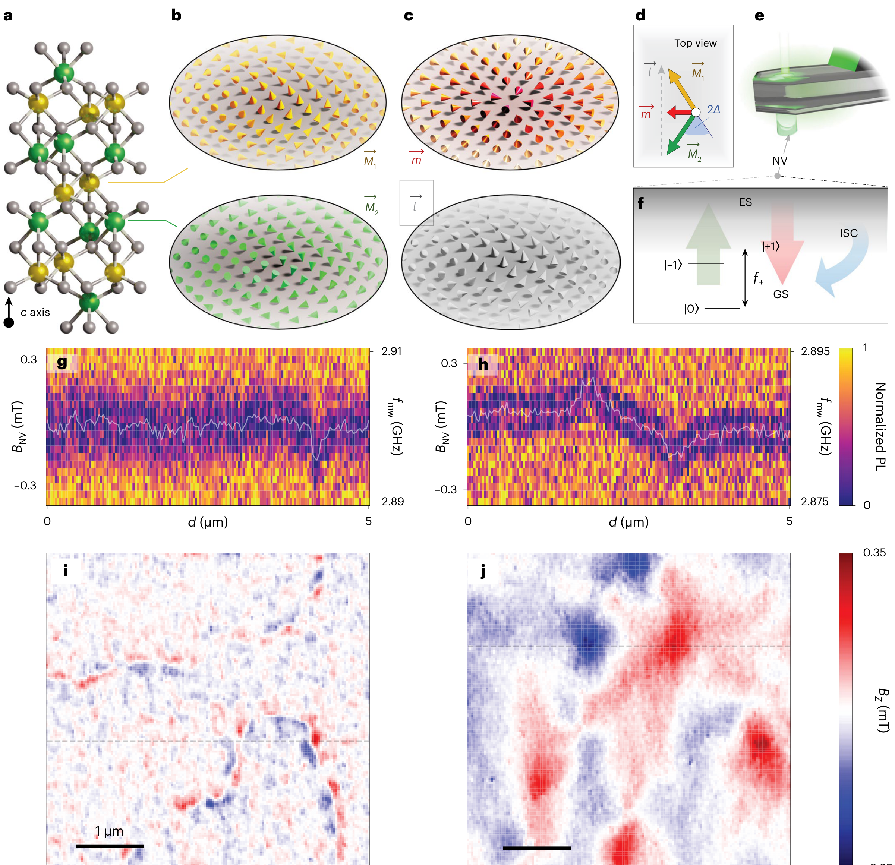
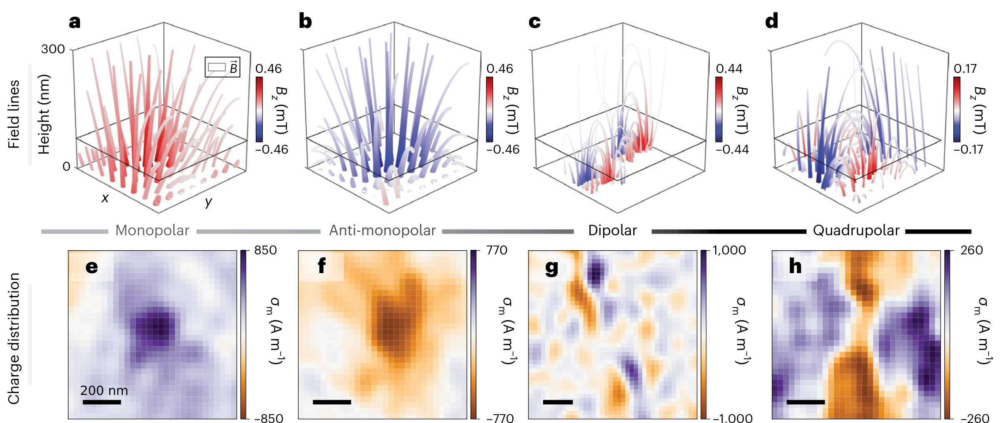

## tanRevealingEmergentMagnetic2024 — 用金刚石量子磁强计揭示反铁磁体中的涌现磁荷

## 📄 元数据
Anthony K. C. Tan, Hariom Jani, Michael Högen 等（共13位作者，通讯：Tan / Jani / Radaelli / Atatüre），2024，*Nature Materials* 23(2), 205–211，DOI: 10.1038/s41563-023-01737-4

## 💡 一句话
利用单晶金刚石氮-空位（NV）色心的量子磁强计（DQM）对斜方反铁磁体 α-Fe₂O₃（赤铁矿）中拓扑自旋织构成像，首次直接读出反铁磁交错涡度，并通过"涡度—磁化散度—磁荷"对偶关系揭示出单极、偶极、四极三类涌现磁荷分布。

## 🔗 Wiki 双链
  - 概念 [[../concepts/topological-defects|拓扑缺陷]]、[[../concepts/diamond-quantum-magnetometry|金刚石量子磁强计]]、[[../concepts/dzyaloshinskii-moriya-interaction|Dzyaloshinskii–Moriya 相互作用]]、[[../concepts/emergent-magnetic-charge|涌现磁荷]]、[[../concepts/meron-antimeron|半子–反半子]]、[[../concepts/morin-transition|莫林相变]]、[[../concepts/nv-center|NV 色心]]、[[../concepts/staggered-vorticity|交错涡度]]
  - 实体 [[../entities/domain-wall|畴壁]]、[[../entities/alpha-Fe2O3|α-Fe₂O₃（赤铁矿）]]
  - 年度 [[../write/2024]]
  - 主题 [[多铁性材料]]
  - 相关论文 [[../../raw/note/tanRevealingEmergentMagnetic2024]]

## 🆕 新概念/实体建议
  （暂无）

## 📊 关键图表
  - **图1 α-Fe₂O₃ 的 DQM 实验装置、ODMR 谱及 4 K/300 K 下重构的 Bz 磁场图**
  -  -> [[../figures/crystal-structures-xrd-phases|XRD与相变]]
    - **图示描述**：自上而下展示材料结构（a–d：α-Fe₂O₃ 原子排布、M₁/M₂ 反铁磁亚晶格、Néel 矢量 l⃗ = M₁−M₂ 与 DMI 诱导的净磁化 m⃗ = M₁+M₂，倾斜角 Δ ≈ 1.1 mrad）、DQM 装置与 NV 色心 ODMR 读出原理（e–f），以及 T = 4 K 与 300 K（分别低于/高于莫林相变 T_M ≈ 200 K）下的 ODMR 谱（g–h）和重构 Bz 磁场图（i–j，比例尺 1 μm）。
    - **关键特征**：4 K（T < T_M）下磁矩面外排列、m⃗ ≈ 0，Bz 图仅见窄而锐利、零背景的畴壁信号；300 K（T > T_M）下磁矩面内倾斜、平均 mΔ ≈ 2×10³ A m⁻¹，Bz 图呈现更宽、非零背景的拓扑织构特征；ODMR 共振峰 f+ 的频移直接给出 NV 处投影磁场 B_NV，偏置场约 0.5 mT，D ≈ 2.87 GHz、γ̃ ≈ 28 MHz mT⁻¹。
    - **结论/意义**：以莫林相变两侧的磁相对比验证了"面内倾斜磁化才产生可测杂散场"这一前提，确立 DQM 作为后续拓扑织构成像的实验平台。
  - **图2 通过 DQM 对拓扑反铁磁织构分类**
  -  -> [[../figures/domain-walls-structures|畴结构与畴壁]]
    - **图示描述**：按五行三列排布（比例尺 200 nm，Bz 色标 ±0.35 mT），每行依次给出理论模型计算 Bz、实验实测 Bz、正则化重构的面内磁化 m_xy（箭头）；对象分别为 a-Bloch 反相畴壁（a–c）、逆时针 a-Bloch 半子（d–f）、顺时针 a-Bloch 半子（g–i）、反半子（j–l，绕数 N = −1）和双半子（m–o）。
    - **关键特征**：ADW 的 Bz 呈正弦状、中心过零，振幅由 sin(ξ_a) 调制，a-Néel 相（ξ_a = 0, π）因 ∇·m = 0 而无信号；a-Bloch 半子（N = +1）的 Bz 径向对称，顺/逆时针极性相反，重构 m_xy 显示反向涡旋；反半子 Bz 呈二重对称；双半子为半子–反半子束缚对的叠加信号。
    - **结论/意义**：通过"模型—实测—重构"三联对照首次在实验上区分 a-Bloch 半子的手性（这是 X 射线二色性做不到的），并系统分类了 α-Fe₂O₃ 中拓扑织构的磁场指纹。
  - **图3 涌现磁荷的三维场线与面密度分布**
  -  -> [[../figures/electronic-bands-cdw-transport|CDW与输运性质]]
    - **图示描述**：上排（a–d）为样品表面向上延拓的三维磁场线（流管粗细/颜色分别编码 |B| 与 Bz），下排（e–h）为对 Bz 做传递函数反卷积并向下延拓得到的面磁荷密度 σ_m = −t(∇·m_xy) 图，比例尺 200 nm；四列依次对应逆时针 a-Bloch 半子、顺时针 a-Bloch 半子、ADW、反半子。
    - **关键特征**：逆时针半子的场线向外发散、σ_m 为正源（单极子）；顺时针半子场线向内汇聚、σ_m 为负汇（反单极子）；ADW 呈现正负相邻的 σ_m（偶极子）；反半子呈四瓣正负交替（四极子）；该重构仅依赖薄膜近似下 Bz ∝ ∇·m_xy 的对偶关系 σ_m/t = −∇·m_xy = Δ(ẑ·V⃗)，不依赖半子模型假设。
    - **结论/意义**：把抽象的磁化散度可视化为单极/偶极/四极三类磁荷分布，直接建立"交错涡度手性 ↔ 涌现磁荷极性"的对偶图像，是全文核心概念图。
  - **图4 二维积分磁荷 |Q_m| 随积分半径 r 的标度**
  -  -> [[../figures/crystal-structures-xrd-phases|XRD与相变]]
    - **图示描述**：（a–b）两个实验反半子的 σ_m 图，点线圆圈标出以织构中心为圆心、半径 r 的积分区域 S；（c）为 |Q_m(r)| = |∫_S σ_m dS| 曲线：浅蓝/浅红虚线为单个半子/反半子数据，深蓝/深红虚线为平均，黑色实线为线性半子模型预测，横轴 r 单位 nm，纵轴 |Q_m| 单位 10⁻¹⁰ A·m。
    - **关键特征**：半子的 |Q_m| 随 r 线性增长，符合孤立单极子理论（r > R_M 时 Q_m = 2π mΔ sin(ξ_a) r t）；理想孤立反半子因二重旋转对称 Q_m ≡ 0，但实测在长程因邻近织构扰动而偏离零值；该偏离说明 Q_m 不是拓扑不变量，a-Bloch→a-Néel 的平滑过渡即可令 Q_m → 0。
    - **结论/意义**：定量证明 α-Fe₂O₃ 中的磁荷是二维、非量子化、披覆在拓扑织构上的等效分布，并揭示多织构通过"磁荷画布"相互作用，区别于自旋冰中三维量子化的磁单极子。

## 🔬 项目连接
无直接项目连接。本文属反铁磁拓扑自旋织构与量子磁成像方向，与 project-2（Mn 多铁）在反铁磁氧化物主题上有外围相邻关系，但材料体系（α-Fe₂O₃ 而非 Mn 基多铁）与核心物理（涌现磁荷而非磁电耦合）均不重合。

## 🔗 项目双链

## 📝 组织与用词
论文按"问题→方法→对偶理论→实验分类→磁荷成像→定量标度→展望"递进：先指出同步辐射 X 射线二色性虽能看到反铁磁织构却无法读取涡度符号，再引入 DQM 对 canted AFM 的弱杂散场成像；核心理论桥梁是薄膜近似下 Bz ∝ ∇·m_xy，并由 m⃗ = Δ(ẑ×l⃗) 推出 ∇·m_xy = Δ[ẑ·(∇×l⃗)]，从而把可测磁场、磁化散度、交错涡度、磁荷四者等同起来；随后在 TM 上下识别 ADW、a-Bloch 半子、反半子、双半子，并将其分别对应偶极、单极、四极磁荷；最后用 Qm–r 标度说明磁荷非拓扑不变量且受多织构相互作用调制。值得在 wiki 叙述中复用的术语：
  - 金刚石量子磁强计 [[../concepts/diamond-quantum-magnetometry|金刚石量子磁强计]] / Diamond quantum magnetometry (DQM)
  - 氮-空位色心 / Nitrogen-vacancy (NV) centre
  - 光探测磁共振 / Optically detected magnetic resonance (ODMR)
  - 涌现磁荷 [[../concepts/emergent-magnetic-charge|涌现磁荷]] / Emergent magnetic charge
  - 交错涡度 [[../concepts/staggered-vorticity|交错涡度]] / Staggered vorticity (V⃗ = ∇×l⃗)
  - 对偶关系 / Duality relation（σm/t = −∇·m_xy = Δ ẑ·V⃗）
  - 倾斜反铁磁体 / Canted antiferromagnet
  - 半子–反半子–双半子 / Meron–antimeron–bimeron

## ✏️ 可写入 Wiki 的要点
  1. α-Fe₂O₃（[[../entities/alpha-Fe2O3|赤铁矿]]）是反铁磁氧化物绝缘体，沿 c 轴堆叠反平行铁磁亚晶格 M₁、M₂；Néel 矢量 l⃗ = M₁−M₂，净磁化 m⃗ = M₁+M₂。TM≈200 K 发生[[../concepts/morin-transition|莫林相变]]：TM 以下磁矩主要面外、m⃗≈0；TM 以上面内排列，块体 DMI（沿 c 轴）造成 Δ≈1.1 mrad 的面内倾斜，平均 mΔ≈2×10³ A m⁻¹，且 m⃗· l⃗ = 0。
  2. DQM 以金刚石探针中单个 [[../concepts/nv-center|NV 色心]]为点传感器，在样品上方恒定高度扫描；基态 |0⟩ 与 |±1⟩ 的塞曼分裂经 ODMR 读出，弱场近似下 ΔE₊ = hγ̃ BNV，其中 D≈2.87 GHz、γ̃≈28 MHz mT⁻¹、偏置场 Bbias≈0.5 mT；通过傅里叶重构由 BNV 得到实验室坐标 (Bx, By, Bz)，空间分辨率由 NV–样品距离 dNV 决定。
  3. 薄膜近似下测量场满足 Bz = αxy(t,d) ∗ ∇·m⃗_xy + αz(t,d) ∗ ∇²mz（式1）；αi 为有效点扩散函数（~d 尺度的模糊核）。α-Fe₂O₃ 中因 DMI 对称 mz=0、m_xy≠0，故 Bz 就是倾斜磁化散度与 αxy 的卷积。
  4. 对沿 ẑ 的 DMI，净磁化 m⃗ = Δ(ẑ×l⃗)，由此导出 ∇·m⃗_xy = Δ[ẑ·(∇×l⃗)]。因此 Bz 图像直接给出[[../concepts/staggered-vorticity|交错涡度]] V⃗ = ∇×l⃗ 的投影——这是 X 射线二色性（对交错磁化符号不敏感）无法获得的量，也是 DQM 区分顺时针/逆时针 a-Bloch 半子的根本原因。
  5. 由磁高斯类比定义面磁荷密度 σm = −t(∇·m⃗_xy)，对偶关系为 σm/t = −∇·m⃗_xy = Δ(ẑ·V⃗)（式2），其强度按 sin(ξa) 缩放；仅需对 Bz 做传递函数 αxy 的傅里叶反卷积即可获得 σm，再经向下/向上延拓三维可视化 B⃗ 场线，且这一过程不依赖半子模型假设。
  6. 织构分类与磁荷对应：a-Bloch 反相畴壁（ξa=π/2, 3π/2）给出正弦型、中心过零的 Bz，对应偶极磁荷；a-Néel ADW（ξa=0,π）因 ∇·m=0 而无 Bz 信号。半子（N=+1）Bz 径向对称，a-Bloch 半子对应涌现磁单极/反单极（逆时针为正源、顺时针为负汇）；反半子（N=−1）Bz 二重对称、对应四极磁荷；[[../concepts/bimeron|双半子]]为半子–反半子束缚对。
  7. 孤立线性半子的积分磁荷 Qm(r) = ∫S σm dS 满足式3：r≤RM 时 Qm = 2π mΔ sin(ξa) sin(πr/2RM) r t，r>RM 时 Qm = 2π mΔ sin(ξa) r t；即 |Qm| 随 r 线性增长，与四个实测半子数据吻合。孤立反半子因二重旋转对称 Qm=0，但受邻近织构影响对称性降低而出现有限 Qm，表明磁荷并非拓扑不变量（a-Bloch→a-Néel 的平滑转变即可令 Qm→0），多织构通过"二维磁荷画布"相互作用。
  8. 该[[../concepts/emergent-magnetic-charge|涌现磁荷]]不违反麦克斯韦方程：它们是材料内部 H⃗ 场的源/汇（∇·H⃗ = −∇·m⃗ ≠ 0），而真空中 B⃗ = μ0H⃗ 仍满足 ∇·B⃗ = 0。与烧绿石自旋冰中的磁单极子本质不同：后者是三维、拓扑保护、量子化的规范荷；α-Fe₂O₃ 中的磁荷是二维、非量子化、"披覆"在拓扑反铁磁织构上的等效分布，正负单极织构彼此拓扑等价，而拓扑反粒子（反半子）反而是四极的。
  9. 铁磁材料中长程退磁场倾向于无散度 Bloch 织构，故不存在此类单极磁分布；α-Fe₂O₃ 中反铁磁交换远强于退磁贡献，使单极磁荷得以存在。DQM 方法可推广到正铁氧体、正铬氧体、硼酸铁等其他斜方反铁磁体，以及无块体 DMI 的补偿型反铁磁体中由织构本身产生的局域净磁矩、超薄膜界面 DMI 诱导的优先涡度；结合自旋扭矩可实现基于磁荷的反铁磁织构读写与非传统计算。
