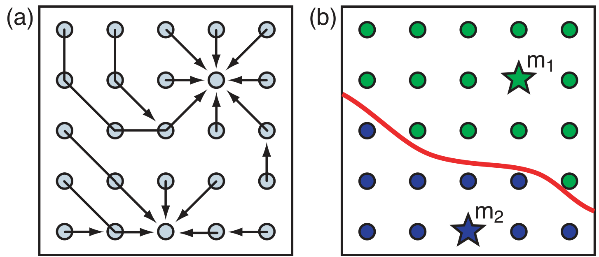
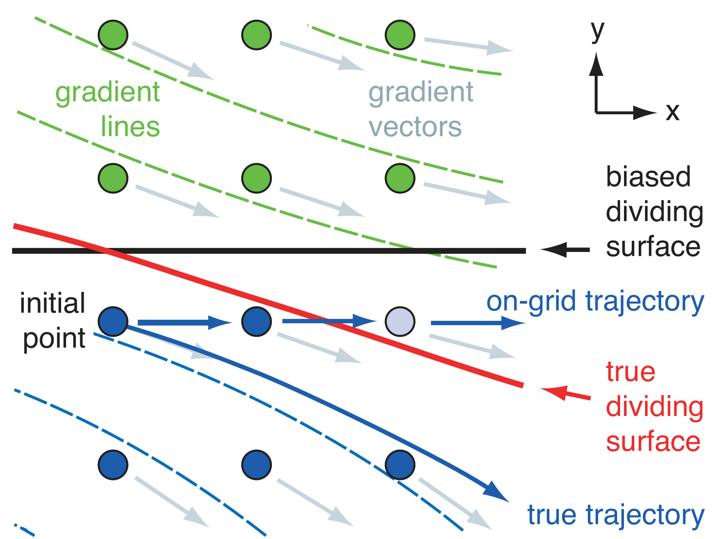
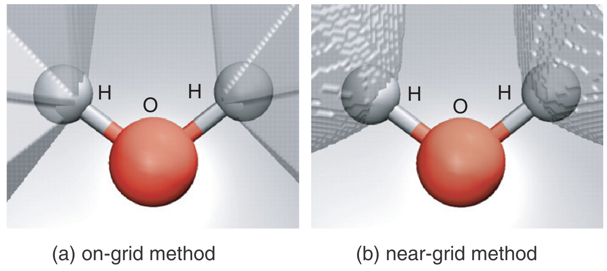
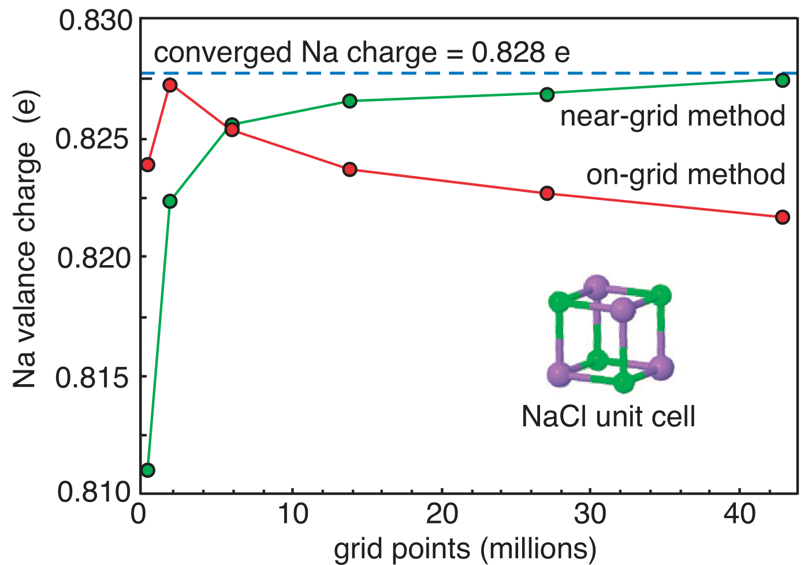
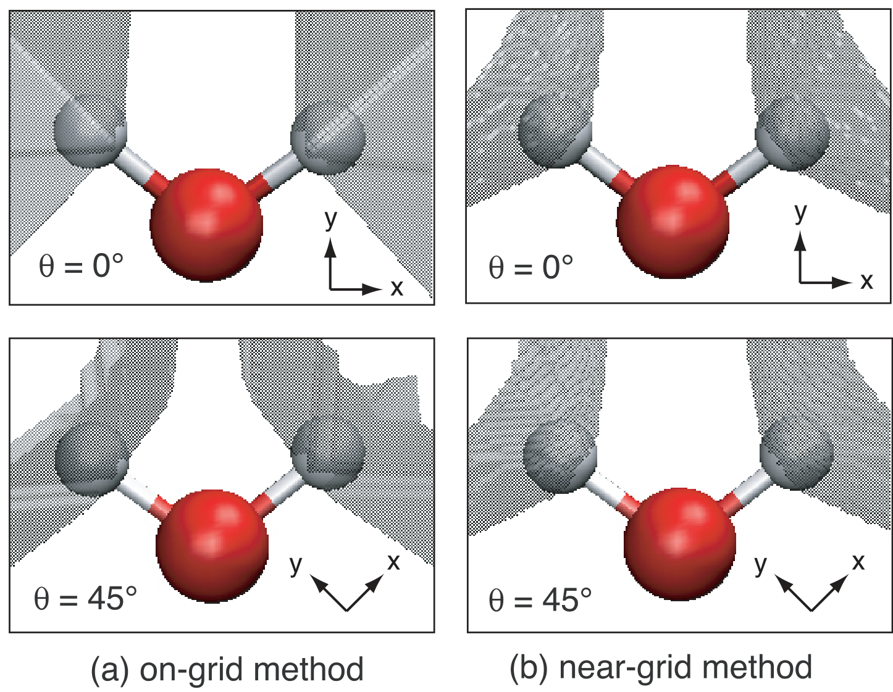
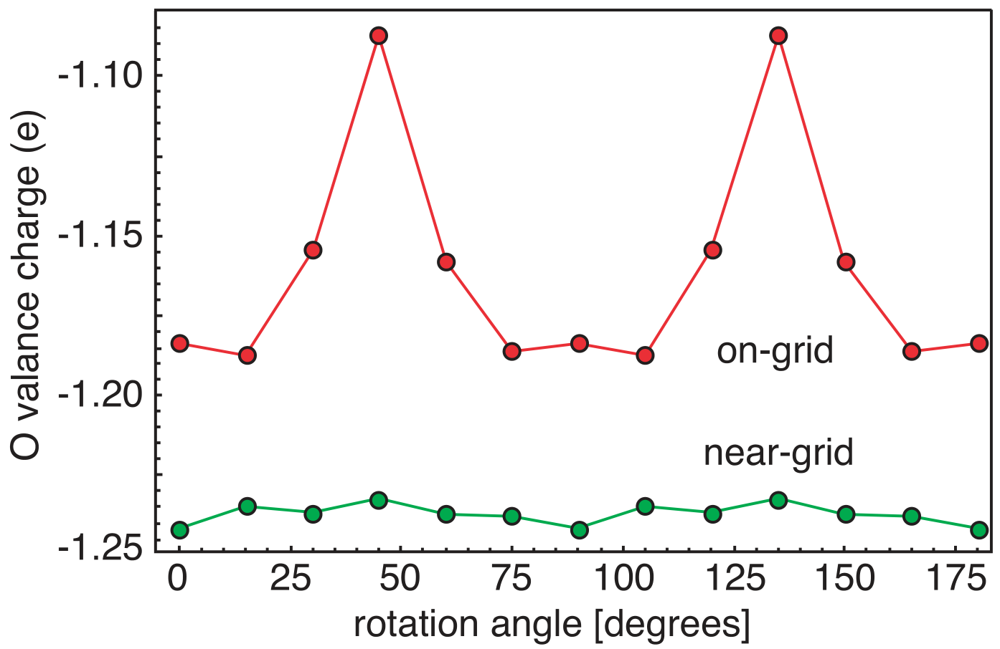
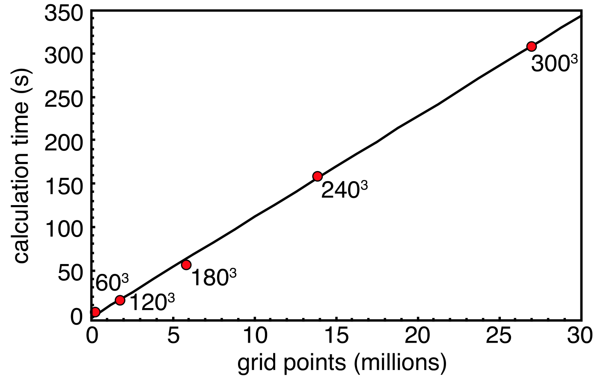

## tangGridbasedBaderAnalysis2009 — 一种无晶格偏差的网格化Bader分析算法

## 📄 元数据
W Tang、E Sanville、G Henkelman，2009，*Journal of Physics: Condensed Matter* 21, 084204，DOI [10.1088/0953-8984/21/8/084204](https://doi.org/10.1088/0953-8984/21/8/084204)。
## 💡 一句话
提出"近网法"（near-grid method），通过累积"修正向量"在网格点间追踪真实的离网格电荷密度梯度轨迹，在保持 O(N) 线性标度的同时彻底消除了早期在网法（on-grid method）的晶格偏差，使 Bader 电荷/体积能随网格加密单调收敛、且不依赖于分子相对网格的取向。

## 🔗 Wiki 双链
  - 概念 [[../concepts/density-functional-theory]] [[../concepts/bader-analysis|Bader分析]] [[../concepts/charge-density|电荷密度]] [[../concepts/zero-flux-surface|零通量面]] [[../concepts/lattice-bias|晶格偏差]] [[../concepts/mulliken-population]] [[../concepts/correction-vector|修正向量]] [[../concepts/steepest-ascent]] [[../concepts/non-nuclear-attractor|非核吸引子]]
  - 实体 [[../entities/VASP]] [[../entities/Quantum-ESPRESSO|Quantum ESPRESSO]] [[../entities/bader-code|Bader程序]]
  - 年度 [[../write/2005-2009|2009]]
  - 概念 [[../concepts/electron-localization-function]]、[[../concepts/steepest-ascent]]
  - 实体 [[../entities/Gaussian-98]]、[[../entities/PAW]]、[[../entities/Vanderbilt-ultrasoft]]
  - 相关论文 [[../../raw/note/tangGridbasedBaderAnalysis2009]]

## 📊 关键图表
  -  -> [[../figures/mathematical-models-computational|计算方法与泛函]]
  - **图示描述**：二维电荷密度网格上在网法（on-grid）的工作原理示意：(a) 从两个电荷密度极大值 m1、m2 之间的各网格点出发，沿水平、垂直或对角线方向（二维 8 个离散邻居）追踪最陡上升路径；(b) 所有路径终点汇聚到同一极大值的点集（绿色到 m1、蓝色到 m2）构成该原子的 Bader 体积，红色曲线为分割面。
  - **关键特征**：路径被严格限制在相邻网格点之间跳跃；一旦轨迹碰到已分配点即终止，路径上所有点归入同一 Bader 区域；每个点只需处理一次，因而算法 O(N) 线性标度；分割面在离散网格上呈现明显的网格状棱角。
  - **结论/意义**：该图是理解后续晶格偏差问题的起点——网格化机制带来高效率，也埋下了分割面被网格方向"绑架"的隐患。

  -  -> [[../figures/crystal-structures-bulk|体相晶体结构]]
  - **图示描述**：在一张二维网格上叠加真实的连续梯度线（蓝色弯曲箭头）和真实分割面（红色斜线），对比在网法实际走出的直箭头路径；浅蓝点本应属于另一侧 Bader 体积，却被错误归入当前区域。
  - **关键特征**：二维只有 8 个、三维只有 26 个离散跳跃方向，无法精确跟随与网格成小角度的连续梯度；格点路径偏离真实轨迹并跨越真实零通量面；最终分割面被"拉成"沿 x 格点方向的直线/折面；这一偏差在网格无限加密的极限下仍然存在，无法靠提高分辨率消除。
  - **结论/意义**：直观定义了本文要解决的核心缺陷——晶格偏差（lattice bias），并说明其根源是轨迹被强行离散化。

  -  -> [[../figures/experimental-setups|实验装置与测量系统]]
  - **图示描述**：近网法（near-grid）单条上升轨迹的"跳跃—修正"细节：从某格点出发，先按中心有限差分算出真实梯度并沿其走到离格点 r_grad，再跳到最近格点 r_grid，二者之差作为修正向量 r 累积；当 r 的某个分量超过半个网格间距时触发一次额外修正步（图中为 −y 方向），并从 r 中扣除该步长。
  - **关键特征**：修正向量 r 始终从当前格点指向真实的离格轨迹；触发阈值是"半个网格间距"，保证任意方向上格点路径与真实轨迹偏差不超过半格；新增终止条件——到达一个自身及邻居都已分配给同一区域的点即可停止；初分配后还需对边界点做一次边缘精修。
  - **结论/意义**：这是全文方法论核心，用"格点跳跃 + 记忆偏差"的方式在不离开网格的前提下追踪连续梯度，从而既保留 O(N) 效率又消除晶格偏差。

  -  -> [[../figures/experimental-setups|实验装置与测量系统]]
  - **图示描述**：在三个高斯函数人为构造、真实分割面与网格成小角度的二维电荷密度上，对比三种处理结果：(a) 在网法，(b) 近网法单次迭代，(c) 近网法再做一次边缘精修；灰色斜线为真实分割面，白色区域为错误分配区。
  - **关键特征**：(a) 在网法给出与网格对齐的垂直分割面，错误区沿真实斜线大片连续分布；(b) 近网法一次迭代后错误区被压缩到真实分割面附近一两个格点宽度内；(c) 再做一次精修后除两个低分辨率误配点外全部修正；网格加密后近网法可收敛到精确 Bader 体积。
  - **结论/意义**：这是一个受控模型算例，干净地展示了"修正向量 + 边缘精修"对晶格偏差的消除能力，为后续真实体系测试提供原理性证据。

  -  -> [[../figures/mathematical-models-computational|计算方法与泛函]]
  - **图示描述**：H₂O 分子中氧原子 O 与两个氢原子 H 之间 Bader 分割面的三维形状对比，左为在网法、右为近网法；电荷密度由 Gaussian 98 在 aug-cc-pVDZ/MP2 水平下计算，并写到 257³ 正交网格上。
  - **关键特征**：在网法的 O–H 界面呈现明显的、由网格面构成的棱角和小面，是晶格偏差在真实分子上的直接体现；近网法界面平滑、圆润，符合化学直觉；右侧仍可见的轻微波纹来自有限网格分辨率而非算法偏差，可通过加密网格减小。
  - **结论/意义**：首次在真实分子体系中定性证明近网法能给出物理上合理的 Bader 表面。

  -  -> [[../figures/crystal-structures-bulk|体相晶体结构]]
  - **图示描述**：横轴为电荷密度网格点数（从 60³ 到 350³，约 0.2–4 千万点），纵轴为 NaCl 晶体中 Na 离子的价电荷（e）；蓝色虚线 0.828 e 为近网法在极密网格下的收敛基准，蓝点为近网法结果、黑点为在网法结果，插图为 8 原子 NaCl 晶胞。
  - **关键特征**：计算条件为 VASP + PW91、PAW/Vanderbilt 赝势、262.5 eV 截断、3×3×3 Monkhorst–Pack k 点、晶格常数 5.86 Å；近网法曲线随网格加密单调、平滑地收敛到 0.828 e；在网法即使加密到约 4×10⁷ 点，仍残留约 0.01 e 的系统性偏差且不消失；必须把赝势冻芯电荷加回电荷密度网格才能得到准确 Bader 电荷。
  - **结论/意义**：定量证明近网法具有正确的"网格加密即收敛"行为，而在网法带有无法靠加密消除的系统误差，是支持算法替换最有力的证据。

  -  -> [[../figures/mathematical-models-computational|计算方法与泛函]]
  - **图示描述**：H₂O 分子在电荷密度网格平面内旋转 45° 前后的 Bader 体积形状对比，左列为在网法、右列为近网法；电荷密度由 VASP 计算，截断能 250 eV、Γ 点采样。
  - **关键特征**：在网法下分子旋转前后 O、H 的 Bader 体积轮廓明显不同，分割面位置被网格方向带着走；近网法下旋转前后体积形状几乎重合，恢复了物理上应有的旋转不变性；该现象与图6 的系统偏差同源，都是晶格偏差在实空间上的表现。
  - **结论/意义**：从形状层面定性说明近网法消除了非物理的分子取向依赖，这是任何严谨电荷分析方法都必须满足的基本对称性。

  -  -> [[../figures/mathematical-models-computational|计算方法与泛函]]
  - **图示描述**：横轴为 H₂O 分子相对电荷密度网格的旋转角度（度），纵轴为氧原子 Bader 价电荷（e）；两条曲线分别对应在网法（On-grid）和近网法（Near-grid）。
  - **关键特征**：在网法不仅系统性低估 H→O 电荷转移，氧电荷还随旋转角出现约 0.1 e 的明显波动；近网法的氧电荷约为 −1.23 e，曲线基本为一条水平线，随角度变化极小；该定量结果与图7 的形状观察一致，把取向依赖从视觉现象变成可报告的数值误差。
  - **结论/意义**：定量证实近网法给出的原子电荷在分子任意取向下都稳定，避免了约 0.1 e 量级的人为取向误差。

  -  -> [[../figures/electronic-bands-dos-fermi|态密度与费米面]]
  - **图示描述**：双对数坐标下，近网法分析 8 原子 NaCl 晶胞电荷密度所需 CPU 时间（秒）随网格点数（60³ 到 300³）的变化，数据点良好拟合成斜率为 1 的直线。
  - **关键特征**：斜率为 1 表明计算时间与网格点数成正比，即 O(N) 线性标度；在 2.5 GHz G5 PowerPC 上每分析 100 万个网格点约需 11.5 s；修正向量和一次边缘精修的额外开销可忽略，没有破坏原在网法的高效性。
  - **结论/意义**：证明近网法在消除晶格偏差、提升精度的同时完整保留了原算法处理大规模平面波 DFT 网格数据所必需的线性标度性能。

## 🔬 项目连接
  - **project-2（Mn 多铁）— medium**：多铁钙钛矿/锰氧化物的 DFT 计算常需用 Bader 电荷分析 Mn–O 共价性、Fe/Cr 等过渡金属价态与磁电耦合机制；本文是 Bader 电荷工具的方法学源头，明确指出必须包含冻芯电荷（PAW/Vanderbilt 赝势）才能得到准确离子电荷，这对解读 Mn 系氧化物的电荷转移、氧空位价态直接可复用。
  - **project-4（TTF 分子计算）— medium**：分子晶体/有机给体–受体体系的电荷转移量、离子化程度判定高度依赖 Bader 电荷。论文水分子算例（aug-cc-pVDZ/MP2 + 257³ 网格）和"在网法对 H→O 电荷转移的系统性低估"直接提示：在分子体系上应使用近网法并做取向/收敛性测试，否则电荷转移量可有约 0.1 e 量级人为误差。
  - **project-5（SnTe 铁电模拟）— medium**：铁电体 DFT 中常用 Bader 电荷讨论 Sn 5s² 孤对立体化学活性、Sn–Te 键离子性/共价性、应变或极化翻转下的电荷重排。本文给出的网格收敛性测试范式（60³→350³，以 0.828 e 为基准）和晶格偏差警告，对正确报告 Sn/Te Bader 电荷、避免取向相关伪影有直接参考价值。
  - **project-7（CDW）— weak**：CDW 的 DFT 研究若涉及电荷密度调制本身、层间电荷转移或 Fermi 面嵌套外的实空间电荷图像，Bader 分析可作为辅助量化工具；但 CDW 的核心物理在能带/声子，Bader 仅为后处理补充，故连接较弱。
  - project-1（双光子）、project-3（机械发光 NN）、project-6（湿度传感器）与本文方法学无直接联系。

## 🔗 项目双链
- 项目 [[../projects/project-2-mn-multiferroics|项目二：Mn极化结构铁电材料]]
- 项目 [[../projects/project-4-ttf-molecular-calc|项目四：lsl老师的ttf分子计算]]
- 项目 [[../projects/project-5-snte-ferroelectric-sim|项目五：lammps势函数SnTe铁电模拟]]
- 项目 [[../projects/project-7-cdw-charge-density-wave|项目七：CDW电荷密度波]]

## 📝 组织与用词
论文采用"问题提出 → 方法回顾 → 算法创新 → 递进式验证"的标准方法学范式：先用图1–图2把在网法及其晶格偏差讲透，再用图3+公式(4)–(7)给出近网法修正向量机制，最后用四个由浅入深的算例（二维模型 → 水分子 → NaCl 收敛性 → 分子取向）系统验证，并以图9确认 O(N) 标度未被破坏。值得在 wiki 中复用的术语：
  - Bader analysis / Bader 分析
  - zero-flux surface / 零通量面 [[../concepts/zero-flux-surface|零通量面]]
  - Bader volume (atomic basin) / Bader 体积（原子盆地）
  - on-grid method / 在网法
  - near-grid method / 近网法
  - lattice bias / 晶格（网格）偏差
  - correction vector / 修正向量 [[../concepts/correction-vector|修正向量]]
  - steepest-ascent path / 最陡上升路径 [[../concepts/steepest-ascent]]
  - frozen core charge / 冻芯电荷
  - linear scaling O(N) / 线性标度

## ✏️ 可写入 Wiki 的要点
  1. Bader 划分以[[../concepts/charge-density|电荷密度]] ρ(r) 这一可观测量为基础，用[[../concepts/zero-flux-surface|零通量面]]（∇ρ·n = 0）把空间切成每个含一个电荷密度极大值的原子盆地；相比[[../concepts/mulliken-population]]的 Mulliken 布居，结果对基组不敏感、更稳健。
  2. 在网法从每个网格点出发，在 26 个三维邻居（二维为 8 个）中选使梯度投影 ∇ρ·r̂ 最大的方向跳跃，碰到已分配点即终止；每个点只处理一次，因而 O(N) 线性标度、对复杂键合拓扑鲁棒。
  3. 在网法的根本缺陷是[[../concepts/lattice-bias|晶格偏差]]：真实梯度方向连续，但格点跳跃方向只有 26 个离散方向，轨迹会偏离真实零通量面，使分割面人为沿网格方向出现棱角；该偏差在网格无限加密的极限下仍存在，无法靠提高精度消除。
  4. 近网法用中心有限差分（六个最近邻）计算连续梯度 ∇ρ，沿梯度走一步 r_grad = c(∇ρ_x, ∇ρ_y, ∇ρ_z)，其中 c = min(dx/|∇ρ_x|, dy/|∇ρ_y|, dz/|∇ρ_z|) 保证任一分量不超过一个网格间距；再跳到最近格点 r_grid，并把二者之差累积进[[../concepts/correction-vector|修正向量]] r ← r + (r_grad − r_grid)。
  5. 一旦 r 的某一分量超过半个网格间距，就在该方向强制一次额外"修正步"并从 r 中扣除，从而保证被追踪的格点路径在任意方向上离真实离格轨迹不超过半个网格间距——这是消除晶格偏差的关键。
  6. 近网法新增终止条件：当到达一个自身及所有邻居均已分配给同一 Bader 区域的点时即可终止；初分配后对边界点做一次边缘精修（refinement），在平滑电荷密度下无需重复即可消除归属歧义。
  7. 二维三高斯模型算例显示：在网法产生与网格对齐的垂直分割面和大片错误区；近网法单次迭代把错误区压到真实分割面附近，再经一次边缘精修后仅剩 2 个低分辨率误配点。
  8. NaCl 收敛性测试（VASP、PW91、PAW/Vanderbilt 赝势、262.5 eV、3×3×3 k 点、a = 5.86 Å，网格 60³→350³）给出 Na 价电荷基准 0.828 e；近网法单调平滑收敛到该值，在网法在 4000 万点时仍偏离约 0.01 e。必须在电荷密度网格中加入冻芯电荷，否则 Bader 电荷严重失真。
  9. 取向测试（VASP 计算 H₂O，250 eV、Γ 点）表明：在网法不仅系统性低估 H→O [[../concepts/charge-transfer|电荷转移]]，氧原子 Bader 电荷随分子在网格中旋转 45° 还波动约 0.1 e；近网法的氧电荷（约 −1.23 e）和 Bader 体积形状基本不随取向变化，恢复了物理上应有的旋转不变性。
  10. 性能测试（60³→300³ 的 NaCl 网格）确认近网法保持 O(N) 线性标度，在 2.5 GHz G5 PowerPC 上约 11.5 s/百万网格点；算法已推广到非正交晶格与周期边界，并以开源 Bader 程序（theory.cm.utexas.edu/bader/）发布，成为平面波 DFT 电荷分析的事实标准后处理工具之一。
