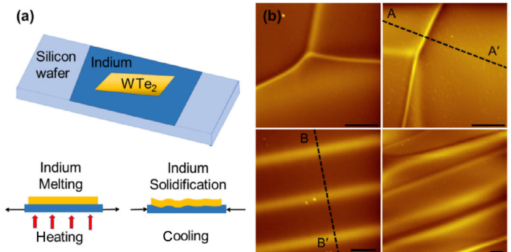
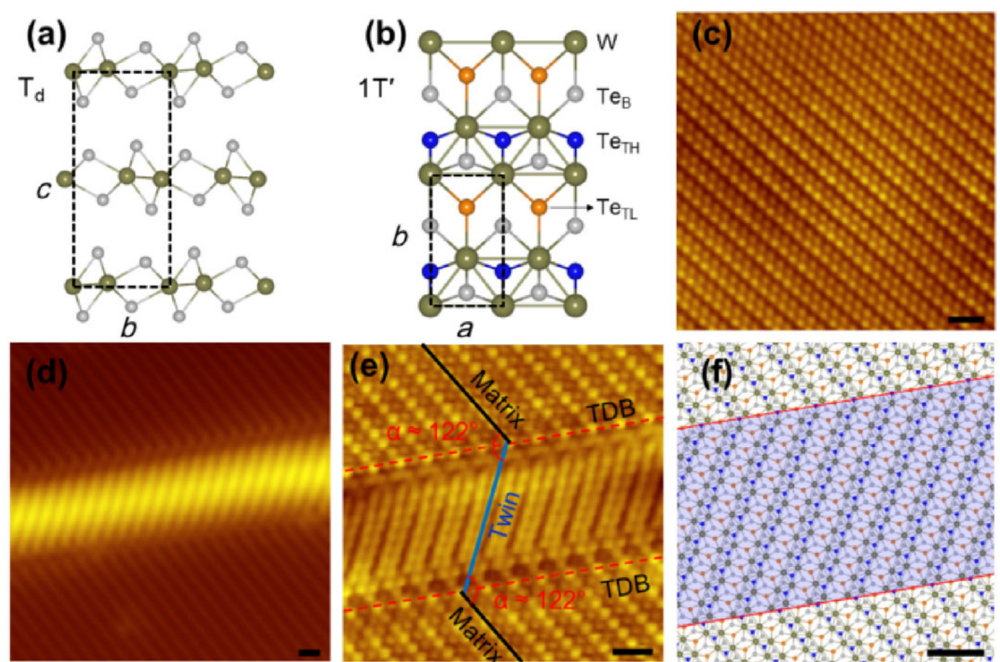
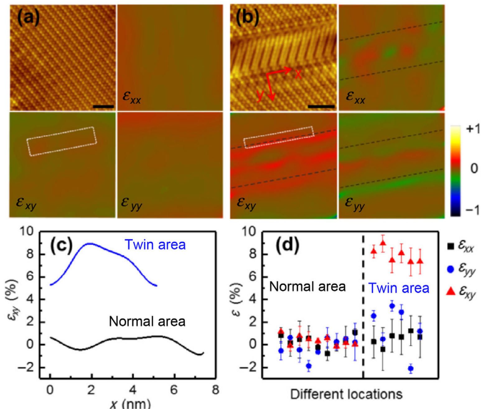
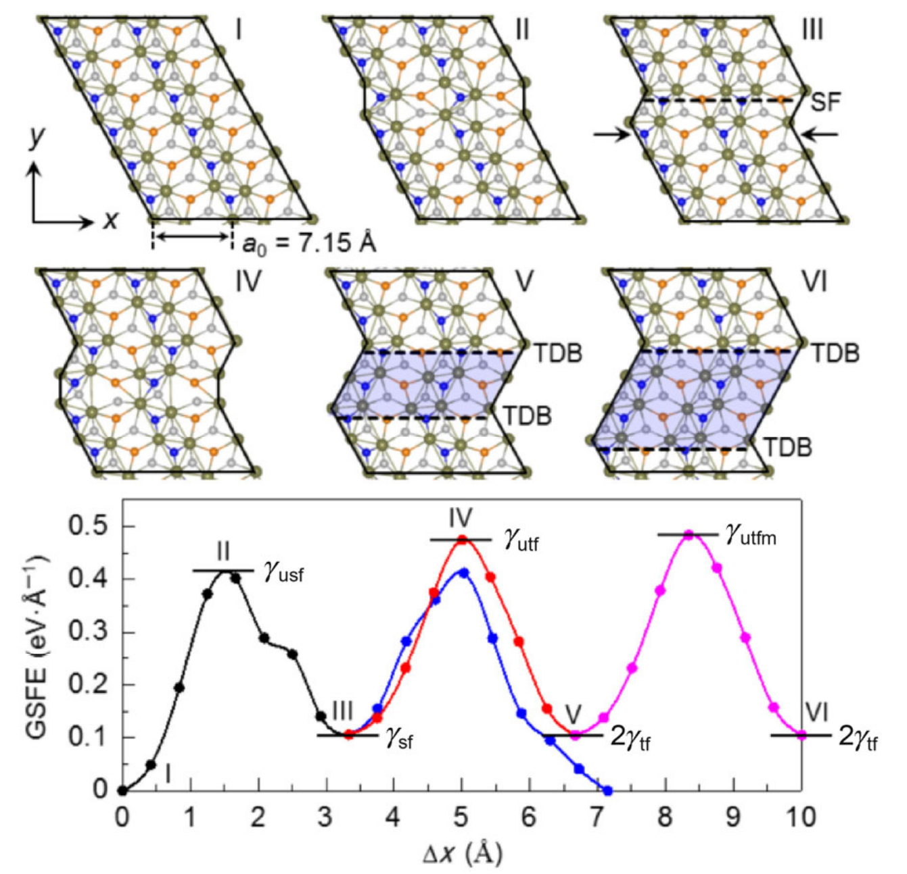

## wangFormationMechanismTwin2019 — 二维材料中孪晶畴边界的形成机制：WTe2的例子

## 📄 元数据
Guan-Yong Wang, Weiyu Xie, Dan Xu, Hai-Yang Ma, Hao Yang, Hong Lu, Hao-Hua Sun, Yao-Yi Li, Shuang Jia, Liang Fu, Shengbai Zhang, Jin-Feng Jia，2019，Nano Research，12(3): 569-573，DOI: 10.1007/s12274-018-2255-x
## 💡 一句话
首次在WTe2单晶表面实验观察到孪晶畴界（TDB），通过STM-GPA应变定量与DFT广义层错能计算证明其为位移驱动而非热驱动，需约7%临界剪切应变克服起始势垒。
## 🔗 Wiki 双链
  - 概念 [[../concepts/2D-materials]]、[[../concepts/strain-engineering]]、[[../concepts/ferroelasticity]]、[[../concepts/topological-defects]]、[[../concepts/charge-density-wave]]、[[../concepts/twin-domain-boundary|孪晶畴界]]、[[../concepts/generalized-stacking-fault-energy|广义堆垛层错能（GSFE）]]、[[../concepts/geometric-phase-analysis|几何相位分析（GPA）]]、[[../concepts/displacement-induced-twinning|位移诱导孪晶]]、[[../concepts/peierls-framework|Peierls框架]]
  - 实体 [[../entities/WTe2]]、[[../entities/TMDs]]、[[../entities/domain-wall]]
  - 图表 [[../figures/crystal-structures]]、[[../figures/experimental-setups]]、[[../figures/mathematical-models]]、[[../figures/heterostructures-stacking-domains-devices|铁弹畴、畴壁、In₂Se₃与器件应用]]
  - 年度 [[../write/2019]]
  - 项目 [[../projects/project-5-snte-ferroelectric-sim]]、[[../projects/project-2-mn-multiferroics]]、[[../projects/project-7-cdw-charge-density-wave]]
  - 相关论文 [[../../raw/note/wangFormationMechanismTwin2019]]
## 🆕 新概念/实体建议
  - `ripplocation`（褶皱位错）：范德华层状材料中通过局部屈曲形成的类位错面缺陷，本文观察到的窄而不对称褶皱与此概念相关。
## 📊 关键图表
  -  → [[../figures/heterostructures-stacking-domains-devices|铁弹畴、畴壁、In₂Se₃ 与器件应用]]
  - **图示描述**：(a) 为样品堆叠示意图，自下而上为 Si 衬底、固化铟胶、WTe₂ 单晶，加热器位于衬底下方；(b) 为四个不同位置的表面褶皱 STM 形貌图，标尺 50 nm。
  - **关键特征**：加热熔化铟再冷却固化时，铟与 WTe₂ 热膨胀系数不匹配及固化非均匀形变会向 WTe₂ 引入大的局部应变；上两幅褶皱窄而不对称（类似自折叠 ripplocation），下两幅宽而对称，所有褶皱高度在 100–200 pm 范围，证明应变场高度不均匀；表面观察到的褶皱中只有不到 10% 是孪晶畴界。
  - **结论/意义**：该装置是后续观察应变诱导 TDB 的实验前提，也提示需把普通褶皱与孪晶界区分开。

  -  -> [[../figures/crystal-structures|晶体结构与原子排布]]
  - **图示描述**：(a)(b) 分别为三维 Td-WTe₂ 侧视图与单层 1T'-WTe₂ 俯视图（W 棕色、顶表面较高 TeTH 蓝色、较低 TeTL 橙色、底层 TeB 灰色）；(c) 为 Vbias = 5 mV 下原始 WTe₂ 的高分辨 STM；(d) 为 Vbias = 2.08 V 下含 TDB 的表面形貌；(e) 为 Vbias = 9.57 mV 下 TDB 的原子分辨像；(f) 为对应 11 个原子层宽孪晶区的结构模型，蓝色阴影为孪晶区，各图标尺 1 nm。
  - **关键特征**：从 (c) 测得晶格常数 a 轴 3.48 Å、b 轴 6.25 Å，与早期报道一致；(d) 中高偏压使孪晶区呈亮斑，内部条纹方向与基体明显不同；(e) 测得孪晶内部条纹与基体条纹夹角约 122°，略偏离理想 1T 相的 120°，源于 1T→1T' 晶格畸变；模型 (f) 预测 TDB 完全平坦，而实验中 TDB 总伴有表面褶皱（褶皱宽约 6 nm、高约 150 pm），这一差异是后续应变分析的关键线索。
  - **结论/意义**：首次在实验上观察并解析 WTe₂ 的 TDB 原子结构，并以"模型平坦 vs 实验褶皱"的矛盾引出应变场主控的假说。

  -  → [[../figures/heterostructures-stacking-domains-devices|铁弹畴、畴壁、In₂Se₃ 与器件应用]]
  - **图示描述**：(a)(b) 各含四幅子图——左上为高分辨 STM 原图，其余三幅为 GPA 得到的正应变 εxx、εyy 和剪切应变 εxy；x 轴沿 TDB 方向、y 轴垂直于 TDB，标尺 2 nm，(b) 中黑虚线标出 TDB 位置；(c) 为 (a)(b) 白框内 εxy 沿 x 方向的平均线轮廓；(d) 为多个相距远大于扫描窗口位置的应变均值（实心点）与标准差（误差棒）统计。
  - **关键特征**：正常区 (a) 晶格近乎完美，εxx、εyy、εxy 均接近零；孪晶区 (b) 中 εxy 在 TDB 附近呈大范围正值集中；线轮廓 (c) 显示正常区 εxy 在 (−1%, 1%) 内波动，而孪晶区跃升至 (5%, 9%)；多点统计 (d) 表明孪晶区 εxy 均值在所有位置都系统性增至 7%–9%，εxx 仅标准差升至约 4%、εyy 均值波动增大但标准差不变，唯独 εxy 呈一致性跃升。
  - **结论/意义**：定量锁定剪切应变 εxy 是与 TDB 形成直接相关的主控分量，把"褶皱伴生"这一定性观察升级为可被理论检验的应变阈值。

  -  -> [[../figures/crystal-structures|晶体结构与原子排布]]
  - **图示描述**：上半部分为单层 1T'-WTe₂ 沿 x 方向刚性滑移的六个快照 I→VI，蓝色阴影为逐渐扩展的孪晶区，a₀ 为 [110] 方向单位长度；下半部分为对应滑移距离的 GSFE 曲线，蓝线对应 trailing partial 恢复原态、红线对应 twinning partial 形成一个原子层宽孪晶、粉线对应孪晶进一步生长。
  - **关键特征**：曲线上定义 γusf（不稳定层错能，I→II 能垒）、γsf（层错态 III 能量）、γutf（不稳定孪晶能，III→IV 能垒）；计算得到 γusf/γutf = 0.894，接近最大值 1，孪晶倾向很大，与样品中罕见孤立层错一致；γutf 约为典型三维金属 Al、Ni、Cu 的三倍，体现二维层内集体滑移路径的高能垒；基于 Peierls 框架推导：I→II 产生层错需 6.4% 剪切应变（速率决定步骤），III→IV 孪晶成核需 5.0%，V→VI 孪晶生长需 5.2%。
  - **结论/意义**：6.4% 即为启动完整孪晶过程所需的临界剪切应变，与 GPA 实验测得的约 7% 高度吻合，从理论上证实 WTe₂ 的 TDB 是位移驱动而非热驱动，需大量原子集体协同位移以克服起始能垒。

## 🔬 项目连接
  - **project-5（SnTe铁电模拟）— medium**：本文的DFT+弹性理论方法（GSFE曲线计算、Peierls框架推导临界应变）可直接迁移到SnTe中铁电畴壁成核与应变驱动结构相变的能垒计算；应变场与畴界耦合的物理图像对理解SnTe中应变调控铁电翻转有方法论参考价值。
  - **project-2（Mn多铁）— weak**：本文讨论铁弹性切换及二维TMDC中铁弹/铁磁/多铁行为的可能性，畴界物理与多铁材料中的畴结构有类比意义；但材料体系与具体机制差异较大，仅提供畴界-应变耦合的一般物理图像。
  - **project-7（CDW）— weak**：本文引言和结论提及畴界可承载一维CDW（如MoSe2镜像孪晶界）等拓扑保护边缘态，应变场与畴界涌现物性的相互作用对CDW研究有背景参考价值；但WTe2的TDB本身未展示CDW。
## 🔗 项目双链
- 项目 [[../projects/project-5-snte-ferroelectric-sim|项目五：lammps势函数SnTe铁电模拟]]
- 项目 [[../projects/project-2-mn-multiferroics|项目二：Mn极化结构铁电材料]]
- 项目 [[../projects/project-7-cdw-charge-density-wave|项目七：CDW电荷密度波]]

## 📝 组织与用词
文章采用"实验观察→提出矛盾→定量分析→理论验证→结论"的经典论证链条。先以铟胶固化引入应变的巧妙实验装置在WTe2表面首次观察到TDB，发现其总与褶皱共生而与"小应力热驱动"旧说矛盾；再用GPA将剪切应变εxy定量锁定为7%-9%；最后以DFT-GSFE计算给出6.4%临界应变的理论预测，与实验吻合。值得复用的术语：孪晶畴界（twin domain boundary, TDB）、位移诱导孪晶（displacement-induced twinning）、广义堆垛层错能（generalized stacking fault energy, GSFE）、几何相位分析（geometric phase analysis, GPA）、临界剪切应变（critical shear strain）、不稳定层错能（unstable stacking fault energy, γusf）、不稳定孪晶能（unstable twin fault energy, γutf）、铁弹性切换（ferroelastic switching）、分位错（partial dislocation）、Peierls框架（Peierls framework）。
## ✏️ 可写入 Wiki 的要点
  - 首次在WTe2单晶表面实验观察到[[../concepts/twin-domain-boundary|孪晶畴界]]（TDB），孪晶内部准一维条纹与基体条纹夹角约122°（略偏离理想1T相的120°，源于1T→1T'晶格畸变）。
  - TDB总是与表面褶皱（rippling）共生，褶皱高度约100-200 pm、宽度约6 nm；但表面观察到的褶皱中只有不到10%是孪晶界。
  - GPA应变分析表明：正常区域εxy在（-1%, 1%）波动，而孪晶区域εxy系统性跃升至7%-9%；εxx和εyy无显著一致变化，证明剪切应变εxy是TDB形成的主控因素。
  - DFT计算单层1T'-WTe2的GSFE曲线，定义了γusf（不稳定层错能）、γsf（层错能）、γutf（不稳定孪晶能）等关键能量参数；γusf/γutf = 0.894，表明材料孪晶倾向很大，与实验上罕见孤立层错一致。
  - 基于[[../concepts/peierls-framework|Peierls框架]]推导：层错产生（I→II）需6.4%剪切应变（速率决定步骤），孪晶成核（III→IV）需5.0%，孪晶生长（V→VI）需5.2%；6.4%即为启动完整孪晶过程的临界剪切应变，与实验值7%吻合。
  - 1T'-WTe2中不同变体间转换势垒约0.2 eV/f.u.，远小于MoTe2的H→T'势垒（0.8-0.9 eV/f.u.）；但本文证明小势垒不等于热激活即可成核，因为起始层错步骤仍需大应变克服γusf。
  - 二维与三维孪晶机制有本质区别：三维金属（Al, Ni, Cu）中滑动发生在相邻原子面之间，而二维层状材料中孪晶必须通过单层内大量原子沿特定方向的集体协同位移完成，能垒更高（γutf约为典型3D金属的3倍）。
  - 实验通过铟胶固化引入应变：加热熔化铟后放置WTe2，冷却时因铟与WTe2热膨胀系数不匹配及固化过程非均匀形变，在WTe2中引入大的局部应变场。
  - WTe2晶格常数实验测量值：a轴3.48 Å，b轴6.25 Å；Td相为三维层状结构，单层1T'相中W原子沿a轴位移、Te原子沿c轴交错。
  - TDB的观察证明了WTe2中[[../concepts/ferroelasticity|铁弹性]]切换的可能性，为二维TMDC中铁弹、铁磁乃至[[../concepts/multiferroicity|多铁性]]行为开辟了思路；可控产生和操控局部应变对利用畴界拓扑保护边缘态等涌现物性具有重要意义。
