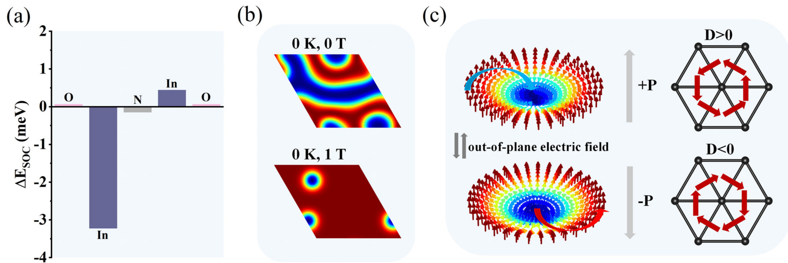
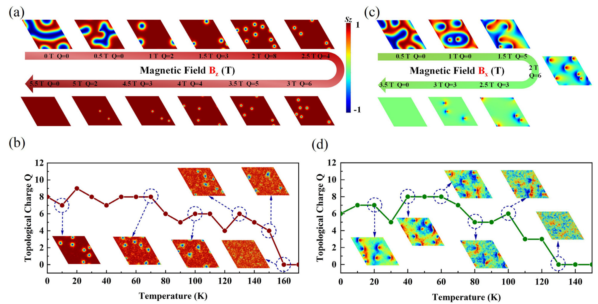
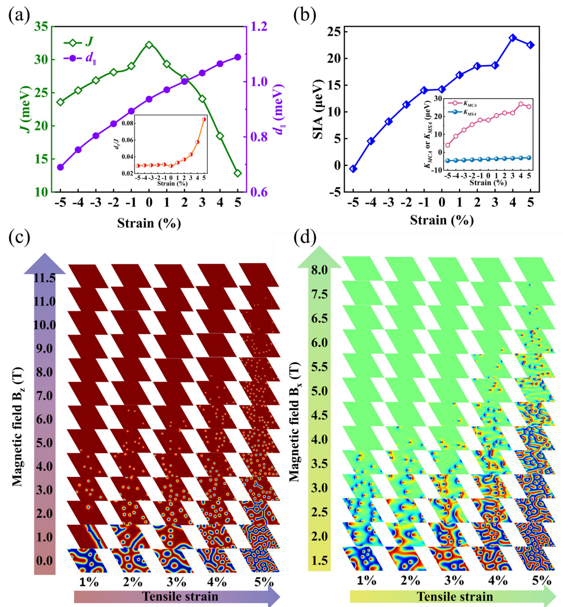
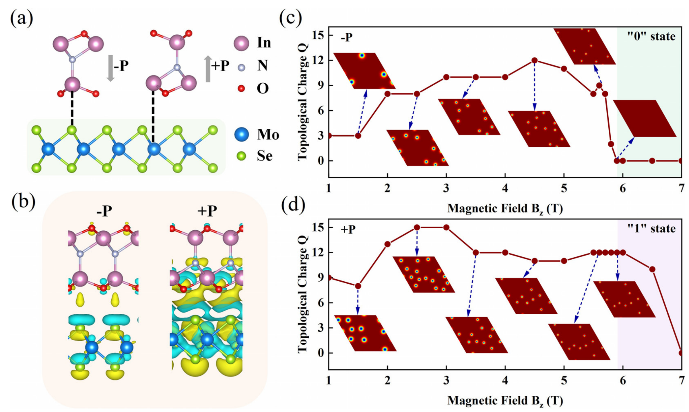
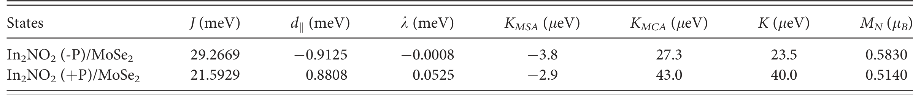

## wangTunableD0Topological2025b — 多铁性单层 In₂NO₂ 中可调谐的 d⁰ 拓扑磁态

- **元数据**：Fei Wang, Li Deng, Yanzhao Wu, Xiang Yin, Junwei Tong, Xianmin Zhang，2025，Applied Physics Letters 127, 092406，DOI 10.1063/5.0282076
- **一句话**：通过第一性原理计算加微磁学模拟，预言单层多铁半金属 In₂NO₂ 中存在由 N 原子 p 轨道电子诱导的 d⁰ 铁磁性，并在垂直/面内磁场下分别产生斯格明子与双半子；拉伸应变可提高其密度与稳定性，In₂NO₂/MoSe₂ 异质结中可借铁电极化翻转对斯格明子相进行非易失性"开/关"以编码"0/1"。

- **现有wiki双链**：
  - 概念 [[../concepts/2d-materials]]
  - 概念 [[../concepts/multiferroicity]]
  - 概念 [[../concepts/magnetoelectric-coupling]]
  - 概念 [[../concepts/strain-engineering]]
  - 概念 [[../concepts/density-functional-theory]]
  - 概念 [[../concepts/spin-orbit-coupling]]
  - 概念 [[../concepts/berry-phase]]
  - 概念 [[../concepts/polarization-switching]]
  - 概念 [[../concepts/topological-defects]]
  - 实体 [[../entities/VASP]]
  - 实体 [[../entities/In2Se3]]
  - 实体 [[../entities/TMDs]]
  - 图表 [[../figures/crystal-structures]]
  - 图表 [[../figures/electronic-bands]]
  - 图表 [[../figures/heterostructures-stacking]]
  - 图表 [[../figures/mathematical-models]]
  - 年度 [[../write/2025]]
  - 项目 [[../projects/project-2-mn-multiferroics]]
  - 项目 [[../projects/project-5-snte-ferroelectric-sim]]
  - 相关论文 [[../../raw/note/wangTunableD0Topological2025b]]

- **新概念/实体建议**：
  - `d0-magnetism`：d⁰ 磁性——磁性不来自 d/f 轨道而来自 s/p 轨道（本文为 N 的 2p 单个未配对电子），特征是小磁矩、电子离域。
  - `skyrmion`：磁斯格明子——涡旋状拓扑自旋织构，由 DMI 与交换、各向异性、外场竞争形成，具拓扑荷 Q。
  - `bimeron`：磁双半子——面内磁化或面内磁场下斯格明子的对应物，由涡旋-反涡旋对组成。
  - `dzyaloshinskii-moriya-interaction`：DMI，反对称交换 d_k·(S_i×S_j)，源自破缺反演对称与 SOC，决定手性磁结构。
  - `half-metal`：半金属——一个自旋通道金属、另一自旋通道绝缘，可产生 100% 自旋极化电流。
  - `heisenberg-model`：经典海森堡自旋哈密顿量（含 J、d_k、各向异性交换 k、单离子各向异性 K、塞曼项），连接 DFT 参数与微磁学。
  - `micromagnetic-simulation`：微磁学模拟，基于 Landau-Lifshitz-Gilbert 方程在介观尺度上演化自旋织构。
  - `topological-spin-texture`：拓扑自旋织构（斯格明子、双半子、反斯格明子等）的总称，可由拓扑荷 Q 计数。
  - `stoner-model`：Stoner 巡游铁磁性模型，用于解释 In₂NO₂ 中非整数 N 磁矩（0.584 μ_B）所体现的离域铁磁。
  - 实体 `In2NO2`：单层铟氮氧化物，P3m1 三角晶格、O–In–N–In–O 五层堆垛，本征面外铁电且 d⁰ 铁磁半金属。
  - 实体 `MoSe2`：二硒化钼，TMD 衬底，与 In₂NO₂ 晶格失配仅 2.4%，用于构建铁电可控异质结。

- **关键图表**：
  - 
  - 
  - 
  - 
  - 
  - 

- **项目连接**：
  - **project-2（Mn 多铁）— strong**：本文是二维多铁中电场-磁场耦合控制拓扑磁态的典型理论范本。可直接借鉴的内容包括：(1) 由本征铁电极化翻转导致 DMI 反号、从而控制斯格明子手性/开关的磁电机理；(2) 从 DFT 提取 J、DMI、K_MCA、K_MSA 等磁参数并代入海森堡模型做微磁学/蒙特卡洛模拟的完整工作流；(3) 对 d 轨道局域磁矩 vs p 轨道离域磁矩在拓扑态稳定性上差异的物理图像，可作为 Mn 基多铁体系的对照与补充。
  - **project-5（SnTe 铁电模拟）— medium**：论文展示了一整套可复用的二维铁电 DFT 工作流——Berry 相位极化计算、双轴应变对铁电/磁性参数的调谐、vdW 异质结（In₂NO₂/MoSe₂）中极化方向调制界面电荷转移与功函数失配的分析。这些方法对 SnTe 薄膜/异质结的铁电模拟有直接方法学参考价值；拓扑磁部分本身关系不大。
  - project-1（双光子）、project-3（机械发光 NN）、project-4（TTF 分子计算）、project-6（湿度传感器）、project-7（CDW）：无直接项目连接。

- **组织与用词**：文章按"问题提出 → 材料设计 → 电子/磁性质论证 → 磁场/温度/应变/电场多维度调控 → 器件编码演示"的递进逻辑组织，先确立 In₂NO₂ 的 d⁰ 铁磁性与本征铁电性，再以 DFT 参数驱动微磁学模拟得到斯格明子/双半子相图，最后落到 In₂NO₂/MoSe₂ 异质结的"0/1"编码。值得在 wiki 中复用的术语：
  - d⁰ 磁性 / d0 magnetism
  - 拓扑自旋织构 / topological spin texture
  - 斯格明子 / skyrmion
  - 双半子 / bimeron
  - Dzyaloshinskii–Moriya 相互作用 / Dzyaloshinskii–Moriya interaction (DMI)
  - 单离子各向异性 / single-ion anisotropy (SIA)
  - 铁电场效应 / ferroelectric field effect
  - 拓扑电荷 / topological charge Q
  - 多铁性半金属 / multiferroic half-metal

- **可写入wiki的要点**：
  1. 单层 In₂NO₂ 为 P3m1（No. 156）三角晶格，O–In–N–In–O 五原子层堆垛，优化晶格常数 a = 3.41 Å，结构与已合成的 α-In₂Se₃ 类似；声子谱与 AIMD 验证其动力学和热稳定性。
  2. In 原子电子构型由 [Kr]4d¹⁰5s²5p¹ 失去 3 个电子变为 [Kr]4d¹⁰5s⁰5p⁰，N 原子变为 1s²2s²2p⁵，仅一个未配对 p 电子，体系总磁矩 1 μ_B/f.u.，N 原子上 M_N = 0.584 μ_B（非整数，体现离域铁磁，用 Stoner 模型描述）；U 值对能带几乎无影响，取 U = 0 eV。
  3. 能带为半金属：一自旋通道穿费米面、另一通道有带隙；SOC 对电子结构影响很小。
  4. 磁参数：J = 32.2194 meV（铁磁），面内 DMI d_k 在 +P/-P 态分别为 +0.9367/-0.9367 meV，各向异性交换 k ≈ 0，K_MCA = 18 μeV、K_MSA = 3.8 μeV，单离子各向异性 K = 14.2 μeV（面外易轴），蒙特卡洛估计 T_C ≈ 105 K；面外 DMI d_⊥ 因 C3 对称可忽略。
  5. 强 DMI 主要来自较重的 In 原子的 SOC，而非磁性元素 N 本身——打破"只有重磁性元素才有大 DMI"的直觉。
  6. 垂直磁场 B_z = 1–5 T 下形成 d⁰ 斯格明子，B_z = 2 T 时拓扑荷峰值 Q = 8，5 T 时斯格明子直径约 9.6 nm，5.5 T 时进入平庸铁磁态；0–150 K 范围内 Q 稳定，归因于 p 轨道磁性的离域化。
  7. 面内磁场 B_x = 1.5–3 T 下形成双半子，0–120 K 稳定，130 K 进入无序相。
  8. ±P 极化态下 DMI 符号相反，使斯格明子手性相反，可用面外电场可逆翻转手性。
  9. 应变工程：拉伸应变使 d_k 单调增加、J 略减，|d_k/J| 显著增大，SIA 保持为正并增强；5% 拉伸下斯格明子可在 B_z = 4–11 T 范围内纯相存在，密度增大；压缩应变影响很小。论文引用 MoS₂ 器件典型应变 ≤2.5%、WS₂ 可达 4%，建议 In₂NO₂ 器件可用约 3% 应变。
  10. In₂NO₂/MoSe₂ 异质结晶格失配仅 2.4%，±P 态下界面电荷转移量因功函数失配不同导致 J、d_k 等参数差异；-P 态 B_z < 5.9 T 为斯格明子相，+P 态仅在 B_z = 5.9–7.0 T 出现斯格明子相（5.9 T 时直径 7.96 nm），从而在约 5.9 T 固定磁场下用电场翻转极化即可在铁磁"0"态与斯格明子"1"态之间非易失切换。
