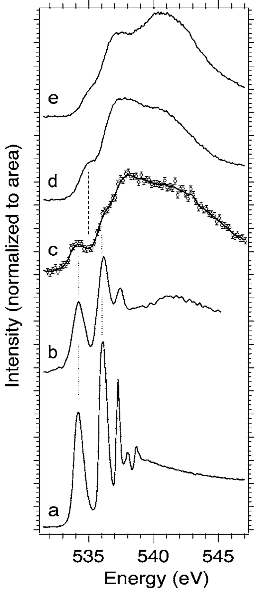
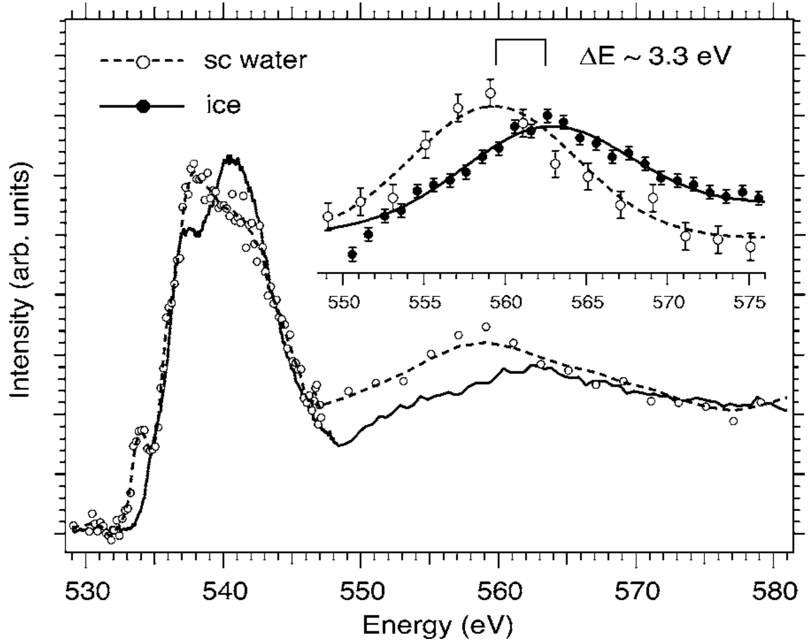

## wernetSpectroscopicCharacterizationMicroscopic2005 — 超临界水中微观氢键差异的光谱表征

## 📄 元数据
Ph. Wernet, D. Testemale, J.-L. Hazemann, R. Argoud, P. Glatzel, L. G. M. Pettersson, A. Nilsson, U. Bergmann et al.，2005，*The Journal of Chemical Physics* 123, 154503，DOI [10.1063/1.2064867](https://doi.org/10.1063/1.2064867)

## 💡 一句话
用氧 K 边 X 射线拉曼散射（XRS）结合 DFT 计算谱，首次直接证明超临界水中并存两种截然不同的局域构型——约 65% 的分子具有四个完整但严重扭曲的氢键（平均 O–O 距 3.1 Å），约 35% 的分子具有两个自由 O–H 键（类气相），支持非均相"斑块"结构模型，颠覆了基于衍射的"均匀部分断键网络"图像。

## 🔗 Wiki 双链
  - 概念 [[../concepts/density-functional-theory|密度泛函理论]]（用 DFT 对 11 分子水团簇计算氧 K 边近边谱，与实验差谱拟合反推氢键几何）
  - 概念 [[../concepts/x-ray-raman-scattering|X 射线拉曼散射]]（硬 X 射线非弹性散射版 XAS，~10 keV 入射、q→0 时等价于 XAS，可穿透 Be 窗原位探测高压高温流体）
  - 概念 [[../concepts/x-ray-absorption-spectroscopy|X 射线吸收光谱]]（芯电子到未占据轨道的吸收谱，氧 K 边近边区对局域氢键环境敏感；Thomas–Reiche–Kuhn 求和规则保证面积归一化可比构型丰度）
  - 概念 [[../concepts/hydrogen-bond|氢键]]（区分供体/受体氢键，给出 O–O 距 ≥3.3 Å 或 O–H···O 角 <150° 的断键判据；XRS 对供体侧敏感）
  - 概念 [[../concepts/radial-distribution-function|径向分布函数]]（衍射给出的系综平均 g(r)，无法区分"断键"与"扭曲键"，是本文引入 XRS 的核心动机）
  - 概念 [[../concepts/heterogeneous-patch-model|非均相斑块模型]]（5–10 分子致密四氢键斑块分散于类气相低密度背景，由 SAXS 相关长度 5.6±0.4 Å 与 XRS 构型联合约束）
  - 实体 [[../entities/supercritical-water|超临界水]]（温度压力高于临界点 374.1 °C/220.6 bar 的水；本文状态点 380 °C、300 bar、0.54 g/cm³）
  - 图表 [[../figures/optical-spectra]]（氧 K 边 XAS/XRS 近边谱、pre-edge/post-edge 指认、差谱法定量组分）
  - 图表 [[../figures/experimental-setups]]（APS 18-ID 波荡器线站、Si(400) 单色器、Ge(555) 多晶分析器、Be 窗高压高温池、氧化铝管样品容器）
  - 年度 [[../write/2005]]
  - 相关论文 [[../../raw/note/wernetSpectroscopicCharacterizationMicroscopic2005]]

## 📊 关键图表
  - **图1：气相/液面/超临界/液态/冰五种水的氧 K 边近边谱对比**
  -  -> [[../figures/optical-spectra|光学光谱]]
  - **图示描述**：横轴为氧 K 边能量转移（eV，约 532–547 eV 近边区），纵轴为按 532–547 eV 面积归一化的强度；五个子图自上而下列出 (a) 气相、(b) 液态水表面、(c) 380 °C/300 bar 超临界水、(d) 常压液态水、(e) 冰。
  - **关键特征**：气相与液面谱在 534 eV（4a₁）和 536 eV（2b₁）出现尖锐双峰，对应两个自由 O–H（不做供体氢键）；液态水在 535 eV 有特征小峰，指示一个断裂或弱化的供体氢键；冰在 534–536 eV 几乎无强度，537–542 eV 后边呈以约 541 eV 为中心的尖锐强峰，对应规整四面体四氢键网络；超临界水既有 534 eV 主峰+536 eV 肩峰（类气相组分），又有 537–542 eV 强后边（成键组分），但后边比冰更宽且缺失 535 eV 峰。
  - **结论/意义**：定性证明超临界水不是"均匀部分断键的类液网络"，而是"类气相分子 + 四氢键饱和但严重扭曲分子"的二元共存，这是论文非均相模型的指纹证据。
  - **图2：超临界水与冰的扩展氧 K 边谱（~560 eV 第二极大）**
  - 
  - **图示描述**：横轴为更宽能量范围的能量转移（eV，约 520–585 eV），纵轴为归一化 XRS 强度；叠加展示超临界水与结晶冰两条谱，重点比较约 560 eV 处由光电子背散射干涉形成的第二极大，插图放大该峰位差异。
  - **关键特征**：约 560 eV 的第二极大峰位对最近邻 O–O 距离敏感（距离越远峰位能量越低）；超临界水该峰相对冰向低能方向移动 3.3±0.8 eV；以冰的 O–O 距 2.75 Å 为基准换算，超临界水成键分子平均 O–O 距被拉长 0.3±0.1 Å，至 3.1±0.1 Å；对应氢键键长约 2.1 Å，落在完整氢键判据（O–O ≤ 3.3–3.5 Å）之内。
  - **结论/意义**：定量给出超临界水成键区"键被显著拉长但仍完整"的几何参数，且与中子/X 射线衍射在相似条件下 O–O RDF 第一峰 3.0–3.2 Å 的结果一致。
  - **图3：实验-计算谱定量拟合（差谱+DFT 构型分解）**
  -  -> [[../figures/mathematical-models-computational|计算方法与泛函]]
  - **图示描述**：四个子图共享能量转移（eV）横轴与归一化强度纵轴：(a) 超临界水谱（实线）与按 0.35 缩放的气相谱（虚线）；(b) 两者之差，即纯氢键组分谱；(c) (b) 与 DFT 计算的三种完全成键构型谱（冰状、单扭曲供体+受体、四扭曲氢键）加权和对比，插图展示不同缩放因子对 534 eV 差谱强度的影响以确定 0.35±0.2 误差；(d) O–O 距 3.9 Å 的均匀非成键分子计算谱。
  - **关键特征**：缩放因子 0.35±0.2 给出超临界水中具有两个自由 O–H（不做供体氢键）的类气相分子比例，剩余约 65% 为成键组分；差谱在 535 eV 无峰、542 eV 以上仍有显著权重，与液态水谱明显不同；DFT 最佳拟合中四扭曲氢键构型贡献约 90% 信号，单扭曲供体构型与冰状构型各仅约 5%，成键构型 O–O 距 2.65–3.3 Å、O–H···O 角 150°–180°；(d) 的均匀非成键谱在 537 eV 以上无强度，与实验矛盾，被明确排除，二聚体/三聚体/链状等中间构型总量被限制在几个百分点。
  - **结论/意义**：定量锁定"约 35% 类气相 + 约 65% 四键饱和但扭曲"的二元构型比例及成键区几何范围，是论文从定性指纹走向定量非均相斑块模型的核心分析图。

## 🔬 项目连接
  - **project-1 双光子**：无直接项目连接。本文研究水的氢键与 X 射线散射，不涉及双光子过程或相关材料。
  - **project-2 Mn多铁**：无直接项目连接。材料体系（水）与物理（氢键流体）与锰基多铁无关。
  - **project-3 机械发光NN**：无直接项目连接。
  - **project-4 TTF分子计算**：有**方法学参考价值**。本文给出了一套可复用的"DFT 团簇计算 + 近边吸收谱拟合"工作流：对 11 分子团簇中心分子做 DFT 计算振子强度→线性变宽 FWHM 高斯卷积→系统改变最近邻距离与角度→与实验差谱加权最小二乘拟合反演局域几何。对 project-4 中 TTF 等分子晶体若需解释 XAS/NEXAFS/电子能量损失谱，这套"团簇尺寸选择依据 SAXS 相关长度、分子内参数 5% 变化不敏感故可固定、显式扫描分子间坐标"的流程可直接借鉴。但本文不涉及 TTF 或有机导体物理本身。
  - **project-5 SnTe铁电模拟**：无直接项目连接。氢键扭曲与铁电扭曲在"局域对称性破缺+宏观平均掩盖双峰分布"层面有松散的物理类比（衍射/RDF 平均无法区分两种局域构型这一方法论教训同样适用于铁电局域极化分析），但材料、能量尺度、计算方法均不同，不构成实质参考。
  - **project-6 湿度传感器**：有**弱参考价值**。图 1(b) 液态水表面谱是"受体键合+两个悬空 O–H"的特征指纹，这正是湿度传感中水分子吸附在固体表面时常见的构型；本文对 534/536 eV 自由 O–H 双峰与 537 eV 以上氢键后边的指认，可作为用氧 K 边谱识别表面水吸附状态的参考基准。但本文主体是 380 °C/300 bar 的体相超临界水，与常温常压表面吸附水条件差异大，仅谱学指认层面可参考。
  - **project-7 CDW**：无直接项目连接。

## 🔗 项目双链
- 项目 [[../projects/project-6-humidity-sensor|项目六：小花闻的电压湿度传感器]]

## 📝 组织与用词
文章按"问题（衍射 RDF 的系综平均模糊性）→ 方法（XRS 硬 X 射线穿透 + 供体氢键敏感）→ 指纹对照（五相谱图定性识别二元性）→ 定量（差谱得 35% 类气相，扩展谱得 O–O=3.1 Å，DFT 拟合得四扭曲氢键占 90%）→ 模型（结合 SAXS 相关长度构建 5–10 分子斑块非均相模型）→ 宏观解释（有机物溶解于稀区、离子接触对）"递进。关键术语：
  - X-ray Raman scattering (XRS) — X 射线拉曼散射
  - Oxygen K edge / O K edge — 氧 K 边
  - Donor/acceptor hydrogen bond — 供体/受体氢键
  - Pre-edge / postedge — 前边峰 / 后边区域
  - Intact but distorted H bond — 完整但扭曲的氢键
  - Spectral difference / difference spectrum — 光谱差分 / 差谱
  - Radial distribution function (RDF) — 径向分布函数
  - Heterogeneous patch model — 非均相斑块模型

## ✏️ 可写入 Wiki 的要点
  1. [[../entities/supercritical-water|超临界水]]（380 °C, 300 bar, 0.54 g/cm³）中约 **65±20%** 的分子具有四个完整氢键，但全部扭曲（O–O 距 2.65–3.3 Å，O–H···O 角 150°–180°，冰为 2.75 Å/180°）；约 **35±20%** 的分子有两个自由 O–H 键，完全不做供体氢键，可能仅做 1–2 个受体氢键。
  2. 成键分子平均 **O–O 距 3.1±0.1 Å**（由扩展谱 ~560 eV 峰相对冰低移 3.3±0.8 eV 推算），对应氢键键长约 2.1 Å；这解释了中子衍射 O–H RDF 在 ~2 Å 处的宽肩峰，且与中子/X 射线衍射一致。
  3. 超临界水谱**缺失液态水 535 eV 特征峰**（该峰对应一个断裂/弱化供体键），说明成键分子是"四键饱和"而非液态水式的"部分断键"——这是对"均匀部分断键网络"传统模型的关键反证。
  4. DFT 拟合中四扭曲氢键构型贡献 **90%** 信号，单扭曲供体键和规则冰状构型各仅约 5%；计算还排除了均匀非键分布（O–O=3.9 Å，谱与气相相似但无 537 eV 以上强度），并限制二聚体/三聚体/链状中间构型总量在几个百分点。
  5. XRS 用 **6–12 keV 硬 X 射线**探测 540 eV 软 X 射线边，在低动量转移 q≈3–7 Å⁻¹ 下与 XAS 等价；硬 X 射线穿透 Be 窗和氧化铝管壁，实现高温高压体相原位探测，这是常规软 XAS 做不到的。能量分辨率约 1 eV，相对能量校准精度 ±0.2 eV。
  6. 谱图归一化基于 **Thomas–Reiche–Kuhn 求和规则**：近边区（532–547 eV）积分强度与价空穴数成正比，氢键不显著改变价电子数，故面积归一化后可直接比较不同构型相对丰度；边跳归一化给出系统误差，最终 0.35±0.2。
  7. [[../concepts/heterogeneous-patch-model|非均相斑块模型]]：SAXS 相关长度 **5.6±0.4 Å** + 斑块内每分子体积 27–33 ų → 平均每斑块 **5–10 个分子**；斑块不断形成-瓦解，稀区为类气相分子。该模型解释超临界水有机物高溶解度（有机物进入稀区无需断氢键网络）和离子接触对现象（氢键网络不够扩展以分别溶剂化阴、阳离子）。
  8. 氢键断裂判据：O–O 距 ≥3.3 Å，或 O–H···O 角 <150°，或两者兼有；XRS 无法区分这三种断键机制，对受体侧氢键也不敏感——这是该技术的固有局限。
  9. DFT 计算用 **11 分子团簇**模拟中心分子的第一配位壳层（团簇尺寸依据 SAXS 斑块大小选择），分子内 O–H 固定 0.95 Å、H–O–H 角 109.47°（5% 变化对谱无显著影响，且中子衍射证实分子内结构不随温压变化），系统扫描最近邻距离/角度生成数十种构型，振子强度用线性增宽高斯卷积。
  10. 实验在 APS 18-ID 波荡器线站完成：Si(400) 双晶单色器，Ge(555) 多晶分析器（布拉格角 86.4°），超临界水扫描 10010–10090 eV，累计 75×40 min 扫描，538 eV 处峰位共 2200 计数（背景扣除后），计数率仅 1–2 counts/s。
