## wuNonvolatileSwitchableHalfmetallicity2024 — MXene Hf₂MnC₂O₂/Sc₂CO₂多铁异质结中的非易失性可开关半金属性与磁性

## 📄 元数据
Changwei Wu, Shanwei Sun, Weiping Gong, Jiangyu Li, Xiao Wang et al.，2024，*Physical Chemistry Chemical Physics* 26(6), 5323–5332，DOI [10.1039/D3CP04847K](https://doi.org/10.1039/D3CP04847K)

## 💡 一句话
用第一性原理设计铁磁 MXene Hf₂MnC₂O₂ 与铁电 MXene Sc₂CO₂ 的范德华多铁异质结，翻转 Sc₂CO₂ 极化可非易失地使 Hf₂MnC₂O₂ 在双极磁性半导体与半金属之间切换，并同时增强铁磁交换 J₁（6.38→9.97 meV）和翻转易磁化轴（面内→面外）。

## 🔗 Wiki 双链
  - 概念 [[../concepts/multiferroicity]]、[[../concepts/magnetoelectric-coupling]]、[[../concepts/2D-materials]]、[[../concepts/density-functional-theory]]、[[../concepts/spin-orbit-coupling]]、[[../concepts/polarization-switching]]、[[../concepts/berry-phase]]、[[../concepts/half-metallicity|半金属性]]、[[../concepts/bipolar-magnetic-semiconductor|双极磁性半导体]]、[[../concepts/magnetic-anisotropy-energy|磁各向异性能]]、[[../concepts/superexchange|超交换作用]]、[[../concepts/selective-charge-transfer|界面选择性电荷转移]]、[[../concepts/polar-metal|极性金属]]、[[../concepts/spin-field-effect-transistor|自旋场效应晶体管]]
  - 实体 [[../entities/MXenes]]、[[../entities/VASP]]、[[../entities/In2Se3]]（同为二维铁电半导体可类比）、[[../entities/CrTe2]]、[[../entities/Fe3GeTe2]]（二维铁磁参照系）、[[../entities/SnTe]]（铁电体，类比项目材料）、[[../entities/Hf2MnC2O2]]、[[../entities/Sc2CO2]]
  - 图表 [[../figures/electronic-bands]]、[[../figures/crystal-structures]]、[[../figures/heterostructures-stacking]]、[[../figures/heterostructures-stacking-spintronics-strain|自旋电子学与应变工程]]、[[../figures/mathematical-models]]、[[../figures/electronic-devices]]
  - 年度 [[../write/2024]]
  - 项目 [[../projects/project-2-mn-multiferroics]]、[[../projects/project-5-snte-ferroelectric-sim]]
  - 主题 [[../topics/D02-多铁性材料]]、[[../topics/Z01-材料模拟计算设计]]
  - 相关论文 [[../../raw/note/wuNonvolatileSwitchableHalfmetallicity2024]]

## 📊 关键图表
  - 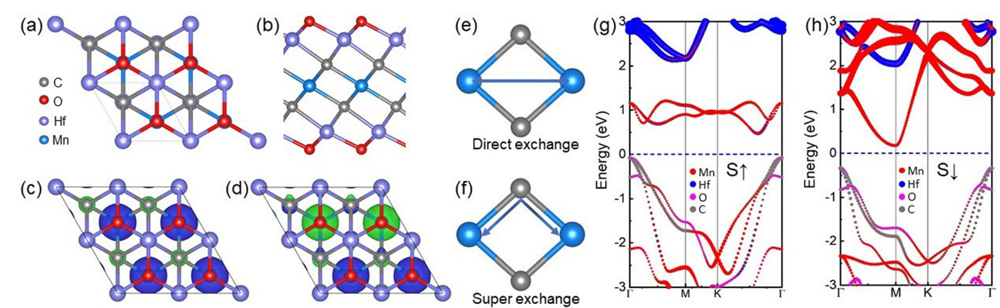 → [[../figures/heterostructures-stacking-spintronics-strain|自旋电子学与应变工程]]
  - 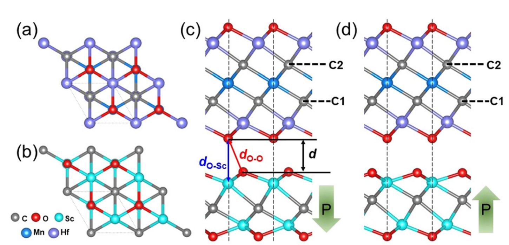 → [[../figures/heterostructures-stacking-spintronics-strain|自旋电子学与应变工程]]
  - 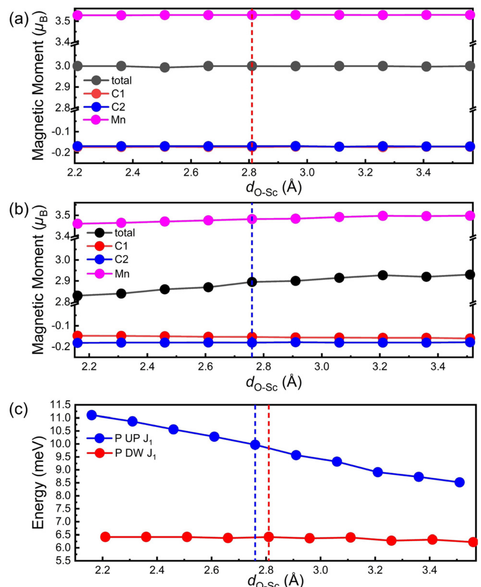
  - 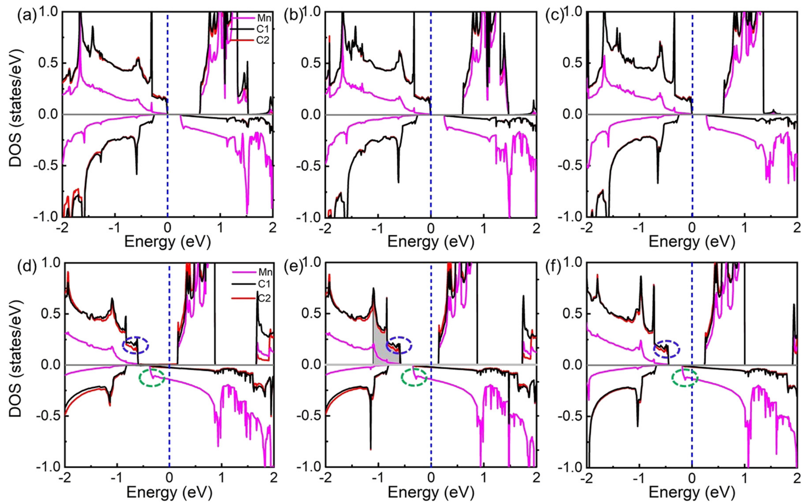
  - 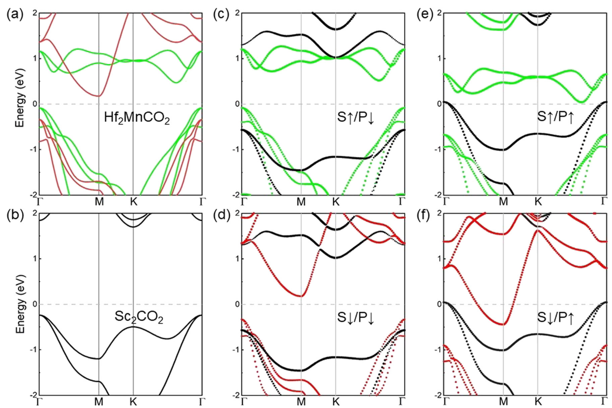 → [[../figures/heterostructures-stacking-spintronics-strain|自旋电子学与应变工程]]
  - 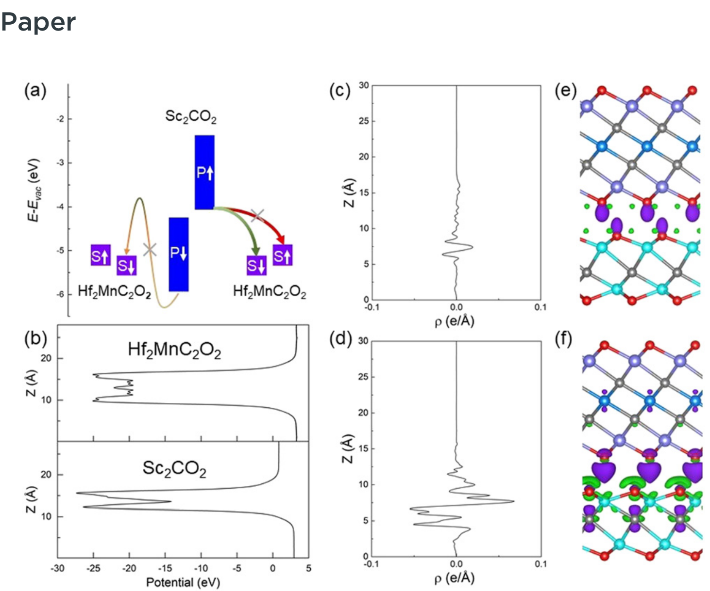
  - 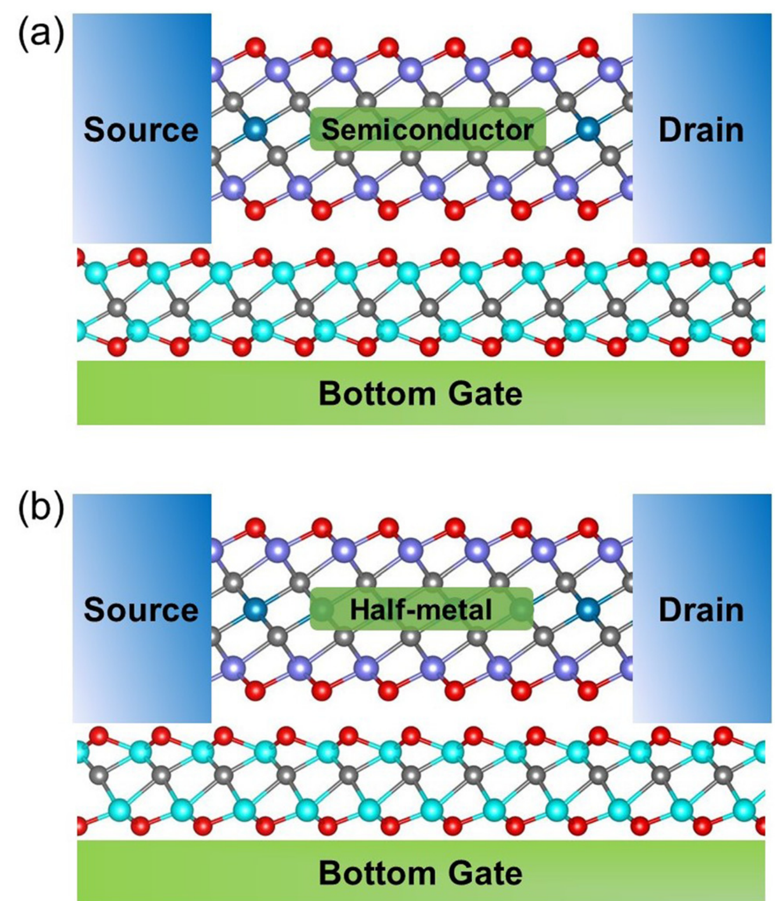
  - 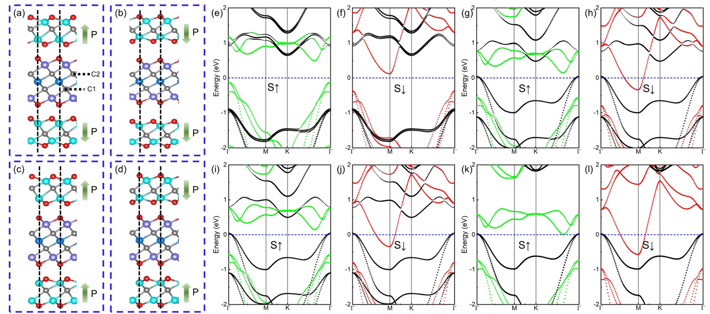 → [[../figures/heterostructures-stacking-spintronics-strain|自旋电子学与应变工程]]
  - 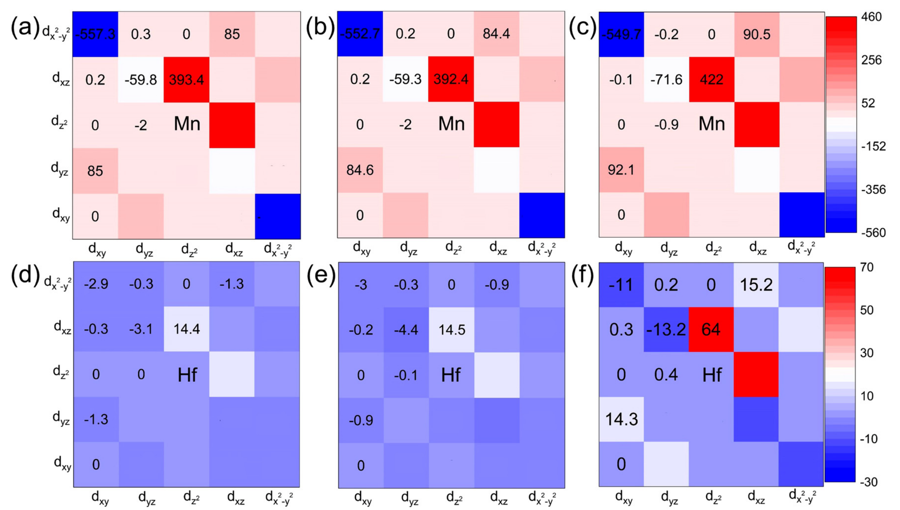 → [[../figures/heterostructures-stacking-spintronics-strain|自旋电子学与应变工程]]
  - 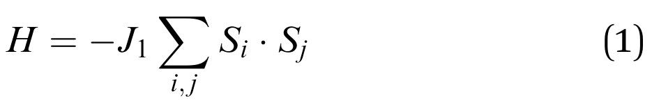
  - 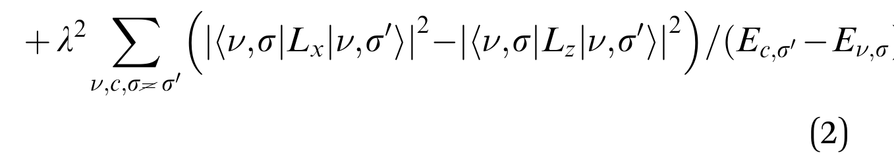
  - 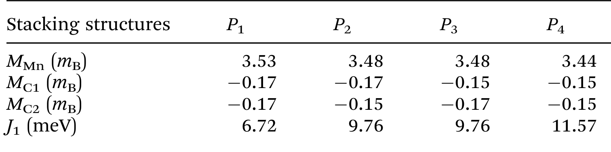

## 🔬 项目连接
  - **project-2（Mn 多铁）— 强相关**。本文核心磁性原子正是 Mn，磁性来源于 Mn–C–Mn 键角 95.22° 的超交换（Goodenough–Kanamori–Anderson 规则），与直接交换竞争后 FM 胜出。可迁移内容：(1) Mn 基二维体系中用 GGA+U（Mn 3d 取 U=4 eV，Dudarev 方案）处理强关联的参数经验；(2) 通过构建 2×1×1 超胞比较 FM/AFM 总能量、拟合最近邻海森堡模型提取 J₁ 的标准流程（公式1，ΔE = E_AFM − E_FM = 81.75 meV/cell 对应 J₁ = 6.38 meV）；(3) 磁电耦合的"铁电对称性破缺 + 铁磁时间反演破缺 → 自旋选择性电荷转移"机理，可类比到 Mn 多铁异质结中分析界面电荷重排对 Mn 价态/磁矩的影响；(4) 轨道分辨 MAE 分析方法（三角晶场下 d 轨道分裂为 |mz=0⟩、|±1⟩、|±2⟩ 三组，再用公式2判断自旋翻转项正负贡献），可直接用于判断 Mn 体系易轴翻转；(5) 通过人工缩放层间距 d_O–Sc 扫描 PDOS 演化来分离界面杂化贡献的论证技巧。
  - **project-5（SnTe 铁电模拟）— 方法学相关**。本文虽以 Sc₂CO₂ 为铁电层，但其铁电极化翻转的 DFT 分析流程对 SnTe 模拟有参考价值：(1) 用沿 z 方向的平面平均静电势定量提取两表面功函数差（约 2.1 eV）来表征极化场强度；(2) 以能带对齐（铁磁层 CB 与铁电层 VB 的相对位置）判断电荷转移方向的做法，可迁移到 SnTe 与其他二维层接触时的界面掺杂分析；(3) Pk/Pm 双稳态构型的构建、对称性破缺导致极性金属出现的图像，对理解铁电材料在异质结中"极化翻转即重构界面"具有一般意义；(4) 用 optPBE-vdW 与 DFT-D2 重复验证结论鲁棒性的做法，可作为铁电异质结计算的方法校验模板。
  - **project-7（CDW）**：无直接项目连接。仅在二维材料/层间 vdW 相互作用描述层面有泛泛相关性，未涉及电荷密度波物理。
  - **project-1 双光子 / project-3 机械发光 NN / project-4 TTF 分子计算 / project-6 湿度传感器**：无直接项目连接。

## 📝 组织与用词
  - 论证按"孤立铁磁层基态 → 异质结结构与稳定性 → Pk/Pm 电子性质对比 → 电荷转移机理 → 器件原型 → 三明治增强验证 → MAE 微观解析"层层递进；用人工扫描界面距离 d_O–Sc 结合 PDOS 的方式把"现象—机理"因果链锁死，是非常干净的计算论证范式。
  - 值得复用的关键词/术语：
    - 半金属性（half-metallicity）
    - 双极磁性半导体（bipolar magnetic semiconductor, BMS）
    - 超交换作用（superexchange）/ Goodenough–Kanamori–Anderson 规则
    - 磁各向异性能（magnetic anisotropy energy, MAE）
    - 选择性电荷转移（selective interfacial charge transfer）
    - 空间反演对称性破缺 / 时间反演对称性破缺（spatial inversion / time-reversal symmetry breaking）
    - 铁电双稳态（ferroelectric bistability）
    - 范德华多铁异质结（vdW multiferroic heterostructure）
    - 极性金属（polar metal）

## ✏️ 可写入 Wiki 的要点
  1. Hf₂MnC₂O₂ 为七层 O–Hf–C–Mn–C–Hf–O 三角反棱柱（D3d）结构，a = b = 3.24 Å，O–Hf、C–Hf、Mn–C 键长分别为 2.11、2.32、2.20 Å；Mn 为 3d⁶4s¹，失去一个电子呈高自旋 Mn⁺ d⁶，磁矩 3.54 μB（C、O、Hf 分别贡献 0.173、0.003、0.055 μB）。
  2. Hf₂MnC₂O₂ 的 FM 比 AFM 低 81.75 meV/cell，J₁ = 6.38 meV；Mn–C–Mn 键角 95.22°，按 Goodenough–Kanamori–Anderson 规则超交换倾向 FM，并压倒 Mn–Mn 直接交换的 AFM 倾向（与 CrI₃、Mn₂Ge₂Te₆ 情形类似）。
  3. Hf₂MnC₂O₂ 是双极磁性半导体：VBM 在 Γ 点自旋向上通道（主要为 C p），CBM 在 M 点自旋向下通道（主要为 Mn d），间接带隙 0.26 eV，可产生 100% 自旋极化电流。
  4. Sc₂CO₂ a = 3.35 Å，间接带隙 1.93 eV，VBM 来自 C p、CBM 来自 Sc d；具有 Pk/Pm 两个能量简并的面外铁电稳态，两表面功函数差约 2.1 eV；与 Hf₂MnC₂O₂ 晶格失配 < 3.3%。
  5. Pk 态下 Hf₂MnC₂O₂ 保持半导体（J₁ = 6.72 meV，Mn 磁矩 3.53 μB，MAE = −93 μeV/cell，面内）；Pm 态下变为半金属——自旋向下通道穿越费米能级、自旋向上通道仍有带隙，J₁ 升至 9.97 meV（摘要处写 9.67 meV），Mn 磁矩降至 3.47 μB，MAE = +47 μeV/cell，易轴翻转为面外。
  6. 机理双对称性协同：Sc₂CO₂ 空间反演破缺给出 2.1 eV 表面功函数差和极化场；Hf₂MnC₂O₂ 时间反演破缺使两自旋通道带边非简并集。Pk 时两自旋 CB均高于 Sc₂CO₂ VB，电荷转移被抑制；Pm 时自旋向下 CB 降至 Sc₂CO₂ VB 之下，电子选择性注入自旋向下通道，使其金属化并增强 Mn d–C p 在 −1.1 至 −0.6 eV 的杂化，从而强化 FM 超交换。Pm 态下 Sc₂CO₂ 自身也转为极性金属。
  7. 三明治 Sc₂CO₂/Hf₂MnC₂O₂/Sc₂CO₂ 四态（P1–P4）中，双 Pm 协同的 P4 态 J₁ 进一步达 11.57 meV，C1、C2 磁矩均降至 0.15 μB，半金属性最显著；P2/P3 镜像对称，J₁ = 9.76 meV。
  8. MAE 用公式 MAE = E[100] − E[001] 定义；基于二阶微扰（公式2）分解为自旋守恒（ΔSz=0，Lz/Lx）与自旋翻转（ΔSx=±1）项。三角晶场下 d 轨道分裂为 dz²(|mz=0⟩)、(dxz,dyz)(|±1⟩)、(dx²−y²,dxy)(|±2⟩)。Pm 电荷转移使自旋向下 CB 下移、带隙减小，Mn/Hf 的 |mz=0,±1⟩ 自旋翻转项经 Lx 贡献正 MAE，超过 |±2⟩ 经 Lz 的负贡献，使易轴由面内翻为面外。
  9. 计算细节：VASP，PAW–PBE，截断能 550 eV，力收敛 0.01 eV/Å、能量 10⁻⁵ eV（MAE 时 10⁻⁸ eV），D3 范德华修正，k 网格 17×17×1（MAE 用 31×31×1），z 方向真空 20 Å，Dudarev GGA+U（Mn U=4 eV，Sc U=2 eV）；并用 optPBE-vdW、DFT-D2 验证电子结构与 MAE 翻转结论的鲁棒性。
  10. 器件概念：以 Hf₂MnC₂O₂/Sc₂CO₂ 为沟道构建非易失 FET，Pk 对应 "0/OFF"（半导体高阻），Pm 对应 "1/ON"（半金属、100% 自旋极化电流）；写入只需翻转铁电极化，撤场后双稳态保持，内建电场抗热涨落，避免读取破坏。
