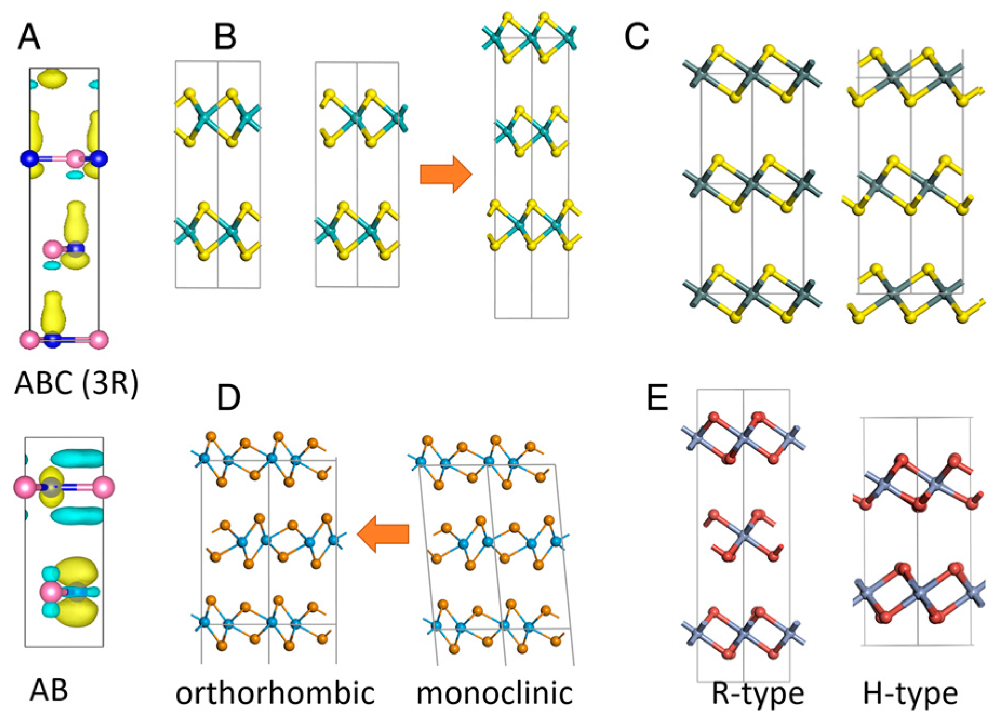
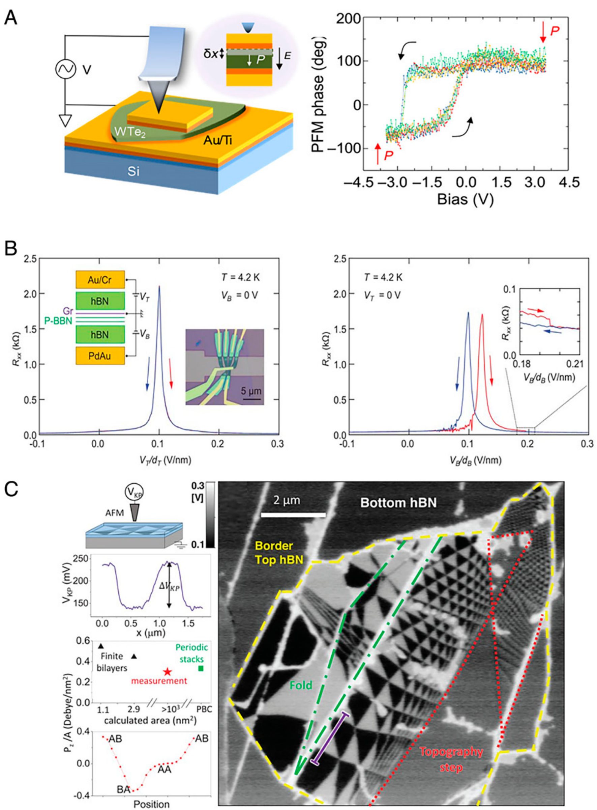
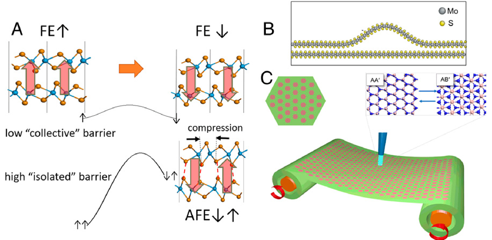
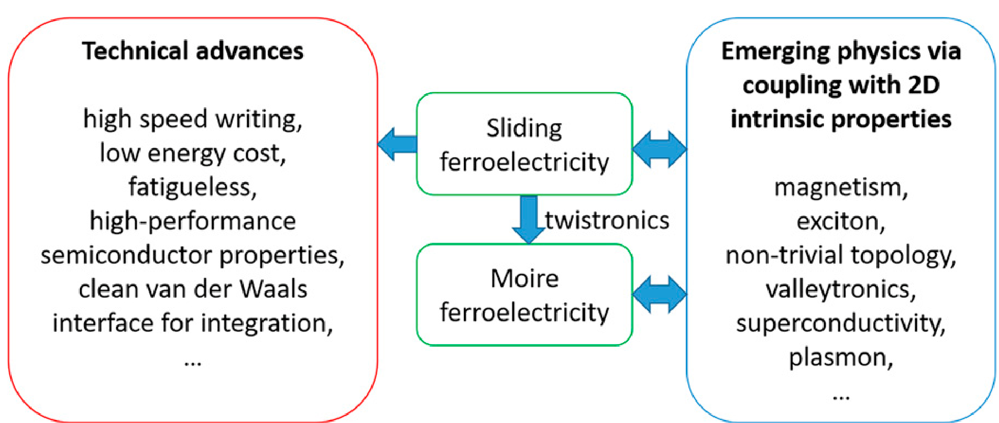

## wuSlidingFerroelectricity2D2021a — 二维范德华材料中的滑动铁电性：相关物理与未来机遇

## 📄 元数据
Menghao Wu（吴梦昊，华中科技大学）& Ju Li（李巨，MIT），2021，PNAS（Proc. Natl. Acad. Sci. U.S.A.），vol. 118 no. 50, e2115703118，DOI: 10.1073/pnas.2115703118。PNAS Perspective/展望文章。

## 💡 一句话
系统建立了二维范德华层状材料中"滑动铁电性"（sliding ferroelectricity）的理论框架——垂直极化由面内层间滑移翻转而非离子垂直位移，提出普适性判据并梳理 WTe₂/BN/TMDs 等实验证据，将二维铁电体候选材料从寥寥几种扩展到大多数已知二维材料。

## 🔗 Wiki 双链
  - 概念 [[../concepts/sliding-ferroelectricity]]（本文即该领域奠基性综述，直接充实此条目）
  - 概念 [[../concepts/2D-materials]]
  - 概念 [[../concepts/polarization-switching]]（集体/孤立翻转势垒模型、ripplocation 畴壁动力学）
  - 概念 [[../concepts/multiferroicity]]（滑动多铁：Cr₂NO₂/VS₂/MoN₂ 双层）
  - 概念 [[../concepts/magnetoelectric-coupling]]（"电写磁读"，层间电压翻转净磁矩）
  - 概念 [[../concepts/spin-orbit-coupling]]（非磁性铁电双层中的 SOC 锁定自旋纹理）
  - 概念 [[../concepts/berry-phase]]（WTe₂ 中铁电非线性反常霍尔效应，Berry 曲率偶极子随极化翻转）
  - 概念 [[../concepts/moire-superlattice]]（Moiré ferroelectricity，扭转 BN/TMD 的周期铁电畴网络）
  - 概念 [[../concepts/ferroelasticity]]（xz/yz 塑性应变意义上滑动即"铁弹性"，与挠曲电效应耦合）
  - 概念 [[../concepts/density-functional-theory]]（极化值的第一性原理计算，引用 VASP/PAW/PBE 类工作）
  - 概念 [[../concepts/super-paraelectricity]]（文中以磁存储"超顺磁性"类比低集体势垒与热稳定性权衡）
  - 实体 [[../entities/h-BN]]（AB 堆叠双层为模型体系，2.08 pC/m；3R-BN 体相 7.6 μC/cm²）
  - 实体 [[../entities/TMDs]]（MoS₂/WS₂/MoSe₂/WSe₂ 双层、3R-MoS₂ 体相、MoA₂N₄ 等）
  - 实体 [[../entities/WTe2]]（首个实验证实的金属性滑动铁电体，0.16 pC/m 实验值，Tc≈350 K）
  - 实体 [[../entities/MXenes]]（Cr₂NO₂ 等双层为滑动多铁候选）
  - 实体 [[../entities/BiFeO3]]（作为传统高铁电体对比，集体势垒 0.43 eV/f.u.，体极化高两个数量级）
  - 实体 [[../entities/In2Se3]]（早期已知的少数二维面外铁电体之一）
  - 实体 [[../entities/SnTe]]（参考文献 12，Chang et al. Science 2016，单层 SnTe 面内铁电，被引为二维铁电早期里程碑）
  - 实体 [[../entities/VASP]]、[[../entities/Wannier90]]（DFT/Berry 相极化计算工具背景）
  - 图表 [[../figures/crystal-structures]]（AB/BA/AA'/ABC/3R 堆垛、ripplocation 原子结构）
  - 图表 [[../figures/heterostructures-stacking]]（扭转双层、Moiré 超晶格、双栅 vdW 异质结器件）
  - 图表 [[../figures/heterostructures-stacking-sliding|层间滑移铁电：机制、翻转与动力学]]（AB↔BA 滑移路径、ripplocation 翻转、集体/孤立势垒模型）
  - 图表 [[../figures/domain-walls]]（ripplocation 畴壁、20–50 nm 铁电畴）
  - 图表 [[../figures/electronic-bands]]（Moiré 电势诱导 II 型能带对齐、层间激子捕获）
  - 图表 [[../figures/experimental-setups]]（PFM、KPFM、EFM、双栅石墨烯探测器）
  - 年度 [[../write/2021]]（本文发表年，亦为 Yasuda/Vizner Stern 两篇 Science 实验年）
  - 项目 [[../projects/project-2-mn-multiferroics]]
  - 项目 [[../projects/project-5-snte-ferroelectric-sim]]
  - 相关论文 [[../../raw/note/wuSlidingFerroelectricity2D2021a]]

## 🆕 新概念/实体建议
  - `ripplocation`（波纹位错）：二维 vdW 层中兼具晶体学位错与面外屈曲波纹特征的畴壁，是滑动铁电翻转的动力学载体；Frank 定律（核心能 ∝|b|²）在 2D 中因面内弹性能被屈曲弛豫而失效。
  - `moire-ferroelectricity`（莫尔铁电性）：小角度扭转双层中局域堆垛（AA/AB/BA）周期调制形成的纳米铁电畴网络，可产生周期 n/p 掺杂、三角超晶格电势与激子捕获阵列。
  - `metallic-ferroelectricity`（金属铁电性）：WTe₂ 实验打破"自由载流子屏蔽使铁电与金属不兼容"的传统认知；足够薄的极性金属可被电场穿透，配合超低滑动势垒实现极化翻转。
  - `ferroelectric-nonlinear-anomalous-hall-effect`（铁电非线性反常霍尔效应）：少层 WTe₂ 中极化翻转同步翻转 Berry 曲率偶极子，奇层信号反向、偶层不变，构成非破坏性读出（Berry curvature memory）。
  - `negative-piezoelectricity`（负压电性）：BN、ZrI₂ 双层在垂直压力下极化反常增加的现象。
  - `stacking-sequence-engineering`（堆垛序工程/相工程）：AB/AA'/ABC（3R）、正交/单斜、R/H 型等近简并堆垛相的极性/非极性控制，是实现滑动铁电的合成关键。
  - 实体 `AlN`（石墨型双层，10.29 pC/m，迄今已知二维铁电最高垂直极化）、`InSe`（β-InSe 室温 PFM 蝴蝶曲线）、`GaSe`、`CrI3`（R/H 型堆垛依赖层间磁性）、`ZrI2`（负压电、层间滑动铁电）、`GaN`/`SiC`/`ZnO`（蜂窝晶格二元化合物高极化双层）。

## 📊 关键图表
  -  → [[../figures/heterostructures-stacking-sliding|层间滑移铁电：机制、翻转与动力学]]
  - **图示描述**：四个子图共同阐述滑动铁电性的机制与普适判据。(A) AB 堆垛 BN 双层的原子结构，黑色箭头标出 B→N 的层间电荷转移，红色箭头指出沿三个等价方向滑移一个 B–N 键长即可实现 AB↔BA 翻转；(B) 小角度扭转 BN 双层形成的莫尔超晶格，红/黄/绿圈分别为 AA（无极化）、AB（极化向下）、BA（极化向上）畴；(C) 3R 相 MoS₂、InSe 等 ABC 堆垛体相；(D) WTe₂ 双层为例说明普适判据。
  - **关键特征**：BN 双层垂直极化为 2.08 pC/m（折合 0.68 μC/cm²）；单胞翻转面能垒约 9 meV/unit cell；蜂窝晶格体系有三个等效翻转态，WTe₂ 等为双稳态；判据要求体系非中心对称，且对中心水平面做 M_z 镜像所得的极化反转态能由层间面内平移 t_∥ 实现。
  - **结论/意义**：这张图确立了"面内滑移翻转面外极化"的物理图像，把二维铁电候选从极少数扩展到大多数已知二维材料。

  -  → [[../figures/heterostructures-stacking-sliding|层间滑移铁电：机制、翻转与动力学]]
  - **图示描述**：对比同一化学成分在不同堆垛序下的极性差异。(A) 体相 BN 的 ABC 与 AB 堆垛层间差分电荷密度，蓝色/黄色等值面分别表示电子耗尽与积聚；(B)–(E) 分别展示 MoS₂ 多型体、三角/六角相 SnS₂、正交/单斜相 WTe₂、R 型/H 型 CrI₃/CrBr₃ 的原子结构。
  - **关键特征**：AB 堆垛的体相 BN/MoS₂/InSe 虽层间不等价，但保持垂直镜面对称而无净极化；只有 ABC（3R）堆垛因层间电荷分布不对称才产生垂直极化，3R-BN 体极化高达 7.6 μC/cm²；这些近简并相能量差很小，仅部分极性相可通过横向平移相互转换（如单斜↔正交 WTe₂），而三角→六角 SnS₂、R→H CrI₃ 无法由纯平移达成。
  - **结论/意义**：强调"堆垛序工程"是实现滑动铁电性的合成关键——并非所有堆垛都有极性，电场可驱动 AB 体相转变为极性 3R 相。

  -  → [[../figures/heterostructures-stacking-sliding|层间滑移铁电：机制、翻转与动力学]]
  - **图示描述**：三组里程碑实验的器件结构与表征结果。(A) 约 15 nm 厚 WTe₂ 薄片的 PFM 振幅/相位成像及偏压驱动的压电响应回线；(B) 双栅 vdW 异质结（Au/Cr 顶栅/hBN/石墨烯/0°平行双层 BN/hBN/PdAu 底栅）中石墨烯电阻 R_xx 对顶栅和底栅电压的响应；(C) 两片 3 nm 厚、微扭转 h-BN 的开尔文探针力显微镜表面电势图。
  - **关键特征**：WTe₂ 中可见 20–50 nm 扭曲圆形反平行铁电畴，畴壁在振幅图中呈暗线；石墨烯探测器 20 K 测得 WTe₂ 极化约 0.16 pC/m（DFT 约 0.38 pC/m），居里温度约 350 K，单层无双稳态；BN 双层的底栅扫描显示电阻滞回与载流子密度 n_H 突跳，且几乎不依赖温度、维持至室温；KPFM 观测到数 μm² 反向极化畴，带电探针扫描可移动畴壁。
  - **结论/意义**：构成从金属（WTe₂）到绝缘体（BN）的完整实验证据链，证实滑动铁电性可被电场翻转并在室温下保持。

  -  → [[../figures/heterostructures-stacking-sliding|层间滑移铁电：机制、翻转与动力学]]
  - **图示描述**：莫尔铁电性的实验观测与理论模型。(A) 扭转 h-BN 双层的静电力显微镜（EFM）图像，呈现规则三角超晶格电势分布；(B) 扭转半导体双层不同局域堆垛区域中上下层能带的相对位移，形成 II 型（type-II）能带对齐；(C) WX₂/MoX₂（X=S,Se）扭转双层中，不同堆叠域的层间激子能量随扭转角变化的理论曲线。
  - **关键特征**：EFM 三角图案直接对应 AB/BA/AA 局域堆垛的周期电势调制；II 型对齐使电子、空穴分别局限于不同层，莫尔铁电畴壁网络可捕获电子、空穴和层间激子，形成量子点阵列；MX₂/M'X'₂/MX₂ 三层还预测了双色莫尔电势与具有相反电偶极的两个独立三角超晶格。
  - **结论/意义**：说明滑动铁电性在扭转体系中演化为莫尔铁电性，可与莫尔平带、电子关联、非常规超导及激子物理耦合。

  -  → [[../figures/heterostructures-stacking-sliding|层间滑移铁电：机制、翻转与动力学]]
  - **图示描述**：解释滑动铁电如何同时做到低写入能耗与高热稳定性。(A) WTe₂ 双层中铁电翻转（低"集体"势垒）与铁电-反铁电转变（高"孤立"势垒）的能量路径对比；(B) MoS₂ 双层中作为畴壁的 ripplocation（兼具面内位错与面外屈曲波纹）原子结构；(C) BN 双层中由光机械飞秒脉冲驱动的 AA'→AB' 堆垛转变示意。
  - **关键特征**：BN 集体翻转势垒仅 4.5 meV/f.u.、WTe₂ 仅 0.15 meV/f.u.，远低于所有室温铁电体（BiFeO₃ 为 0.43 eV/f.u.，常规门槛 >27 meV/f.u.）；非易失条件为 Q(0)≫50 k_BT，可写条件为可读场（<10 MV/cm）下 Q<5 k_BT（对应 ns–ps 翻转）；vdW 层中 Frank 定律（核心能 ∝|b|²）因长程面内弹性能被屈曲波纹弛豫而失效，Peierls 势垒极低；光驱动路径可实现皮秒级写入并用非线性 Edelstein 效应读出。
  - **结论/意义**：这是文章最核心的动力学图像——"集体势垒 vs 孤立势垒"的分离打破了传统铁电/磁存储中的速度-稳定性权衡。

  -  → [[../figures/heterostructures-stacking-sliding|层间滑移铁电：机制、翻转与动力学]]
  - **图示描述**：以滑动铁电性为中心向外辐射的概览图，把它与莫尔物理、金属铁电性、多铁耦合、自旋-轨道电子学、谷电子学、非平庸能带拓扑、超导电性、铁电非线性反常霍尔效应、负压电性以及非易失存储器/低功耗器件等方向连接起来。
  - **关键特征**：图中分支涵盖：①反铁磁耦合铁磁双层（Cr₂NO₂/VS₂/MoN₂）可切换磁化 0.008/0.016/0.09 μB/f.u. 的"电写磁读"；②少层 WTe₂ 中极化翻转同步翻转 Berry 曲率偶极子，奇层非线性霍尔反向、偶层不变；③非磁性强 SOC 铁电双层（如 WSe₂）的动量锁定自旋纹理；④BN、ZrI₂ 双层的负压电性；⑤与莫尔平带、关联绝缘态、超导的潜在耦合。
  - **结论/意义**：这是论文的"研究蓝图"，把滑动铁电性定位为可电控调控磁性、自旋、谷、拓扑与关联态的通用旋钮。

  -  -> [[../figures/heterostructures-stacking-sliding|层间滑移铁电：机制、翻转与动力学]]
  - **图示描述**：第一性原理计算得到的 AB 堆垛范德华双层垂直极化值汇总表，单位为二维极化单位 pC/m。
  - **关键特征**：BN 2.08、ZnO 8.22、AlN 10.29、GaN 9.72、SiC 6.17、MoS₂ 0.97、InSe 0.24、GaSe 0.46 pC/m；其中 AlN 双层 10.29 pC/m 是当时已知二维铁电中最高垂直极化，约为 BN 的五倍；pC/m 除以层间距可换算为三维 μC/cm²（BN 的 2.08 pC/m ≈ 0.68 μC/cm²）。
  - **结论/意义**：为高通量筛选高极化二维铁电提供基准，表明蜂窝晶格二元化合物（氮化物、碳化物）极化显著高于 TMDs。

  -  -> [[../figures/heterostructures-stacking-sliding|层间滑移铁电：机制、翻转与动力学]]
  - **图示描述**：范德华体相结构的计算垂直极化值汇总表，单位为三维标准单位 μC/cm²。
  - **关键特征**：3R-BN 2.41（正文另给 7.6）μC/cm²，3R-MoS₂ 0.52，3R-InSe 0.08，六方相 h-SnS₂ 0.18、h-SnSe₂ 0.42，h-CrI₃ 0.06，ZrI₂ 0.31 μC/cm²；体相因不受退极化场限制，极化可比双层显著增强；涵盖 R3m 蜂窝体系（3R 相）、1T/1T' 体系的六角/正交极性相。
  - **结论/意义**：说明滑动铁电性不仅限于双层，在合适堆垛的体相中同样存在，且极化可与传统铁电体同量级比较。

## 🔬 项目连接
  - **project-2（Mn多铁）— 有直接参考价值**：本文专节讨论"滑动多铁耦合"（Multiferroicity and Spin-Orbitronics）。两个反铁磁耦合的铁磁单层因不等价堆垛可同时产生滑动铁电极化与未补偿磁矩，总磁化随极化/层间电压翻转，实现"电写磁读"；给出 Cr₂NO₂/VS₂/MoN₂ 双层可切换磁化值 0.008/0.016/0.09 μB/f.u.，已大于多数 II 型多铁体。VS₂ 双层中还存在铁谷（ferrovalley）与磁性/铁电的谷耦合。这些为 Mn 极化结构多铁项目提供了①堆垛驱动磁电耦合的物理范式，②用电场（而非磁场）翻转磁矩的低能耗路径，③SOC 锁定自旋纹理与极化耦合的理论图像，可与项目中 BiFeO₃/HoMnO₃ 等传统多铁的磁电机制对比。文中引用的 Lu/Wu/Liu《Single-phase multiferroics》(Natl. Sci. Rev. 2019) 亦为多铁理论综述背景。
  - **project-5（SnTe铁电模拟）— 有直接参考价值**：项目 wiki 已将 sliding-ferroelectricity 与 polarization-switching 列为相关概念。本文对 LAMMPS/MD 势函数构建的参考价值在四点：①明确引用单层 SnTe 面内铁电（Chang et al. Science 2016, ref.12）作为二维铁电里程碑，是 SnTe 铁电物理的文献坐标；②给出滑动翻转的动力学判据——非易失性条件 Q(F=0)≫50k_BT（锁定）与可写条件 Q(F)<5k_BT（纳秒/皮秒翻转），以及无热阈值 F_C 与面势垒 q 成正比的关系，这正是 MD 势函数需复现的能垒-温度-场强关系；③阐明"集体势垒"（层间剪切，低，~meV/f.u.）与"孤立势垒"（层内拉伸，高，抗热扰动）的分离机制，解释 2D 铁电如何同时满足高速写入与零场保持，对 SnTe 纳米尺度铁电畴的 MD 建模有直接指导；④ripplocation 作为畴壁的原子结构（面内位错+面外屈曲）及其 Peierls 势垒、Frank 定律在 2D 失效，是构建 SnTe 势函数时必须正确描述的拓扑缺陷动力学；⑤光机械驱动堆垛转变（AA'→AB'）与非线性 Edelstein 读出提供了多场耦合模拟的目标场景。
  - **project-1（双光子）、project-3（机械发光 NN）、project-4（TTF 分子计算）、project-6（湿度传感器）、project-7（CDW）**：无直接项目连接。其中 WTe₂ 虽为已知 CDW/ Weyl 半金属材料，本文聚焦其铁电性而非 CDW，对 project-7 仅有材料交集而无机制参考价值；project-4 的 DFT 方法论虽通用，但本文为固态层状材料，与分子晶体计算流程差异较大，不构成实质方法参考。

## 🔗 项目双链
- 项目 [[../projects/project-1-two-photon|项目一：双光固化和双光发光]]
- 项目 [[../projects/project-2-mn-multiferroics|项目二：Mn极化结构铁电材料]]
- 项目 [[../projects/project-3-mechanoluminescence-nn|项目三：应力发光神经网络]]
- 项目 [[../projects/project-4-ttf-molecular-calc|项目四：lsl老师的ttf分子计算]]
- 项目 [[../projects/project-5-snte-ferroelectric-sim|项目五：lammps势函数SnTe铁电模拟]]
- 项目 [[../projects/project-6-humidity-sensor|项目六：小花闻的电压湿度传感器]]
- 项目 [[../projects/project-7-cdw-charge-density-wave|项目七：CDW电荷密度波]]

## 📝 组织与用词
文章按"理论模型 → 实验验证 → 相关物理 → 潜在应用 → 展望"递进。理论部分以 BN 双层为原型建立对称性判据（非中心对称 + 水平镜像态可由层间平移达到），再推广到蜂窝晶格二元化合物、TMDs、1T/1T' 体系与体相 3R 相；实验部分按金属（WTe₂, 2018）→ 绝缘体（BN, 2020）→ 半导体（InSe/TMDs, 2019–2021）的证据链组织；相关物理发散为莫尔铁电、多铁/自旋轨道、金属铁电、非线性反常霍尔四个方向；应用部分以"集体势垒 vs 孤立势垒"模型统一解释低能耗与高稳定性，并讨论疲劳豁免（无氧缺陷迁移）与光驱动翻转。值得复用的术语：
  - [[../concepts/sliding-ferroelectricity|sliding ferroelectricity / 滑动铁电性]]
  - [[../concepts/ripplocation|ripplocation / 波纹位错]]（畴壁）
  - [[../concepts/interlayer-charge-transfer|interlayer charge transfer / 层间电荷转移]]
  - stacking-sequence control / 堆垛序控制
  - collective vs isolated switching barrier / 集体与孤立翻转势垒
  - athermal threshold (F_C) / 无热阈值
  - Moiré ferroelectricity / 莫尔铁电性
  - [[../concepts/berry-curvature-dipole|Berry curvature dipole memory / 贝里曲率偶极子存储器]]
  - metallic (polar) ferroelectricity / 金属（极性）铁电性
  - flexoelectric coupling / 挠曲电耦合

  - [[../concepts/flexoelectric-effect|flexoelectricity]]
  - [[../concepts/ferroelectric-metal|ferroelectric-metal]]
  - [[../concepts/moire-ferroelectricity|moire-ferroelectricity]]
  - [[../concepts/polar-metal|polar-metal]]
  - [[../concepts/stacking-engineering|stacking-engineering]]
## ✏️ 可写入 Wiki 的要点
  1. **机制本质**：滑动[[../concepts/ferroelectricity|铁电性]]仅存在于 2D vdW 叠层中，垂直电极化由面内层间滑移翻转，无需垂直离子位移；极化源于两层不等价堆垛导致的净[[../concepts/interlayer-charge-transfer|层间[[../concepts/charge-transfer|电荷转移]]]]（如 AB-BN 中 B→N 的电荷转移）。
  2. **普适判据**：一个 vdW 双层/多层具备滑动铁电性当且仅当：①非中心对称；②对中心水平面作镜像 M_z 得到的极化反转态，可通过层间面内平移 t_∥ 实现。该判据将二维铁电体从极少数（CuInP₂S₆、In₂Se₃、MoTe₂）扩展到大多数已知[[../concepts/2D-materials|二维材料]]。
  3. **极化数值**：AB 双层（pC/m）BN 2.08、ZnO 8.22、AlN 10.29（已知最高）、GaN 9.72、SiC 6.17、MoS₂ 0.97、InSe 0.24、GaSe 0.46、WTe₂ ~0.38（计算）/0.16（20 K 实验）；体相（μC/cm²）3R-BN 2.41（正文称 7.6）、3R-MoS₂ 0.52、3R-InSe 0.08、h-SnS₂ 0.18、h-SnSe₂ 0.42、h-CrI₃ 0.06、ZrI₂ 0.31。二维单位 pC/m 除以层间距可换算为三维 μC/cm²（BN 2.08 pC/m ≈ 0.68 μC/cm²）。
  4. **堆垛敏感性**：并非所有堆垛都有极性——BN 双层 AA'（B 在 N 正上方重叠）非极性且与 AB 近简并；体相中 AA' 与 AB 均保持垂直镜面对称而非极性，只有 ABC（3R 相）堆叠因层间[[../concepts/charge-density|电荷密度]]不对称产生垂直极化。电场可驱动 AB→3R 转变。SnS₂ 三角相/六角相、WTe₂ 单斜/正交相、CrI₃ R/H 型等多型体中，仅部分可由横向平移互相转换。
  5. **ripplocation 畴壁动力学**：翻转通过"ripplocation"环（兼具位错与面外屈曲）的形核与扩展完成；由于 vdW 层间耦合弱、层内共价键刚，长程面内弹性能被屈曲"波纹"几乎完全弛豫，使位错核心能 ∝|b|² 的 Frank 定律失效，Peierls 势垒极低，畴壁可在小驱动力下快速移动。
  6. **速度-稳定性统一**：非易失存储要求 ①零场激活能 Q(0)≫50k_BT（抗热扰动），②可读场（<10 MV/cm）下 Q<5k_BT（ns–ps 翻转）。集体[[../concepts/switching-barrier|翻转势垒]]（=类比磁体中的 K，层间剪切，BN 4.5 meV/f.u.、WTe₂ 0.15 meV/f.u.）决定写入速度/能耗，孤立翻转势垒（=NJ+K，层内拉伸）决定热稳定性；二者分离打破传统铁电/磁存储的权衡。所有传统室温铁电集体势垒均 >27 meV/f.u.（BiFeO₃ 为 0.43 eV/f.u.）。
  7. **实验证据链**：WTe₂（Fei et al. Nature 2018，[[../entitys/graphene|石墨烯]]探测器测滞回，Tc≈350 K；Sharma et al. Sci. Adv. 2019，PFM 直接成像 20–50 nm 反平行畴）；BN（Yasuda et al. Science 2021 双栅石墨烯器件，n_H 突跳至室温；Vizner Stern et al. Science 2021 KPFM 观测数 μm 反向畴并用电偏置探针移动畴壁）；β-InSe（Hu et al. APL 2019，室温 PFM 蝴蝶曲线）；TMDs 双层（Wang et al. 2021，极化约为 BN 一半）。
  8. **莫尔铁电性**：小角度扭转形成周期 AA/AB/BA 局域堆垛，AA 区极化消失、AB/BA 极化反向，构成三角[[../concepts/superlattice|超晶格]][[../concepts/ferroelectric-domain|铁电畴]]网络；可产生周期性 n/p 掺杂（石墨烯/BN）、II 型[[../concepts/band-alignment|能带对齐]]与激子/电子/空穴捕获阵列（WX₂/MoX₂）、双色莫尔电势（MX₂/M'X'₂/MX₂ 三层）；[[../entities/bilayer-graphene|双层石墨烯]]/hBN 中还观测到由莫尔平带[[../concepts/electron-correlation|电子关联]]驱动的非常规铁电性（Zheng et al. Nature 2020）。
  9. **金属铁电性与非线性霍尔**：WTe₂ 实验证实足够薄的[[../concepts/polar-metal|极性金属]]可被电场穿透翻转（区别于 Anderson-Blount 极性金属 LiOsO₃ 的不可翻转极化）；少层 WTe₂ 中[[../concepts/polarization-switching|极化翻转]]同步翻转 Berry 曲率偶极子与 shift dipole，奇层（除 1T' 单层）非线性霍尔电压反向、偶层不变（Xiao et al. Nat. Phys. 2020 证实），构成非破坏性 Berry 曲率记忆读出。
  10. **多铁与疲劳豁免**：反铁磁耦合铁磁双层（Cr₂NO₂/VS₂/MoN₂）可由层间电压翻转净磁矩（0.008–0.09 μB/f.u.）；非磁性强 SOC 铁电双层（如 WSe₂）具动量线性 SOC 锁定的[[../concepts/spin-texture|自旋纹理]]，可电控。滑动铁电体因清洁 vdW 界面无氧缺陷迁移且离子位移严格面内，可豁免钙钛矿铁电的电极界面疲劳机制；另预测光机械飞秒脉冲驱动 AA'→AB' 堆垛转变（皮秒写入，非线性 [[../concepts/edelstein-effect|Edelstein 效应]]读出）与负压电性（BN、ZrI₂）。
