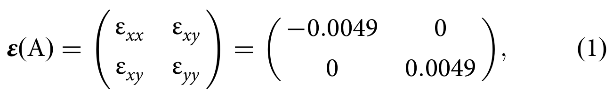
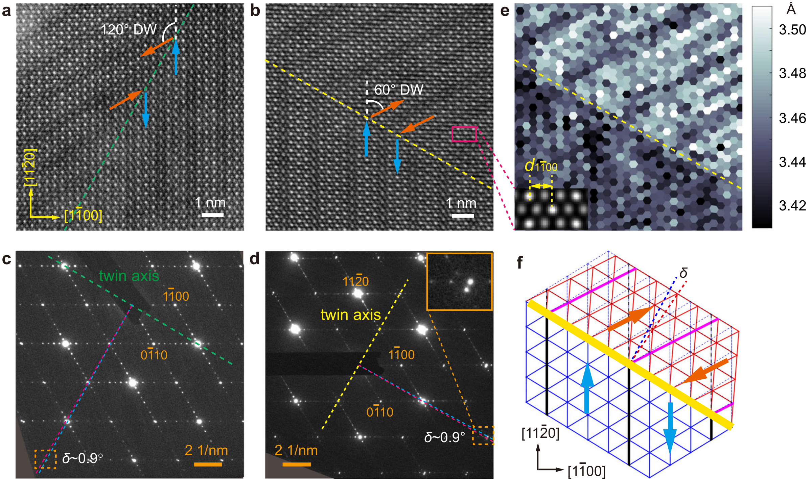
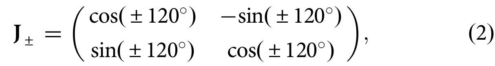
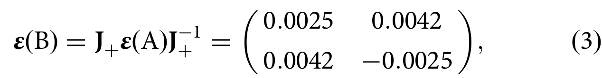
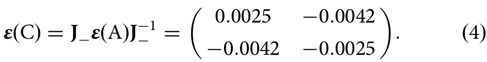
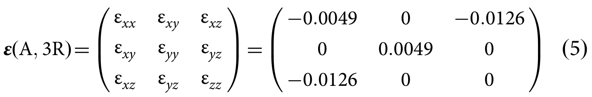
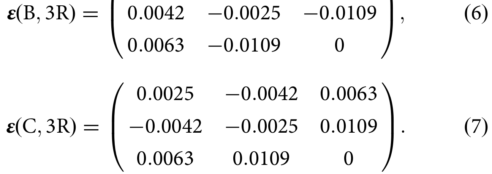
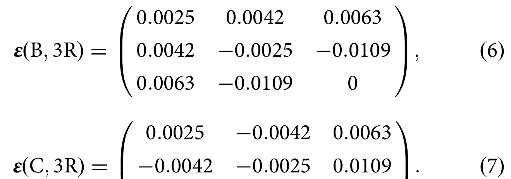

## xuTwodimensionalFerroelasticityVan2021 — 范德华 β'-In2Se3 的二维铁弹性

## 📄 元数据
Xu, Mao, Guo, Yan, Chen, Lo, Chen, Lei, Luo, Hao, Zheng, Zhu et al.，2021，Nature Communications 12:3665，DOI 10.1038/s41467-021-23882-7
## 💡 一句话
首次在少层范德华 β'-In2Se3 中实验证实由面内反铁电畸变驱动的二维铁弹性，定量给出 ~0.49% 的自发应变并实现 ≤0.5% 外应变下的可逆畴切换。
## 🔗 Wiki 双链
  - 概念 [[../concepts/ferroelasticity]]、[[../concepts/2D-materials]]、[[../concepts/strain-engineering]]、[[../concepts/multiferroicity]]、[[../concepts/polarization-switching]]、[[../concepts/antiferroelectricity|反铁电性]]、[[../concepts/spontaneous-strain|自发应变]]、[[../concepts/peierls-distortion|Peierls 畸变]]、[[../concepts/shape-memory-effect|形状记忆效应]]、[[../concepts/linear-dichroism|线性二向色性]]
  - 实体 [[../entities/In2Se3]]、[[../entities/SnTe]]、[[../entities/TMDs]]
  - 图表 [[../figures/crystal-structures]]、[[../figures/domain-walls]]、[[../figures/experimental-setups]]、[[../figures/mathematical-models]]、[[../figures/heterostructures-stacking-domains-devices|铁弹畴、畴壁、In₂Se₃ 与器件应用]]
  - 年度 [[../write/2021]]
  - 项目 [[../projects/project-5-snte-ferroelectric-sim]]
  - 相关论文 [[../../raw/note/xuTwodimensionalFerroelasticityVan2021]]
## 🆕 新概念/实体建议
  - `domain-wall-classification`（W 墙/S 墙分类）：Wf 墙取向由母相对称性固定（120° DW 沿 {11-20}），S 墙取向依赖自发应变量级（60° DW 沿 {1-100}），适合作为畴壁条目的补充概念。
## 📊 关键图表
  -  -> [[../figures/experimental-setups|实验测试与测量装置]]
  -  -> [[../figures/mathematical-models|数学模型与物理公式]]
  -  -> [[../figures/crystal-structures|晶体结构与原子排布]]
  -  -> [[../figures/mathematical-models|数学模型与物理公式]]
  -  -> [[../figures/mathematical-models|数学模型与物理公式]]
  -  -> [[../figures/mathematical-models|数学模型与物理公式]]
  -  -> [[../figures/domain-walls|畴与畴壁结构]]
  -  -> [[../figures/mathematical-models|数学模型与物理公式]]
  -  -> [[../figures/domain-walls|畴与畴壁结构]]
  -  → [[../figures/heterostructures-stacking-domains-devices|铁弹畴、畴壁、In₂Se₃ 与器件应用]]
  -  -> [[../figures/mathematical-models|数学模型与物理公式]]
  -  -> [[../figures/mathematical-models|数学模型与物理公式]]
  -  -> [[../figures/mathematical-models|数学模型与物理公式]]
  -  → [[../figures/heterostructures-stacking-domains-devices|铁弹畴、畴壁、In₂Se₃ 与器件应用]]
## 🔬 项目连接
  - **project-5（SnTe 铁电模拟）— strong**：作者在摘要、引言和讨论中三次明确将 SnTe 家族列为二维铁弹性"应广泛存在"的代表体系（"2D ferroelectrics such as the SnTe family"），并指出可借此通过应变/畴壁工程调控面内铁电性。对项目五的具体参考价值：(1) 提供了铁电/反铁电畸变与自发应变张量耦合的定量范式——Aizu 张量 εxx=+0.49%、εyy=-0.49%、B/C 由 120° 旋转矩阵导出，可直接类比用于 SnTe 面内铁电/铁弹耦合的应变张量构造；(2) 给出 60°/120° 畴壁的力学相容性判据（W 墙/S 墙、{1-100}/{11-20} 晶面族）和 ~0.97° 晶格偏转角，对 LAMMPS 势函数下 SnTe 畴壁构型与能量计算有直接对照意义；(3) 报道了 ≤0.5% 切换应变、5.5% 屈服应变、0.5%–1.1% 线性响应区以及畴壁钉扎等动力学图像，可作为 SnTe 铁电翻转/铁弹切换 MD 模拟的实验标尺；(4) 2H（纯面内）vs 3R（含 εxz≈-0.0126 面外剪切、91.44° 倾斜）的堆垛对比，提示在 SnTe 薄膜/多层模拟中需关注堆垛序引入的剪切分量与表面褶皱、倾斜畴壁。
  - project-1 双光子、project-2 Mn 多铁、project-3 机械发光 NN、project-4 TTF 分子计算、project-6 湿度传感器、project-7 CDW：无直接项目连接。
## 🔗 项目双链
- 项目 [[../projects/project-5-snte-ferroelectric-sim|项目五：lammps势函数SnTe铁电模拟]]

## 📝 组织与用词
论文按"现象发现（热弹性转变与自发应变）→ 机制解析（多畴与畴壁）→ 性质验证（应变驱动切换）→ 维度确认（CVD 少层）→ 三维拓展（2H/3R 堆垛）"五步递进，每一步均由"原子尺度 STEM/XRD + 介观尺度偏光/PFM + 定量应变张量"三类证据互锁；讨论部分将结论外推至 1T' TMDs 与 SnTe 家族，并提出二维形状记忆效应。可复用术语：
  - ferroelasticity 铁弹性
  - spontaneous strain 自发应变
  - antiferroelectric distortion 反铁电畸变
  - domain variant 畴变体
  - domain wall (DW) 畴壁
  - W wall / S wall W 墙 / S 墙（对称性固定 vs 应变依赖）
  - mechanical compatibility 力学相容性
  - domain-wall propagation / nucleation 畴壁传播 / 畴成核
  - hysteresis 迟滞
  - mosaic tilt 镶嵌倾斜
  - Peierls distortion Peierls 畸变
  - thermoelastic transformation 热弹性转变
## ✏️ 可写入 Wiki 的要点
  1. β'-In2Se3 的室温超结构为周期性纳米条纹（周期约 1.4 nm，SAED 中位于 n/8 {1-100} 处的卫星斑），其本质是相邻条纹间 Se 原子反平行位移的二维反铁电序。
  2. β→β' 热弹性转变温度约 250 °C，加热/冷却曲线完全可逆；以 β 相六方晶格（d⊥1100 = √3 d∥1120）为基准，2H 相二维[[../concepts/spontaneous-strain|自发应变]]张量 ε(A)=diag(+0.0049, −0.0049)，约 ±0.49%，远小于 1T' TMDs 理论预测的百分之几。
  3. 母相六方对称性给出三个能量简并的畴变体 A/B/C，应变方向沿三个 <11-20> 方向，彼此相差 60°/120°；ε(B)、ε(C) 由 ±120° 旋转矩阵 J± 对 ε(A) 做相似变换得到，ε(B)=[[-0.0025,-0.0042],[-0.0042,0.0025]]，ε(C)=[[-0.0025,0.0042],[0.0042,0.0025]]，符合 Aizu 6mm−mm2 或 3m−2/m 铁弹转变物种。
  4. 共格畴壁的力学相容性要求：120° 畴壁平行 {11-20}（母相镜面，属 Wf 墙，取向由对称性固定），60° 畴壁沿 {1-100}（S 墙，取向依赖自发应变量级）；由 ±0.49% 应变推出的晶格偏转角 ~0.97° 与 SAED 分裂斑点测得的 ~0.9° 一致。
  5. 偏光成像利用[[../concepts/linear-dichroism|线性二向色性]]：透射光强随起偏角 φ 呈余弦调制，三畴最大光强对应角相差 60°/120°，可快速无损确定畴取向。
  6. 铁弹畴切换：PET [[../concepts/flexible-substrates|柔性衬底]]两点弯曲施加单轴拉伸（ε=h/2R），≤0.5% 外应变即可触发；0.5%≤ε≤1.1% 区间 A 畴面积分数近似线性增长（斜率~1.35），外加应变几乎完全由 B→A 畴切换协调（理论上可产生~0.74% 垂直伸长）；卸载后残留新成核 A 畴，表现出铁弹迟滞；低/高应变区的偏离归因于畴壁钉扎。
  7. 用原位 Raman 与二次谐波（SHG）排除了应变诱导相变和挠曲铁电效应；AFM 纳米压痕测得 In2Se3 屈服应变 ~5.5%，远大于畴切换应变，保证切换不损坏材料；该切换应变（≤0.5%）也小于第一性原理预测的 1T' TMDs 切换应变（≥1%）。
  8. 二维属性：CVD 生长的 ~6.6 nm（约 7 个五元层，Se-In-Se-In-Se）超薄薄片中仍可见畴结构与卫星衍射，并能实现应变切换；更薄的 ~5.7 nm 样品亦有畴图案；第一性原理预测反铁电畸变可保持至单层。
  9. 三维堆垛调制：2H（AB'AB' 反向堆垛，正交晶系）自发应变纯面内、60°/120° 畴壁表面平坦；3R（单斜晶系）[0001] 与 [1-100] 夹角 91.44°，引入 εxz=-0.0126 面外剪切；3R 中 120° 畴壁两侧剪切分量反号，为维持共格发生 (0001) 面镶嵌倾斜~2.5° 并形成表面褶皱（RSM 上 (0 0 0 15) 反射分裂为二），60° 畴壁两侧剪切同号故表面平整但畴壁在三维中倾斜——跨过 270 nm 台阶观察到 ~480 nm 水平偏移。
  10. 普适性与展望：二维[[../concepts/ferroelasticity|铁弹性]]应广泛存在于具有[[../concepts/migdal-eliashberg-theory|各向异性]]晶格畸变的 vdW 材料中，包括具 [[../concepts/peierls-distortion|Peierls 畸变]]的 1T' TMDs（MoTe2、WTe2）和 SnTe 家族二维铁电体；β'-In2Se3 的热弹性转变有望成为二维[[../concepts/shape-memory-effect|形状记忆效应]]平台，并可通过应变/[[../concepts/domain-wall-engineering|畴壁工程]]耦合调控量子[[../concepts/spin-hall-effect|自旋[[../concepts/hall-effect|霍尔效应]]]]和面内[[../concepts/ferroelectricity|铁电性]]，构筑 2D 多铁。
