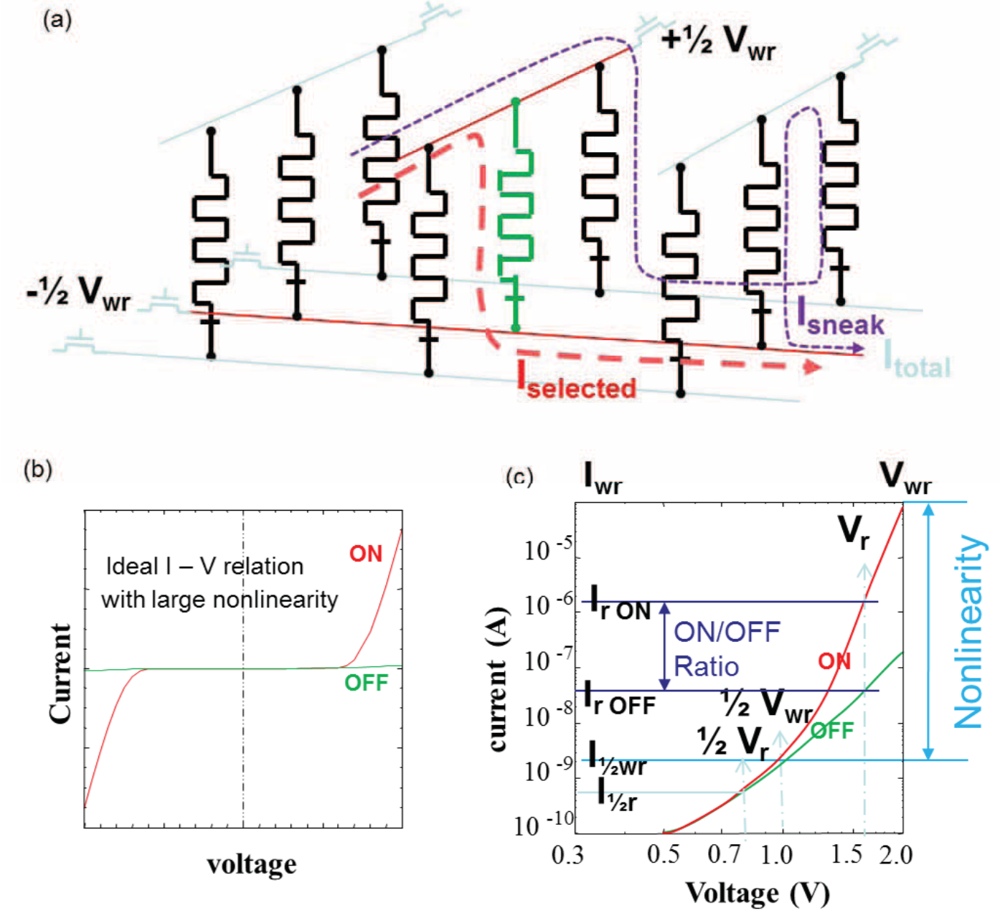
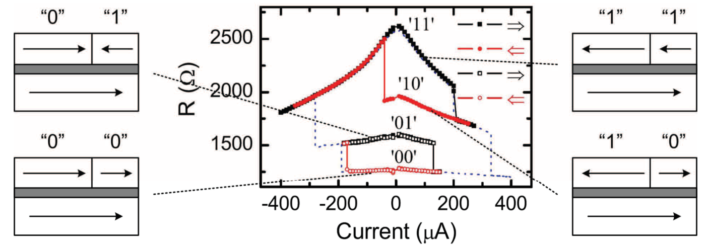
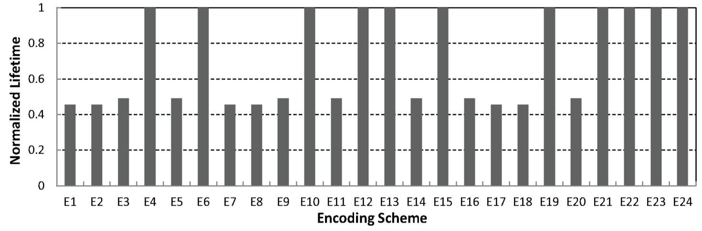
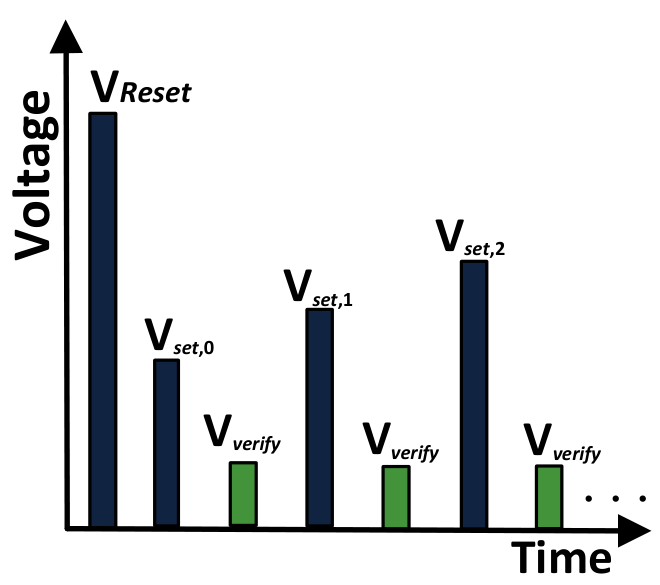
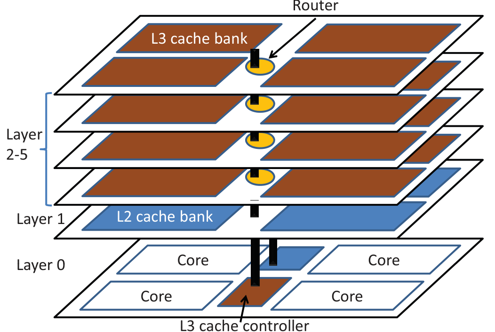
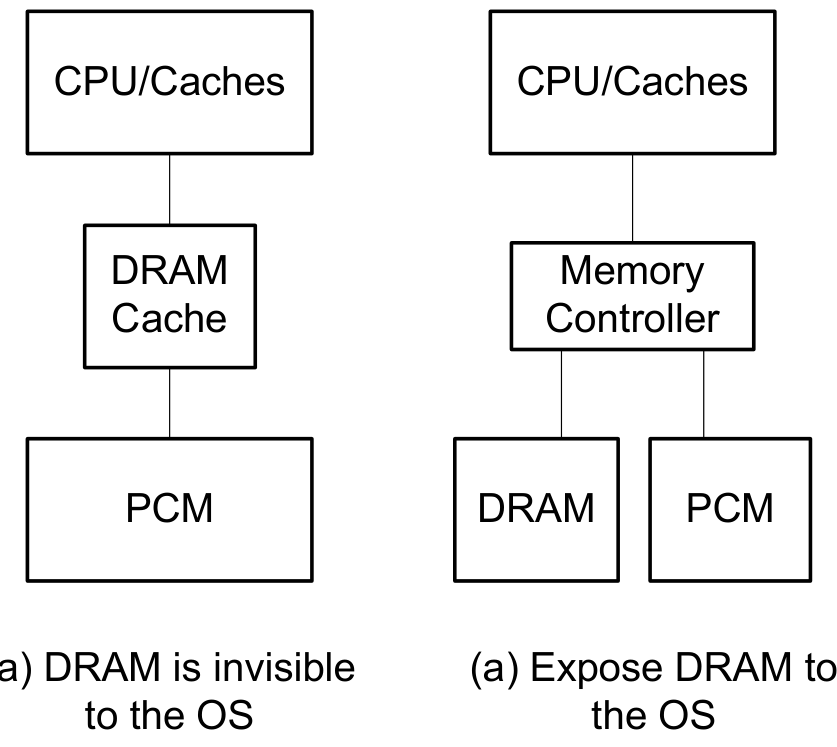
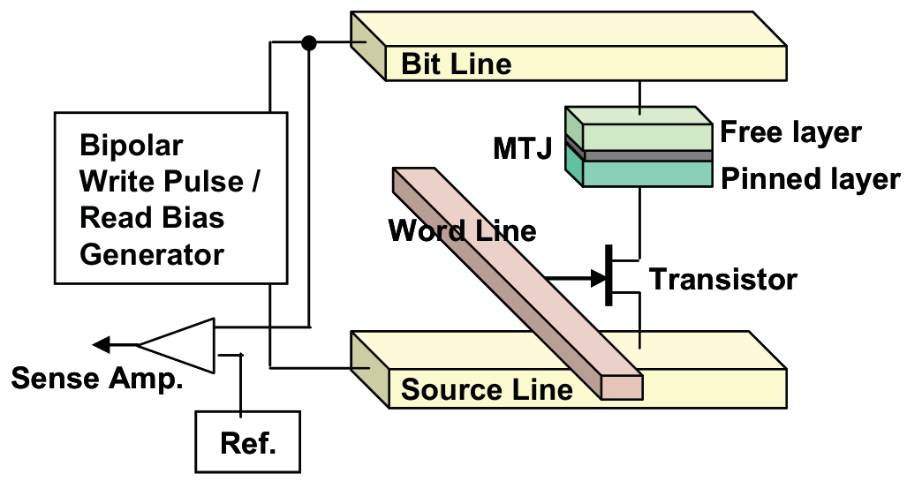
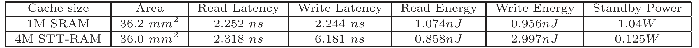

## xueEmergingNonvolatileMemories2011 — 新兴非易失性存储器（PCM / STT-RAM / MLC STT-RAM / 忆阻器综述）

## 📄 元数据
Chun Jason Xue、Youtao Zhang、Yiran Chen、Guangyu Sun、J. Joshua Yang、Hai Li 等，2011，Proceedings of the 7th IEEE/ACM/IFIP International Conference on Hardware/Software Codesign and System Synthesis (CODES+ISSS, ESWeek '11, Taipei)，pp. 325–334，DOI: 10.1145/2039370.2039420
## 💡 一句话
这是一篇由四个独立贡献汇编而成的体系结构视角综述，系统梳理了相变存储器（PCM）、自旋转移力矩磁阻存储器（STT-RAM，含 MLC）和忆阻器（Memristor）三类新兴非易失存储器（NVM）的器件物理、性能参数，并从电路/架构/系统层提出应对"读写不对称、写耐久性、写功耗、潜行电流"等共性挑战的方案。
## 🔗 Wiki 双链
  - 概念 [[../concepts/polarization-switching]]（铁电极化翻转是 FeRAM 的物理基础，本文作为 NVM 家族综述与其形成器件物理对照）
  - 概念 [[../concepts/ferroelectric-tunnel-junction]]（FTJ/FeRAM 是 NVM 版图中的一员，本文给出的 PCM/STT-RAM/忆阻器参数表可作为器件对比参照）
  - 概念 [[../concepts/spin-orbit-coupling]]（STT-RAM 依赖自旋极化电流翻转自由层磁矩，属自旋电子学器件范畴）
  - 概念 [[../concepts/phase-change-memory|相变存储器（PCM）]]（本文三大主题之一，GST 晶态/非晶态电阻差异存储）
  - 概念 [[../concepts/stt-ram|自旋转移力矩磁阻存储器（STT-RAM）]]（本文三大主题之一，基于 MTJ 的自旋极化电流写磁）
  - 概念 [[../concepts/mlc-stt-ram|多级单元 STT-RAM]]（单 MTJ 存 2 bit，ZT/ST/HT/TT 状态转换与编码寻优）
  - 概念 [[../concepts/magnetic-tunnel-junction|磁隧道结（MTJ）]]（STT-RAM 核心单元，TMR 决定高低阻比）
  - 概念 [[../concepts/memristor|忆阻器]]（本文三大主题之一，氧空位导电通道阻变器件）
  - 概念 [[../concepts/crossbar-array|交叉阵列]]（忆阻器高密度无源集成与存算一体基础）
  - 概念 [[../concepts/sneak-path-current|潜行路径电流]]（交叉阵列半选旁路电流，需非线性 I-V 或选通管抑制）
  - 概念 [[../concepts/write-endurance|写耐久性]]（NVM 共性指标，PCM ~10^8、STT-RAM ~10^12、早期忆阻器 10–10^6）
  - 概念 [[../concepts/wear-leveling|磨损均衡]]（地址随机化延长 PCM 寿命，Start-Gap/Security Refresh）
  - 概念 [[../concepts/pcm-dram-hybrid-memory|PCM/DRAM 混合主存]]（DRAM 作写缓存以吸收写流量、延长 PCM 寿命）
  - 图表 [[../figures/electronic-devices]]（1T1R、1T1J、MTJ、交叉阵列等器件结构图）
  - 图表 [[../figures/heterostructures-stacking-domains-devices|铁弹畴、畴壁、In₂Se₃ 与器件应用 (Domains, Domain Walls, In₂Se₃ & Devices)]]
  - 年度 [[../write/2011]]
  - 项目 [[../projects/project-2-mn-multiferroics]]
  - 项目 [[../projects/project-5-snte-ferroelectric-sim]]
  - 相关论文 [[../../raw/note/xueEmergingNonvolatileMemories2011]]
## 🆕 新概念/实体建议
  - 实体建议：`GST.md`（Ge2Sb2Te5 相变合金）、`TaOx.md`（高耐久性忆阻材料，>10^12 次循环）、`MgO-MTJ.md`（MgO 势垒磁隧道结）。
## 📊 关键图表
  -  -> [[../figures/electronic-devices|电子与突触器件]]
  -  -> [[../figures/experimental-setups|实验测试与测量装置]]
  -  -> [[../figures/experimental-setups|实验测试与测量装置]]
  -  -> [[../figures/electronic-devices|电子与突触器件]]
  -  -> [[../figures/electronic-devices|电子与突触器件]]
  -  -> [[../figures/electronic-devices|电子与突触器件]]
  -  → [[../figures/heterostructures-stacking-domains-devices|铁弹畴、畴壁、In₂Se₃ 与器件应用]]
  -  -> [[../figures/electronic-devices|电子与突触器件]]
  -  -> [[../figures/experimental-setups|实验测试与测量装置]]
## 🔬 项目连接
  - **project-1 双光子**：无直接项目连接。本文为电子存储器体系结构综述，与双光子吸收/三维光存储无机制或方法重叠。
  - **project-2 Mn 多铁**：有参考价值。(1) 本文综述 of STT-RAM 是"用电荷/电流操控磁矩"的范式，而 Mn 基多铁追求的是"用电场操控磁矩"（磁电耦合），理解 STT-RAM 的写电流大、MgO TDDB 耐久性问题（ln TTF ≈ 1/E）正好反衬出磁电耦合低功耗写磁的动机；(2) 论文给出了 NVM 器件的统一评价维度——读/写延迟、读/写能耗、耐久性、保持时间、单元面积、可微缩性，这套指标可直接用于评估多铁/铁电存储器的应用前景；(3) FeRAM 虽未被单独成章，但作为 NVM 家族背景出现，其极化翻转机制与多铁材料同根，可在 wiki 中把多铁器件物理与存储器应用语境挂钩。
  - **project-3 机械发光 NN**：弱关联/类比价值。本文第 4 章提到忆阻器可用于神经形态计算（spike-timing-dependent learning）和状态逻辑（material implication），这是硬件神经网络的器件路线之一；可作为"新兴器件如何承载 NN 计算"的旁证，但与机械发光光神经网络在物理机制上无直接联系。
  - **project-4 TTF 分子计算**：有间接参考价值。(1) 忆阻器的"金属/氧化物/金属"三明治结构、离子迁移开关机制、交叉阵列无源集成，与分子电子器件在尺度极限、非线性 I-V、无晶体管集成等议题上高度可类比；(2) 潜行路径电流及其用器件非线性解决的思路，对分子交叉点阵电路同样适用；(3) 论文对"信息载体从电子转向离子/原子位置"的讨论，为分子尺度信息器件提供了物理图像。
  - **project-5 SnTe 铁电模拟**：有参考价值。(1) 论文把铁电/极化翻转型存储器（FeRAM、FTJ）置于更广阔的 NVM 版图中，其性能对比表（PCM 写延迟 ~1 μs、读 50–100 ns、耐久性 10^8；STT-RAM 读 ~2.3 ns、写 ~6.2 ns、待机功耗仅 SRAM 的 1/8）可作为 SnTe 铁电器件应用定位的参照系；(2) [[../concepts/polarization-switching]] 与 [[../concepts/ferroelectric-tunnel-junction]] 所描述的物理机制，正是 SnTe 这类铁电材料走向存储应用的桥梁，本文提供了系统级的性能指标与挑战清单（读写不对称、耐久性、保持时间），有助于在模拟工作中明确"需要算出什么参数才有器件意义"；(3) 论文强调 NVM 的微缩性比较（DRAM 逼近 22 nm、PCM 可至 5 nm），与 SnTe 作为二维/超薄铁电的微缩优势叙事一致。
  - **project-6 湿度传感器**：无直接项目连接。忆阻器氧空位迁移机制对氧化物电导受环境影响有一点边缘类比，但不构成本文对该项目的参考价值。
  - **project-7 CDW**：无直接项目连接。论文未涉及电荷密度波物理。
## 🔗 项目双链
- 项目 [[../projects/project-2-mn-multiferroics|项目二：Mn极化结构铁电材料]]
- 项目 [[../projects/project-3-mechanoluminescence-nn|项目三：应力发光神经网络]]
- 项目 [[../projects/project-4-ttf-molecular-calc|项目四：lsl老师的ttf分子计算]]
- 项目 [[../projects/project-5-snte-ferroelectric-sim|项目五：lammps势函数SnTe铁电模拟]]

## 📝 组织与用词
文章采用"总-分-总"汇编式结构：摘要给出 NVM 共性优势（低漏电、高密度、快读）与共性挑战（读写不对称）；正文四章分别独立撰写——(1) PCM 的物理机制、P&V 迭代写、工艺偏差致过编程、PCM/DRAM 混合主存与寿命延长三件套（减写/磨损均衡/挽救）；(2) STT-RAM 作高性能 CMP 的 L2/L3 缓存，基于 TSV 的 3D NUCA 堆叠与读优先写缓冲；(3) MLC STT-RAM 在嵌入式系统中的 ZT/ST/HT/TT 转换分类、写前读策略与 24 种编码方案寻优；(4) 忆阻器的氧空位通道开关模型、前景与六大挑战（耐久性、良率、能耗、电铸、非线性、集成）。论证逻辑为"器件物理 → 电路参数 → 架构/系统方案"层层递进。可复用术语：
  - 非易失性存储器（Non-Volatile Memory, NVM）
  - 读写不对称性（Read/Write Asymmetry）
  - 写耐久性 [[../concepts/write-endurance|写耐久性]]（Write Endurance）
  - 磁隧道结 [[../concepts/magnetic-tunnel-junction|磁隧道结]]（Magnetic Tunnel Junction, MTJ）
  - 自旋转移力矩（Spin-Transfer Torque, STT）
  - 隧道磁阻比（Tunneling Magneto-Resistance ratio, TMR）
  - 时间相关介质击穿（Time-Dependent Dielectric Breakdown, TDDB）
  - 潜行路径电流 [[../concepts/sneak-path-current|潜行路径电流]]（Sneak Path Current）
  - 编程-验证迭代（Program-and-Verify, P&V）
  - 磨损均衡 [[../concepts/wear-leveling|磨损均衡]]（Wear Leveling）
  - 多级单元 / 单级单元（MLC / SLC）
  - 交叉阵列 [[../concepts/crossbar-array|交叉阵列]]（Crossbar Array）
## ✏️ 可写入 Wiki 的要点
  1. PCM 利用 GST（Ge2Sb2Te5）晶态（低阻，逻辑 1）与非晶态（高阻，逻辑 0）的电阻差异存储；SET 需加热至 300–600°C 并缓慢结晶，RESET 需加热至 >600°C 熔化后快速淬火。典型读延迟 50–100 ns、写延迟 ~1 μs（比读慢 10× 以上）、耐久性 10^8–10^9 次、字节寻址、待机功耗 <<0.1 W。
  2. PCM 写采用"编程-验证"（P&V）迭代方案：先 RESET 统一初态，再施加递增 SET 脉冲并逐次验证，是写延迟远大于读延迟的根因；工艺偏差导致同一行内各单元最优 RESET 电流不同，统一按最大值写会"过编程"——写能量增加 2× 可使耐久性下降约 50×。
  3. PCM 寿命延长三技术：(i) 减少写流量（DRAM 缓冲、差分写入只写变化位）；(ii) [[../concepts/wear-leveling|磨损均衡]]（Start-Gap、Security Refresh 等硬件地址随机化）；(iii) 故障挽救（ECC/ECP 纠错指针、行级备份映射，允许降级使用）。Qureshi 的 DRAM 缓存仅占 PCM 容量 3%、面积 13%，即可获 3× 加速与 3× 寿命延长。
  4. STT-RAM 单元为 1T1J（NMOS + MTJ），MTJ 由自由层/MgO 隧道势垒/固定层组成；65 nm 工艺下 4 MB STT-RAM 与 1 MB SRAM 面积相同（~36 mm²），读延迟 2.318 ns、写延迟 6.181 ns、读能 0.858 nJ、写能 2.997 nJ、待机功耗仅 0.125 W（SRAM 为 1.04 W）。
  5. MLC STT-RAM 的 MTJ 自由层含软/硬两磁畴，组合出 R00<R01<R10<R11 四阻态存 2 bit；45 nm 节点下最大转换电流 66.4 μA（R11/R10→R00，硬翻转），SLC 为 54 μA。状态转换分四类：ZT（零转换）、ST（仅软畴翻转）、HT（两畴同翻）、TT（两步：先 HT 后 ST）；写前读可避免不必要翻转。
  6. MLC STT-RAM 数据-阻态编码共 4!=24 种；最优编码（R00→11, R01→10, R10→01, R11→00）较最差编码节省写能耗 27.5%，同时寿命最长——因为最小化了需要大电流（加剧 MgO TDDB）的状态转换频率。MTJ 寿命受 MgO 势垒 TDDB 限制，1/E 模型给出 ln(TTF) ≈ 1/E。
  7. 16 MB MLC STT-RAM 缓存相对 2 MB SRAM：能耗仅为其约 15%（SLC/MLC 同容量均约 15–17%），16 MB MLC 能耗进一步降至同容量 SLC 的 78%；归一化执行时间 2 MB MLC 为 1.025、16 MB MLC 为 0.979（容量提升使缺失率下降，性能反超 SRAM）。
  8. [[../concepts/memristor|忆阻器]]（Pt/TiO2-x/TiO2/Pt）开关机制：负偏压吸引带正电[[../concepts/oxygen-vacancy|氧空位]]（VO）向顶电极漂移、凝聚成亚氧化物导电通道，贯穿金属/氧化物界面势垒时器件开启（对称指数 I-V，隧穿薄残余势垒）；反偏将 VO 推离界面、恢复势垒即关闭。ON/OFF 电导比 ~10^3，开关可达亚纳秒至 2 ns，保持力在 85°C 下达数年，可缩至几纳米（信息载体为原子位置而非电子，无隧穿漏电）。
  9. 忆阻器六大挑战及对策：耐久性（TiOx 仅 10–10^6 次，TaOx 可达 >10^12 次，50 nm×50 nm TaOx 器件 <2 V、<100 μA、<2 ns，亚 pJ/bit）；良率（纳米播种开关中心可将可开关器件良率从 <30% 提至近 100%）；操作能耗（随结面积缩小而降低）；电铸（减薄化学计量氧化层+加厚亚氧化物层，消除"体区"只留开关界面）；非线性（[[../concepts/crossbar-array|交叉阵列]]中半选器件承受 1/2 Vwr，需开态高度非线性 I-V 抑制潜行电流，非线性度定义 I(Vwr)/I(Vwr/2)，线性器件为 2，文献多 <10，需大幅提升以实现无选通管大规模无源阵列）；集成（与 CMOS 兼容、可堆叠）。
  10. 论文核心结论：没有一种 NVM 是"银弹"；PCM 可微缩性与 Flash 兼容性最佳但写寿命/延迟短板突出，STT-RAM 是片上 SRAM 缓存的有力竞争者（高密度、低漏电），忆阻器前景最具颠覆性（存算一体、[[../concepts/neuromorphic-computing|神经形态计算]]）但材料与集成挑战最基础；释放 NVM 潜力必须跨器件-电路-架构-系统软件协同设计。
