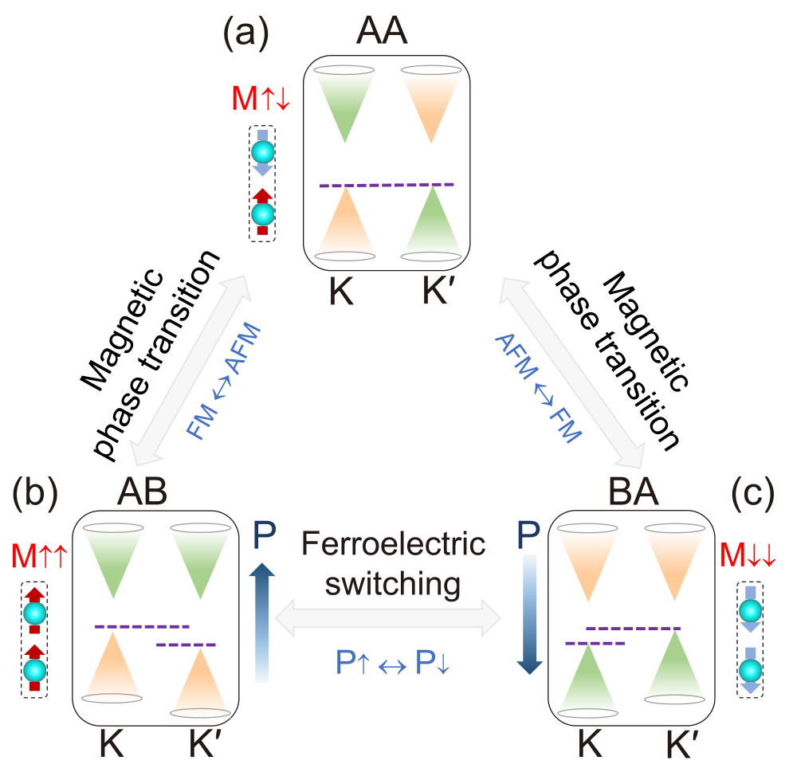
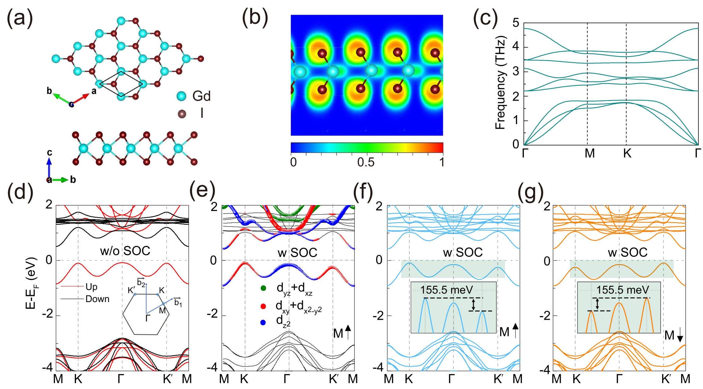
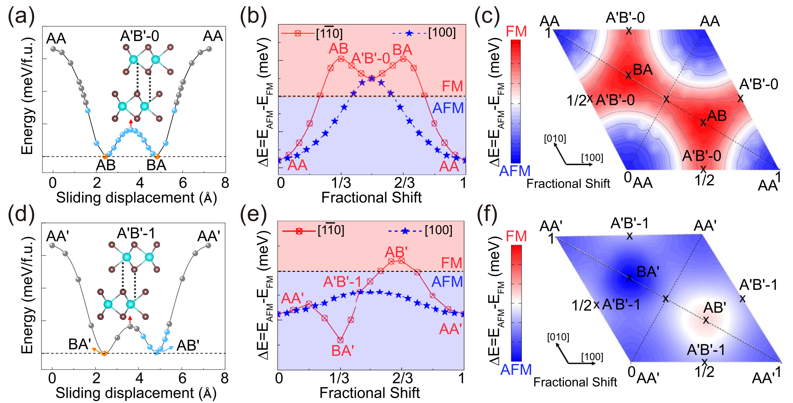
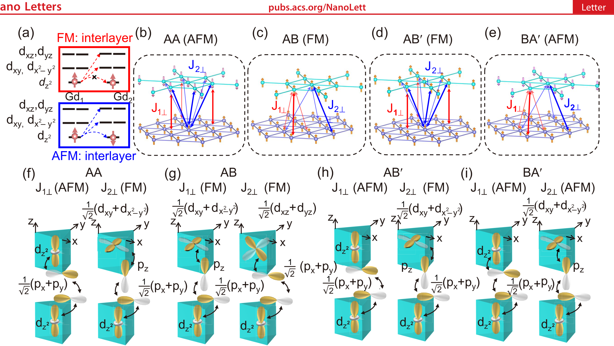
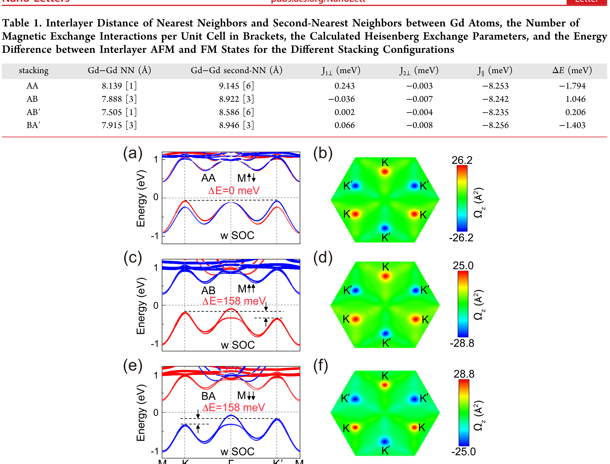
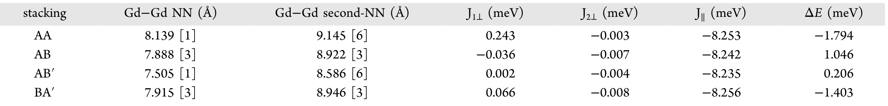
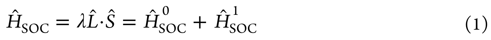

## xunCoexistingMagnetismFerroelectric2024 — 叠层相关二维材料中磁、铁电和铁谷共存的多铁性

## 📄 元数据
Wei Xun, Chao Wu, Hanbo Sun, Weixi Zhang, Yin-Zhong Wu, Ping Li，2024，Nano Letters 24(11), 3541-3547，DOI 10.1021/acs.nanolett.4c00597
## 💡 一句话
通过第一性原理计算提出在双层 GdI₂ 中利用层间滑移（滑移铁电性）同时实现并可逆耦合铁磁性、铁电性与铁谷性的"滑移多铁"机制，并以轨道分辨的超超交换模型揭示了堆垛依赖磁相变的微观根源。
## 🔗 Wiki 双链
  - 概念 [[../concepts/multiferroicity]]、[[../concepts/sliding-ferroelectricity]]、[[../concepts/magnetoelectric-coupling]]、[[../concepts/berry-phase]]、[[../concepts/spin-orbit-coupling]]、[[../concepts/2D-materials]]、[[../concepts/ferroelasticity]]、[[../concepts/d-orbital-hopping]]、[[../concepts/ferrovalley]]、[[../concepts/stacking-engineering]]、[[../concepts/supersuperexchange]]、[[../concepts/valley-polarization]]
  - 实体 [[../entities/VASP]]、[[../entities/TMDs]]、[[../entities/h-BN]]
  - 图表 [[../figures/crystal-structures]]、[[../figures/electronic-bands]]、[[../figures/heterostructures-stacking]]、[[../figures/heterostructures-stacking-multiferroic|多铁与磁电异质结]]、[[../figures/mathematical-models]]
  - 年度 [[../write/2024]]
  - 相关论文 [[../../raw/note/xunCoexistingMagnetismFerroelectric2024]]
## 🆕 新概念/实体建议
  - `GdI2`（碘化钆）：新型二维铁磁半导体/多铁候选材料，4f⁷5d¹ 构型，大谷极化（155.5 meV）。
## 📊 关键图表
  -  → [[../figures/heterostructures-stacking-multiferroic|多铁与磁电异质结]]
  -  → [[../figures/heterostructures-stacking-multiferroic|多铁与磁电异质结]]
  -  → [[../figures/heterostructures-stacking-multiferroic|多铁与磁电异质结]]
  -  → [[../figures/heterostructures-stacking-multiferroic|多铁与磁电异质结]]
  -  → [[../figures/heterostructures-stacking-multiferroic|多铁与磁电异质结]]
  -  -> [[../figures/crystal-structures|晶体结构与原子排布]]
  -  -> [[../figures/mathematical-models|数学模型与物理公式]]
## 🔬 项目连接
  - **project-2（Mn 多铁）— strong**：本文直接研究二维多铁材料中铁磁-铁电-铁谷三序耦合，磁电耦合机制、堆垛依赖磁相变（AFM↔FM）、超超交换轨道图像均可为 Mn 基多铁体系（尤其层状/二维 Mn 氧化物）的磁电耦合机理提供类比和方法参考；滑移铁电作为非离子位移型极化起源，也丰富了多铁极化图像。
  - **project-5（SnTe 铁电模拟）— medium**：滑移铁电性的 DFT 计算流程（平面平均静电势跃变 ΔΦ 定极化、Berry 曲率/贝里相位、层间堆垛能垒扫描）对 SnTe 铁电模拟有方法学参考价值；AB/BA 简并极化翻转对与铁电畴翻转能垒计算可类比。
  - project-1/3/4/6/7：无直接项目连接。
## 🔗 项目双链
- 项目 [[../projects/project-2-mn-multiferroics|项目二：Mn极化结构铁电材料]]
- 项目 [[../projects/project-5-snte-ferroelectric-sim|项目五：lammps势函数SnTe铁电模拟]]

## 📝 组织与用词
文章按"机制提出（图1）→ 单层前驱体验证（图2）→ 双层堆垛-磁相图（图3）→ 微观轨道机制（图4、表1）→ 多铁耦合终态验证（图5）"递进展开，每一步由对称性论点（D3h→C3v 破缺 xy 镜面）统领。可复用术语：
  - sliding ferroelectricity [[../concepts/sliding-ferroelectricity|sliding ferroelectricity]]（滑移铁电性）
  - ferrovalley / valley polarization（铁谷性 / 谷极化）
  - supersuperexchange（超超交换）
  - stacking-dependent magnetism（堆垛依赖磁性）
  - layer-polarized anomalous Hall effect（层极化反常霍尔效应）
  - interlayer exchange energy J⊥（层间交换能）
  - Berry curvature（贝里曲率）
  - multiferroic coupling（多铁耦合）
## ✏️ 可写入 Wiki 的要点
  1. 单层 GdI₂ 为铁磁半导体，面内晶格常数 4.17 Å，Gd 为 4f⁷5d¹ 构型；层内交换 J∥≈−8.25 meV（强 FM），FM-AFM 能量差 ΔE=−266 meV；MAE=0.777 meV/cell，易轴沿面内 x 方向，需 ~3.58 T 磁场才能将磁矩转到面外。
  2. 单层 GdI₂ 在 SOC 下 K/K' 谷劈裂达 155.5 meV，大于 VSe₂(90 meV)、VSiXN₄(~70 meV)、MoTe₂/EuO(~20 meV)；VBM 主要由 Gd d_xy、d_x²−y² 轨道贡献，谷劈裂可由 H_SOC=S_z L_z 的[[../concepts/effective-hamiltonian|有效哈密顿量]]解析给出 E_vK−E_vK'=4⟨d_xy|S_z|d_xy⟩⟨d_x²−y²|L_z|d_xy⟩。
  3. 双层 GdI₂ 六种堆垛（AA/AB/BA/AA'/AB'/BA'）中，AB、BA、BA' 为能量稳态；AA 具有 D3h 对称（xy 镜面），无面外极化；滑移至 AB/BA 后对称性降为 C3v，产生面外极化 P=3.68×10⁻¹² C/m，真空能级跃变 ΔΦ=±22.86 meV。
  4. 磁相对堆垛高度敏感：AA 堆垛层间交换能 ΔE=E_AFM−E_FM=−1.794 meV（AFM 基态），AB/BA 为 +1.046 meV（FM 基态）；AB→BA 滑移能垒 16.42 meV（低于室温 kBT≈26 meV，存在热稳定性隐患）。
  5. 微观机制为 Gd-I-I-Gd 超[[../concepts/superexchange|超交换]]：AA 中 J₁⊥ 由半满 d_z²-d_z² 虚激发主导（AFM，J₁⊥=0.243 meV），AB 中滑移改变轨道重叠，J₁⊥ 变为 d_z²-d_xy/d_x²−y² 虚激发（FM，J₁⊥=−0.036 meV），J₂⊥ 由 d_z²-d_xz/d_yz 贡献亦为 FM。
  6. AA 堆垛 AFM 态下 K/K' 贝里曲率大小相等符号相反（±26.2 Ų），无净谷[[../concepts/hall-effect|霍尔效应]]；AB 堆垛 FM 态下贝里曲率不对称（+25.0 vs −28.8 Ų），谷极化 158 meV；BA 堆垛谷极化与贝里曲率分布整体翻转，实现铁电↔磁↔谷三序协同反转。
  7. 计算上采用 DFT+U（U=2.5–5 eV 扫描，谷极化变化仅 0.5 meV，结果稳健）、PAW 赝势、GGA-PBE；声子谱无虚频、[[../concepts/formation-energy|形成能]] −11.140 eV，表明单层 GdI₂ 动力学稳定且易制备。
  8. "滑移多铁"设计范式：任何具有本征自发谷极化的单层铁磁半导体，原则上都可通过双层堆垛+层间滑移实现磁-电-谷耦合多铁，避免了异质结制备困难，为二维多铁器件提供通用路线。
  9. AA' 类堆垛因上下层 180° 旋转导致面外极化相互抵消，虽有磁耦合但无[[../concepts/ferroelectricity|铁电性]]，说明对称性（而非单纯滑移）是极化存在的判据。
  10. 批判性局限：16.42 meV 滑移势垒偏低、室温热稳定性存疑；易轴面内与谷极化需面外磁矩矛盾；GdI₂ 空气敏感、实验合成尚未实现；4f 强关联效应可能超出 DFT+U 描述，需 GW 等更高精度方法验证。
