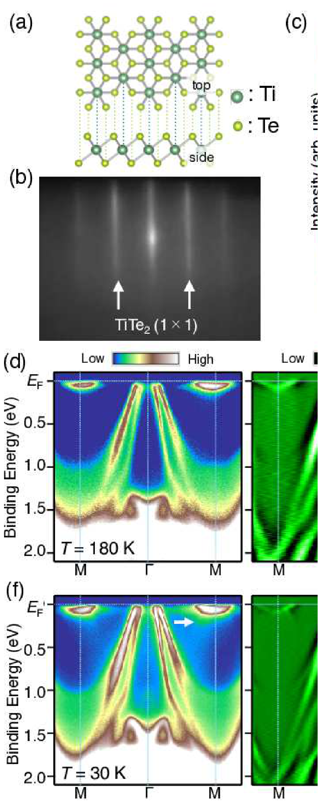
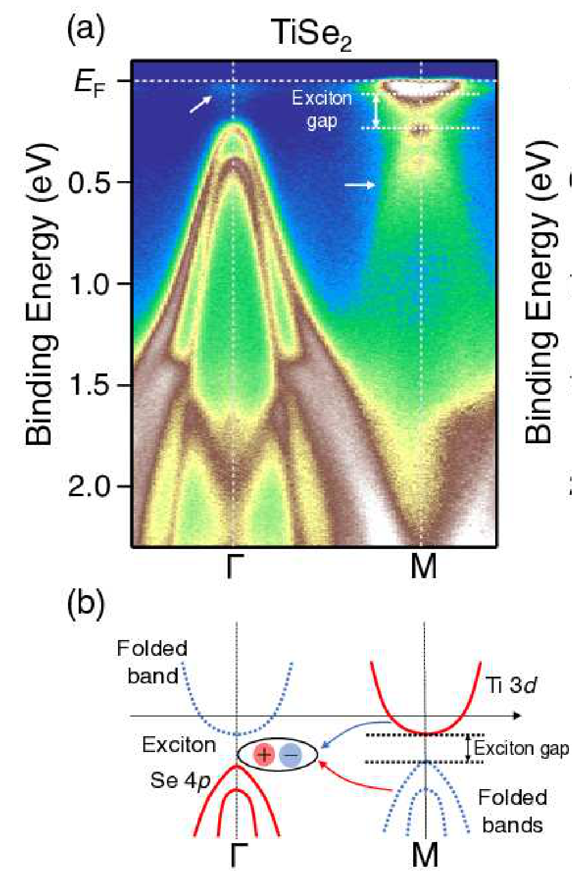

## yanagizawaSwitchingChargedensityWave2023 — 单层 TiTe₂ 中通过载流子调谐实现电荷密度波的开关

## 📄 元数据
Koki Yanagizawa, Katsuaki Sugawara, Tappei Kawakami, Ryuichi Ando, Ken Yaegashi, Kosuke Nakayama, Seigo Souma, Kiyohisa Tanaka, Miho Kitamura, Koji Horiba, Hiroshi Kumigashira, Takashi Takahashi, Takafumi Sato et al.，2023，Physical Review Materials 7, 104002，DOI 10.1103/PhysRevMaterials.7.104002
## 💡 一句话
通过 MBE 衬底温度和表面 K 沉积两种手段调控单层 1T-TiTe₂ 的载流子浓度，用 ARPES 直接观察到 2×2 CDW 仅在电子-空穴精确补偿的极窄掺杂窗口出现，从而确认费米面嵌套（而非激子凝聚）是该 CDW 的主导驱动力。

## 🔗 Wiki 双链
  - 概念 [[../concepts/charge-density-wave]]、[[../concepts/2d-materials]]、[[../concepts/density-functional-theory]]、[[../concepts/fermi-surface-nesting|费米面嵌套]]、[[../concepts/exciton-condensation|激子凝聚]]、[[../concepts/band-folding|能带折叠]]、[[../concepts/carrier-tuning|载流子调谐]]、[[../concepts/electronic-susceptibility|电子磁化率]]、[[../concepts/electron-phonon-coupling|电子-声子耦合]]
  - 实体 [[../entities/TMDs]]、[[../entities/TiTe2|TiTe₂]]、[[../entities/TiSe2|TiSe₂]]、[[../entities/bilayer-graphene|双层石墨烯]]
  - 图表 [[../figures/crystal-structures]]、[[../figures/electronic-bands]]、[[../figures/heterostructures-stacking|极性金属、拓扑相、CDW 与相变]]
  - 年度 [[../write/2020-2024|2023]]
  - 项目 [[../projects/project-7-cdw-charge-density-wave]]、[[../projects/project-5-snte-ferroelectric-sim]]
  - 概念 [[../concepts/orbital-selective-hybridization]]
  - 实体 [[../entities/Quantum-ESPRESSO]]、[[../entities/potassium]]、[[../entities/SiC]]
  - 相关论文 [[../../raw/note/yanagizawaSwitchingChargedensityWave2023]]

## 🆕 新概念/实体建议
  - [[../entities/Quantum-Espresso|Quantum-Espresso]] — 本文使用的第一性原理平面波 DFT 软件包（GGA-PBE，60 Ry 截断，12×12×1 k 网格，真空层 >10 Å）。
  - 方法标签可在 wiki/concepts 下补：[[../concepts/ARPES]]、[[../concepts/mbe-rheed|mbe-rheed]]、[[../concepts/k-deposition-doping|k-deposition-doping]]。

## 📊 关键图表
  - **图1：原始单层 1T-TiTe₂ 的电子结构与 2×2 CDW 指纹**
  -  → [[../figures/crystal-structures-bulk|体相晶体结构]]
    - **图示描述**：(a) 单层 1T-TiTe₂ 八面体配位晶体结构；(b) 双层石墨烯/SiC 上生长薄膜的 RHEED 图；(c)–(f) 沿 Γ–M 方向、T = 180 K 与 30 K 的 EDC、ARPES 强度与二阶导数图；(e) DFT 计算能带；(g) 正常相与 2×2 CDW 相布里渊区对比。
    - **关键特征**：180 K 时 Γ 点可见 Te 5p 空穴带穿越 E_F、M 点有 Ti 3d 浅电子带，约 −1.5 eV 处有 M 形带，与 DFT 吻合，确认单层 TiTe₂ 为负带隙补偿半金属；降至 30 K 时 M 点电子带下方出现额外强度（白箭头），是 Γ 点空穴带被 2×2 CDW 周期势折叠至 M 点的副本，折叠带谱重约为主带的 10%，远弱于同构 TiSe₂。
    - **结论/意义**：确立原始样品的本征电子结构，并以 M 点折叠带作为后续判断 CDW 开/关的直接 ARPES 指纹。

  - **图2：Ts 与 K 沉积双路载流子调控下 CDW 的开关、T_CDW 与各向异性能隙**
  -  -> [[../figures/electronic-bands-dos-fermi|态密度与费米面]]
    - **图示描述**：(a)–(f) Ts = 400/420/440 °C 样品在 40 K 的 Γ–M ARPES 强度/二阶导数及 E_F ± 50 meV 费米面图；(g)–(l) t_K = 6/12/24 min 钾沉积样品的对应数据；(m)–(n) Γ 点内空穴口袋 k_F 处变温 EDC 与领先边缘位移；(o)–(q) M 点椭球电子口袋五个 k_F 点的 EDC、对称化 EDC 及峰位/位移；(r) 三种掺杂下费米面拓扑与 q_CDW 示意。
    - **关键特征**：Ts = 420 °C 原始样品电子/空穴各约 0.08 e⁻(h⁺)/晶胞，M 点折叠带清晰，蓝/红箭头标出 2×2 嵌套矢量 q_CDW；Ts = 400 °C（约 0.06 h⁺，空穴掺杂）、Ts = 440 °C（约 0.37 e⁻，电子掺杂）以及 t_K = 6/12/24 min（约 0.07/0.21/0.39 e⁻）所有非补偿样品折叠带均消失；空穴口袋领先边缘在 30 K 位移 2–10 meV 并呈双峰，位移在约 90 K 归零，给出 T_CDW ≈ 90 K；电子口袋短轴点 5 处 EDC 在 70 meV 出现峰并显著位移，沿长轴向点 1 位移逐渐消失，表明 CDW 能隙在椭球口袋上强各向异性。
    - **结论/意义**：两种独立掺杂手段共同证明 2×2 CDW 仅在电子-空穴精确补偿的极窄窗口出现，且能隙各向异性与 Γ 内空穴口袋/M 椭球电子口袋短轴的部分嵌套几何完全吻合。

  - **图3：与单层 TiSe₂ 对比排除激子凝聚机制**
  -  → [[../figures/electronic-bands-band-structures|能带结构与带隙]]
    - **图示描述**：(a)、(c) 分别为单层 TiSe₂ 与 TiTe₂ 在 CDW 相沿 Γ–M 的 ARPES 强度图；(b)、(d) 为两者整体能带结构示意图，对比半导体性零带隙与半金属负带隙。
    - **关键特征**：TiSe₂ 在 M 点显示高强度折叠带，对应间接零带隙半导体中电子-空穴强库仑作用形成的激子凝聚，激子能隙约 0.2 eV；TiTe₂ 的 M 点折叠带强度明显更弱，且其半金属本性提供大量自由载流子，对库仑作用产生强屏蔽，使激子无法稳定。
    - **结论/意义**：以同构体系作为机制对照，直接排除激子凝聚作为单层 TiTe₂ CDW 的驱动力，把机制讨论指向费米面拓扑本身。

  - **图4：DFT 电子磁化率 Re[χ₀(q)] 对费米面嵌套的理论确证**
  - ![图4 DFT 费米面计算的电子磁化率 Re[χ₀(q)]：原始态 q=½G 亮点 vs 电子掺杂 0.1 eV 后消失](../../raw/figures/yanagizawaSwitchingChargedensityWave2023/fig_4_BQBPQY75.png)
    - **图示描述**：基于 DFT（Quantum Espresso，GGA-PBE，60 Ry 截断，12×12×1 k 网格，真空层 >10 Å）计算的费米面得到的 Lindhard 电子磁化率实部 Re[χ₀(q)] 在二维 q 平面的强度图；(a) 原始非掺杂、(b) 化学势上移 0.1 eV 的电子掺杂态，插图为各自费米面。
    - **关键特征**：原始态在 q = ½G（对应 M 点，即实验 q_CDW）出现明显局部极大值（亮点），反映 Γ 内空穴口袋与 M 椭球电子口袋之间的费米面嵌套不稳定性；化学势仅上移 0.1 eV 后该亮点即消失，与实验中电子掺杂样品 CDW 折叠带消失定量对应。
    - **结论/意义**：从第一性原理层面独立验证了费米面嵌套机制，并定量显示 CDW 对载流子浓度极端敏感（化学势窗口约 0.1 eV），为载流子调谐开关 CDW 提供理论支撑。

## 🔬 项目连接
  - **project-7（CDW，core）**：这是 project-7 的核心机理文献。它给出"载流子调谐 + 费米面拓扑 + χ₀(q) 计算"三件套判定 CDW 驱动力的完整范式，可直接作为项目内其他 CDW 体系（1T-TiSe₂、TaS₂、NbSe₂ 等）机制辨析的模板。具体可复用结论：(i) 2×2 CDW 的 ARPES 指纹是 M 点折叠空穴带，谱重约为主带 10%；(ii) T_CDW ≈ 90 K，CDW 能隙 2–10 meV（空穴口袋）/70 meV 峰位（电子口袋短轴）；(iii) CDW 仅在电子-空穴补偿区出现，对掺杂极敏感；(iv) 体材料无 CDW 而单层有，根源是体材料 L 点电子口袋沿 k_z 的强 warping 破坏嵌套，单层纯二维椭球口袋恢复嵌套；(v) 费米面嵌套驱动的 CDW 比激子凝聚驱动的更脆弱（折叠带谱重更弱）。
  - **project-5（SnTe 铁电模拟，medium）**：本文的 DFT 计算流程对 SnTe 铁电模拟有方法学参考价值——Quantum Espresso + GGA-PBE + 60 Ry 平面波截断 + 12×12×1 k 网格 + >10 Å 真空层，是标准的二维/薄膜电子结构计算配方；更关键的是从 DFT 费米面计算 Lindhard 电子磁化率 χ₀(q) 实部来定位结构/电子不稳定性波矢的做法，可类比迁移到铁电软模分析（铁电失稳同样与 q=0 或特定 q 处的极化率发散有关）。化学势差仅 0.1 eV 即令 χ₀(q) 亮点消失，也提示掺杂/载流子浓度对铁电相稳定性的定量影响。
  - 其余项目（project-1 双光子、project-2 Mn 多铁、project-3 机械发光 NN、project-4 TTF 分子计算、project-6 湿度传感器）无直接项目连接。

## 🔗 项目双链
- 项目 [[../projects/project-7-cdw-charge-density-wave|项目七：CDW电荷密度波]]
- 项目 [[../projects/project-5-snte-ferroelectric-sim|项目五：lammps势函数SnTe铁电模拟]]

## 📝 组织与用词
  - 论证结构遵循"建立基准电子结构 → 两路独立载流子调控 → 能隙与各向异性观测 → 机制逐一排除 → χ₀(q) 理论确证"的经典实验物理链条。两种掺杂手段（改 Ts 改化学计量比 / 表面沉积 K）互为对照，排除了单一方法引入无序假象的可能；再以同构 TiSe₂ 作为"机制对照样品"排除激子凝聚，论证严密。
  - 机制讨论采用枚举排除法：(i) 无序效应、(ii) 范霍夫奇异点散射、(iii) Jahn-Teller 畸变 [[../concepts/jahn-teller-distortion|Jahn-Teller 畸变]]、(iv) 强电子-声子耦合、(v) 费米面嵌套——逐一给出排除/保留证据。
  - 值得复用的关键词/术语：
    - 电荷密度波 [[../concepts/charge-density-wave|电荷密度波]] (Charge-Density Wave, CDW)
    - 费米面嵌套 [[../concepts/fermi-surface-nesting|费米面嵌套]] (Fermi-surface nesting)
    - 激子凝聚 [[../concepts/exciton-condensation|激子凝聚]] (Exciton condensation)
    - 能带折叠 [[../concepts/band-folding|能带折叠]] (Band folding)
    - 载流子补偿 (Carrier compensation)
    - 电子磁化率 [[../concepts/electronic-susceptibility|电子磁化率]] / Lindhard 函数 (Electronic susceptibility χ₀(q))
    - 谱重 (Spectral weight)
    - 领先边缘中点位移 (Leading-edge midpoint shift)
    - 部分嵌套 (Partial nesting)
    - 维度效应 / 费米面扁平化 (Dimensionality effect / FS flattening)

## ✏️ 可写入 Wiki 的要点
  1. 单层 1T-TiTe₂ 是补偿型[[../concepts/half-metallicity]]（负带隙），Γ 点有空穴口袋（Te 5p），M 点有浅椭球型电子口袋（Ti 3d）；体材料则因 L 点电子口袋沿 k_z 强 warping 而无 CDW。
  2. 单层 TiTe₂ 的 2×2 CDW 转变温度 T_CDW ≈ 90 K，由 ARPES 领先边缘位移随温度消失确定；CDW 态在 M 点出现 Γ 点空穴带的折叠副本，谱重约为主带的 10%（远弱于 TiSe₂）。
  3. CDW 仅在有效零掺杂（电子 ≈ 空穴 ≈ 0.08/晶胞）的极窄窗口出现；Ts=400 °C 样品约 0.06 h⁺（空穴掺杂）、Ts=440 °C 约 0.37 e⁻（电子掺杂）、K 沉积 6/12/24 min 分别约 0.07/0.21/0.39 e⁻，所有非补偿样品折叠带均消失。
  4. 掺杂物理：略高于最优 Ts 产生 Te 空位（电子给体）；略低则 Te 吸附原子（受主，因 Te [[../concepts/work-function|功函数]] 4.95 eV > TiTe₂ 4.86 eV）；K 沉积为表面[[../concepts/charge-transfer|电荷转移]]电子掺杂，每 K 原子约贡献 1 e⁻。
  5. CDW 能隙在 M 点椭球电子口袋上强[[../concepts/migdal-eliashberg-theory|各向异性]]：短轴方向（与折叠空穴口袋重叠最好）能隙最大（70 meV 峰位），向长轴方向逐渐闭合；空穴口袋能隙为 2–10 meV。
  6. 排除[[../concepts/exciton-condensation|激子凝聚]]：TiTe₂ 是半金属，自由载流子强屏蔽使激子无法稳定（对照 TiSe₂ 为间接零带隙半导体，激子能隙约 0.2 eV，折叠带强度大）。
  7. 排除其他机制：K 沉积样品准粒子寿命不变 → 非无序；正常态无范霍夫奇异点；CDW 前后高结合能带无移动 → [[../concepts/jahn-teller-distortion|Jahn-Teller 畸变]]影响极小；单层无能带 kink（体材料有）→ 强[[../concepts/electron-phonon-coupling|电子-声子耦合]]证据不足。
  8. DFT（Quantum Espresso，GGA-PBE，60 Ry，12×12×1，真空 >10 Å）计算的 Re[χ₀(q)] 在原始态 q=½G（M 点）出现局部极大值，[[../concepts/chemical-potential|化学势]]上移 0.1 eV（对应电子掺杂）后该亮点消失，与实验一致。
  9. tK=6 min 样品[[../concepts/fermi-surfaces|费米面]]看似仍满足部分嵌套但 CDW 已消失，作者推测椭球电子口袋长轴扩张降低了嵌套 k 区占总费米面的比例，提示存在一个临界嵌套面积比。
  10. 方法学结论：[[../concepts/carrier-tuning|载流子调谐]]是钉扎原子层 TMD 中 CDW 机制的通用有效手段；[[../concepts/fermi-surface-nesting|费米面嵌套]]驱动的 CDW 比激子凝聚驱动的更脆弱；下一步可通过电学栅压/化学掺杂逼近 CDW 边界寻找超导等奇异量子相。
