## yangStrainEngineeringTwodimensional2021 — 二维材料的应变工程：方法、性质与应用

## 📄 元数据
Shengxue Yang, Yujia Chen, Chengbao Jiang（北京航空航天大学材料科学与工程学院），2021-04，InfoMat 3(4): 397-420，DOI: 10.1002/inf2.12177（综述，Q1，ISSN 2567-3165，基金 NSFC 51520105002、51972007）

## 💡 一句话
系统归纳了向二维材料引入应变的六大方法（晶格失配、柔性基底、图案化基底、压电基底、AFM 针尖、气泡），并按"方法→声子/能带/非线性光学/电学/磁学/相变性质→柔性传感器与光探测器应用"的逻辑链构建了二维材料应变工程的完整知识框架。

## 🔗 Wiki 双链
  - 概念 [[../concepts/strain-engineering]]
  - 概念 [[../concepts/2D-materials]]
  - 概念 [[../concepts/moire-superlattice]]（晶格失配产生的莫尔花纹用于定量应变张量）
  - 概念 [[../concepts/berry-phase]]（文中提到应变扭曲石墨烯狄拉克锥与2D峰分裂，与能谷物理相关）
  - 概念 [[../concepts/ferroelasticity]]（2H→1T'结构相变、应力驱动晶格重构）
  - 概念 [[../concepts/spin-orbit-coupling]]（应变诱导磁性的电子结构基础）
  - 概念 [[../concepts/piezoresistive-effect|压阻效应]]（应变通过带隙/载流子浓度改变二维材料电阻，柔性应变传感器核心机制）
  - 概念 [[../concepts/exciton-funnel-effect|激子漏斗效应]]（非均匀应变场中激子向最大应变、最窄带隙处漂移复合）
  - 概念 [[../concepts/wrinkle-strain|褶皱应变工程]]（预拉伸柔性基底形成周期性褶皱，产生1–2%局域非均匀应变）
  - 概念 [[../concepts/shg-strain-mapping|SHG应变映射]]（基于光弹张量的偏振分辨SHG/THG全张量应变成像）
  - 概念 [[../concepts/phase-transition-2h-1tp|2H→1T'应力诱导相变]]（拉伸应变驱动MoTe₂等从半导体2H相转变为金属1T'相）
  - 概念 [[../entities/graphene|石墨烯]]（可承受25%弹性应变，拉曼G/2D峰随应变分裂红移）
  - 概念 [[../entities/black-phosphorus|黑磷]]（各向异性二维材料，ZZ/AC方向应变响应不同）
  - 概念 [[../concepts/flexible-substrates|柔性衬底]]（PDMS/PC/PET等聚合物衬底，按模量/热膨胀失配或弯曲传应变）
  - 实体 [[../entities/TMDs]]（MoS₂、MoSe₂、WS₂、WSe₂、MoTe₂、NbS₂、NbSe₂、ReSe₂等MX₂体系）
  - 实体 [[../entities/h-BN]]（气泡法常用衬底，MoS₂/h-BN界面）
  - 实体 [[../entities/In2Se3]]（表1中α-In₂Se₃/PMN-PT压电衬底应变体系）
  - 实体 [[../entities/VASP]]（文中DFT/第一性原理计算所属工具范畴）
  - 实体 [[../entities/graphene|石墨烯]]（最典型二维材料，可承受25%弹性应变）
  - 实体 [[../entities/black-phosphorus|黑磷]]（各向异性二维材料，3–6%应变可使优选导电方向旋转90°）
  - 图表 [[../figures/vibrational-spectra]]（拉曼峰位移/分裂、声子软化）
  - 图表 [[../figures/electronic-bands]]（带隙调控、间接-直接带隙转变）
  - 图表 [[../figures/crystal-structures]]（2H/1T/1T'相结构、晶格失配图）
  - 图表 [[../figures/electronic-devices]]（FET、柔性应变传感器、光电探测器）
  - 图表 [[../figures/heterostructures-stacking]]（WSe₂-MoS₂面内异质结、范德华界面气泡）
  - 图表 [[../figures/heterostructures-stacking-spintronics-strain|自旋电子学与应变工程]]（应变诱导磁性、磁耦合调控）
  - 图表 [[../figures/experimental-setups]]（两点/四点弯曲装置、AFM加载装置、压力鼓泡装置）
  - 图表 [[../figures/mathematical-models]]（ε=τ/2R、ε∝(h/R)²等应变公式与SHG极化率张量）
  - 年度 [[../write/2021]]
  - 相关论文 [[../../raw/note/yangStrainEngineeringTwodimensional2021]]

## 🆕 新概念/实体建议
  - `mos2.md`（二硫化钼）：单层为直接带隙，奇数层具压电效应；褶皱区迁移率可达平坦区3倍（5.55 vs 1.42 cm²/Vs @30K）。
  - `mote2.md`（二碲化钼）：AFM针尖应变驱动2H→1T'相变的模型体系；压电衬底上的MoTe₂单晶呈现应变依赖各向异性磁阻。

## 📊 关键图表
  -  → [[../figures/heterostructures-stacking-spintronics-strain|自旋电子学与应变工程]]
  -  -> [[../figures/heterostructures-stacking-spintronics-strain|自旋电子学与应变工程]]
  -  → [[../figures/heterostructures-stacking-spintronics-strain|自旋电子学与应变工程]]
  - 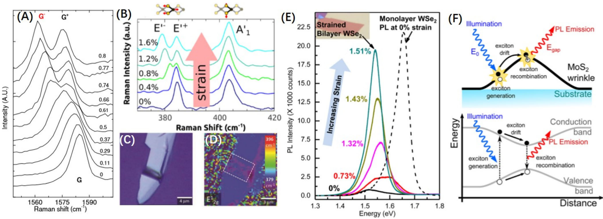 → [[../figures/heterostructures-stacking-spintronics-strain|自旋电子学与应变工程]]
  - 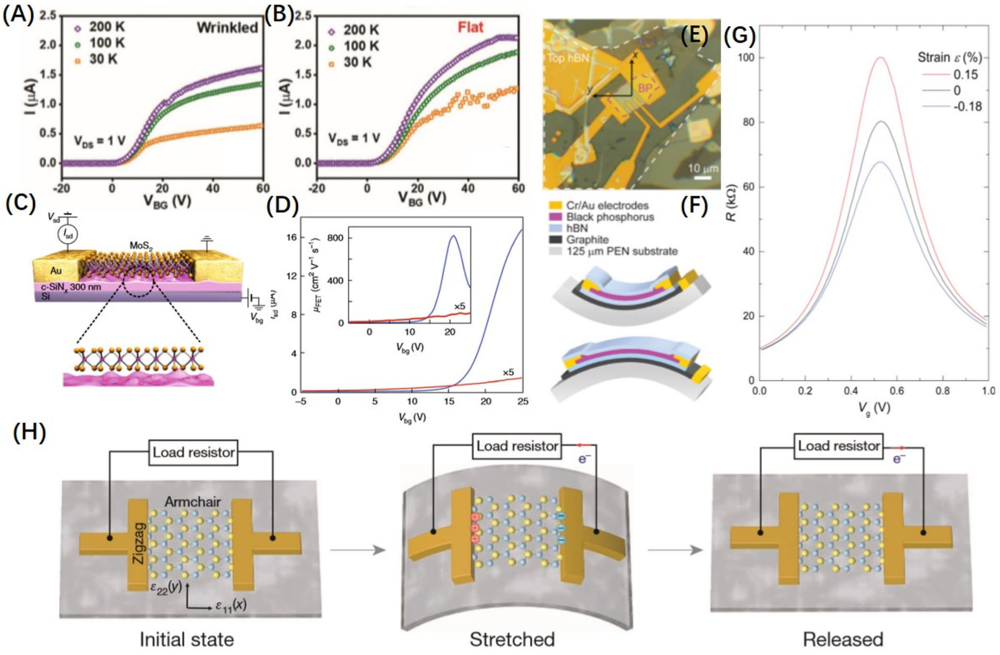 -> [[../figures/heterostructures-stacking-spintronics-strain|自旋电子学与应变工程]]
  - 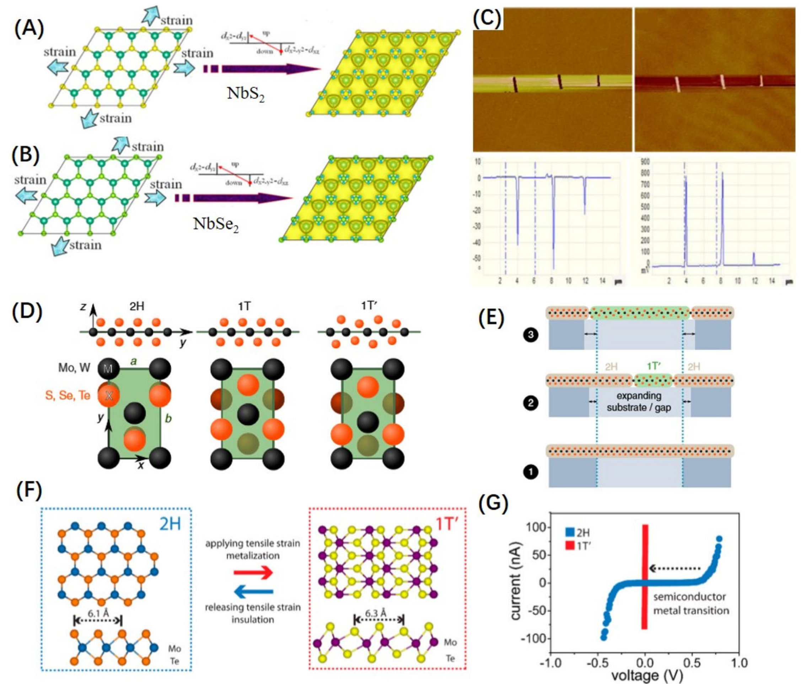 → [[../figures/heterostructures-stacking-spintronics-strain|自旋电子学与应变工程]]
  - 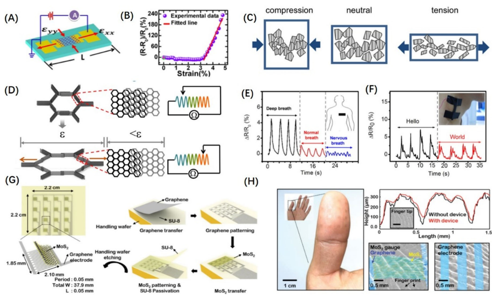 -> [[../figures/heterostructures-stacking-mechanics-misc|力学性质、剥离能与杂项]]
  - 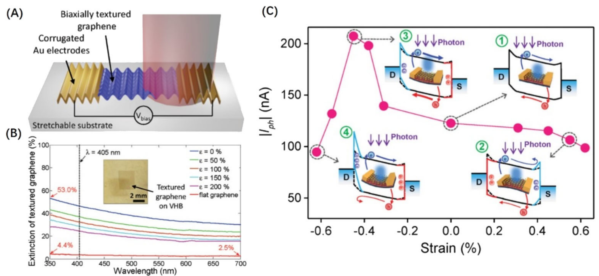 → [[../figures/heterostructures-stacking-spintronics-strain|自旋电子学与应变工程]]
  -  -> [[../figures/experimental-setups|实验测试与测量装置]]
  - 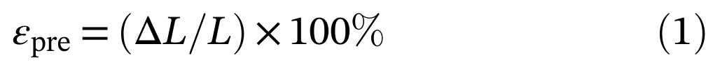 -> [[../figures/mathematical-models|数学模型与物理公式]]
  - 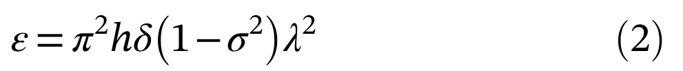 -> [[../figures/mathematical-models|数学模型与物理公式]]
  - 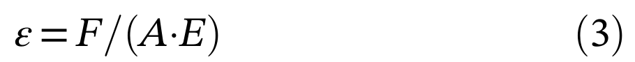 -> [[../figures/mathematical-models|数学模型与物理公式]]
  -  -> [[../figures/mathematical-models|数学模型与物理公式]]
  - 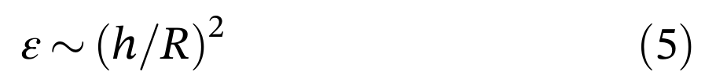 -> [[../figures/mathematical-models|数学模型与物理公式]]
  - 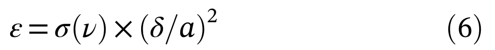 -> [[../figures/mathematical-models|数学模型与物理公式]]
  - 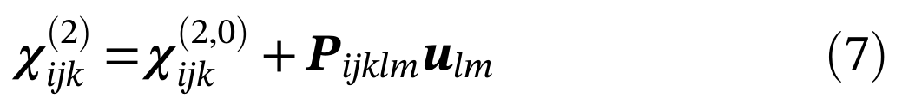 -> [[../figures/mathematical-models|数学模型与物理公式]]
  - 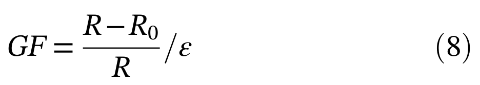 -> [[../figures/mathematical-models|数学模型与物理公式]]

## 🔬 项目连接
无直接项目连接。本文为二维材料应变工程综述，与 project-5（SnTe铁电模拟）在"应变调控铁电/极性二维材料（如α-In₂Se₃）"上有间接方法学关联；与 project-2（Mn多铁）在"应变诱导磁性、磁电耦合"主题上有概念邻近性，但均不构成直接项目连接。笔记虽归入"07_发光机理与陷阱物理 (ML Mechanisms)"分类，但正文并不涉及机械发光陷阱物理。

## 🔗 项目双链
- 项目 [[../projects/project-2-mn-multiferroics|项目二：Mn极化结构铁电材料]]
- 项目 [[../projects/project-5-snte-ferroelectric-sim|项目五：lammps势函数SnTe铁电模拟]]

## 📝 组织与用词
文章采用经典综述"总—分—总"结构，主干论证链为"二维材料原子级厚度→超强变形能力与应变敏感性→六种物理机制引入应变→应变改变晶格/电子结构→调控声子、能带、非线性光学、电学、磁学、相变→转化为柔性传感器与光电探测器性能→界面传递/理论-实验差距/集成稳定性三大瓶颈"。方法章按"应变来源（内禀晶格失配 vs 外加柔性/图案化/压电衬底 vs 局域AFM/气泡）"分类，并用Table 1把基底、材料/层数、应变范围、应变类型、参考文献浓缩成速查表；性质章按"微观声子→电子能带→非线性光学→宏观电学/磁学/结构相变"递进；应用章只聚焦两类最成熟器件（应变传感器、光电探测器），把压阻/压电/能带调控直接映射到GF和响应度等性能指标。值得在 wiki 叙述中复用的术语：
  - 应变工程 [[../concepts/strain-engineering|应变工程]]（strain engineering）
  - 柔性衬底 [[../concepts/flexible-substrates|柔性衬底]]/柔性基底（flexible substrate）
  - 褶皱与屈曲（wrinkle, buckling-induced delamination）
  - 晶格失配与莫尔花纹（lattice mismatch, moiré pattern）
  - 压阻效应与压电效应（piezoresistive effect, piezoelectric effect）
  - 漏斗效应（funnel effect / exciton funneling）
  - 二次/三次谐波产生（SHG/THG）与光弹张量（photoelastic tensor）
  - 应变诱导2H→1T'相变（strain-induced 2H-to-1T' phase transition）

## ✏️ 可写入 Wiki 的要点
  1. [[../concepts/2D-materials|二维材料]]相比块体对应变容忍度极高：单层[[../entitys/graphene|石墨烯]]可承受25%弹性应变，而块体石墨在~0.1%即断裂；原因是原子级厚度大幅降低缺陷概率，并允许面外屈曲弛豫应力。
  2. 六种应变引入方法及其应变特征：晶格失配（界面局域非均匀，WSe₂-MoS₂中ε_aa=1.17%, ε_bb=−0.26%, ε_ab=0.69%）；预拉伸PDMS褶皱（顶部局域1–2%非均匀应变，ε=π²hδ(1−σ²)/λ²）；热膨胀失配（MoS₂/PDMS激光加热得0.23%双轴均匀应变，PC衬底−200~100°C范围实现−1.48%~0.48%，传递效率>80%）；弯曲[[../concepts/flexible-substrates|柔性衬底]]（ε=τ/(2R)，单轴均匀、可逆、重复性好）；图案化刚性衬底（倒置漏斗Si阵列上MoS₂应变3.46–3.65%）；PMN-PT压电衬底（500V下三层MoS₂得0.2%双轴压缩应变，可电控）；AFM针尖（悬浮MoS₂膜中心挠度33 nm，TERS空间分辨率~2.3 nm）；气泡（MoS₂/h-BN界面自发气泡~2%梯度应变，ε∝(h/R)²）。
  3. 弯曲法应变传递效率依赖三条件：衬底高杨氏模量、界面强相互作用、最小滑移；PDMS等低模量衬底易滑移，PVA旋涂封装可显著抑制滑移并提高传递效率。
  4. 声子对应变的指纹响应：单轴拉伸使石墨烯G峰在>0.6%应变时分裂为G⁺/G⁻（E₂g简并解除），2D峰亦分裂；单层MoS₂的E'（面内）峰分裂而A'₁（面外）峰几乎不动，证明面内振动对应变更敏感；黑磷沿ZZ与AC方向的应变选择性移动A_g²/B₂g/A_g¹模式，可用于[[../concepts/migdal-eliashberg-theory|各向异性]]柔性器件。拉曼峰频移与应变线性相关，可定量并mapping应变分布。
  5. 能带调控定量数据：双层WSe₂在单轴拉伸下导带极小值从K点移至Σ点，发生间接→直接带隙转变，PL强度急剧增强；1%拉伸应变使单层MoS₂带隙减小45 meV、双层MoS₂减小120 meV；非均匀应变下激子向最大应变区漂移的"漏斗效应"使PL红移并局域增强。
  6. SHG是比PL更灵敏的应变探针：单层MoSe₂的SHG强度随拉伸应变更减，相对变化率0.49±0.05/ε，比PL峰强度变化高约一个数量级；偏振分辨SHG基于光弹张量Pᵢⱼₖₗₘ可重建全应变张量（空间分辨~280 nm），THG则可推广到中心对称材料（如双层WS₂）。
  7. 应变对载流子迁移率具有双面性：褶皱MoS₂ FET迁移率5.55 cm²/Vs约为平坦器件1.42的3倍（30 K），归因于拉伸应变抑制[[../concepts/electron-phonon-coupling|电子-声子耦合]]；粗糙c-SiNx衬底通过应变涨落降低MoS₂带隙与有效质量而提升迁移率；但单层SnSe迁移率在应变>8%时由10⁴骤降至300 cm²/Vs；3–6%应变可使单层BP的优选导电方向旋转90°。
  8. 压阻与压电机制对比：BP FET在+0.15%/−0.18%应变下电阻在电荷中性点附近发生巨大变化，机制为拉伸增大带隙、压缩减小带隙（压阻，被动、需外电）；单层奇数层MoS₂（1/3/5层）因破缺中心对称而具[[../concepts/piezoelectricity|压电效应]]，拉伸/释放时ZZ方向极化电荷驱动外电路电子往复流动并调制[[../concepts/schottky-barrier|肖特基势垒]]（主动、可自驱动），偶数层无响应。
  9. 应变可在非磁性材料中诱导[[../concepts/ferromagnetism|铁磁性]]：DFT显示双轴拉伸使NbS₂、NbSe₂产生自旋极化；褶皱ReSe₂的MFM图像观测到磁性信号；应变还可调控本征[[../concepts/vdw-magnets|范德华磁体]]的[[../concepts/curie-temperature|居里温度]]和磁耦合（理论多于实验，是公认瓶颈）。
  10. 应力驱动2H→1T'相变：AFM针尖加载MoTe₂可实现半导体2H相到金属1T'相转变，电导率变化达10⁴倍；该突变在相变存储和超灵敏应变传感器中具有应用潜力。
  11. 器件应用要点：基于压阻的石墨烯应变传感器GF可达151，片层滑移/重叠面积变化是高GF机制；柔性光探测器通过褶皱增大光吸收面积+压电光电子效应调控肖特基势垒促进光生载流子分离两条路径提升响应度。
  12. 领域三大瓶颈：界面应变传递效率低（范德华界面滑移、粘附/摩擦缺乏定量模型）；理论预测的应变幅值/磁性等效应在实验中难以完全实现；柔性器件电极脱落、长期弯折疲劳等集成稳定性问题，以及晶圆级均匀应变制造的可扩展性挑战。
