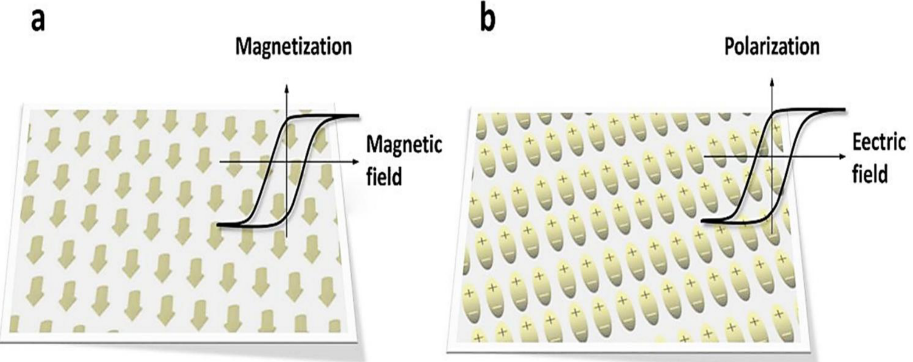
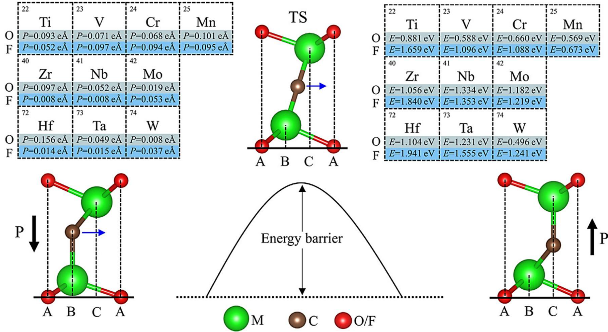
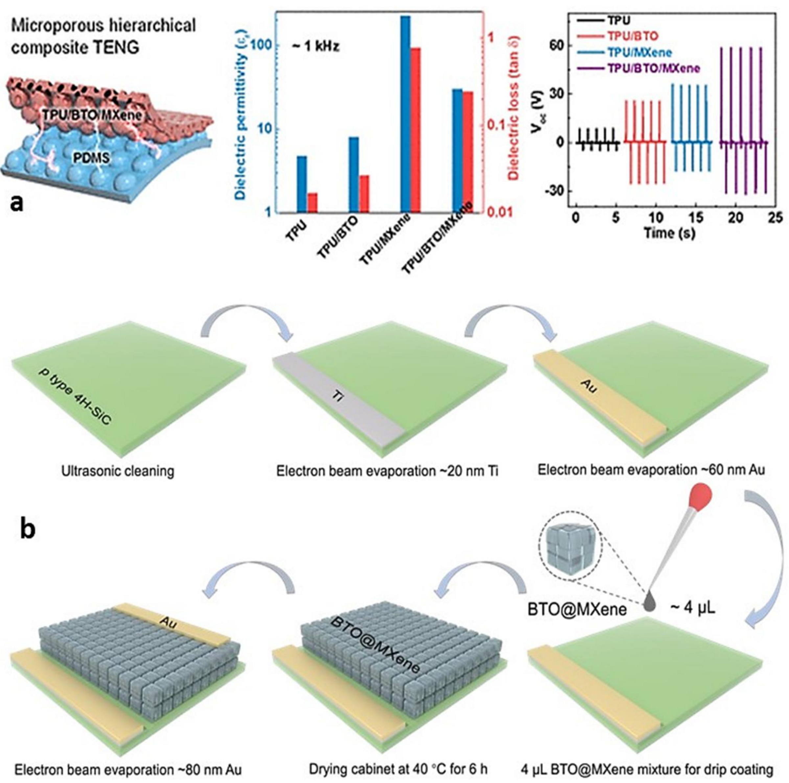
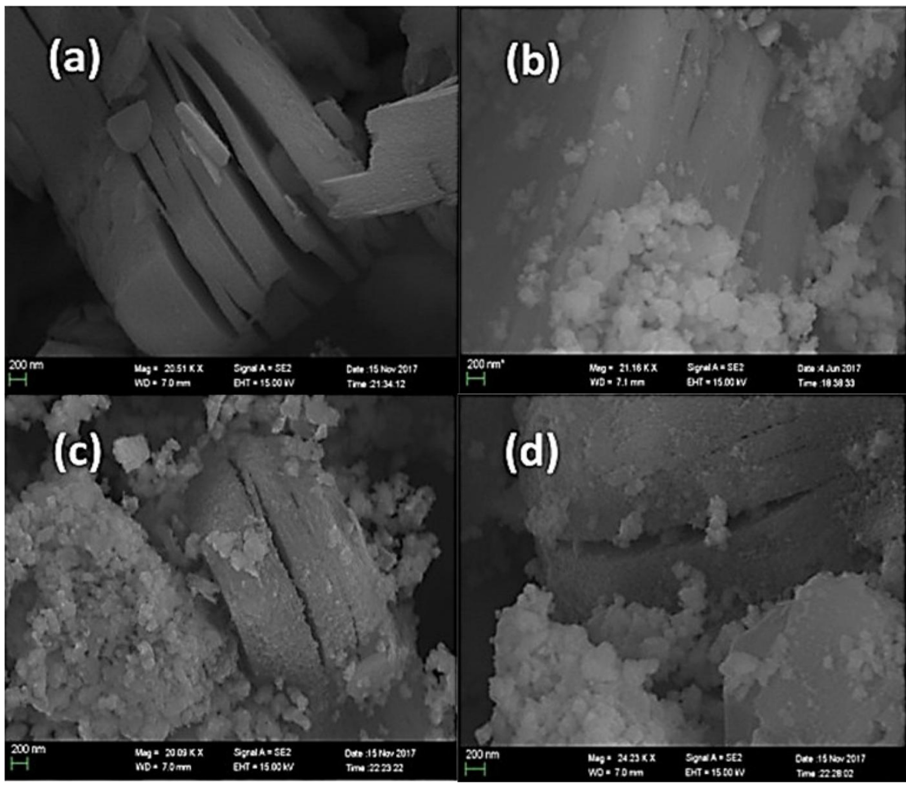
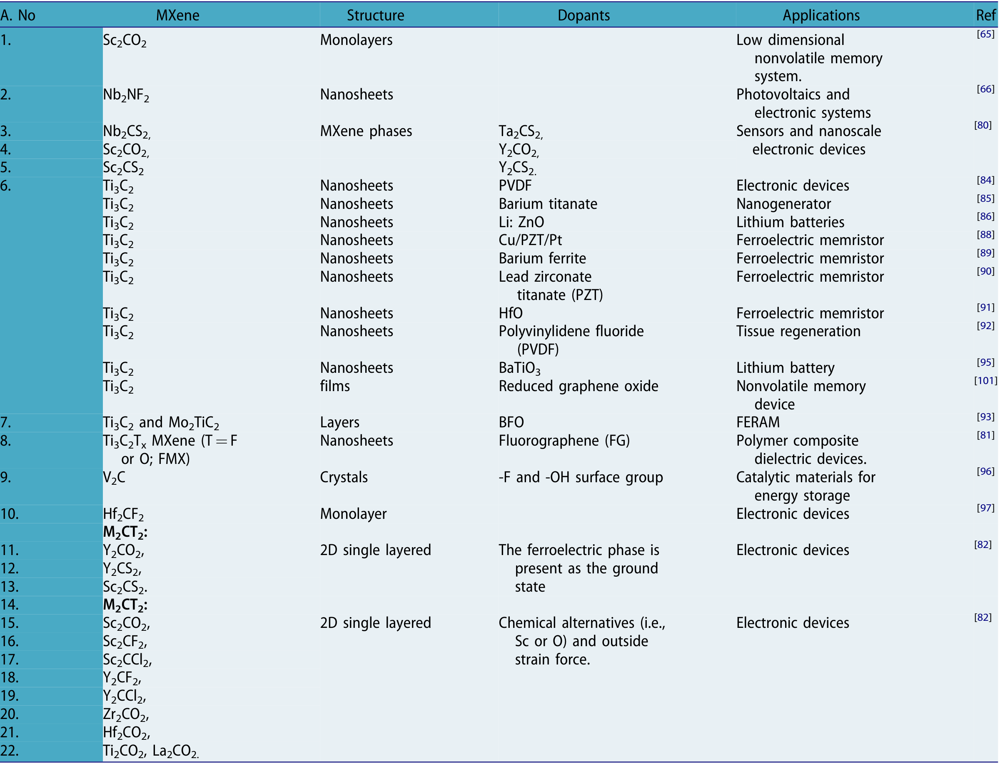
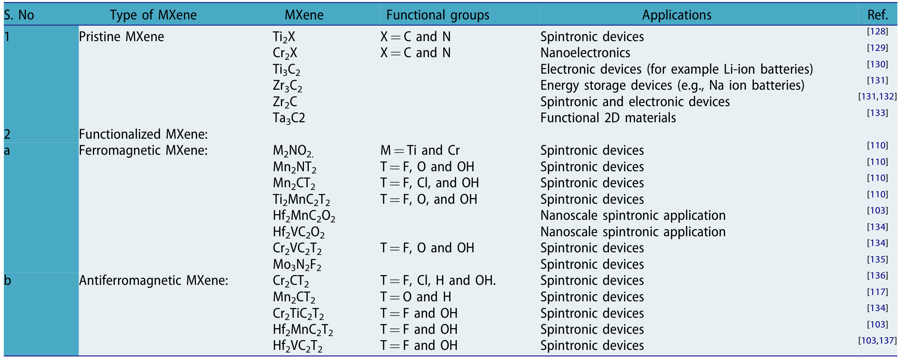

## zahraCriticalAnalysisFerroelectric2025 — 二维MXene铁电和铁磁性质的临界分析

## 📄 元数据
Saman Zahra, Bo Dai, Xianhua Wei, Fei Zhou, Syed Irfan et al.，2025，Critical Reviews in Solid State and Materials Sciences, 51(2), 200-226，DOI: 10.1080/10408436.2025.2511122
## 💡 一句话
首篇系统批判性综述二维 MXene（过渡金属碳/氮化物）中铁电、铁磁与多铁性的工作，归纳了从 MAX 相刻蚀、表面端基工程到掺杂/应变/复合诱导 FE/FM 的完整策略工具箱。
## 🔗 Wiki 双链
本文涉及且 wiki 中已存在的条目，用双链列出（存在才链）：
  - 概念 [[../concepts/2D-materials]]、[[../concepts/density-functional-theory]]、[[../concepts/multiferroicity]]、[[../concepts/magnetoelectric-coupling]]、[[../concepts/polarization-switching]]、[[../concepts/ferroelectric-tunnel-junction]]、[[../concepts/ferroelasticity]]、[[../concepts/strain-engineering]]、[[../concepts/spin-orbit-coupling]]、[[../concepts/topological-defects]]、[[../concepts/max-phase]]、[[../concepts/surface-terminations-tx]]、[[../concepts/janus-mxene]]、[[../concepts/ferroelectric-metal]]、[[../concepts/i-mxene]]、[[../concepts/sc2co2]]、[[../concepts/v2c-mxene]]、[[../entities/hf2vc2f2]]、[[../concepts/ti3c2tx]]、[[../concepts/piezoresponse-force-microscopy]]、[[../concepts/stoner-ferromagnetism]]、[[../entities/ferroelectric-memristor]]
  - 实体 [[../entities/MXenes]]、[[../entities/BiFeO3]]、[[../entities/In2Se3]]、[[../entities/TMDs]]、[[../entities/hf2vc2f2]]
  - 图表 [[../figures/crystal-structures]]、[[../figures/heterostructures-stacking]]、[[../figures/electronic-devices]]、[[../figures/experimental-setups]]
  - 年度 [[../write/2025]]
  - 主题 [[多铁性材料]]、[[材料模拟计算设计]]
  - 相关论文 [[../../raw/note/zahraCriticalAnalysisFerroelectric2025]]
## 📊 关键图表
  - 图1：MXene 应用示意图：
  - **图示描述**：以 MXene 为中心的辐射状示意图，外围分电学（电池、超级电容器）、磁学（电磁干扰屏蔽）、光学（光子学、激光器）、机械以及层状结构五大应用板块。
  - **关键特征**：全景式呈现 MXene 的多功能平台属性；强调其高导电、可调表面端基、高比表面积带来的跨领域应用潜力；为后文聚焦铁电/铁磁两大物性提供应用语境。
  - 图2：MAX 相结构、刻蚀分层流程及单/双过渡金属 MXene 分类：
  - **图示描述**：(a) 周期表中标出 M（早期过渡金属）、A（IIIA/IVA 族）、X（C/N）元素；(b) 从三维 MAX 相选择性刻蚀 A 层再经分层得到二维 MXene 纳米片；(c) 按 M 元素数量分为单过渡金属（如 Ti3C2）与双过渡金属（如 Mo2TiC2）MXene。
  - **关键特征**：M-X 为金属/离子/共价混合键，强于 M-A 金属键，故刻蚀仅断 M-A；已报道约 155 种 MAX 相、约 55 种 MXene；n=1 时 M 原子呈 ABAB 六方密堆，n=2、3 时呈 ABCABC 面心立方堆垛；通式 M_{n+1}X_nT_x 的来源一目了然。
  - 图3：铁电 P-E 回线与铁磁 M-H 回线对比，及 3D 铁电体死层/退极化场问题：
  - **图示描述**：(a) 铁电体在外电场 E 下偶极矩 P 翻转形成的 P-E 电滞回线，同时示意传统 3D 铁电薄膜的死层与退极化场；(b) 铁磁体在外磁场 H 下磁矩 M 翻转形成的 M-H 磁滞回线。
  - **关键特征**：两条回线均呈"翻转—滞后"特征，是 FE/FM 的身份证；铁电源于电荷有序，铁磁源于自旋有序；3D 铁电薄膜在减薄时受死层、退极化场、屏蔽场共同作用，面外极化难以稳定。
  - 图4：3D 铁电电容屏蔽场/死层效应 vs 2D In2Se3 无死层的稳定极化：
  - **图示描述**：(a) 3D 铁电电容中电极/界面处的屏蔽电荷产生 E_screen 屏蔽场，叠加退极化场削弱面外极化；(b) 以 In2Se3 为代表的 2D 范德华铁电体单层结构，无界面死层即可保持面内/面外极化。
  - **关键特征**：厚度越薄，死层对 3D 铁电体的压制越显著；范德华表面干净、无悬挂键，使 2D 铁电在纳米尺度仍稳定；该图是"为什么要在 2D MXene 中找铁电"的核心物理动机。
  - 图5：α-MXene 可调铁电性与极化翻转能量势垒：
  - **图示描述**：α 相（类 α-In2Se3 六方相）MXene（Nb2CF2、Mo2CO2、Ta2CF2、W2CF2、Mo2CF2）的原子结构及极化上/下两态，附表给出各材料极化值（eÅ）与极化翻转能量势垒（eV）。
  - **关键特征**：这一族 α-MXene 被 DFT 预测为罕见的"铁电金属"；势垒过低则极化易受热扰动丢失，过高则翻转电压过大，图中数值为筛选存储材料提供依据；基于此类材料的 FTJ 隧穿电阻比 TER 极高。
  - 图6：TPU/BTO/MXene 体系介电常数及 BTO/MXene/4H-SiC 异质结合成流程：
  - **图示描述**：(a) TPU、TPU/BTO、TPU/MXene、TPU/BTO/MXene 四种纳米复合材料的介电常数与介电损耗随频率曲线；(b) BTO 掺杂 MXene/4H-SiC 异质结紫外探测器的合成流程。
  - **关键特征**：TPU/BTO/MXene 三元体系介电常数最高，源于 BTO 铁电极化与 MXene 导电网络/微电容的协同；MXene 还可破坏 BTO 对称性、增强 BTO/4H-SiC 界面内建电场，通过铁电-热释电-光电子效应提升光敏性。
  - 图7：BT/f-Ti3C2Tx 复合材料合成流程、SEM 形貌与结构：
  - **图示描述**：(a–c) 在 Ti3C2Tx 纳米片上原位生长 BaTiO3 纳米颗粒的合成策略；(e–h) 从 Ti3AlC2 MAX 相→多层 Ti3C2Tx→少层 Ti3C2Tx→BT/f-Ti3C2Tx 复合物的 SEM 形貌演变；(k) BTO 借助表面亚稳态 Ti 原子在 MXene 上成核的原子示意图。
  - **关键特征**：MXene 表面的亚稳态 Ti 原子充当天然反应位点，无需额外添加剂即可实现 BTO 紧密成核；"原位生长"保证高质量界面，是后续锂电内建电场富集 Li+ 的结构基础。
  - 图8：V2C 的 PFM 蝴蝶曲线与相位回滞（铁电实验证据）：
  - **图示描述**：压电力显微镜（PFM）对三种不同刻蚀/还原条件 V2CTx（V2C-HF、V2C-OH、V2C-BH）测得的形貌、振幅、相位图，以及振幅-电压蝴蝶曲线和相位-电压回滞曲线。
  - **关键特征**：振幅蝴蝶曲线对应压电形变，相位曲线呈现 ~180° 翻转，是铁电极化可被电场可逆翻转的直接指纹；三种样品的翻转电场不同，证明刻蚀/还原条件（即端基）可直接调控 V2C 的铁电性能。
  - 图9：过渡金属在 Zr2CO2 的 Zr 位/C 位/O 位掺杂构型：
  - **图示描述**：DFT 建模给出 Cr 等过渡金属在 Zr2CO2 单层中的三种替位构型：(a) Zr 位替代、(c) C 位替代、(e) O 位替代，以及各自优化后的局域结构。
  - **关键特征**：比较三类位点的形成能可判断热力学最易实现的掺杂方式；结论是 Cr 替 Zr 位形成能最低、具铁磁基态与半金属性；该图是"计算筛选掺杂位点"策略的范例。
  - 图10：Cr2COOH 中两个不等价 Cr 的 3d 轨道分裂与磁矩（3 μB+2 μB=5 μB/单胞）：
  - **图示描述**：扭曲八面体晶体场下 Cr2COOH 中两个不等价 Cr 原子（Cr1、Cr2）的 3d 轨道能级分裂图，标出每个轨道的电子占据与对应磁矩。
  - **关键特征**：Cr1 为 3d³ 贡献 3 μB，Cr2 为 3d² 贡献 2 μB，每单胞总磁矩 5 μB；两 Cr 局域配位环境不同导致 d 轨道分裂方式不同，净磁矩非零→宏观铁磁性；材料为铁磁半导体。
  - 图11：Gd 掺杂 Ti3C2 MXene 的稳定铁磁 M-H 回滞回线：
  - **图示描述**：300 K（室温）与 100 K（低温）下 Gd³⁺/Ti3C2 复合物的磁化强度 M 随外加磁场 H 变化的磁滞回线。
  - **关键特征**：闭合"S"型曲线显示矫顽力与剩磁，是铁磁体指纹；300 K 仍保留清晰回线，表明实现室温铁磁性；机制为 Gd³⁺ 自由电子与费米能级处 Ti-3d 自旋密度的交换耦合，形成软铁磁复合。
  - 图12：Nb/Ti3C2 及 Lewis 熔盐刻蚀 Co 掺入 MXene 的"S"形 M-H 曲线：
  - **图示描述**：(a,b) Nb 掺杂 Ti3C2 的理论与实验 M-H 曲线；(c) Lewis 熔融盐刻蚀过程中 Co²⁺ 高温掺入碳氮化物 Ti3CNCl2 所得的"S"形 M-H 曲线。
  - **关键特征**：Nb 无需额外端基即可在 Ti3C2 中诱导铁磁；熔盐法实现无氟、无毒刻蚀并同步完成磁性元素掺杂；典型"S"形回线证实 Co 掺入后铁磁序稳定。
  - 图13：双过渡金属 Mo2TiC2Tx 的多铁性制备流程：
  - **图示描述**：Rabia Tahir 等从 Mo2TiAlC2 MAX 相出发，经刻蚀、分层得到 Mo2TiC2Tx 薄膜并测试其 FE/FM 共存的简单制备流程。
  - **关键特征**：这是室温下在双过渡金属 MXene 薄膜中实验观察到多铁性的代表工作；刻蚀工艺增强铁电性并同时诱导铁磁性；DTM 多铁材料在纳米器件中具潜力。
  - 图14：Gd 取代 BiFeO3（BFO）的 SEM 图像：
  - **图示描述**：Gd 掺杂 BiFeO3 纳米颗粒的扫描电子显微镜形貌图，展示颗粒尺寸、分布与团聚情况。
  - **关键特征**：Gd 取代改变 BFO 晶粒尺寸与形貌，是后续 BGFSO 共掺体系磁性增强的微观结构基础；与纯 BFO 对比可看出稀土掺杂对钙钛矿微结构的调制。
  - 图15：BGFSO（BiGdFeSnO）共掺杂 Ti3C2Tx 增强铁电与磁性：
  - **图示描述**：300 K 下 (a) BGFSO 纳米颗粒、(b) Ti3C2Tx/BGFSO 复合物的 M-H 磁滞回线对比。
  - **关键特征**：复合后饱和磁化与剩余磁化均增强，呈典型"S"形铁磁回线；Ti3C2Tx 与 BGFSO 界面的超交换作用是磁性增强来源；证明铁磁钙钛矿与 MXene 复合是室温磁电/多铁设计的有效路径。
  - 图16：Mo2Ti2C3Tx/激光还原石墨烯三层铁电忆阻器结构及 Roff/Ron≈10²、10³ 次循环耐久性：
  - **图示描述**：以 Mo2Ti2C3Tx MXene 为中间活性层、激光还原石墨烯为上下电极的三层铁电忆阻器结构，及其 I-V 开关曲线、电阻开关耐久性。
  - **关键特征**：存储窗口 R_off/R_on≈10²，循环耐久性达 10³ 次；MXene 铁电性使导电细丝形成可控；对比 Cu/PZT 体系，MXene 显著降低 Cu 离子迁移势垒（PZT 中约 4.43 eV）。
  - 图17：MXene 在锂离子电池中的应用及 BT/f-Ti3C2Tx 循环稳定性与内建电场富集 Li+：
  - **图示描述**：(a) MXene 用于锂离子电池示意；(b,c) BT/f-Ti3C2Tx 复合物的循环稳定性与倍率性能；(d) BTO 纳米颗粒极化内建电场吸引 Li+ 至 MXene 负极的机理示意。
  - **关键特征**：10 A g⁻¹ 下比容量达 84 mAh g⁻¹，约为本征 Ti3C2Tx 的 5 倍；BTO 同时抑制 MXene 片层堆叠与 Ti 原子还原；铁电极化内建电场加速 Li+ 传输并促进均匀 SEI 膜。
  - 图18：Li:ZnO/Ti3C2 压电纳米发电机（PENG）结构示意，输出性能提升约两倍：
  - **图示描述**：Li 掺杂 ZnO 纳米线与 Ti3C2 MXene 复合的 PENG 器件分层结构，以及其输出电压/电流相对于纯 Li:ZnO PENG 的对比。
  - **关键特征**：MXene 在极化过程中协助 Li:ZnO 纳米线有效极化；纳米线包覆阻止金属 Ti3C2 薄片聚集，提高电场均匀性；铁电性与输出功率整体提升约 2 倍。
  - 图19：Janus MXene（-O/-F/-OH 端基）的磁各向异性对比：
  - **图示描述**：不同端基（-O、-F、-OH）的 Janus MXene 原子结构与磁各向异性能（MAE）对比，区分面内 vs 面外各向异性。
  - **关键特征**：-O 端基 Janus MXene 磁各向异性较低；-F、-OH 端基倾向面内各向异性；TiCrCO2 在所有 Janus MXene 中铁磁性与交换常数最高；双过渡金属 W2CrN2O2、Mo2Cr2N2O2 表现强铁磁半金属性，是自旋电子学优选。
  - 表1：MXene 刻蚀方法汇总：
  - **图示描述**：系统列出湿法 HF 刻蚀、氟盐/强酸、NH4HF2、无氟熔盐、电化学刻蚀、CVD 等方法的试剂、条件、所得端基及优缺点。
  - **关键特征**：刻蚀方法直接决定端基 T_x（-O/-OH/-F/-Cl/-S/-Br/-NH2 等），是性能调控第一旋钮；HF 法成熟但有毒，熔盐/电化学/CVD 代表绿色、规模化方向。
  - 表2：MXene 基铁电复合材料与铁电忆阻器性能汇总：
  - **图示描述**：汇总 Cu/MXene/PZT、BFO/MXene、MXene-PZT、Mo2Ti2C3Tx/激光还原石墨烯等体系的器件结构、开关比、工作电压、耐久性等关键指标。
  - **关键特征**：MXene 引入普遍降低开关电压、提高开关比与耐久性；表中数据为横向比较 MXene 铁电忆阻器性能提供统一依据。
  - 表3：不同表面官能团类型及其应用汇总：
  - **图示描述**：列出 -O、-F、-OH、-Cl、-S、-Br、-NH2、N 端等官能团对应的电子结构、磁性/铁电倾向及典型应用（电池、TENG、催化、自旋电子等）。
  - **关键特征**：-O/-OH 为电子受体使 MXene 呈 p 型，-F 倾向电子给体；端基不对称是诱导铁电的关键；在 TENG 中 -NH2 端为摩擦正、N 端为摩擦负，开路电压可达 250 V。
## 🔬 项目连接
project-2 Mn多铁（弱相关：综述系统讨论 Mn₂C/Mn₂CO₂ 等 Mn 基 MXene 的反铁磁/铁磁基态，以及 Hf₂VC₂F₂、i-MXene 等 II 型多铁与磁电耦合机制，可为本项目提供二维多铁材料设计与磁电耦合判据的参考）；其余项目无直接连接。
## 🔗 项目双链
- 项目 [[../projects/project-2-mn-multiferroics|项目二：Mn极化结构铁电材料]]

## 📝 组织与用词
全文以"合成（MAX→MXene 刻蚀）→物性（FE / FM / 多铁三章，每章再分计算预测与实验验证）→器件应用（忆阻器/电池与纳米发电机/自旋电子）→总结展望"的递进逻辑组织，核心问题是"如何在原本中心对称、非磁性的 MXene 中诱导并稳定 FE/FM 序"。三大策略主线贯穿全篇：(i) 对称性破缺（端基不对称、Janus、应变、α 相）诱发铁电；(ii) 自旋极化调控（d 轨道填充、磁性元素掺杂、缺陷、扭转）诱发铁磁；(iii) 界面/复合（BTO、BFO、PZT、PVDF）引入并协同增强。每个物性章节都先 DFT 预测后 PFM/VSM/SQUID 实验验证，形成"理论筛选—实验闭环"范式。值得在 wiki 叙述中复用的关键词/术语：
  - MXene / 二维过渡金属碳氮化物
  - Surface terminations T_x / 表面端基
  - Symmetry breaking / 对称性破缺
  - Polarization reversal energy barrier / 极化翻转势垒
  - Stoner ferromagnetism / Stoner 铁磁性
  - Half-metallicity / 半金属性 [[../concepts/half-metallicity|半金属性]]
  - Type-I / Type-II multiferroics / I 型与 II 型多铁体
  - Magnetoelectric (ME) coupling / 磁电耦合
  - Ferroelectric tunnel junction (FTJ), tunneling electroresistance (TER) / 铁电隧道结与隧穿电阻比
  - Piezoresponse force microscopy (PFM), butterfly loop / 压电力显微镜与蝴蝶曲线
## ✏️ 可写入 Wiki 的要点
5-10 条 bullet，是可直接用于第二步充实 wiki 条目的具体事实、机制、数据、公式、结论
  - MXene 通式 M_{n+1}X_nT_x，由 [[../concepts/max-phase|MAX 相]] M_{n+1}AX_n 选择性刻蚀 A 层得到；M-X 为金属/离子/共价混合键，强于 M-A 金属键，因此刻蚀只断 M-A。已报道约 155 种 MAX 相、约 55 种 MXene。
  - 刻蚀工艺（HF、氟盐/强酸、NH₄HF₂、无氟熔盐、电化学、CVD）直接决定端基 T_x（-O/-OH/-F/-Cl/-S/-Br/-NH₂ 等），T_x 同时调控电子结构、亲疏水性、对称性与磁性，是性能调控的第一旋钮；无 T_x 的 M_{n+1}X_n 称 pristine MXene。
  - 多数 MXene 为中心对称结构，本征禁止自发极化；3D 铁电薄膜在减薄时存在"死层+[[../concepts/depolarization-field|退极化场]]+屏蔽场"使面外极化失稳，而 2D 范德华铁电（如 In₂Se₃）无死层，单层即可保持稳定极化，这是 MXene 铁电研究的物理动机。
  - 首个本征铁电 MXene 是 2017 年 Chandrasekaran 等预测的 Sc₂CO₂；随后 DFT 预测 Nb₂CS₂/Ta₂CS₂、Sc₂CS₂/Y₂CS₂、Y₂CO₂ 等也以铁电为基态；类 α-In₂Se₃ 六方相的 α-MXene（Nb₂CF₂、Mo₂CO₂、Ta₂CF₂、W₂CF₂、Mo₂CF₂）是罕见的"[[../concepts/ferroelectric-metal|铁电金属]]"，其[[../entitys/FTJ|铁电隧道结]] TER 极高，可用于铁电存储器。
  - 五层 M₂CT₂（M=Ti,Zr,Hf；T=O,F,OH）可同时存在面外(OOP)与面内(IP)极化，二者高阶耦合使外场下[[../concepts/polarization-switching|极化翻转]]更高效稳定；Hf₂CF₂ 在小应变下可由非极性半导体相转为[[../concepts/polar-metal|极性金属]]相。
  - 实验上，V₂CT_x 的 PFM 振幅蝴蝶曲线+180° 相位回滞是 MXene [[../concepts/ferroelectricity|铁电性]]的直接证据，且刻蚀/还原条件（V₂C-HF / V₂C-OH / V₂C-BH）可调控极化电场；对 Ti₃C₂ 薄膜进行热处理亦可使其由非铁电转为铁电（FE-MXene），并与 rGO 叠层实现非易失双极开关。
  - [[../concepts/ferromagnetism|铁磁性]]来源：早期过渡金属为 Cr/Mn 的 MXene 因 3d 半满常具本征磁矩；Mn₂C 反铁磁、Mn₂CO₂ 铁磁，Cr₂NO_x/CrCO₂/Fe₂C 为本征铁磁，Cr₂N 反铁磁但官能团化（F/H/OH/Cl）可改变其磁基态；氮化物 MXene（Cr₂NO₂、Ti₂NO₂、Mn₂NT_x）因 N 的额外电子而具本征磁性。
  - Cr₂COOH 为铁磁半导体，两不等价 Cr 分别为 3d³(3 μ_B) 与 3d²(2 μ_B)，每单胞总磁矩 5 μ_B；Cr 替位掺杂 Zr₂CO₂ 的 Zr 位[[../concepts/formation-energy|形成能]]最低、具铁磁基态与[[../concepts/half-metallicity|半金属性]]，可用于室温自旋电子学。
  - 非磁 Ti₃C₂T_x 诱导铁磁的途径：Gd³⁺ 掺杂（300 K 仍有清晰 M-H 回线，Gd 自由电子与 Ti-3d 在费米能级的自旋密度交换耦合形成软磁复合）、Nb 掺杂、La 掺杂（铁磁-反铁磁共存）、L-抗坏血酸化学还原使铁磁转变温度由 50 K 升至 150 K；V₂C 纳米片扭转可破坏层间对称、重排费米能级附近[[../concepts/density-of-states|态密度]]而增强 Stoner 铁磁性。
  - [[../concepts/multiferroicity|多铁性]]：i-MXene (Ta_{2/3}Fe_{1/3})₂CO₂ 为 I 型多铁且磁电效应高；[[../entitys/hf2vc2f2|Hf₂VC₂F₂ 单层]]为 II 型多铁（磁性直接源于铁电性、转变温度高）；Mo₂NCl₂ 因 Mo 离子电荷歧化诱导面外极化而具磁电性；Co₂CF₂ 天然同时具 FE/FM 与电控可逆磁性[[../concepts/skyrmion|斯格明子]]；Sc₂CO₂/Hf₂MnC₂O₂ 垂直异质结可实现非易失可切换半金属性。Rabia Tahir 等首次在室温 Ti₃C₂T_x 及[[../entitys/Mo2Ti2C3Tx|双过渡金属]] Mo₂TiC₂T_x 薄膜中实验观察到多铁性。
  - 器件：Cu/MXene/PZT [[../entitys/ferroelectric-memristor|铁电[[../concepts/memristor|忆阻器]]]]较纯 PZT 显著降低 Cu 离子迁移势垒（PZT 中约 4.43 eV），实现低开关电压、高开关比、低能耗；Mo₂Ti₂C₃T_x/激光还原[[../entitys/graphene|石墨烯]]三层忆阻器 R_off/R_on≈10²、耐久性达 10³ 次循环；BT/f-Ti₃C₂T_x 锂电负极在 10 A g⁻¹ 下容量 84 mAh g⁻¹（本征 Ti₃C₂T_x 的 5 倍），源于 BTO 极化内建电场富集 Li⁺；官能化 Ti₃C₂/PVDF 或 TENG 填料可同时调控铁电 β 相结晶度与摩擦电极性（-NH₂ 端为摩擦正、N 端为摩擦负，开路电压达 250 V）。
  - 批判性局限：多数"诱导"FE/FM 难以区分是 MXene 本体改性还是掺杂/复合次生相（如 Gd 团簇）；DFT 多用完美晶体/0K/均匀端基，与真实缺陷、混合端基、堆叠无序差距大；复合"协同增强"常未定量剥离导电网络、界面应变、[[../concepts/charge-transfer|电荷转移]]与轨道杂化各自贡献；综述所引多铁案例多为弱耦合 I 型，真正 II 型强[[../concepts/magnetoelectric-coupling|磁电耦合]]与器件级开关比/耐久性/保持时间的统一评价仍缺失。
