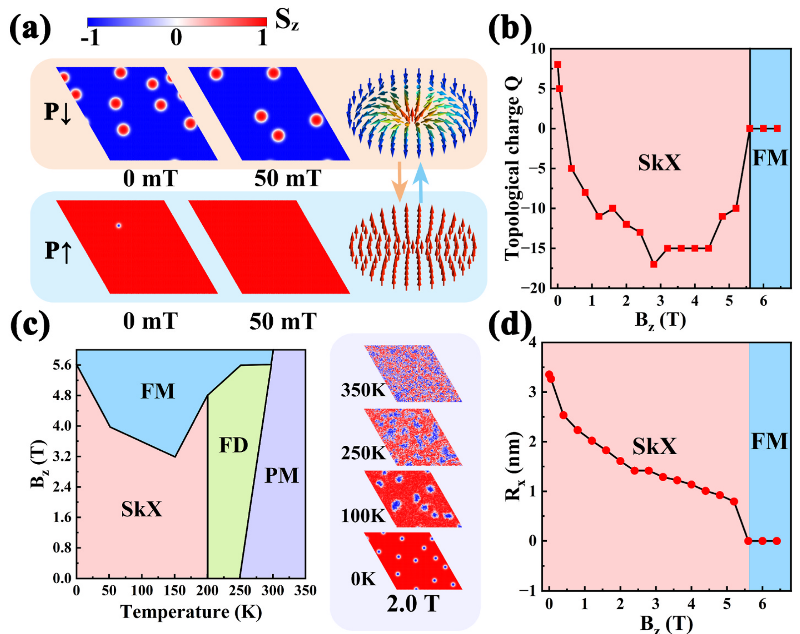
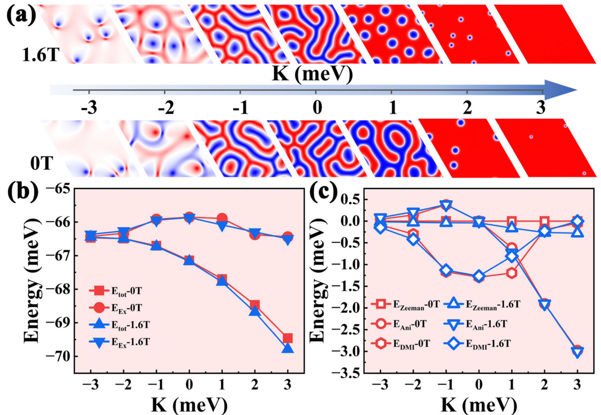
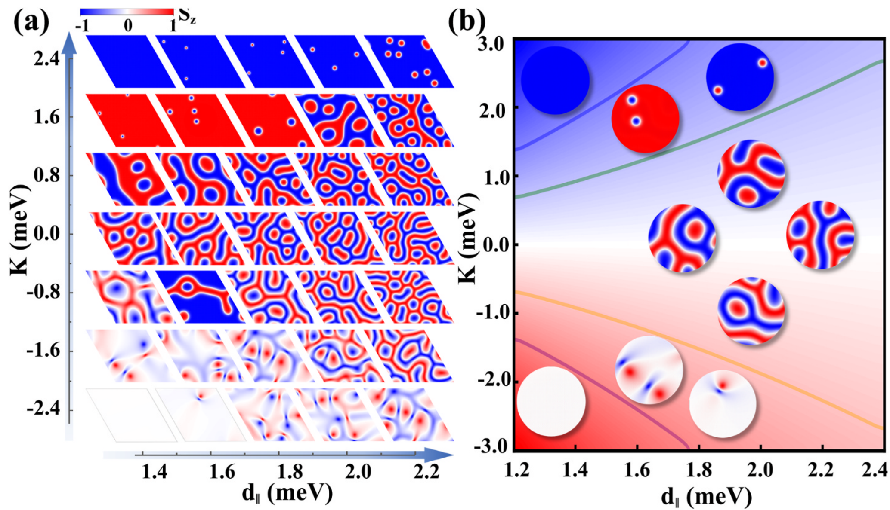
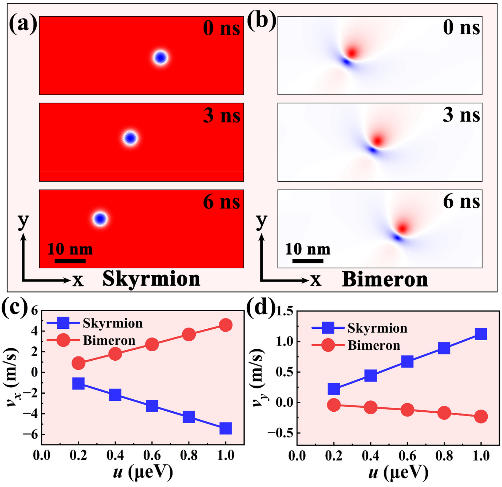

## zhangNonvolatileControlTopological2025 — 二维CrInTe2/In2Se3多铁异质结构拓扑磁性的非挥发控制

## 📄 元数据
Shuo Zhang, Yunfei Zhang, Dan Xing, Lixiu Guan, Junguang Tao et al.，2025，Materials Today Chemistry 49, 103049，DOI 10.1016/j.mtchem.2025.103049
## 💡 一句话
通过第一性原理计算加微磁学模拟证明，在 CrInTe2/In2Se3 二维多铁异质结中翻转 In2Se3 的铁电极化，可协同增强 DMI（+6%）并抑制 MAE（−20%），从而在仅 50 mT 辅助磁场下非易失性地实现铁磁态与 Néel 型斯格明子晶格之间的可逆切换，并提出无量纲稳定性判据 κ。

## 🔗 Wiki 双链
  - 概念 [[../concepts/multiferroicity]]、[[../concepts/magnetoelectric-coupling]]、[[../concepts/2D-materials]]、[[../concepts/spin-orbit-coupling]]、[[../concepts/polarization-switching]]、[[../concepts/topological-defects]]、[[../concepts/skyrmion]]、[[../concepts/bimeron]]、[[../concepts/dzyaloshinskii-moriya-interaction]]、[[../concepts/heisenberg-exchange]]、[[../concepts/magnetic-anisotropy-energy]]、[[../concepts/rashba-effect]]、[[../concepts/spin-transfer-torque]]、[[../concepts/skyrmion-hall-effect]]、[[../concepts/topological-charge]]、[[../concepts/llg-equation]]、[[../concepts/micromagnetic-simulation]]、[[../concepts/racetrack-memory]]、[[../concepts/superexchange]]
  - 实体 [[../entities/In2Se3]]、[[../entities/VASP]]、[[../entities/Fe3GeTe2]]、[[../entities/CrTe2]]、[[../entities/CrI3]]
  - 图表 [[../figures/crystal-structures]]、[[../figures/heterostructures-stacking]]、[[../figures/electronic-bands]]、[[../figures/domain-walls]]、[[../figures/mathematical-models]]、[[../figures/electronic-devices]]、[[../figures/heterostructures-stacking-spintronics-strain|自旋电子学与应变工程]]
  - 年度 [[../write/2025]]
  - 项目 [[../projects/project-2-mn-multiferroics]]、[[../projects/project-5-snte-ferroelectric-sim]]
  - 相关论文 [[../../raw/note/zhangNonvolatileControlTopological2025]]

## 🆕 新概念/实体建议
  - `skyrmion`（斯格明子）：受拓扑保护的纳米级涡旋状自旋织构，本文核心拓扑准粒子。
  - `bimeron`（双半子）：面内各向异性体系中拓扑荷为 ±1 的椭圆形自旋织构，可视为斯格明子的面内对应物，霍尔角显著更小。
  - `dzyaloshinskii-moriya-interaction`（DMI，Dzyaloshinskii-Moriya 相互作用）：反演对称破缺下由 SOC 诱导的反对称交换，E_DMI = −D_ij·(S_i×S_j)，是手性斯格明子成核的核心驱动力。
  - `magnetic-anisotropy-energy`（MAE，磁各向异性能）：决定易磁化方向的能量项；K > 0 稳定面外磁化（斯格明子），K < 0 稳定面内磁化（双半子）。
  - `heisenberg-exchange`（海森堡交换作用 J）：相邻自旋间的各向同性交换，倾向于共线排列。
  - `topological-charge`（拓扑荷 Q）：Q = (1/4π)∫m·(∂_x m × ∂_y m) dxdy，整数绕数，刻画拓扑保护。
  - `skyrmion-hall-effect`（斯格明子霍尔效应）：拓扑准粒子在电流驱动下因 Magnus 力产生横向漂移的现象；双半子因各向异性耗散张量霍尔角比斯格明子小约 80%。
  - `spin-transfer-torque`（自旋转移矩，STT）：自旋极化电流对局域磁矩施加的力矩，可驱动磁畴壁/斯格明子运动，u = jPħμ_B/(2eM_s)。
  - `rashba-effect`（Rashba 型 SOC）：界面结构反演不对称导致的自旋-轨道耦合，极化翻转可放大界面 Rashba SOC 从而调制 DMI。
  - `llg-equation`（Landau-Lifshitz-Gilbert 方程）：含阻尼、自旋转移矩和热场的磁化动力学方程，微磁学模拟基础。
  - `micromagnetic-simulation`（微磁学模拟）：介观尺度磁化动力学模拟方法，本文使用 Spirit 软件包。
  - `thiele-equation`（Thiele 方程）：G×v − αD·v + 4πB·j = 0，描述拓扑磁结构刚体运动轨迹。
  - `racetrack-memory`（赛道存储器）：以电流驱动磁畴壁/斯格明子沿纳米线运动来存储数据的非易失存储方案；双半子的低霍尔角对其尤其有利。
  - `CrInTe2`：二维铁磁金属，Te2–Cr–Te1–In 堆叠、C3v 对称、反演破缺，a = b = 4.04 Å，本征即具有较强 DMI。
  - `Spirit`：用于多尺度自旋动力学模拟的开源软件包，本文微磁学模拟工具。

## 📊 关键图表
  - 图1 CrInTe2/In2Se3 异质结晶格模型与 12 种堆叠构型（P↑/P↓，Se–In 与 Se–Te 两类界面，晶格失配仅 0.7%）：
     -> [[../figures/heterostructures-stacking-spintronics-strain|自旋电子学与应变工程]]
  - 图2 原子/轨道分辨的 MAE 与 DMI 贡献：Te 原子主导 MAE，Te2 主导 DMI；极化翻转使 Te1 对 DMI 的贡献由 −8.81 meV 反转为 +3.20 meV：
    
  - 图3 P↓ 态拓扑磁织构静态相图：50 mT 即可擦除 P↑ 态斯格明子，P↓ 态 SkX 可维持至 Bz = 5.2 T，200 K、4.4 T 下密度仍 >628 μm⁻²：
     -> [[../figures/crystal-structures|晶体结构与原子排布]]
  - 图4 K 值对拓扑相及各能量项（E_Ani、E_DMI、E_Ex、E_Zeeman）的调控：K > 2.0 meV/Cr 稳定孤立斯格明子，K < −2.0 meV/Cr 稳定双半子：
     -> [[../figures/heterostructures-stacking-polar-cdw|极性金属、拓扑相、CDW 与相变]]
  - 图5 d∥–K 全局相图与无量纲判据 κ：|κ| < 5 为斯格明子-迷宫混合相，5 < |κ| < 10 为孤立斯格明子/双半子窗口：
     -> [[../figures/crystal-structures|晶体结构与原子排布]]
  - 图6 电流驱动动力学：u = 0.6 μeV（j ≈ 4.14×10⁹ A/m²）下，斯格明子霍尔角 11.68°（v_x = 3.25, v_y = 0.67 m/s），双半子仅 2.44°（v_x = 2.71, v_y = 0.12 m/s）：
     -> [[../figures/heterostructures-stacking-multiferroic|多铁与磁电异质结]]
  - 表1 两种极化态下磁学参数对比（J、K、d∥ 随极化翻转的变化）：
     -> [[../figures/mathematical-models|数学模型与物理公式]]
  - 关键方程（LLG 方程、自旋转移矩强度 u、拓扑荷 Q、自旋哈密顿量、Thiele 方程）：
     -> [[../figures/mathematical-models|数学模型与物理公式]]
     -> [[../figures/mathematical-models|数学模型与物理公式]]
     -> [[../figures/mathematical-models|数学模型与物理公式]]
     -> [[../figures/mathematical-models|数学模型与物理公式]]

## 🔬 项目连接
  - **project-2（Mn 多铁）— strong**：本文是二维多铁异质结磁电耦合的代表性理论工作，其核心机制——铁电极化翻转通过界面电荷转移与轨道杂化协同调制磁相互作用参数（DMI、MAE、J）——与 Mn 基多铁中磁电耦合的物理图像高度可类比。可复用要点：(1) 原子-轨道分辨的 SOC 能量分解方法（ΔE_SOC-MAE、ΔE_SOC-DMI）用于定位磁电耦合的微观来源；(2) GGA+U 下提取 J、DMI（顺/逆时针自旋螺旋能量对比）、MAE 的计算流程；(3) 界面 Se→In 电荷转移改变 Te p 轨道杂化从而调控磁性的因果链，可类比到 Mn 基多铁中通过阴离子 p 轨道介导的超交换/磁电耦合；(4) Goodenough–Kanamori–Anderson 规则下键角变化（θ1、θ2 偏离 90°）削弱 Cr–Te–Cr 超交换的分析范式。
  - **project-5（SnTe 铁电模拟）— medium**：本文展示的铁电极化翻转、界面电荷重排、Rashba SOC 放大以及 DFT+微磁学多尺度流程，对 SnTe 铁电模拟具有方法学和物理图像参考价值。可复用要点：(1) 二维铁电体 P↑/P↓ 双稳态建模与差分电荷密度分析流程（VASP、450 eV 截断、真空层 30 Å、共轭梯度弛豫至 0.001 eV/Å）；(2) 铁电极化作为非易失"开关"调制邻近层物性的异质结设计思路，可类比 SnTe 拓扑铁电与其他层状材料的界面耦合；(3) κ 判据将多参数竞争压缩为单一无量纲量的思路，对铁电相变/畴稳定性判据构建有启发；(4) In2Se3 与 CrInTe2 晶格失配仅 0.7% 的共格界面筛选标准，可迁移至 SnTe 异质结界面设计。
  - 其他项目（project-1 双光子、project-3 机械发光 NN、project-4 TTF 分子计算、project-6 湿度传感器、project-7 CDW）：无直接项目连接。

## 🔗 项目双链
- 项目 [[../projects/project-2-mn-multiferroics|项目二：Mn极化结构铁电材料]]
- 项目 [[../projects/project-5-snte-ferroelectric-sim|项目五：lammps势函数SnTe铁电模拟]]

## 📝 组织与用词
  - 文章按"材料设计 → 微观机制（DFT）→ 宏观性能（微磁学）→ 普适原理（κ 判据）→ 器件动力学"的递进链条组织，每一步都用具体数值（J、K、d∥、Q、R_x、霍尔角）闭环支撑结论。图1 建立结构模型，图2 做微观溯源，图3-5 构建静态相图，图6 转入动力学，逻辑严密。
  - 值得复用的关键词/术语（中英对照）：
    1. 拓扑自旋织构（topological spin texture）
    2. 非易失性电控（nonvolatile electrical control）
    3. 磁电耦合 / 铁电局域场效应（magnetoelectric coupling / ferroelectric local-field effect）
    4. 界面电荷转移与轨道重整化（interfacial charge transfer / orbital renormalization）
    5. 协同调制（synergistic modulation；DMI↑ 与 MAE↓ 的一增一减）
    6. 斯格明子晶格（skyrmion crystal, SkX）/ 涨落无序相（fluctuating disorder, FD）
    7. 无量纲稳定性判据（dimensionless stability parameter κ）
    8. 斯格明子霍尔角 / 各向异性耗散张量（skyrmion Hall angle / anisotropic dissipative tensor）

## ✏️ 可写入 Wiki 的要点
  1. **体系与晶格**：单层 CrInTe2 为 Te2–Cr–Te1–In 堆叠的三角晶格（C3v、反演破缺），a = b = 4.04 Å；α-In2Se3 为 Se–In–Se–In–Se 五重层、面外铁电，a = b = 4.07 Å；异质结晶格失配 0.7%。P↓-AC1（Se–In 界面）为 12 种堆叠中能量最低构型，比对应 P↑-AC1 低 140 meV/单胞。
  2. **计算设置**：VASP + PAW + PBE(GGA)，Cr 3d 取 U_eff = 3.0 eV，截断 450 eV，能量/力收敛 1×10⁻⁸ eV 与 0.001 eV/Å，真空层 30 Å，11×11×1 MP 网格，计入 SOC；微磁学用 Spirit 求解含 STT 与热场的 LLG 方程，α = 0.1，150×150×1 超胞。
  3. **磁参数随极化的变化**：J 由本征 12.60 meV 降至 P↑ 的 11.69 meV 再降至 P↓ 的 9.85 meV（P↑→P↓ 再降 16%）；d∥ 由 1.87 meV（P↑）增至 1.98 meV（P↓），+6%，超过其他 Cr 基 vdW 磁体；K 由本征 0.73 meV/Cr 提升至异质结的 1.96–2.44 meV/Cr（+63–70%），其中 P↓ 为 1.96、P↑ 为 2.44 meV/Cr——即[[../concepts/polarization-switching|极化翻转]]使 DMI 增强 6%、MAE 抑制约 20%。
  4. **微观机制**：差分[[../concepts/charge-density|电荷密度]]显示 P↓ 态 Se→In [[../concepts/charge-transfer|电荷转移]]强于 P↑，界面 Rashba 型 SOC 放大；Te 原子主导 MAE（P↑ 时 ΔE_SOC-MAE = 4.47 meV、P↓ 时 4.03 meV，本征仅 1.22 meV），Te2 主导 DMI；极化翻转使 Te1 对 DMI 的原子分辨 SOC 贡献由 −8.81 meV 反转为 +3.20 meV，是 DMI 净增强的直接来源。Te2 的 p_x–p_y 杂化对 MAE 负贡献、p_z–p_x/p_y 杂化正贡献，极化翻转使 p_x–p_y 负贡献更负。
  5. **键角与[[../concepts/superexchange|超交换]]**：θ1 在 P↑/P↓ 下为 90.15°/90.64°，θ2 为 94.25°/94.32°（本征 90.03°、94.12°），偏离 90° 削弱 Cr–Te–Cr 超交换路径，导致 J 下降，符合 GKA 规则。
  6. **静态拓扑相图**：0 K 下 P↑ 态在 50 mT 时 SkX 坍塌为 FM；P↓ 态 SkX 可维持至 Bz = 5.2 T，|Q| 在 Bz ≈ 2.8 T 达到峰值 17，5.6 T 完全进入 FM；[[../concepts/skyrmion|斯格明子]]半径 R_x 由 0 T 的 6.15 nm 压缩至 5.2 T 的 2.86 nm。温度上 P↓ 态 SkX 在 200 K、4.4 T 下密度仍 >628 μm⁻²，优于 CrSeI/In2Te3；200 K 以上转入 FD，再升温进入 PM。
  7. **κ 判据**：κ = (π/4)²·2JK/(3d∥²)（AI 解读中写作 (π²/4)·2JK/(3d∥²)，原式以 (π/4)² 给出）量化共线能量（J、K）与非共线能量（d∥）的竞争。|κ| < 5 → 斯格明子-迷宫混合（SLM）相；5 < |κ| < 10 → 孤立斯格明子/[[../concepts/bimeron|双半子]]稳定窗口；|κ| 更大 → FM 相。该判据可作为筛选二维 vdW 多铁异质结的"配方"。
  8. **K 调相**：Bz = 0 T 下 K > 2.0 meV/Cr 抑制迷宫畴、稳定半径约 5.8 nm 的孤立 Néel 斯格明子；K < −2.0 meV/Cr 且 |K| > 2 meV/Cr 时出现双半子。E_Ex 在 K = 0 最大、随 |K| 增大而减小，E_DMI 趋势相反，二者竞争决定总能量抛物线下降。
  9. **电流驱动动力学**：u = 0.6 μeV（对应 j = 4.14×10⁹ A/m²）下斯格明子 v_x = 3.25 m/s、v_y = 0.67 m/s，霍尔角 11.68°；双半子 v_x = 2.71 m/s、v_y = 0.12 m/s，霍尔角 2.44°（小约 80%）。物理根源是斯格明子耗散张量各向同性（d_xx = d_yy = d，tan θ = G/(αd)），双半子耗散张量[[../concepts/migdal-eliashberg-theory|各向异性]]（d_xx ≠ d_yy，tan θ = G/(αd_xx)），故横向漂移被抑制；v_x 斯格明子约为双半子 1.2 倍，v_y 差异可达 5.5 倍。
  10. **器件意义与局限**：该异质结把"电场可调拓扑 + 电流驱动动力学"集成于同一材料平台，双半子适合密集存储阵列、斯格明子横向运动可用于逻辑分流，对应赛道存储器/[[../concepts/neuromorphic-computing|神经形态计算]]；但工作温度 200 K 仍低于室温，且理论预测尚待机械剥离+vdW 组装实验以及 MOKE/LTEM 等磁成像验证，GGA+U 中 U 值敏感性、长程 DMI、结构弛豫与纯电子效应的拆分等是可进一步检验的点。
