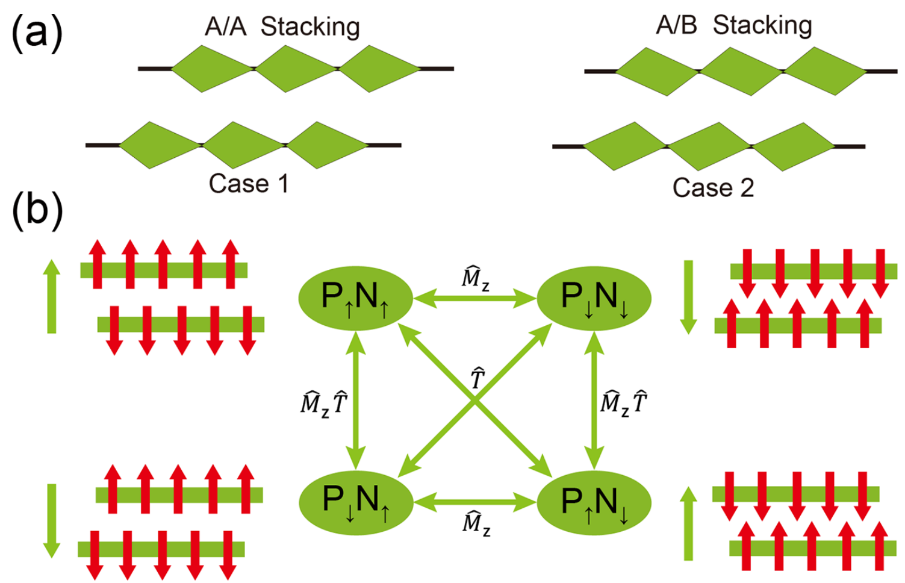
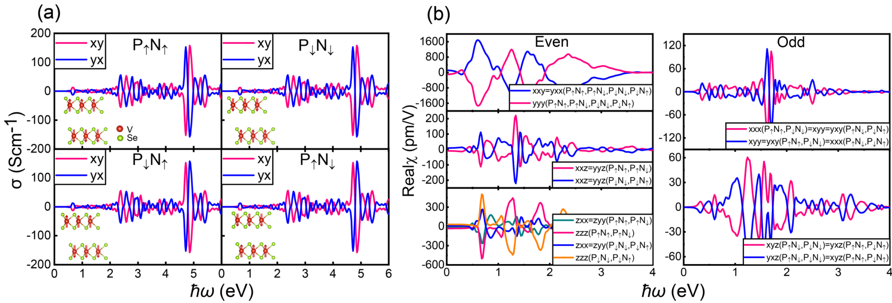
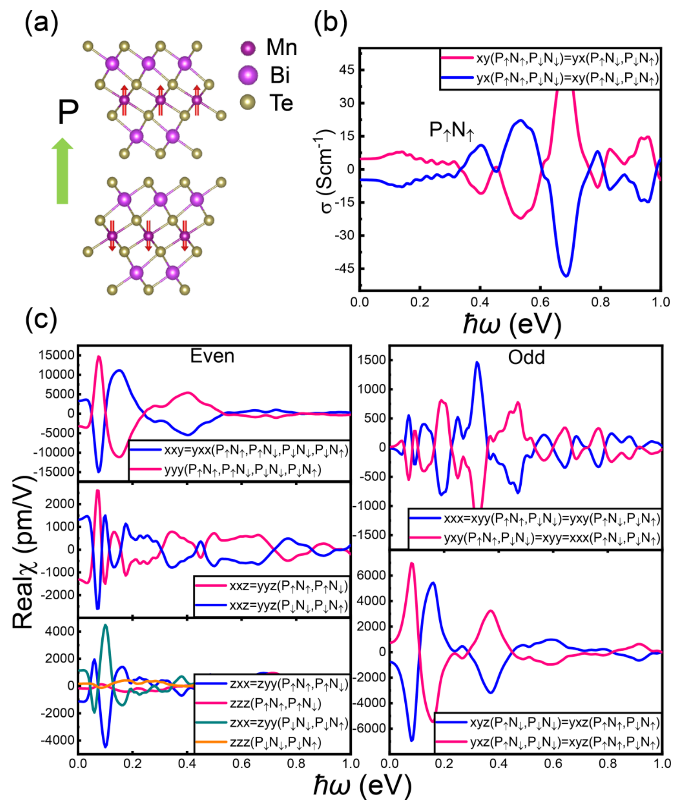
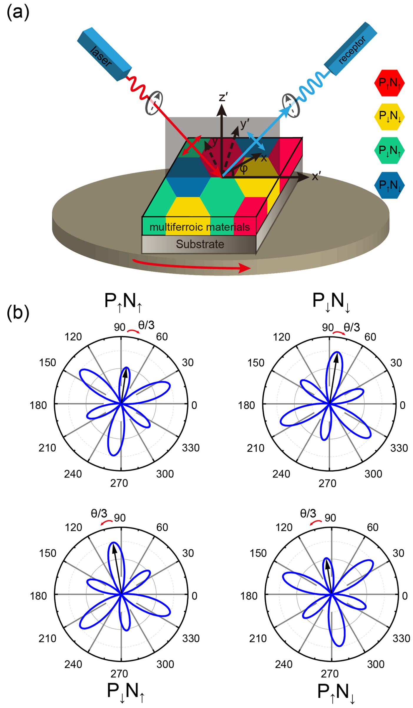

## zhaoOpticalFingerprintsTwodimensional2024 — 二维层间滑移多铁材料的光学指纹

## 📄 元数据
Hong-Miao Zhao, Hang Zhou, Wei Gan, Hui Han, Hui Li, Rui-Chun Xiao et al.，2024，Physical Review B 110, 125413，DOI 10.1103/PhysRevB.110.125413
## 💡 一句话
通过对称性分析与 DFT 计算证明，二维层间滑移多铁材料的四个多铁态（P↑N↑/P↑N↓/P↓N↓/P↓N↑）在克尔效应（反常光电导 σ^A_xy）和 SHG 张量上具有严格可区分的"光学指纹"，斜入射 PPP 偏振分辨 SHG 的"六瓣花"图案可无损识别全部四个态。
## 🔗 Wiki 双链
  - 概念 [[../concepts/sliding-ferroelectricity]]、[[../concepts/multiferroicity]]、[[../concepts/magnetoelectric-coupling]]、[[../concepts/2D-materials]]、[[../concepts/spin-orbit-coupling]]、[[../concepts/symmetry-analysis|对称性分析]]、[[../concepts/optical-kerr-effect|磁光克尔效应]]、[[../concepts/second-harmonic-generation|二次谐波产生]]、[[../concepts/neel-vector|奈尔矢量]]、[[../concepts/anomalous-hall-effect|反常霍尔效应]]、[[../concepts/magnetic-point-group|磁点群]]、[[../concepts/d0-rule|d⁰规则]]
  - 实体 [[../entities/VASP]]、[[../entities/Wannier90]]、[[../entities/Fe3GeTe2]]、[[../entities/VSe2]]、[[../entities/MnBi2Te4]]、[[../entities/WRFP]]
  - 图表 [[../figures/crystal-structures]]、[[../figures/optical-spectra]]、[[../figures/mathematical-models]]、[[../figures/heterostructures-stacking-domains-devices|铁弹畴、畴壁、In₂Se₃ 与器件应用]]
  - 年度 [[../write/2024]]
  - 项目 [[../projects/project-2-mn-multiferroics]]、[[../projects/project-5-snte-ferroelectric-sim]]
  - 相关论文 [[../../raw/note/zhaoOpticalFingerprintsTwodimensional2024]]
## 📊 关键图表
  -  → [[../figures/heterostructures-stacking-domains-devices|铁弹畴、畴壁、In₂Se₃ 与器件应用]]
  -  → [[../figures/heterostructures-stacking-domains-devices|铁弹畴、畴壁、In₂Se₃ 与器件应用]]
  - 
  - 
## 🔬 项目连接
  - **project-2（Mn 多铁）— strong**：MnBi₂Te₄ 是本文两大算例之一，属 Mn 基层间滑移多铁体系；其磁电耦合机制（滑移产生面外极化→层间库仑势差→AFM 背景下诱导弱未补偿磁矩）、层极化反常霍尔效应、以及磁点群 3m′ 下的 SHG/Kerr 张量约束，均可直接为 Mn 基多铁材料的磁电耦合物理与光学表征提供参考。
  - **project-5（SnTe 铁电模拟）— medium**：方法学可复用——VASP+GGA-PBE+SOC+U、WANNIER90 构造 MLWF、自研响应函数包计算 SHG/Kerr 的流程，以及"铁电正负态由何种对称性联结决定 SHG 能否区分 P↑/P↓"的对称性判据（传统多铁由 P̂ 联结故 SHG 强度不可区分；滑移铁电由 M̂_z 联结故部分张量不变号、斜入射 SHG 可区分），对 SnTe 铁电翻转的光学/电学表征 design 有类比价值。
  - 其余项目无直接连接。
## 📝 组织与用词
文章按"问题→抽象双层模型→对称性推导（Table I）→DFT 验证（VSe₂、MnBi₂Te₄）→斜入射 SHG 探测方案"的总-分-总结构展开；核心论证策略是先用群论给出与材料无关的变换规则表，再用两个算例定量验证，最后落到可操作的实验几何。值得复用的术语：
  - [[../concepts/sliding-ferroelectricity|interlayer-sliding ferroelectricity / 层间滑移铁电性]]
  - Néel vector / 奈尔矢量 N = M_top − M_bottom
  - anomalous photoconductivity σ^A_xy / 反常光电导
  - T̂-even (i-type) vs T̂-odd (c-type) SHG / 时间反演偶(i 型)与奇(c 型)二次谐波分量
  - [[../concepts/magnetic-point-group|magnetic point group 3m′ / 磁点群 3m′]]（偶分量等价于 3m，奇分量等价于 32）
  - oblique-incidence polarization-resolved SHG / 斜入射偏振分辨二次谐波
  - electrical-writing-optical-reading / 电写-光读
  - abstract bilayer model (Case 1: A/A; Case 2: A/B with B=Ĉ_2z A) / 抽象双层模型
## ✏️ 可写入 Wiki 的要点
  1. 二维层间滑移多铁材料可由两个非铁电单层铁磁材料经特定堆叠+滑移构成；Case 1 单层无 P̂ 但有 M̂_z（如 VSe₂、VS₂、Fe₃GeTe₂），用 A/A 堆叠；Case 2 单层有 P̂ 但无 M̂_z（如 FeCl₂、MnBi₂Te₄、CrI₃、Cr₂Ge₂Te₆、MnSe），用 A/B 堆叠（B = Ĉ_2z A）。
  2. 四个多铁态 P↑N↑、P↑N↓、P↓N↓、P↓N↑ 由 M̂_z（同时翻转 P 与 N）、T̂（只翻转 N）、M̂_z T̂（只翻转 P）联结：M̂_z P↑N↑ = P↓N↓；T̂ P↑N↑ = P↑N↓；M̂_z T̂ P↑N↑ = P↓N↑。
  3. 反常光电导 σ^A_xy 在 M̂_z 下不变，在 T̂ 与 M̂_z T̂ 下变号；因此 Kerr 信号只能区分奈尔矢量方向（两种），不能单独区分极化方向，但可通过电场/磁场调控实现"电写-光读"。
  4. SHG 张量元须分解为 T̂-偶（χ^even，i 型）与 T̂-奇（χ^odd，c 型）分量；M̂_z 使面内 χ^even_ijk 不变，但翻转面外 χ_zzz 与混合（含一个 z）分量；由此四态在面内/面外/混合 SHG 的偶奇分量上各有固定符号（Table I）。
  5. 双层 VSe₂ 与双层 MnBi₂Te₄ 的磁点群均为 3m′，尽管单层磁点群不同；χ^even 非零分量为 χ_zzz、χ_xxz(=χ_xzx=χ_yyz=χ_yzy)、χ_zxx(=χ_zyy)、χ_yyy(=−χ_xxy=−χ_xyx=−χ_yxx)；χ^odd 满足 χ_xxx=−χ_xyy=−χ_yxy=−χ_yyx 与 χ_xyz=χ_xzy=−χ_yxz=−χ_yzx。
  6. 计算参数：VASP、GGA-PBE、SOC；VSe₂ 中 V 的 U_eff=1.2 eV，MnBi₂Te₄ 中 Mn 的 U_eff=4.0 eV；WANNIER90 构造 MLWF，自研 WRFP 计算光学系数；对称性用 FINDSYM 与 Bilbao Crystallographic Server 分析。
  7. 双层 VSe₂ 的偶面内 SHG 系数约为单层的两倍，而 T̂-奇分量显著小于单层；MnBi₂Te₄ 低频区 SHG 系数异常大，作者推测与其拓扑性质有关。
  8. 斜入射 SHG（PPP 或 PSS 配置）让面内、混合、面外张量元同时参与干涉；PPP 信号 E_PPP(2ω) ∝ χ^odd_xxx cos(3φ) + χ^even_yyy sin(3φ) + 2χ^even_xxz + χ^even_zxx + χ^even_zzz，呈现 Ĉ₃ 对称的"六瓣花"图案；花瓣不均匀且相对 x/y 轴有错位角，该错位角由偶/奇系数的相对大小与相位决定，四态图案互不相同。
  9. 关键对照：传统多铁材料的 P↑/P↓ 由 P̂ 联结，P̂ 使所有 SHG 张量元变号而光强（平方）不变，故斜入射 SHG 无法区分正负铁电态；层间滑移多铁的 P↑/P↓ 由 M̂_z 联结，M̂_z 只翻转部分张量元，使干涉图案随极化翻转而改变——这是滑移铁电体可被 SHG 光学读取的根本对称性原因。
  10. 铁电极化在上下层磁性原子间造成库仑势差，在 AFM 构型下诱导出弱但未补偿的磁矩，从而产生 Kerr 效应（类似实验上在双层 AFM MnBi₂Te₄ 中观察到的反常霍尔/layer Hall 效应）；预期 VS₂、Fe₃GeTe₂、FeCl₂、CrI₃、Cr₂Ge₂Te₆、MnSe 等滑移铁电体系亦有类似光学指纹。
