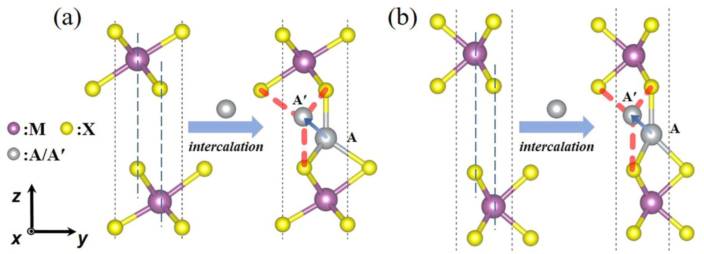
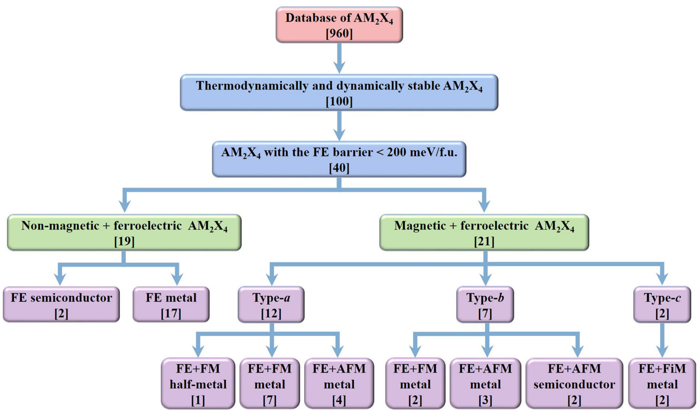
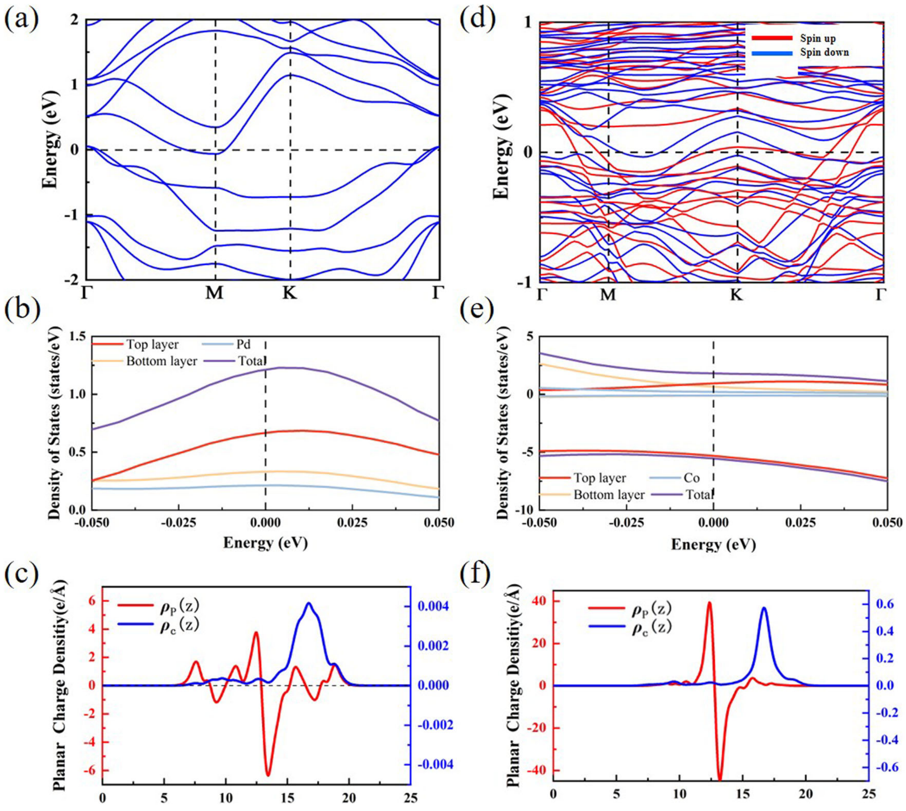
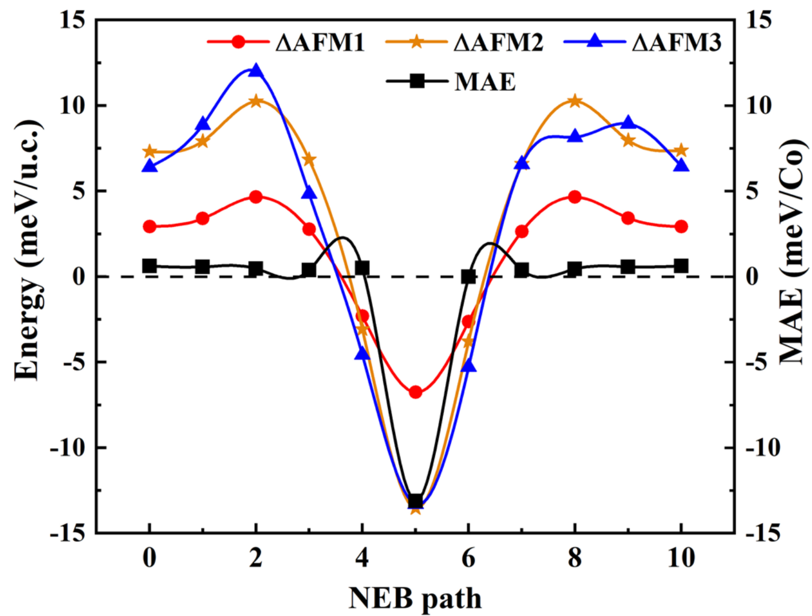
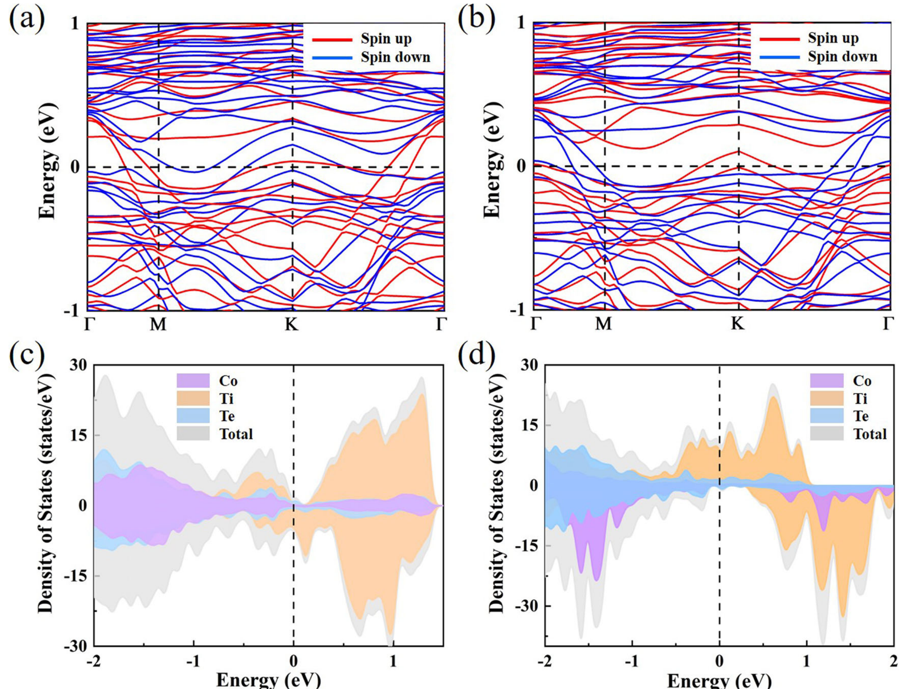
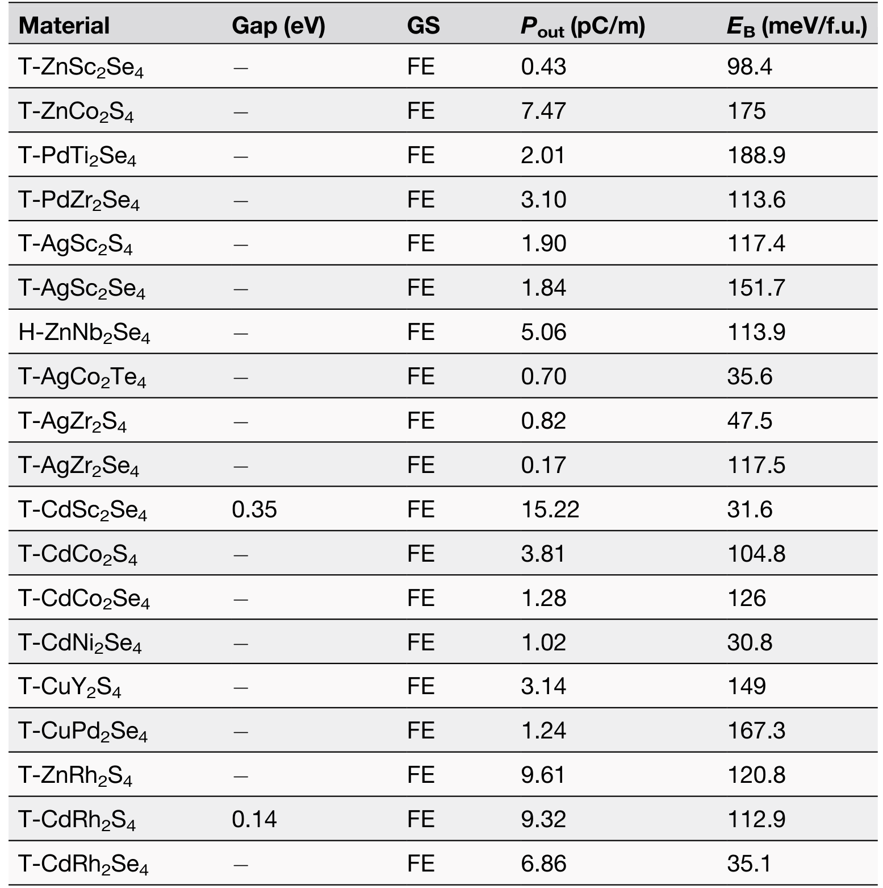
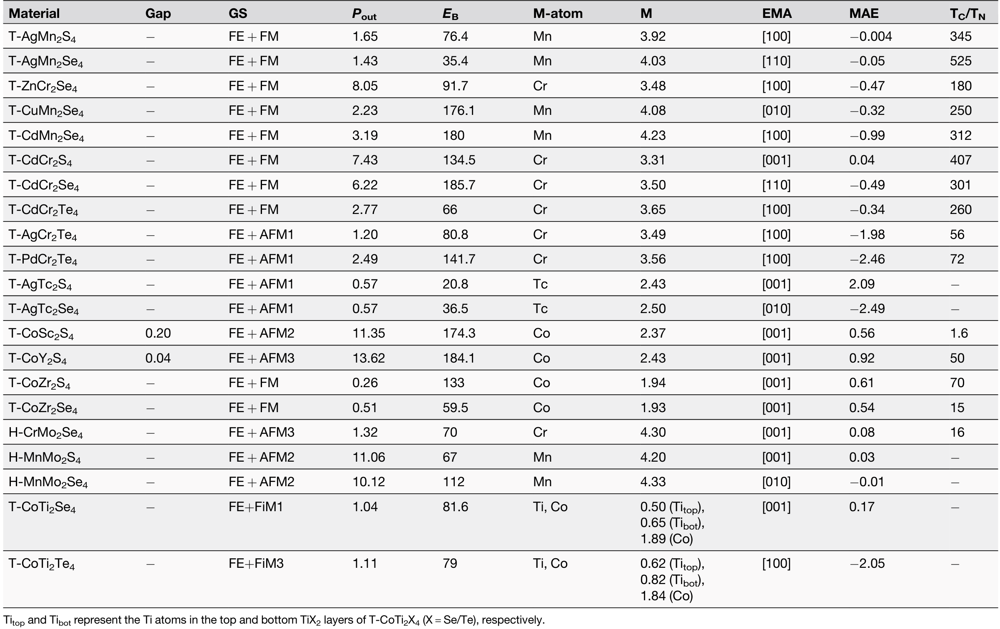
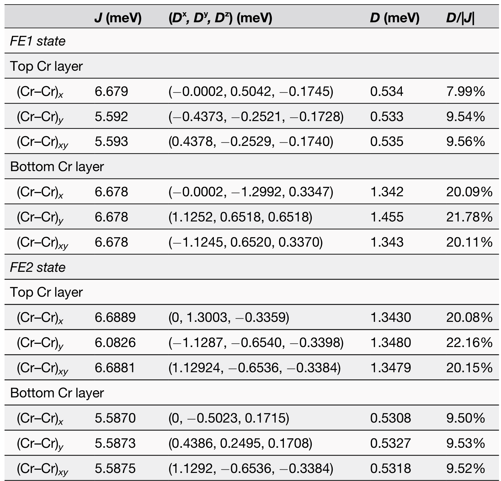

## zhaoRealization2DMultiferroic2024 — 通过插层实现具有强磁电耦合的二维多铁性材料：第一性原理高通量预测

## 📄 元数据
Ying Zhao, Yanxia Wang, Yue Yang, Jijun Zhao, Xue Jiang（大连理工大学/华南师范大学），2024，npj Computational Materials 10:122，DOI: 10.1038/s41524-024-01301-x
## 💡 一句话
提出将过渡金属离子 A 非中心对称地插入 TMD 双层四方空位构建 AM₂X₄ 的"超晶格插层"通用策略，从 960 种候选物中高通量筛选出 21 种强磁电耦合二维多铁体，并按磁性起源分为 a/b/c 三类，其中 T-CdCr₂Te₄ 可通过极化翻转可逆调控反斯格明子的产生、湮灭与手性反转。
## 🔗 Wiki 双链
  - 概念 [[../concepts/multiferroicity]]、[[../concepts/magnetoelectric-coupling]]、[[../concepts/2D-materials]]、[[../concepts/density-functional-theory]]、[[../concepts/berry-phase]]、[[../concepts/spin-orbit-coupling]]、[[../concepts/topological-defects]]、[[../concepts/polarization-switching]]
  - 实体 [[../entities/TMDs]]、[[../entities/VASP]]、[[../entities/In2Se3]]、[[../entities/WTe2]]、[[../entities/CrTe2]]
  - 图表 [[../figures/crystal-structures]]、[[../figures/electronic-bands]]、[[../figures/mathematical-models]]、[[../figures/heterostructures-stacking]]、[[../figures/experimental-setups|实验测试与测量装置]]、[[../figures/heterostructures-stacking-multiferroic|多铁与磁电异质结]]
  - 年度 [[../write/2024]]
  - 主题 [[../topics/D02-多铁性材料]]、[[../topics/Z01-材料模拟计算设计]]
  - 相关论文 [[../../raw/note/zhaoRealization2DMultiferroic2024]]
## 🆕 新概念/实体建议
  - `intercalation`（插层）：外来原子/分子嵌入范德华层间间隙形成杂化化合物的化学过程，是本文设计策略的核心。
  - `magnetic-skyrmion`（磁斯格明子）：拓扑保护的涡旋状纳米自旋织构，可作赛道存储器信息比特；本文在 T-CdCr₂Te₄ 中实现电控反斯格明子。
  - `dzyaloshinskii-moriya-interaction`（DMI，Dzyaloshinskii-Moriya 相互作用）：破缺反演对称体系中的反对称交换作用，是斯格明子形成的关键驱动力。
  - `metallic-ferroelectricity`（金属铁电性）：金属中自由电子未能完全屏蔽局域极化电荷而保留铁电极化的现象，本文以极化电子/传导电子空间分离机制解释。
  - `AM2X4-intercalation-family`（AM₂X₄ 插层化合物家族）：由 A 离子插入 MX₂ 双层构成的非范德华二维材料家族，可承载多铁、拓扑等多种序参量。
  - `high-throughput-screening`（高通量筛选）：基于第一性原理批量计算并按稳定性/能垒/物性漏斗式筛选候选材料的方法论。
  - 实体 `T-CdCr2Te4`：本文旗舰型 a 类多铁体，近室温（T_C=260 K）、电场可克斯格明子手性。
## 📊 关键图表
  -  → [[../figures/heterostructures-stacking-multiferroic|多铁与磁电异质结]]
  -  → [[../figures/experimental-setups|实验测试与测量装置]]
  - 
  - 
  - 
  - 
  - 
  - 
  - 注：原文图4（极化翻转调控斯格明子自旋织构快照）与图5（温度-磁场相图）在 raw/figures 目录中未附图片。
## 🔬 项目连接
project-2 Mn多铁（本文 a 类含多种 Mn 基多铁体如 T-CuMn₂Se₄、T-AgMn₂S₄/Se₄、T-CdMn₂Se₄，T-AgMn₂Se₄ 的 T_C 高达 525 K，与 Mn 多铁主题直接相关）；其余 project-1/3/4/5/6/7 无直接连接。
## 📝 组织与用词
论文按"策略提出 → 四步高通量筛选 → 铁电行为（半导体/金属分开讨论）→ 三类磁电耦合机制逐一剖析 → 结论"递进展开。论证以筛选漏斗（960→104/100→40→21）为骨架，再用三个代表材料（T-CdCr₂Te₄、T-CoZr₂S₄、T-CoTi₂Te₄）分别承载 a/b/c 三类机制，结构清晰、数据-机制对应。值得复用的术语：
  - [[../concepts/intercalation|插层 intercalation]]
  - 磁电耦合 magnetoelectric (ME) coupling
  - 磁斯格明子 / 反斯格明子 magnetic skyrmion / anti-skyrmion
  - Dzyaloshinskii-Moriya 相互作用 DMI
  - [[../concepts/high-throughput-screening|高通量第一性原理筛选 high-throughput first-principles screening]]
  - [[../concepts/switching-barrier|铁电翻转势垒 FE switching barrier]]
  - 极化电子与传导电子空间分离 spatial separation of polarization and conduction electrons
  - 拓扑磁织构 topological magnetic texture
  - [[../concepts/dzyaloshinskii-moriya-interaction|dzyaloshinskii-moriya-interaction]]
  - [[../concepts/topological-spin-texture|topological-spin-texture]]
## ✏️ 可写入 Wiki 的要点
  1. 插层设计原理：将 3d/4d 过渡金属 A 插入 2H 或 1T 相 MX₂ 双层的类四方空位，A 与一层 1 个 X、另一层 3 个 X 配位，形成不对称四面体配位而破缺反演对称；A 在两位置间 180° 翻转即实现极化反转，构成 H-/T-AM₂X₄ 两种结构。
  2. 筛选漏斗：960 种组合 → 结构优化确认自发极化 → 声子谱无虚频（104 种）且形成能为负（100 种）→ 铁电翻转势垒 < 200 meV/f.u.（约合室温 k_BT/原子）并排除已报道体系 → 40 种稳定铁电体 → 磁基态筛选得 21 种多铁体（10 FM、9 AFM、2 FiM）。
  3. 金属铁电共存机制：以 T-PdZr₂Se₄ 为例，传导电子 ρ_c(z) 主要分布于顶/底 ZrSe₂ 层，极化电子 ρ_P(z)=ρ_FE−ρ_PE 主要局域在插层 Pd 原子周围并呈振荡；两类电荷实空间分离使传导电子无法完全屏蔽垂直极化，Pout=3.10 pC/m。16 种非磁金属铁电体 Pout 在 0.43–9.61 pC/m，均大于实验测得的 WTe₂ 双层（0.42 pC/m）。
  4. 半导体铁电体（T-CdSc₂Se₄、T-CdRh₂S₄、T-CoSc₂S₄、T-CoY₂S₄）同时具有面内 Pin（Berry phase，最高 306.45 pC/m）和面外 Pout（偶极修正，最高 15.22 pC/m），与 In₂Se₃ 相当，并存在面内-面外铁电关联（dipole locking），可用于多向场效应晶体管。
  5. 分类依据：a 类（12 种）磁性来自 MX₂ 层 M 原子（A=Pd/Cu/Ag/Zn/Cd 满 d 壳层非磁）；b 类（7 种，CoSc₂S₄、CoY₂S₄、CoZr₂S₄、CoZr₂Se₄、CrMo₂Se₄、MnMo₂S₄、MnMo₂Se₄）磁性来自插层 A 原子；c 类（2 种，CoTi₂Se₄、CoTi₂Te₄）磁性来自 A 与 M 两者。
  6. a 类旗舰 T-CdCr₂Te₄：FM 基态，T_C=260 K（MC），FE 转变温度 >300 K（AIMD：250 K 时 Cd 位移 0.376 Å，300 K 降至 0.020 Å），Pout=2.77 pC/m，E_B=66 meV/f.u.，MAE=−0.34 meV/Cr（面内易轴）；T-AgMn₂Se₄ 的 T_C 更高达 525 K。
  7. a 类电控斯格明子：FE1 态顶层 CrTe₂ 的 D 值约为底层 3 倍，FE2 态反转；D/|J| 比在 9.03%–20.80% 间随极化切换。MC 模拟显示 FE1 态顶层在 B=2.4–3.17 T 出现反斯格明子（直径 3.8–8.9 nm，随场增大而缩小），底层保持 FM；FE2 态顶层/底层行为互换，且两态斯格明子手性相反。斯格明子晶格相临界温度约 40 K（T>40 K 时条纹畴直接转 FM，T>60 K 为无序相）。
  8. b 类 T-CoZr₂S₄：J1>0 主导 FM，MAE=0.61 meV/Co（面外易轴），T_C≈70 K，FE 在 300 K 稳定；极化翻转路径上磁基态经历 FM→AFM→FM，PE 相处 MAE 骤变为 −13.34 meV/Co（易轴翻为面内），T-CoY₂S₄ 与 H-MnMo₂Se₄ 表现类似耦合。
  9. c 类 T-CoTi₂Te₄：FiM 基态，净磁矩 0.21 μB/f.u.（T-CoTi₂Se₄ 为 0.24 μB/f.u.）；FE1 态费米能级传导电子以自旋向下为主、FE2 态转为自旋向上为主；Titop/Tibot 磁矩由 0.62/0.82 μB 互换为 0.82/0.62 μB；易磁化轴由 x 方向翻为 z 方向，实现对自旋极化输运的电场调控。
  10. 方法学：VASP + PAW + PBE(GGA)+U，平面波截断 500 eV，k 点间距 2π×0.02 Å⁻¹，真空层 >15 Å；Phonopy 有限位移法算声子；形成能 E_f=(E_AM2X4−E_A−2E_M−4E_X)/7；CI-NEB 算翻转势垒；Berry phase 算 Pin、偶极修正算 Pout；MC（80×80 晶格，Spirit 软件，Metropolis 算法，最小 6×10⁵ 步）估算 T_C/T_N 并模拟自旋织构；AIMD（NVT，4×4×1 超胞，≥10 ps，1 fs 步长）估算 FE 转变温度。含 DMI 的自旋哈密顿量为 H=ΣJ_ij S_i·S_j − A_z Σ(S_i^z)² + Σ D_ij·(S_i×S_j)。
