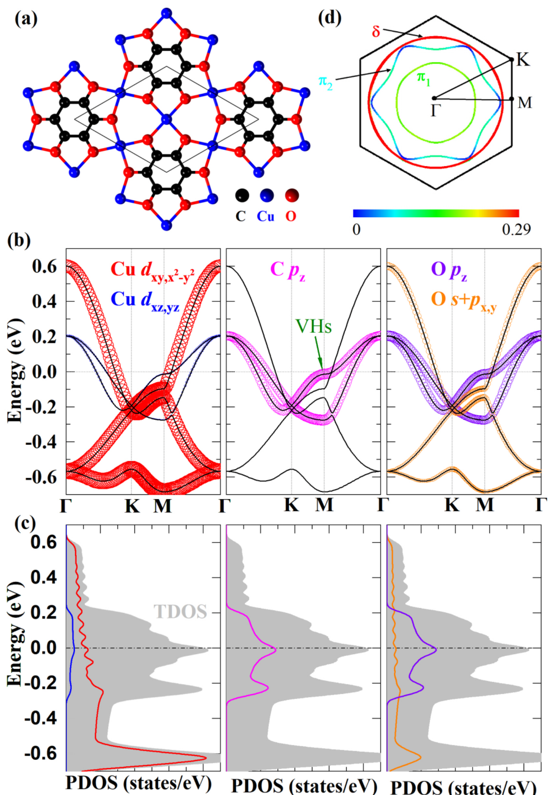
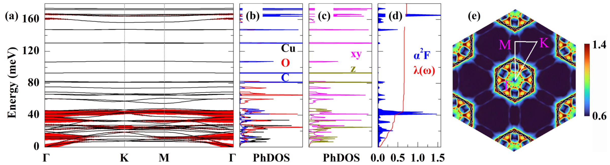
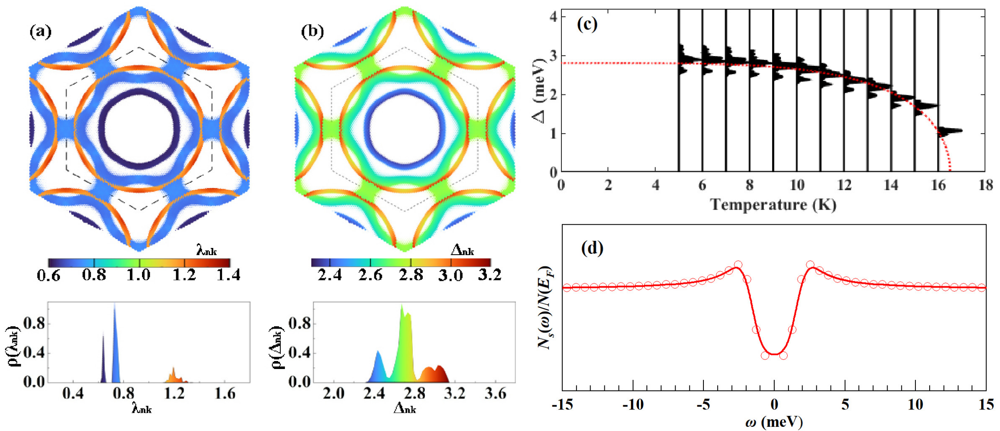
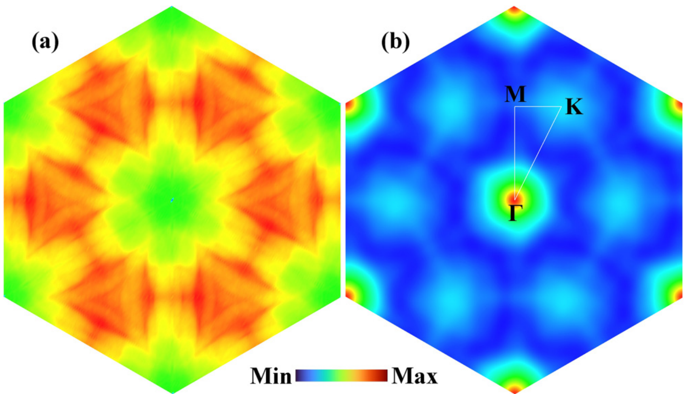

## zhengAnisotropicSuperconductivityTwodimensional2025 — 二维金属-有机kagome骨架Cu3(CO)6中的各向异性超导电性

## 📄 元数据
Jing-Jing Zheng、Jingyu Li、Rong-Rong Ma、Fengkai Guo、Jiang-Jiang Ma、Peng-Fei Liu et al.，2025，Physical Review B 112, 195405，DOI: [10.1103/srwj-fttf](https://doi.org/10.1103/srwj-fttf)

## 💡 一句话
通过第一性原理 DFPT + 各向异性 Migdal–Eliashberg 计算，首次预测已实验合成的二维 kagome 金属-有机框架 Cu3(CO)6 单层是 Tc = 16.5 K 的单能隙各向异性 BCS 超导体，其强电-声耦合（λ=0.72）由费米面嵌套驱动、主要来自 Cu/O 低能声子。

## 🔗 Wiki 双链
  - 概念 [[../concepts/2D-materials|二维材料]]
  - 概念 [[../concepts/density-functional-theory|密度泛函理论 DFT]]
  - 概念 [[../concepts/charge-density-wave|电荷密度波 CDW]]（文中以电子磁化率 χ′′(q) 讨论费米面嵌套，并明确把 CDW 列为该体系潜在的竞争序；引用 Calandra & Mauri 关于 TiSe2 中 CDW+超导穹顶的工作）
  - 概念 [[../concepts/kagome-lattice|笼目晶格 kagome lattice]]（共顶点三角形构成的二维图案，天然产生狄拉克锥、平带与范霍夫奇点，是本文 Cu 子晶格的核心几何）
  - 概念 [[../concepts/electron-phonon-coupling|电子-声子耦合 EPC]]（BCS 超导配对胶水；本文给出 λ=0.72、α²F(ω)、λ(ω) 的完整定量分析）
  - 概念 [[../concepts/migdal-eliashberg-theory|Migdal–Eliashberg 理论]]（各向异性 Migdal–Eliashberg 方程，用以得到动量分辨能隙 Δnk 和 Tc）
  - 概念 [[../concepts/fermi-surface-nesting|费米面嵌套]]（χ′′(q) 在特定 q 处出现尖峰，是 CDW 不稳定性与强电声耦合的共同根源）
  - 概念 [[../concepts/flat-band|平带]]（M 点附近 vF 急剧降低导致电子局域化、N(EF) 抬升）
  - 概念 [[../concepts/van-hove-singularity|范霍夫奇点]]（本文在 −0.01 eV 处出现 DOS 尖峰）
  - 概念 [[../concepts/2d-mof|二维金属-有机框架 2D-MOF]]（金属离子与有机配体配位自组装形成的二维晶体，Cu3(CO)6/Cu3(CS)6 是其中的 π-d 共轭导电子类）
  - 概念 [[../concepts/anisotropic-superconductivity|各向异性超导]]（单能隙、Δnk 在费米面上连续但大小随轨道/带变化）
  - 实体 [[../entities/Wannier90|Wannier90]]（EPW 用最大局域化 Wannier 函数做电声插值）
  - 实体 [[../entities/TMDs|TMDs]]、[[../entities/MXenes|MXenes]]（引言中作为 2D 材料家族并列提及）
  - 实体 [[../entities/Cu3CO6|Cu3(CO)6]]（本文主角材料，P6/mmm、a=7.732 Å、Cu 四配位 kagome、已在 Cu(111)/Ag(111) 上合成）
  - 实体 [[../entities/Cu3CS6|Cu3(CS)6 / Cu-BHT]]（硫代类似物，2D-MOF 中首个被预测 Tc=4.43 K 并在块体 ≈0.25 K 观测到超导的体系）
  - 实体 [[../entities/Quantum-ESPRESSO|Quantum ESPRESSO]]（DFT/DFPT 计算软件）
  - 实体 [[../entities/EPW|EPW]]（基于 Wannier 插值计算电声耦合与各向异性 Eliashberg 方程的代码）
  - 图表 [[../figures/electronic-bands]]、[[../figures/heterostructures-stacking-spintronics-strain|自旋电子学与应变工程 (Spintronics & Strain Engineering)]]
  - 年度 [[../write/2025]]
  - 项目 [[../projects/project-7-cdw-charge-density-wave]]
  - 相关论文 [[../../raw/note/zhengAnisotropicSuperconductivityTwodimensional2025]]

## 📊 关键图表
  -  → [[../figures/electronic-bands-dos-fermi|态密度与费米面]]
  - **图示描述**：(a) 俯视原子结构，黑色实线标出含一个 Cu3(CO)6 化学式单元的原胞，蓝/黑/红分别为 Cu/C/O，Cu 原子构成完美 kagome 点阵、四重配位 O；(b) 沿 Γ–K–M–Γ 的轨道分辨能带，EF=0，三条带穿过 EF，颜色区分 Cu dxy,x2−y2、C pz、O pz 等轨道贡献；(c) 对应的分波态密度（灰色为总 DOS）；(d) 二维费米面，色标为费米速度 vF 大小。
  - **关键特征**：优化晶格常数 a=7.732 Å，Cu–O/C–O/C–C 键长分别为 2.03/1.33/1.02 Å，属 P6/mmm（No.191）；N(EF)=16.2 states/eV/unit cell，是硫代类似物 Cu3(CS)6（3.56）的 4.5 倍以上；M 点附近同时出现类狄拉克锥、K–M 路径上的平带以及 −0.01 eV 处的范霍夫奇点，M 点附近 vF 显著压低是平带的直接证据；费米面由围绕 Γ 的三片空穴袋组成——内圈 π1（C pz/O pz/Cu dxz,yz，圆形）、中圈 π2（花瓣形，与 δ 相交）、外圈 δ（Cu dxy,x2−y2 与 O s+px,y 杂化，圆形）。
  - **结论/意义**：确立"高 N(EF)+平带/范霍夫奇点+三片费米面"的电子前提，为后续强电-声耦合与各向异性超导提供电子结构基础。
  -  → [[../figures/vibrational-spectra|振动光谱]]
  - **图示描述**：(a) 沿高对称路径的声子色散，红圈大小正比于模式分辨电-声耦合 λqν；(b) 按 Cu/O/C 原子投影的声子态密度 PhDOS；(c) 按面内（xy，红线）/面外（z，蓝线）振动投影的 PhDOS；(d) Eliashberg 谱函数 α²F(ω)（红线）与累积耦合 λ(ω)（蓝线）；(e) 整个布里渊区的 q 分辨 λq 二维分布。
  - **关键特征**：15 原子原胞共 45 支声子（3 声学+42 光学），全布里渊区无虚频，证明动力学稳定；频率分三区——I 区 <40 meV 以 Cu、O 振动为主，II 区 40–49 meV 为 C 与 O 强混合，III 区 >49 meV 为 C 高能光学模（50–80 meV 突出 Oxy、80–174 meV 以 C 为主）；总 λ=0.72（低于 Cu3(CS)6 的 1.16），其中 I 区贡献 0.43（59.7%）、II 区约 30.6%（Cz 面外+Oxy/Oz）、III 区仅约 9.7%；(a)(e) 中 Γ 附近低能光学支红圈最大，λq 呈六重对称六角星芒分布。
  - **结论/意义**：证明超导配对胶水主要来自 Cu/O 主导的 <40 meV 低能声子，与 LiC6、Cu3(CS)6 中"低能声子主导 EPC"的图像一致。
  -  → [[../figures/electronic-bands-dos-fermi|态密度与费米面]]
  - **图示描述**：(a) 费米面上动量分辨电-声耦合 λnk 的三维着色图及其归一化分布 ρ(λnk)；(b) 5 K 时费米面上动量分辨超导能隙 Δnk（meV）及分布 ρ(Δnk)；(c) 各向异性能隙随温度的演化，红色虚线为 BCS 型 Δ(T)=Δ0 tanh[2.2√((Tc−T)/T)] 拟合；(d) 15 K 下超导态准粒子态密度 Ns(ω)/N(EF) 随频率 ω 的变化。
  - **关键特征**：λnk 范围 0.62–1.31，δ 带（外圈）最大（由 Cu dxy,x2−y2/O s+px,y 驱动），π1 仅 0.62–0.67，π2 为 0.71–0.78；5 K 下 Δnk=2.08–3.90 meV，其空间分布与 λnk 一一对应，ρ(Δnk) 呈三个峰但在能量上连续，判定为单能隙各向异性；零温平均 Δ0=2.80 meV，拟合得 Tc=16.5 K（远高于 Cu3(CS)6 的 4.43 K）；2Δ0/kBTc=3.94，略大于弱耦合 BCS 值 3.53，对应中等耦合；15 K 下 ±2.2 meV 处出现 BCS 相干峰。
  - **结论/意义**：定量给出 Cu3(CO)6 为 Tc=16.5 K 的单能隙各向异性 BCS 超导体，是论文的核心结论图。
  -  → [[../figures/electronic-bands-dos-fermi|态密度与费米面]]
  - **图示描述**：(a) 电子磁化率实部 χ′(q) 在布里渊区内的二维分布，反映电子体系对扰动的整体稳定性；(b) 虚部 χ′′(q)，即 ω→0 极限下的费米面嵌套函数 Σk δ(εk−εF)δ(εk+q−εF)，红/绿/蓝分别对应高/中/低值。
  - **关键特征**：Γ 点（q=0）处 χ′′ 的发散是自嵌套平凡项，无物理意义；在 K 点周围及沿 M–K 路径出现显著强峰，形成围绕 K 点的三角形图案和围绕 Γ 的六边形/圆周图案；这些强峰位置与图2(a)、2(e) 中 λqν/λq 的强耦合波矢精确重合。
  - **结论/意义**：从微观上证实费米面嵌套是驱动并增强 Cu3(CO)6 电-声耦合的机制，同时提示该体系存在 CDW/SDW 等竞争序的潜在可能。
  - 公式图：Eliashberg 谱函数 eq_1、累积 λ(ω) eq_2、动量分辨 λk eq_3、质量重整化 Z eq_4、能隙方程 eq_5、各向异性 λ(k,k′,n−n′) eq_6、BCS 型 Δ(T) eq_7、χ′(q) eq_8、χ′′(q) eq_9（均在 raw/figures 同目录下）

## 🔬 项目连接
  - **project-7（CDW）—— 核心参考价值**：(1) 本文方法学直接是 CDW 研究的标准武器——用 DFPT 声子谱查虚频、用电子磁化率虚部 χ′′(q) = Σ_k δ(εk−εF)δ(εk+q−εF) 定量识别费米面嵌套波矢，再与电声 λqν 对照；(2) 物理想像上，Cu3(CO)6 同时具备高 N(EF)=16.2 states/eV、平带、VHs 和强嵌套峰，正是 CDW/SDW 等竞争序最容易出现的电子环境，作者及 AI 批判分析都明确把 CDW 列为应进一步检验的失稳通道；(3) 文中引用 [97] Calandra & Mauri (PRL 2011) 关于 TiSe2 中电声相互作用同时产生 CDW 与超导穹顶的工作，把"嵌套—电声耦合—CDW/超导竞争"的因果链写得很清楚，可直接作为 project-7 讨论 CDW–超导共存的方法与文献模板；(4) χ′/χ′′ 双图（图4）与 λq 图（图2e）并置的呈现方式，可作为 project-7 图表组织范式。
  - **project-4（TTF 分子计算）—— 方法学参考**：同为含机/共轭体系，Cu3(CO)6 是 π-d 共轭的 2D-MOF，其计算流程——QE(PBE+模守恒 NCV 赝势) → DFPT 声子 → Wannier90/EPW 粗到细网格插值 → 各向异性 Eliashberg 方程——为分子/有机导体中的电声耦合与不稳定性分析提供了可直接照搬的工作流；真空层 12 Å、80/320 Ry 截断、4×4×1 q 粗网格 + 40×40×1 插值、μ*=0.1、电子/声子洛伦兹展宽 25/0.5 meV 等参数可作收敛性参照。
  - **project-5（SnTe 铁电模拟）—— 弱方法学参考**：仅在 DFT 结构优化、声子谱（软模/虚频判定）这一通用层面可借鉴；本文不涉及铁电、极性畸变或 Berry 相，与 SnTe 物理无直接交集。
  - **project-1（双光子）、project-2（Mn 多铁）、project-3（机械发光 NN）、project-6（湿度传感器）**：无直接项目连接。（注：引言提及 Mn3(CO)6 是该 MOF 家族的一员，但本文未做 Mn 体系的磁性/多铁分析，不构成 project-2 的实质参考。）

## 🔗 项目双链
- 项目 [[../projects/project-4-ttf-molecular-calc|项目四：lsl老师的ttf分子计算]]
- 项目 [[../projects/project-7-cdw-charge-density-wave|项目七：CDW电荷密度波]]

## 📝 组织与用词
论文按"引言（类比 Cu3(CS)6 提出问题）→ 计算方法（DFT/DFPT/EPW/ME 方程与参数）→ 结果四小节 A 结构与电子性质 → B 声子与电声相互作用 → C 各向异性超导 → D 电子磁化率（嵌套）→ 结论"的递进链条展开，每一步结论都由对应图支撑：图1 立"高 N(EF)+平带/VHs"的电子前提，图2 立"低能 Cu/O 声子主导耦合、λ=0.72"，图3 立"单能隙各向异性、Tc=16.5 K、2Δ0/kBTc=3.94"，图4 回到微观机制"嵌套驱动"。值得复用的术语：kagome lattice（笼目晶格）、2D-MOF（二维金属有机框架）、π–d conjugation（π-d 共轭）、electron-phonon coupling, EPC（电子-声子耦合）、Eliashberg spectral function α²F(ω)（Eliashberg 谱函数）、Fermi surface nesting（费米面嵌套）、van Hove singularity / flat band（范霍夫奇点 / 平带）、anisotropic single-gap BCS superconductivity（单能隙各向异性 BCS 超导）。

## ✏️ 可写入 Wiki 的要点
  1. 结构：Cu3(CO)6 单层属 P6/mmm（No.191），优化晶格常数 a = 7.732 Å，Cu 原子构成完美 kagome 点阵，每个 Cu 由 4 个 O 四重配位，Cu–O/C–O/C–C 键长分别为 2.03/1.33/1.02 Å；原胞 15 原子，共 45 支声子模（3 声学 + 42 光学），整个[[../concepts/brillouin-zone|布里渊区]]无虚频，动力学稳定。
  2. 电子结构：三条带穿过 EF，呈金属性；N(EF) = 16.2 states/eV/unit cell，是硫代类似物 Cu3(CS)6（3.56）的 4.5 倍以上；EF 附近态主要来自 Cu dxy,x2−y2、C pz、O pz 以及 Cu dxz,yz、O s+px,y 的杂化。
  3. kagome 特征电子结构：M 点附近类狄拉克锥、K–M 路径上的平带、−0.01 eV 处的[[../concepts/van-hove-singularity|范霍夫奇点]]共存；M 点附近费米速度 vF = (1/ħ)|∂E/∂k| 显著压低，是平带的直接光谱证据。
  4. [[../concepts/fermi-surfaces|费米面]]三片结构：中心圆形空穴袋 π1（C pz/O pz/Cu dxz,yz）、花瓣形 π2（与 δ 相交）、外圈圆形空穴袋 δ（Cu dxy,x2−y2 与 O s+px,y 杂化），均围绕 Γ 点。
  5. 电声耦合：总 λ = 0.72（低于 Cu3(CS)6 的 1.16）；按频率分三区——I 区 <40 meV（Cu、O 振动）贡献 0.43（59.7%），II 区 40–49 meV（Cz 面外 + Oxy/Oz）贡献约 30.6%，III 区 >49 meV（C 高能光学模）仅约 9.7%；与 LiC6、Cu3(CS)6 一致，低能声子主导。
  6. [[../concepts/migdal-eliashberg-theory|各向异性]]：费米面上 λnk 范围 0.62–1.31，δ 带最大（Cu dxy,x2−y2/O s+px,y 驱动），π1 仅 0.62–0.67，π2 为 0.71–0.78；Δnk 分布与 λnk 一一对应，5 K 下 2.08–3.90 meV，零温平均 Δ0 = 2.80 meV。
  7. 超导判定：单能隙各向异性 BCS 超导体；Δ(T) 可用 Δ(T)=Δ0 tanh[2.2√((Tc−T)/T)] 拟合；Tc = 16.5 K，远高于 Cu3(CS)6 的 4.43 K；2Δ0/kBTc = 3.94，略大于弱耦合 BCS 值 3.53，对应中等耦合；15 K 下 Ns(ω)/N(EF) 在 ±2.2 meV 处出现相干峰。
  8. 嵌套机制：χ′′(q) 在 K 点及 M–K 路径上出现强峰（Γ 点 q=0 的发散为自嵌套平凡项），其位置与图2中 λqν/λq [[../concepts/strong-coupling|强耦合]]区精确对应，证明[[../concepts/fermi-surface-nesting|费米面嵌套]]是增强电声耦合的微观机制。
  9. 计算流程与参数：QE + PBE + 优化模守恒 Vanderbilt 赝势，波函数/[[../concepts/charge-density|电荷密度]]截断 80/320 Ry，真空层约 12 Å，力收敛 10−6 Ry/Bohr、SCF 10−7 Ry，16×16×1 k-mesh（0.01 Ry Methfessel–Paxton）；DFPT 声子在 4×4×1 q 网格；EPW 在 8×8×1 粗网格构造 [[../concepts/wannier-function|Wannier 函数]]，插值到 40×40×1 细网格；Matsubara 截断 4.5×180 meV = 0.80 eV；δ 函数用电子 25 meV、声子 0.5 meV 洛伦兹展宽；库仑赝势 μc* = 0.1（2D 材料常用 0.05–0.2）。
  10. 开放问题（AI 批判与作者展望）：μ* 取值与 Tc 鲁棒性、单能隙 vs. 多能隙（三个 Δ 峰是否对应 π1/π2/δ 三带）、PBE 对嵌套描述精度与 HSE/GW 交叉验证、强嵌套下的 CDW/SDW [[../concepts/competing-orders|竞争序]]与磁性基态、Cu(111)/Ag(111) 衬底（[[../concepts/charge-transfer|电荷转移]]/应变/杂化）对 Tc 的影响、金属中心替换（Zn/Mn/Ag/Au 等）与静电/化学掺杂调控 Tc 等，均待后续研究。
