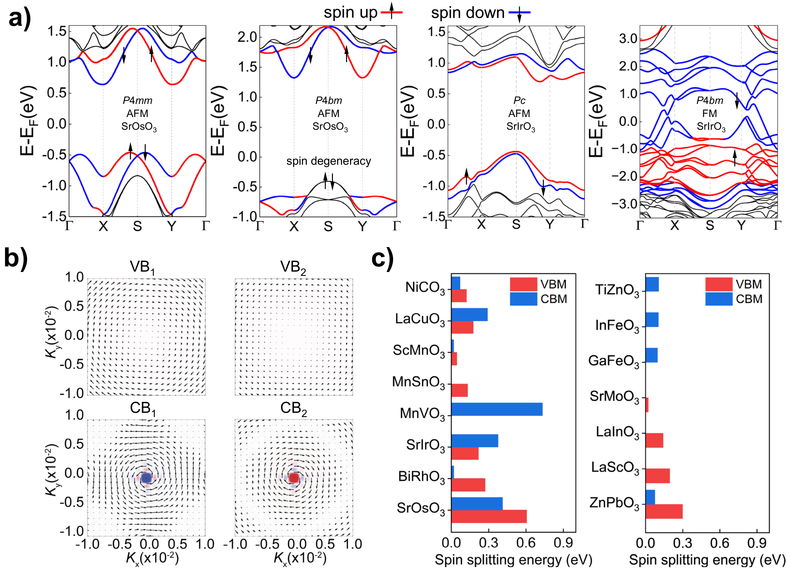
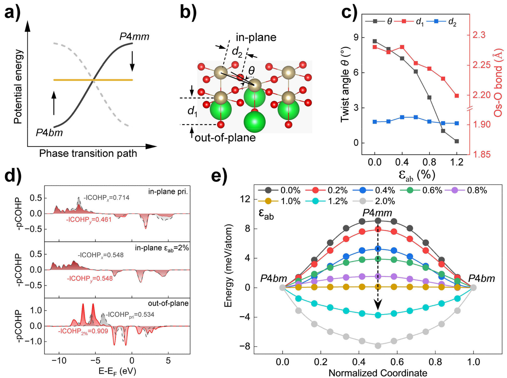
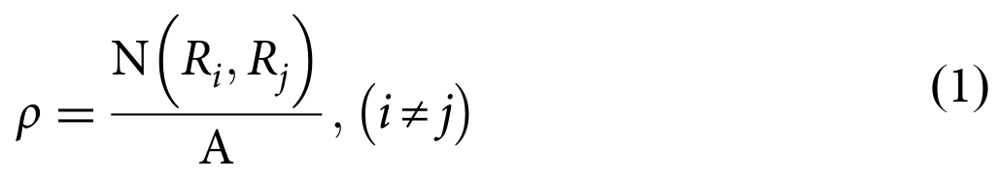
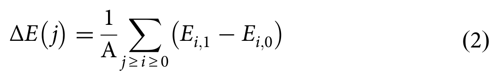
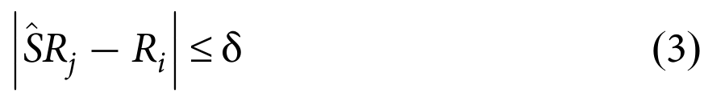
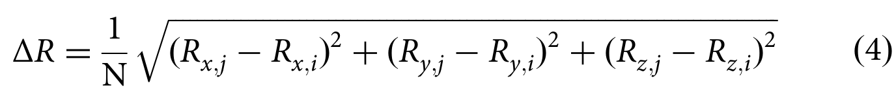
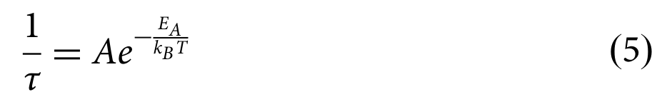

## zhongHighthroughputExfoliationMultiferroic2025 — 具有高转变温度和巨自旋劈裂的多铁三元氧化物单分子膜的高通量剥离

- **元数据**：Yongle Zhong, Yuxiang Xiao, Zhengfang Qian, Wen Xiong, Pu Huang（深圳大学射频异质集成全国重点实验室；中国科学院重庆绿色智能技术研究院，通讯作者 Pu Huang），2025，*npj Computational Materials* **11**, 383，DOI: [10.1038/s41524-025-01867-0](https://doi.org/10.1038/s41524-025-01867-0)

- **一句话**：提出"键密度 + 面内/面外结合强度"通用判据，从 831 种 ABO₃ 钙钛矿中非范德华块体高通量筛出 35 种可剥离稳定单层，并以 SrOsO₃/SrIrO₃/SrMoO₃/BiFeO₃ 为范例揭示室温以上磁转变温度、0.606 eV 巨自旋劈裂及微应变驱动的相锁定电子-自旋调控。

- **现有wiki双链**：
  - 概念 [[../concepts/2D-materials]]、[[../concepts/multiferroicity]]、[[../concepts/magnetoelectric-coupling]]、[[../concepts/strain-engineering]]、[[../concepts/giant-spin-splitting]]、[[../concepts/spin-orbit-coupling]]、[[../concepts/bond-density]]、[[../concepts/binding-strength]]、[[../concepts/ferroelasticity]]、[[../concepts/altermagnetism]]、[[../concepts/phase-interlocked]]、[[../concepts/density-functional-theory]]、[[../concepts/berry-phase]]
  - 实体 [[../entities/BiFeO3]]、[[../entities/SrIrO3]]、[[../entities/SrMoO3]]、[[../entities/SrOsO3]]、[[../entities/NaZnO3]]、[[../entities/MnVO3]]、[[../entities/ZnPbO3]]、[[../entities/VASP]]、[[../entities/Wannier90]]、[[../entities/h-BN]]、[[../entities/TMDs]]
  - 图表 [[../figures/crystal-structures]]、[[../figures/electronic-bands]]、[[../figures/mathematical-models]]
  - 年度 [[../write/2025]]
  - 项目 [[../projects/project-2-mn-multiferroics]]（MnVO₃ 候选与多铁钙钛矿主题直接相关）
  - 相关论文 [[../../raw/note/zhongHighthroughputExfoliationMultiferroic2025]]

- **新概念/实体建议**：
  - `exfoliation-energy.md`（剥离能 E_exf）：衡量从非范德华块体切出单层所需能量，单位 eV/Ų，阈值 ≤0.13；可与键密度、结合强度共同构成可剥离性判据。
  - `non-vdw-exfoliation.md`（非范德华剥离）：针对无天然层状结构三维块体，通过识别低键密度晶面并模拟"拉伸-弛豫"实现二维化的方法学。
  - `half-metal.md`（半金属）：一种自旋通道金属导电、另一自旋通道绝缘/半导体，理论上提供 100% 自旋极化电流；本文 SrIrO₃ P4bm 相、SrMoO₃ Pc 相即此类。
  - `rashba-effect.md`（Rashba 型自旋劈裂）：极性结构破缺空间反演对称导致动量空间自旋-动量锁定的旋涡状自旋纹理；SrOsO₃ P4mm 相 VBM 0.606 eV 劈裂的主要来源。
  - `superexchange.md`（超交换相互作用）：磁性离子经非磁性 O 2p 轨道介导的间接交换；SrOsO₃ 中 B1↔B1（dx²⁻y²–px/py）和 E↔E（dxz/dyz–pz）两通道主导 AFM。
  - `cohp-icohp.md`（晶体轨道哈密顿布居及其积分）：成键/反键分析工具，−ICOHP 绝对值越大键越强；用于揭示应变下 Os–O 面外键增强驱动 P4bm→P4mm 相变。
  - `cneb.md`（爬升图像微动弹性带方法）：计算相变最小能量路径与势垒；本文得 SrOsO₃ 相变势垒 9.1 meV/atom。
  - `magnetic-force-theory.md`（磁力理论 MFT/TB2J）：基于格林函数从 DFT 提取各向异性交换参数 J、DMI、SIA，配合 Vampire 蒙特卡洛估算 T_N/T_C。
  - `SrTiO3.md`、`BaTiO3.md`、`LaCuO3.md`（LaCuO3 已存在）：作为已实验合成的对照 ABO₃ 单层/超薄膜，值得建实体条目。
  - `spin-texture.md`（自旋纹理）：布里渊区内自旋方向的矢量场分布，可作为 Rashba/交变磁性判定依据。

- **关键图表**：
  - 
  - 
  - 
  - 公式（键密度、剥离能求和、对称性容差、平均原子位移、Arrhenius 相变时间）：
    - 
    - 
    - 
    - 
    - 
  - （笔记未附原图2：T_N/T_C 统计、Os–O–Os 超交换路径示意、MLWF 等值面；亦未附表1的独立图片，但表1文字数据在笔记正文中完整保留。）

- **项目连接**：project-2 Mn 多铁直接相关——筛选名单中 MnVO₃ 为高转变温度多铁候选之一，且方法学可推广至 Mn 基钙钛矿；其余 project-1/3/4/5/6/7 无直接连接（project-5 SnTe 铁电模拟主题邻近但材料体系不同，可作方法借鉴而非直接连接）。

- **组织与用词**：
  - 论证按"方法提出 → 高通量筛选 → 稳定性验证 → 物性深挖（磁性/自旋）→ 相耦合调控 → 应变工程 → 器件展望"闭环展开；每一节均以代表性体系（SrOsO₃ 为主，SrIrO₃/SrMoO₃/BiFeO₃ 为辅）锚定抽象结论，并以 MLWF、pCOHP、cNEB 三类微观证据交叉印证，逻辑严密。
  - 可复用术语（中英对照）：
    - 键密度 / bond density (ρ)
    - 面外/面内结合强度 / out-of-plane vs in-plane binding strength (ξ⊥/ξ∥)
    - 剥离能 / exfoliation energy (E_exf)
    - 相锁定（相耦合）物性 / phase-interlocked (phase-coupled) properties
    - 巨自旋劈裂 / giant spin splitting
    - 拉什巴型自旋纹理 / Rashba-type spin texture
    - 超交换 / super-exchange
    - 序-序相变 / order-to-order phase transition
    - 积分晶体轨道哈密顿布居 / integrated COHP (−ICOHP)
    - 自旋极化率 / spin polarization P=(N↑−N↓)/(N↑+N↓)

- **可写入wiki的要点**：
  1. **方法学判据**：可剥离晶面需同时满足低键密度 ρ ≤ 0.3 bonds/Ų 与 ξ⊥ < ξ∥；剥离能阈值取 E_exf ≤ 0.13 eV/Ų。剥离通过固定底层、每步外移约 0.2 Å 并弛豫直至断键来模拟，E_exf = Σ ΔE/A（Eq.1–2）。该判据不依赖化学成分与对称性，已用 TiFeO₃、FeCr₂O₄、α-Fe₂O₃ 等已知可剥离非范德华材料验证。
  2. **筛选规模与结果**：从 Materials Project + ICSD 的 831 种实验合成 ABO₃ 出发，得到 35 种稳定可剥离单层（16 AFM/FM/FiM、18 FE、8 FC、1 无铁性序），剥离能最低 0.049 eV/Ų（NaZnO₃），MnSnO₃ 0.057、BiFeO₃ 0.109、SrOsO₃ 0.134 eV/Ų，与石墨烯 0.013、MoS₂ 0.019、h-BN 0.032、BP 0.023 eV/Ų 同量级。
  3. **稳定性验证流程**：对每个候选做 AIMD 采样→空间群识别（容差 δ=δp+δa）→DFT 全弛豫→DFPT/Phonopy 声子谱（无虚频）→~10 ps、300 K、NVT 长时 AIMD→cNEB 相变路径；代表性体系 BiFeO₃/SrOsO₃/SrMoO₃/MnVO₃ 的多相被 6.9–118.4 meV/atom 势垒隔开，动力学可及。
  4. **SrOsO₃ 高 T_N 微观机制**：P4mm 四方结构，每晶胞 2 Sr + 2 Os + 6 O；Os–O 面内 1.93 Å、面外 2.05 Å。Néel 型 AFM 比 FM 低 1.384 eV/晶胞，面外磁各向异性能 63.35 meV。MFT/TB2J 给出 1NN J₁=−11.19 meV，约为 2NN J₂(1.96 meV) 的 5.7 倍、3NN J₃(0.20 meV) 的两个数量级；C₄ᵥ 晶体场下 Os 5d 分裂为 A₁(dz²)、E(dxz,dyz)、B₁(dx²⁻y²)、B₂(dxy)，AFM 超交换由 B₁↔B₁（dx²⁻y²–px/py）与 E↔E（dxz/dyz–pz）通道主导；4 个自旋近邻 + 大 |J₁| 共同给出 T_N=300 K。BiFeO₃ 280 K、SrMoO₃ 315 K。
  5. **巨自旋劈裂**：35 种中 15 种在 CBM/VBM 有显著劈裂；SrOsO₃ P4mm 相 VBM/CBM 分别达 0.606/0.411 eV，远超 2D SrTiO₃(~0.1 eV)、Mn₂ClXH(0.062–0.089 eV)、CrSBr 双层(~0.25 eV)，为目前已知最大的二维 AFM 氧化物自旋劈裂；ZnPbO₃ 次之为 0.293 eV。机制：极性 P4mm 中 Os 占 1a/1b 两个不等价 Wyckoff 位破缺反演对称 + Os 5d/O 2p 强杂化（杂化率 0.65）；自旋劈裂与杂化率近线性相关。1% 面内双轴压缩（等价层厚拉伸 1.6%，Os–O 从 2.05→2.28 Å）使杂化率降至 0.35、VBM 劈裂降至 0.309 eV，定量证明 p–d 杂化的主导作用。
  6. **相锁定的三种电子响应**：(i) 能带边排序改变；(ii) 费米面自旋极化态重构；(iii) 带隙可调的半导体-金属互变。SrOsO₃ P4mm(AFM, Rashba 劈裂)↔P4bm(交变磁性 altermagnetism，自旋简并)：P4bm 引入 OsO₅ 五面体绕 c 轴面内旋转（Glazer a⁰a⁰c⁰ 型），破缺 P4mm 中的面内自旋时间反演 Tτ 与自旋翻转反演 Uτ；SrIrO₃ Pc(AFM，自旋上/下带隙 1.14/1.35 eV)→P4bm(FM 半金属，自旋下通道金属、自旋上带隙扩至 3.58 eV)；SrMoO₃ P4mm(AFM，0.186/0.196 eV)→Pc(自旋下金属、自旋上 0.304 eV)；后两者费米面自旋极化率达 100%。
  7. **应变驱动相变的定量阈值（表1）**：SrOsO₃ P4bm→P4mm 需 ε_ab=1.2% 双轴拉伸，θ 由 8.68°→0°；势垒随应变反转：1% 时 +0.11 meV/atom、1.2% 时 −3.74、2% 时 −7.9 meV/atom；本征势垒 9.1 meV/atom（P4bm a=b=5.32 Å，P4mm a=b=5.45 Å）。SrIrO₃ Pc↔P4bm 需 a 轴压缩 3.5%；SrMoO₃ P4mm↔Pc 需 a 轴拉伸 0.7%、b 轴压缩 2.7%；BiFeO₃ Pc(AFM)→P4mm(FM) 需 a/b 轴压缩 4%/3%，伴随带隙 3.31→0.60 eV 与带边自旋极化增强。微观上应变使面外 −ICOHP 从 0.53 增至 0.91 eV，面内 Os–O 成键各向异性被淬灭，O 原子被拉向相邻 Os 中点，驱动五面体回转。
  8. **器件性能估算**：外推至 ~10 nm 栅长 CMOS 尺寸，SrOsO₃、SrMoO₃ 的单次开关能耗 4.4×10⁻⁴–4.9×10⁻³ fJ，比当前 FET 低约两个数量级；以 A=10 THz、T=300 K 的 Arrhenius 方程（Eq.5）估算序-序相变时间 ~21–232 fs，对比 3 nm 环栅 SiC/SiGe CMOS 的 2.85 ps 电荷动力学，跨入飞秒 regime；为非易失相控自旋逻辑/存储提供概念基础。
  9. **计算协议**：VASP + PAW + GGA-PBE，平面波截断 520 eV，Γ 中心 k 点间距 0.02 Å⁻¹，能量收敛 10⁻⁷ eV，力收敛 0.001 eV/Å，真空层 >15 Å，极性材料加偶极修正，磁性 d/f 离子初始磁矩 5 μ_B 并用 HSE06 收敛磁态；剥离过程加 DFT-D3 色散修正；磁交换通过 TB2J（MFT 格林函数）+ Wannier90 提取，T_N/T_C 用 Vampire 50×50×1 超胞蒙特卡洛；自旋纹理取自 Y–Γ–X 平面自旋密度矩阵；开源 ECP 代码见 https://yjndl.github.io/。
  10. **批判性边界**：判据为几何-电子结构静态指标，未涵盖液相剥离中溶剂-表面相互作用与表面重构动力学；T_N/T_C 基于海森堡模型 + MFT，对 5d 巡游磁性体系可能需量子蒙特卡洛交叉验证；0.606 eV 劈裂中 Rashba 与交变磁自旋劈裂的贡献比例未做自旋空间群定量分离；~1% 应变的工程均匀施加、循环相变疲劳、电极接触/寄生电容对本征超低能耗的稀释等器件化问题尚待解决。
