## Şahin2009probe — 在LHC上通过光子-光子融合的独家双轻子和双光子产生探测非粒子

## 📄 元数据
İ. Şahin, S.C. İnan，2009，*Journal of High Energy Physics* 2009(09):069，DOI [10.1088/1126-6708/2009/09/069](https://doi.org/10.1088/1126-6708/2009/09/069)
## 💡 一句话
首次系统论证LHC上的独家光生过程 pp→pl⁻l⁺p 与 pp→pγγp 可借助前向探测器和等效光子近似，以极低背景探测标量/张量非粒子，其中双光子道能在树图级无SM背景地独立隔离 γγU 耦合。
## 🔗 Wiki 双链
  - 年度 [[../write/2009]]
  - 相关论文 [[../../raw/note/Şahin2009probe]]
  - （本文为高能物理唯象学，与wiki现有凝聚态/材料概念、实体条目无对应，故不强行双链。）
## 🆕 新概念/实体建议
  - `unparticles.md`（非粒子）：Georgi 2007 提出的具有非整数标度维度 d_U、标度不变的新物理sector，传播子含 sin(d_Uπ) 与 (−P²)^(d_U−2)，表现为连续质谱而非共振峰。属高能物理概念，与当前wiki主题距离远，可酌情新建。
  - `equivalent-photon-approximation.md`（等效光子近似, EPA）：将高能带电粒子周围的准实虚光子云谱化，把 pp→pXp 卷积为 γγ→X 的通用方法；在其它涉及带电粒子周边光子场的主题（如粒子束辐射、光核反应）中可复用，但同样偏HEP。
  - `exclusive-production.md`（独家/排他产生）：pp→pXp，两质子保持完整、无强子残余，前向探测器（距IP 100–400 m）标记散射质子，背景极低；是LHC前向物理的通用范式。
  - `scale-invariance.md`（标度不变性）/ `conformal-invariance.md`（共形不变性）：非粒子传播子与幺正性界限（d_U≥1 标量、d_U≥3 张量标度不变、d_U≥4 张量共形不变）的理论基础。condensed-matter wiki 已有"相变/临界现象"潜在语境时可复用，但本文用法是HEP场论语境。
## 📊 关键图表
  - 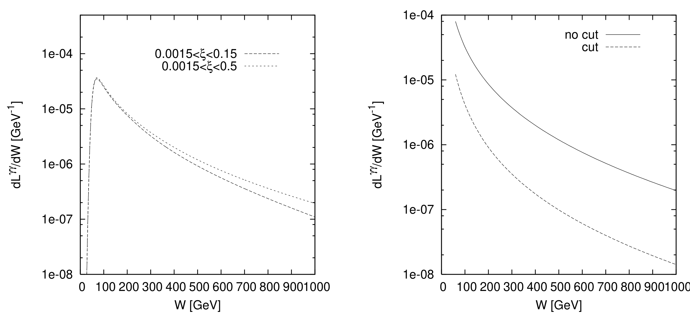 -> [[../figures/optical-spectra|光学与吸收光谱]]
  - **图示描述**：左图绘出两种前向探测器接受度（0.0015<ξ<0.15 与 0.0015<ξ<0.5）下有效 γγ 亮度 dL_γγ/dW（纵轴，GeV⁻¹）随双光子系统不变质量 W（横轴，GeV，0–1000 GeV）的变化；右图比较在不施加任何 ξ 接受度时，对光子对总横动量加 |q̃₁t+q̃₂t|<30 MeV 截断前后亮度曲线的差异。
  - **关键特征**：0.0015<ξ<0.5 的宽接受度亮度整体高于 0.0015<ξ<0.15，并在低 W 区（<200 GeV）优势最明显；加 30 MeV 总横动量截断后实线与虚线几乎重合，说明该截断在有效剔除质子解离本底的同时对信号亮度的损失可以忽略。
  - **意义**：该图奠定了全文使用 |q̃₁t+q̃₂t|<30 MeV 作为独家事件筛选条件的依据。
  - 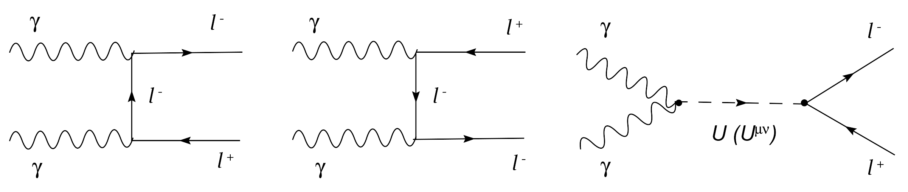 -> [[../figures/mathematical-models|数学模型与物理公式]]
  - **图示描述**：示意子过程 γγ→l⁻l⁺ 的树级费曼图，包括标准模型中电子交换的 t 道和 u 道图，以及新物理贡献——非粒子（标量 O_U 或张量 O_U^{μν}）作为中间态的 s 道交换图。
  - **关键特征**：SM 图在 t、u=0 处有极点，导致截面在前/后向及低 p_t 区发散；非粒子走 s 道，其振幅含 (−s)^{d_U−2} 与 1/sin(d_Uπ)，在高 p_t 区相对平坦，与 SM 自然分离。
  - **意义**：这张图给出了双轻子道全部微扰计算的拓扑基础，并解释了为何高 p_t 截断能放大新物理信号。
  - 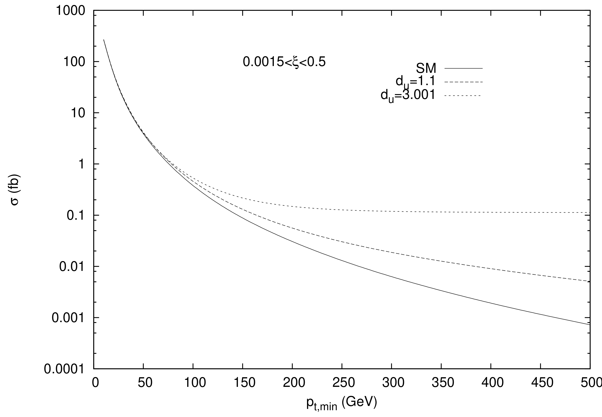 -> [[../figures/mathematical-models|数学模型与物理公式]]
  - **图示描述**：纵轴为 pp→pl⁻l⁺p 的总截面 σ（fb，对数坐标），横轴为末态轻子的最小横动量 p_t,min（GeV）；实线为标准模型预期，虚线为加入标量（d_U=1.1）和张量（d_U=3.001）非粒子贡献后的总截面。
  - **关键特征**：SM 曲线随 p_t,min 增加迅速跌落（t/u 道极点被切掉），非粒子贡献曲线相对平坦；在 p_t,min>400 GeV 后非粒子贡献反超 SM，信号/背景比显著提高。
  - **意义**：直接支持了"用高 p_t 截断压低 SM、泊松计数搜寻非粒子"的分析策略。
  -  -> [[../figures/experimental-setups|实验测试与测量装置]]
  - **图示描述**：在 CMS-TOTEM 宽接受度 0.0015<ξ<0.5 下，pp→pl⁻l⁺p 对标量非粒子耦合乘积 κλ_S 的 95% C.L. 排除上限随积分亮度（0–200 fb⁻¹）的变化，不同曲线对应 d_U=1.01, 1.1, …, 1.9；截断为 |q̃₁t+q̃₂t|<30 MeV、|η|<2.5、p_t>460 GeV，Λ_U=3 TeV，泊松统计。
  - **关键特征**：耦合上限随亮度增加而变严；d_U 越接近 1 灵敏度越高，d_U=1.01 在 200 fb⁻¹ 时 κλ_S 上限约 0.7；d_U=1.9 的极限反而优于 d_U=1.8，源于振幅分母 sin²(d_Uπ) 的周期性；标量贡献与 SM 不相干，极限关于 κλ_S 正负对称。
  - 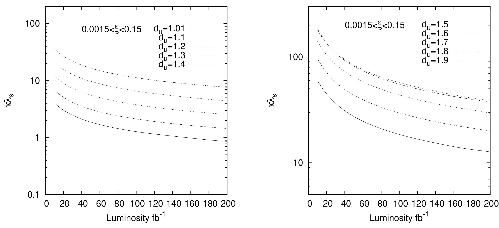 -> [[../figures/experimental-setups|实验测试与测量装置]]
  - **图示描述**：AFP 接受度 0.0015<ξ<0.15 下 pp→pl⁻l⁺p 对 κλ_S 的 95% C.L. 灵敏度，横轴 0–200 fb⁻¹，纵轴 κλ_S；p_t>420 GeV，Λ_U=3 TeV，泊松统计。
  - **关键特征**：趋势与图4一致——d_U 越接近 1 越严，d_U=1.01 在 200 fb⁻¹ 时上限约 0.9；因 AFP 接受度较窄、p_t 截断略低，整体极限比 0.0015<ξ<0.5 略弱，但对低质量中心系统更有定位精度。
  - 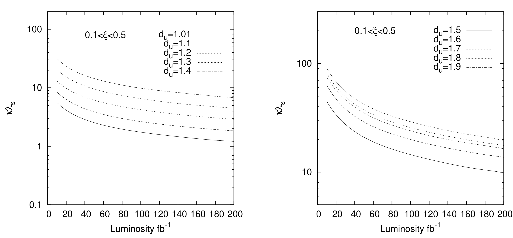 -> [[../figures/experimental-setups|实验测试与测量装置]]
  - **图示描述**：高 ξ 接受度 0.1<ξ<0.5 下 pp→pl⁻l⁺p 对 κλ_S 的 95% C.L. 灵敏度随亮度变化，纵轴 κλ_S（0.1–100），p_t>30 GeV，Λ_U=3 TeV。
  - **关键特征**：ξ 下限高使末态轻子对不变质量自动大于约 1400 GeV，SM 截面仅约 1.1×10⁻⁶ pb，因此不需要高 p_t 截断；该接受度对 d_U≈1 的标量非粒子灵敏度最差，但对较大 d_U 可与宽接受度相当。
  - 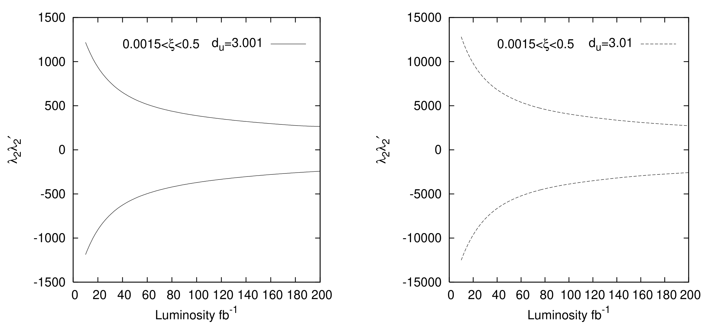 -> [[../figures/experimental-setups|实验测试与测量装置]]
  - **图示描述**：0.0015<ξ<0.5 下 pp→pl⁻l⁺p 对张量非粒子耦合乘积 λ_2λ'_2 的 95% C.L. 灵敏度，两面板分别对应 d_U=3.001 与 d_U=3.01；泊松统计，p_t>460 GeV，Λ_U=3 TeV。
  - **关键特征**：张量贡献与 SM 发生干涉并含 cot(d_Uπ)，极限呈正负双侧分支；d_U=3.001 时纵轴范围 ±1500，d_U=3.01 时放大到 ±15000，说明对 d_U 极敏感，d_U 仅增加 0.009 极限即恶化约一个数量级。
  - 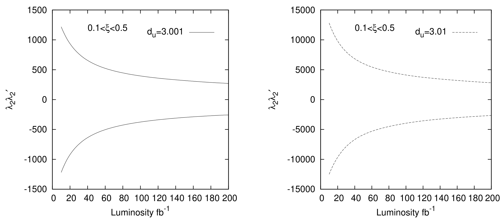 -> [[../figures/experimental-setups|实验测试与测量装置]]
  - **图示描述**：与图7相同的张量灵敏度图，但接受度换成 0.1<ξ<0.5（p_t>30 GeV，自动高质量阈值），同样给出 d_U=3.001 与 d_U=3.01 两条曲线。
  - **关键特征**：张量非粒子贡献随能量快速增长，使高能区主导；因此 0.1<ξ<0.5 的极限与 0.0015<ξ<0.5 几乎相同，而 0.0015<ξ<0.15 因缺少高能区被论文舍弃。
  - 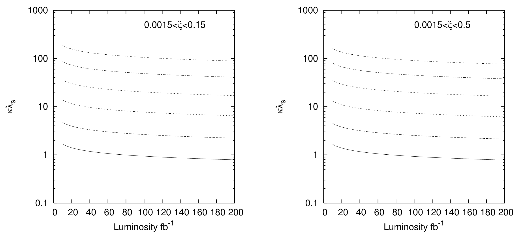 -> [[../figures/experimental-setups|实验测试与测量装置]]
  - **图示描述**：基于角分布 cosθ 六等分的 χ² 检验得到的 pp→pl⁻l⁺p 对 κλ_S 灵敏度，左/右面板分别为 0.0015<ξ<0.15 与 0.0015<ξ<0.5；纵轴 κλ_S（0.1–1000），曲线由下到上对应 d_U=1.01, 1.1, 1.2, 1.3, 1.4, 1.5；Λ_U=3 TeV，无系统误差。
  - **关键特征**：d_U 接近 1 时 χ² 法给出比泊松法更严的极限，但当 d_U 从 1.01 增至 1.4 时极限劣化约 40 倍（泊松法仅约 7 倍）；因此论文未给出 d_U>1.5 的 χ² 结果。
  - **意义**：说明小 d_U 时角分布形状信息最有价值，大 d_U 时单 bin 高 p_t 计数更稳。
  - 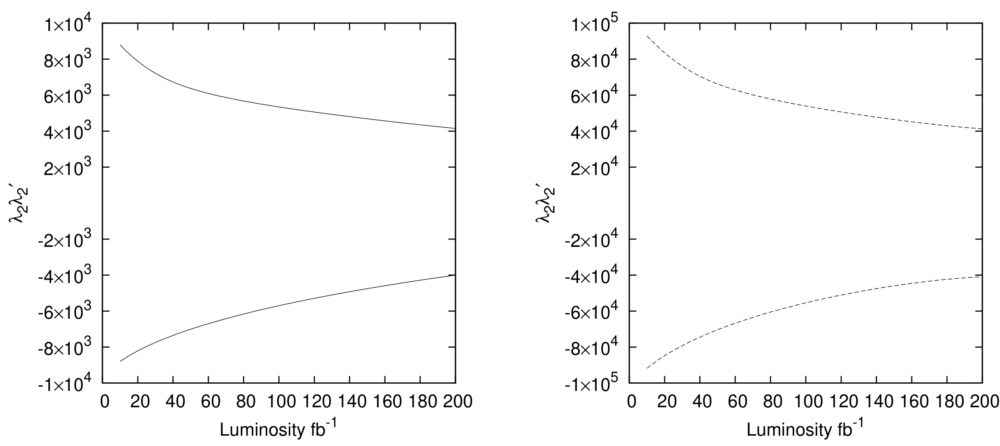 -> [[../figures/experimental-setups|实验测试与测量装置]]
  - **图示描述**：0.0015<ξ<0.5 下用 χ² 角分布法得到的 pp→pl⁻l⁺p 对张量耦合 λ_2λ'_2 的 95% C.L. 极限，左面板 d_U=3.001（实线，±10⁴ 量级）、右面板 d_U=3.01（虚线，±10⁵ 量级）。
  - **关键特征**：张量极限对 d_U 极敏感，d_U 从 3.001 变到 3.01 极限放大约一个数量级；因 0.1<ξ<0.5 下 SM 截面已小于 1 事件/200 fb⁻¹，χ² 多 bin 分析无法使用，该图只给宽接受度结果。
  - 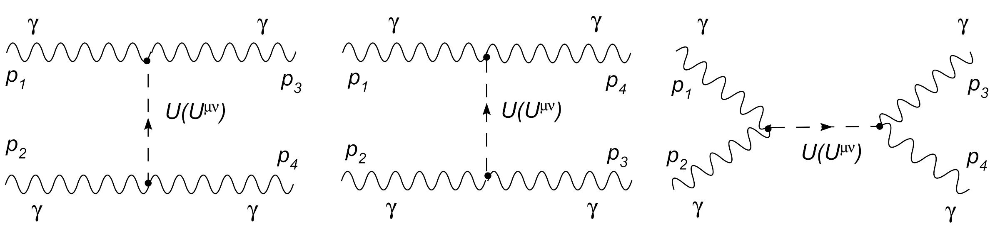 -> [[../figures/mathematical-models|数学模型与物理公式]]
  - **图示描述**：子过程 γγ→γγ 的树级费曼图，标量与张量非粒子分别通过 s、t、u 三个道贡献，共 12 张图；标准模型在树级没有该过程。
  - **关键特征**：与 γγ→l⁻l⁺ 不同，这里标量非粒子的 t/u 道与 s 道彼此干涉（振幅含 cos(d_Uπ) 项）；由于无 SM 树级"背景"，该道直接测量 γγU 与 γγU^{μν} 耦合。
  - **意义**：这是 pp→pγγp 被誉为"黄金通道"的拓扑根源。
  - 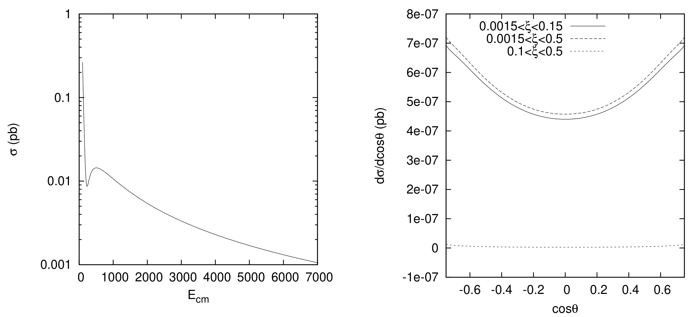 -> [[../figures/mathematical-models|数学模型与物理公式]]
  - **图示描述**：左图为 SM 1-loop（带电费米子+W 圈）γγ→γγ 总截面 σ（pb）随双光子质心系能量 E_cm（GeV，0–7000）的变化（已加 |cosθ|<0.86）；右图为不同 ξ 接受度下 dσ/dcosθ 随 cosθ（−0.6–0.6）的角分布。
  - **关键特征**：σ 在 E_cm<200 GeV 区因费米子圈贡献急剧上升，因此用 √s_γγ>250 GeV 截断可躲开该峰；角分布在 cosθ→±1（前/后向）出现尖峰，用 |η|<0.88 可切除；加完截断后 0.0015<ξ<0.15 与 0.0015<ξ<0.5 的总 SM 截面分别约 3.50×10⁻⁷ pb 与 3.52×10⁻⁷ pb，200 fb⁻¹ 下仍可忽略；0.1<ξ<0.5 下仅约 2.60×10⁻⁸ pb。
  - **意义**：为双光子道的两条关键运动学截断提供了定量依据。
  - 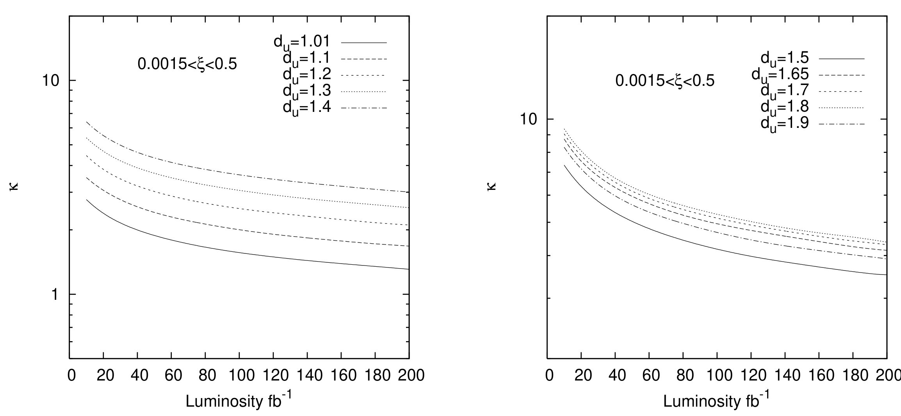 -> [[../figures/experimental-setups|实验测试与测量装置]]
  - **图示描述**：0.0015<ξ<0.5 下 pp→pγγp 对标量非粒子耦合 κ（不再有 λ_S 简并）的 95% C.L. 灵敏度随亮度的变化；截断为 |q̃₁t+q̃₂t|<30 MeV、√s_γγ>250 GeV、|η|<0.88，每条光子效率取 90%，Λ_U=3 TeV。
  - **关键特征**：d_U=1.01 与 1.1 时此接受度给出三种接受度中最严的 κ 上限；随 d_U 增大极限变差，但因 SM 树级为零，曲线整体比双轻子道更"干净"，可独立约束 γγU 耦合。
  - 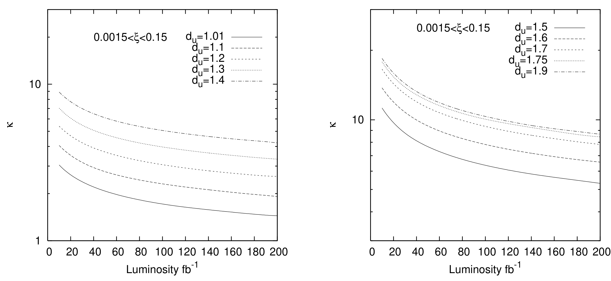 -> [[../figures/experimental-setups|实验测试与测量装置]]
  - **图示描述**：与图13相同的双光子标量灵敏度，但接受度为 AFP 的 0.0015<ξ<0.15，截断同样为 √s_γγ>250 GeV 与 |η|<0.88。
  - **关键特征**：曲线趋势与图13类似，但由于接受度较窄、可获取的高能光子对较少，整体 κ 上限略松；对 d_U 接近 1 的情形仍能在 200 fb⁻¹ 给出 O(1) 的耦合限制。
  - 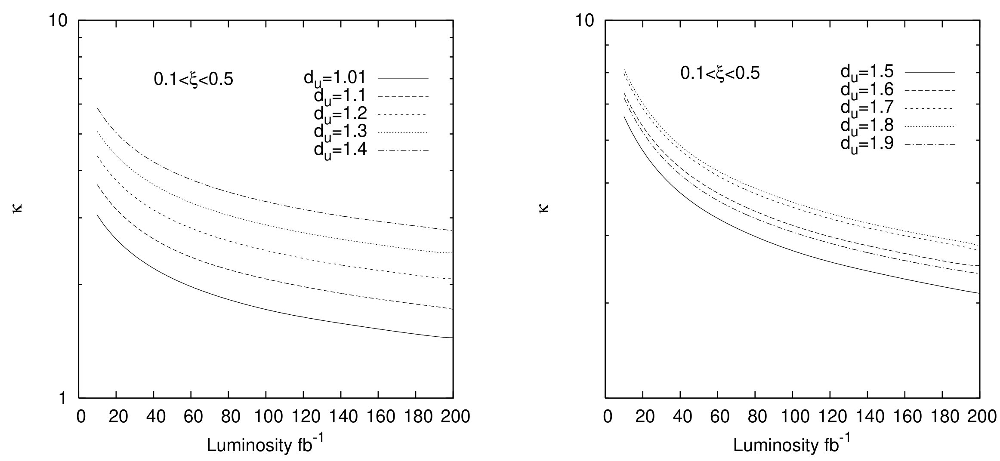 -> [[../figures/experimental-setups|实验测试与测量装置]]
  - **图示描述**：高 ξ 接受度 0.1<ξ<0.5 下 pp→pγγp 对 κ 的 95% C.L. 灵敏度，截断为 |q̃₁t+q̃₂t|<30 MeV 与 |η|<2.5（√s_γγ>250 GeV 自动满足，E_min≈1400 GeV）。
  - **关键特征**：对 d_U>1.1 的标量非粒子，该接受度的极限优于另外两种，因为非粒子贡献随能量增长而高 ξ 正好对应更高的 γγ 质心系能量；对 d_U=1.01–1.1 则不如 0.0015<ξ<0.5。
  - 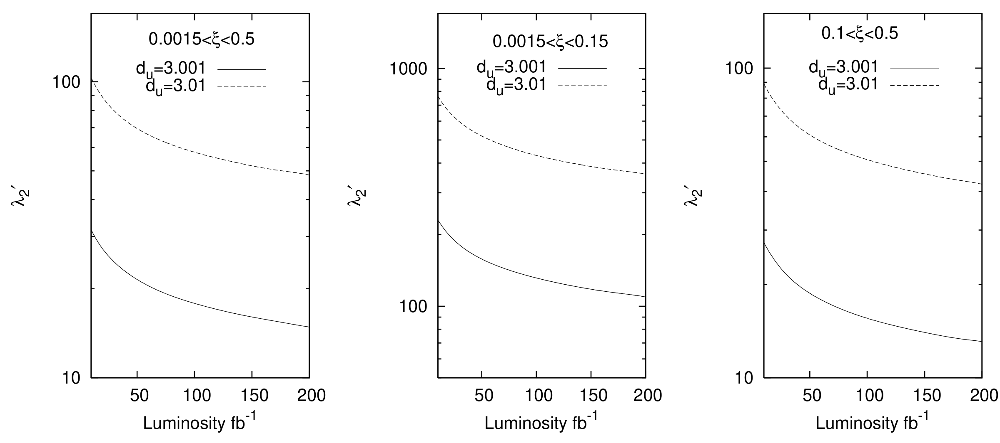 -> [[../figures/experimental-setups|实验测试与测量装置]]
  - **图示描述**：pp→pγγp 对张量非粒子耦合 λ'_2 的 95% C.L. 灵敏度，三个面板分别对应 0.0015<ξ<0.5、0.0015<ξ<0.15、0.1<ξ<0.5；实线为 d_U=3.001，虚线为 d_U=3.01；Λ_U=3 TeV。
  - **关键特征**：张量贡献随能量迅速增长，因此 0.0015<ξ<0.5 与 0.1<ξ<0.5 两种接受度的极限彼此接近，0.0015<ξ<0.15 明显较差；双光子道直接隔离 λ'_2，不与 SM 干涉，极限关于符号对称。
  - 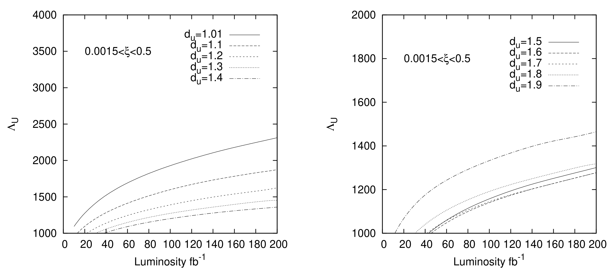 -> [[../figures/mathematical-models|数学模型与物理公式]]
  - **图示描述**：0.0015<ξ<0.5 下 pp→pγγp 对标量非粒子能量标度 Λ_U 的 95% C.L. 下限（GeV）随积分亮度的变化，κ=1、λ'_2=0，截断同图13；上半图 d_U=1.01–1.4（Λ_U 范围约 1000–4000 GeV），下半图 d_U=1.5–1.9（约 1000–2000 GeV）。
  - **关键特征**：d_U=1.01 在 200 fb⁻¹ 时 Λ_U 下限可达约 4 TeV；与双轻子道的表3对比，d_U=1.01–1.1 时双轻子道更严，但 d_U=1.4–1.9 区间双光子道反而能探测到更高的 Λ_U，显示两通道互补。
  - **意义**：把耦合灵敏度翻译成对新物理能标的直观排除范围，是论文的核心数值结论之一。
  - 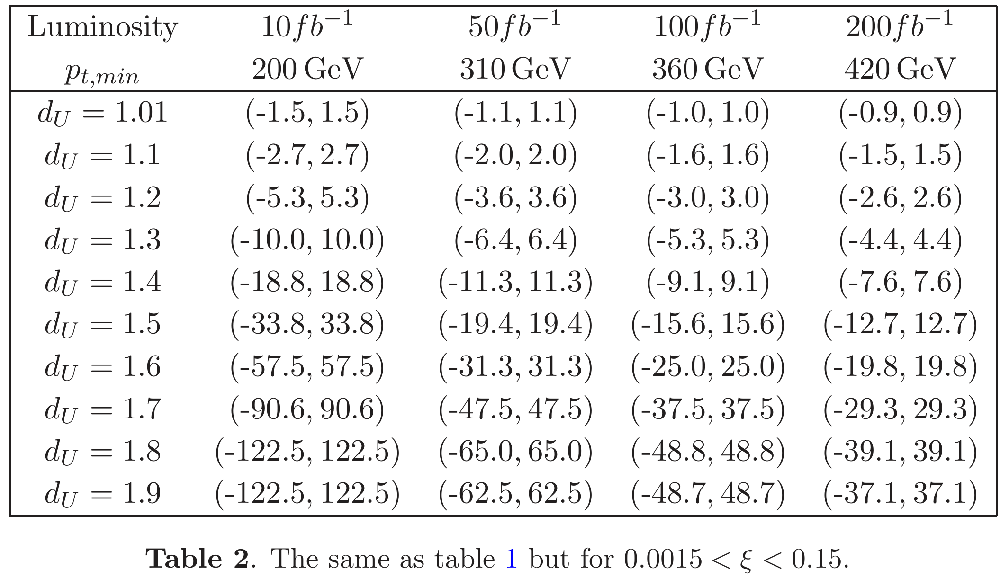 -> [[../figures/experimental-setups|实验测试与测量装置]]
  - **图示描述**：表格列出 0.0015<ξ<0.5、Λ_U=3 TeV 时，对 10、50、100、200 fb⁻¹ 四档亮度分别选用的最优 p_t,min（210、320、380、460 GeV）以及各 d_U 下 κλ_S 的 95% C.L. 双侧区间。
  - **关键特征**：随亮度提高，最优 p_t,min 同步提高（保持 SM 事件数 <0.5），κλ_S 区间收窄；如 d_U=1.01 在 200 fb⁻¹ 时为 (−0.7, 0.7)，d_U=1.5 为 (−7.8, 7.8)，d_U=1.8 为 (−17.3, 17.3)；d_U=1.9 的区间（−14.8, 14.8）反而比 d_U=1.8 更紧，再次显示 sin²(d_Uπ) 的非单调效应。
  - 
  - **图示描述**：与表1相同亮度-p_t,min 组合下，把 κλ_S 固定为 1 时反推出的 Λ_U 95% C.L. 下限（GeV）。
  - **关键特征**：d_U=1.01 时 Λ_U 下限从 10 fb⁻¹ 的 2109 GeV 提升到 200 fb⁻¹ 的 4063 GeV；d_U=1.1 在 200 fb⁻¹ 为 2625 GeV；d_U=1.5 为 1063 GeV；d_U=1.9 因 sin²(d_Uπ) 周期性反而比 d_U=1.8 更高（1141 GeV vs 1000 GeV）。该表是双轻子道与双光子道图17做能标 reach 对比的基准。
  - 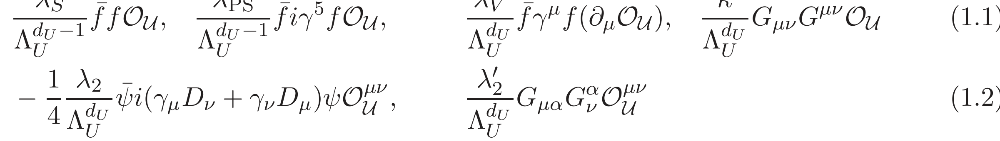 -> [[../figures/mathematical-models|数学模型与物理公式]]
  - **图示描述**：列出标量非粒子传播子 Δ(P²)=i A_{d_U}/[2 sin(d_Uπ)] (−P²)^{d_U−2}、张量传播子 Δ^{μν,ρσ}=同因子 ×T^{μν,ρσ}、归一化系数 A_{d_U}（含 Γ 函数）以及横向无迹投影算符 T^{μν,ρσ} 与 π^{μν}=−g^{μν}+P^μP^ν/P²。
  - **关键特征**：幺正性约束给出标量 d_U≥1、张量标度不变 d_U≥3（共形不变则 d_U≥4）；分母 sin(d_Uπ) 既带来复数相位（张量-SM 干涉中的 cot(d_Uπ)），也导致灵敏度随 d_U 非单调；这些公式是后续所有振幅和极限数值的理论基础。
  - 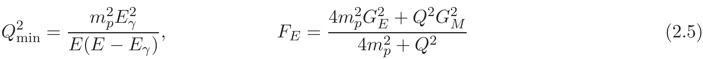 -> [[../figures/mathematical-models|数学模型与物理公式]]
  - **图示描述**：等效光子近似（EPA）的核心公式：dσ=∫dL_γγ/dW dσ̂(W)dW、有效亮度对虚度 Q² 与光子能量 y 的双重积分、y_min/y_max 由 ξ 接受度决定、等效光子谱 f=dN/dE_γdQ²（含电/磁形状因子 F_E、F_M 与偶极参数化 Q_0²=0.71 GeV²）。
  - **关键特征**：Q²_max 取 2 GeV²，质子磁矩 μ_p²=7.78；ξ=(|p̃|−|p̃′|)/|p̃| 直接决定可观测的中心质量范围；这些公式把 pp→pXp 与 γγ→X 定量联系起来，是图1亮度曲线的来源。
  - 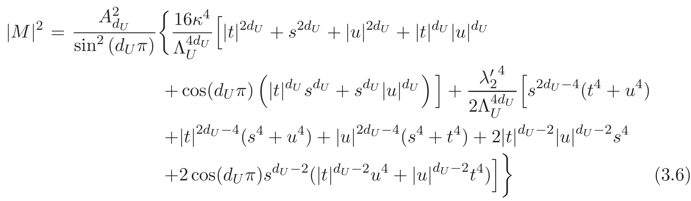 -> [[../figures/mathematical-models|数学模型与物理公式]]
  - **图示描述**：γγ→l⁻l⁺ 的极化求和 |M|²，含四项：SM t/u 道 8g_e⁴tu(1/t²+1/u²)、标量非粒子 s 道（与 SM 不相干，总为正叠加）、张量非粒子平方项，以及张量-SM 干涉项 −4g_e²A_{d_U}s^{d_U−2}(λ_2λ'_2/Λ_U^{2d_U})cot(d_Uπ)(t²+u²)。
  - **关键特征**：λ_PS 与 λ_S 在截面上完全简并，λ_V 耦合并无贡献（非粒子耦合到在壳 l⁻l⁺ 流），因此数值计算只保留 κλ_S；cot(d_Uπ) 因子使张量极限可正可负、对 d_U 极敏感；该式是图3–10 所有双轻子结果的直接计算依据。
## 🔬 项目连接
  - **project-1 双光子**：无直接项目连接。题名中的"photon-photon fusion/双光子"指LHC质子辐射出的两个准实光子在高能对撞中聚变（QED/电弱过程，质心系能量数百GeV–TeV），与project-1所指的非线性光学"双光子吸收/上转换发光"（~eV尺度、介质中强光-物质相互作用）在物理机制、能量尺度、理论框架上完全不同。EPA中"高速带电粒子周边的等效光子谱"概念不可迁移到非线性光学的双光子跃迁；非粒子s道交换与材料的双光子响应无类比。
  - **project-2 Mn多铁**：无直接项目连接。本文无磁性、无铁电、无磁电耦合、无过渡金属氧化物内容；标量/张量非粒子的"张量"是洛伦兹张量场，与多铁中的序参量张量无物理对应。
  - **project-3 机械发光NN**：无直接项目连接。无机械发光、无神经网络/机器学习内容（论文展望部分仅泛泛提及"未来可用ML"，未实现）。
  - **project-4 TTF分子计算**：无直接项目连接。本文方法是解析量子场论（有效拉氏量+费曼图+Mandelstam变量+EPA卷积），不涉及DFT、量子化学、分子电子结构或Wannier等任何分子计算流程；可复用的"卷积截面—亮度"思想属于HEP对撞机物理，不迁移至分子体系。
  - **project-5 SnTe铁电模拟**：无直接项目连接。无铁电、无晶格、无DFT/MD/应变工程内容；非粒子传播子中的"标度不变性"与铁电相变临界点的标度律仅在术语层面重合，数学对象（4D QFT两点函数 vs 凝聚态临界指数）不同，不构成可迁移机制。
  - **project-6 湿度传感器**：无直接项目连接。无传感器、无水分子吸附/输运、无介质物理内容。
  - **project-7 CDW**：无直接项目连接。本文的"连续质谱/非整数维度"与电荷密度波的周期性晶格调制、费米面嵌套、Peierls相变无关；无固体电子结构内容。
  - 说明：本文属高能物理（HEP）唯象学，七个项目均为凝聚态/材料/光学/传感方向，按"内容参考价值"标准判定，机制、方法、计算流程、数据上均无可迁移项；最接近的project-1仅为字面"双光子"同名，已明确排除。
## 🔗 项目双链
- 项目 [[../projects/project-1-two-photon|项目一：双光固化和双光发光]]
- 项目 [[../projects/project-2-mn-multiferroics|项目二：Mn极化结构铁电材料]]
- 项目 [[../projects/project-3-mechanoluminescence-nn|项目三：应力发光神经网络]]
- 项目 [[../projects/project-4-ttf-molecular-calc|项目四：lsl老师的ttf分子计算]]
- 项目 [[../projects/project-5-snte-ferroelectric-sim|项目五：lammps势函数SnTe铁电模拟]]
- 项目 [[../projects/project-6-humidity-sensor|项目六：小花闻的电压湿度传感器]]
- 项目 [[../projects/project-7-cdw-charge-density-wave|项目七：CDW电荷密度波]]

## 📝 组织与用词
文章按高能唯象学标准结构推进——(1)引言：以"独家产生pp→pXp是LHC最干净通道"和"Georgi非粒子模型"两个独立前沿的交叉立论；(2)理论工具：给出非粒子有效算符(1.1)(1.2)、标度/共形不变传播子(1.3)–(1.7)，再给出EPA亮度卷积公式(2.1)–(2.6)；(3)数值分析分两通道，双轻子道先给振幅平方(3.1)并指出标量非粒子与SM不相干（总是相加）、张量非粒子因cot(d_Uπ)与SM干涉，随后用"高p_t截断+泊松"和"角分布+χ²"两套统计方法给95% C.L.极限；双光子道强调SM树级为零、1-loop本底可由√s_γγ>250 GeV与|η|<0.88压低至可忽略，从而独立隔离κ与λ'_2；(4)结论比较两通道与不同ξ接受度对Λ_U的灵敏度。论证主线是"用极干净的独家通道 + 前向探测器接受度 + 运动学截断"把SM本底压低到<0.5事件，使任何超出都是新物理的强证据。值得在wiki叙述中复用的术语：
  - exclusive production / 独家（排他）产生
  - equivalent photon approximation (EPA) / 等效光子近似
  - forward detector acceptance / 前向探测器接受度 ξ
  - unparticle / 非粒子；scale dimension d_U / 标度维度
  - scalar vs tensor unparticle / 标量与张量非粒子
  - photon-photon fusion / 光子-光子融合
  - proton dissociation background / 质子解离本底；|q̃₁t+q̃₂t|<30 MeV 截断
  - 95% C.L. sensitivity limit / 95%置信水平灵敏度极限；Poisson vs χ² analysis
## ✏️ 可写入 Wiki 的要点
  1. LHC独家产生 pp→pXp 因两个质子保持完整、无质子残余，被公认为LHC最干净的反应通道之一；前向探测器（AFP: 0.0015<ξ<0.15，可标记100–800 GeV中心质量；CMS-TOTEM: 0.0015<ξ<0.5 与 0.1<ξ<0.5）位于距相互作用点约100–400 m处，通过测量质子动量损失分数 ξ=(|p̃|−|p̃′|)/|p̃| 反推中心系统质量。
  2. 光子诱导反应的主要本底是质子解离为重子激发态（N*, Δ等压线），可通过对光子对/轻子对施加 |q̃₁t+q̃₂t|<(10–30) MeV 的总横动量截断有效消除；图1右图显示该截断对有效γγ亮度几乎无影响。
  3. 非粒子模型（Georgi 2007）的核心是标度不变sector，标度维度d_U为非整数；标量幺正性界限d_U≥1，张量标度不变界限d_U≥3、共形不变界限d_U≥4。传播子 Δ(P²)=i A_{d_U}/[2 sin(d_Uπ)] (−P²)^{d_U−2}，其中 A_{d_U}=16π^{5/2}/(2π)^{2d_U} · Γ(d_U+1/2)/[Γ(d_U−1)Γ(2d_U)]；分母的 sin²(d_Uπ) 导致灵敏度随d_U非单调（如d_U=1.9可能比1.8更灵敏）。
  4. 在 γγ→l⁻l⁺ 中，SM贡献为t/u道并在t,u=0处有极点（前/后向峰、高p_t处骤降），非粒子经s道交换；标量非粒子贡献与SM**不相干**（总是正叠加，故限制关于耦合正负对称），张量非粒子贡献与SM发生干涉并含cot(d_Uπ)因子；λ_PS与λ_S在截面上简并，λ_V对在壳l⁻l⁺流无贡献。
  5. 双轻子道的典型截断：0.0015<ξ<0.5时p_t>460 GeV，0.0015<ξ<0.15时p_t>420 GeV，可在200 fb⁻¹亮度下把SM事件数压到<0.5；0.1<ξ<0.5因ξ下限高导致末态不变质量>1400 GeV，SM截面仅~1.1×10⁻⁶ pb，只需p_t>30 GeV。
  6. [[../concepts/biphoton|双光子]]道 pp→pγγp 的最大优势：γγ→γγ在SM树级**完全禁止**，非粒子经s/t/u道贡献并彼此干涉（公式3.6），因此该道能独立、无歧义地隔离耦合 κ 与 λ'_2，这是任何其他LHC过程都做不到的；SM 1-loop本底（带电费米子+W圈）可被 √s_γγ>250 GeV（避开<200 GeV的费米子圈急升区）和 |η|<0.88（避开前后向峰）压低到~3.5×10⁻⁷ pb，在200 fb⁻¹下仍可忽略。
  7. 数值分析采用两种互补统计方法：(i) 高p_t单bin + 泊松分布（N_obs=0.9 L σ^SM，0.9为QED双光子存活概率，电子/μ子中心探测器|η|<2.5，光子效率90%）；(ii) 角分布cosθ六等分 + χ²=Σ[(σ_i^SM−σ_i^NEW)/(σ_i^SM Δ_i^exp)]²。χ²法在d_U接近1时优于泊松法（d_U from 1.01 to 1.4，泊松极限劣化约7倍而χ²劣化约40倍），但d_U>1.5后迅速失效。
  8. 能量标度 reach（κ=λ_S=1，Λ_U单位GeV）：在0.0015<ξ<0.5、200 fb⁻¹、p_t>460 GeV下，双轻子道对d_U=1.01可排除Λ_U<4063 GeV，d_U=1.1为2625 GeV，d_U=1.5为1063 GeV；双光子道对d_U=1.01在200 fb⁻¹下可达~4 TeV，且在d_U=1.4–1.9区间对Λ_U的灵敏度优于双轻子道。
  9. 不同ξ接受度的分工：d_U≈1（1.01–1.1）时0.0015<ξ<0.5最灵敏；d_U>1.1（标量双光子）时0.1<ξ<0.5因高能阈值更优；对张量非粒子（贡献随能量快速增长），0.0015<ξ<0.15最差，而0.0015<ξ<0.5与0.1<ξ<0.5潜力几乎相同。
  10. 横向比较：独家γγ道的极限在耦合普适假设下弱于LHC上 gg,q q̄→γγ 的双光子产生，但强于Tevatron已有结果；其不可替代价值在于"干净"和"耦合类型独立（直接测γγU、γγU^{μν}）"，并可作为LHC亮度监测器 pp→pl⁻l⁺p 的新物理灵敏度校准。
