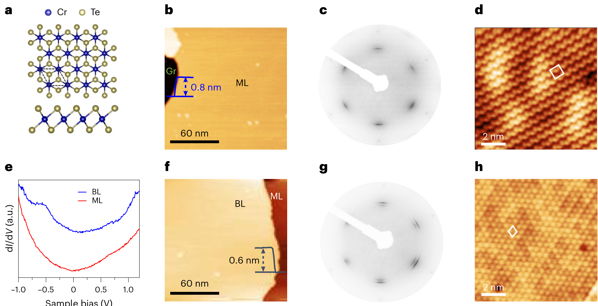
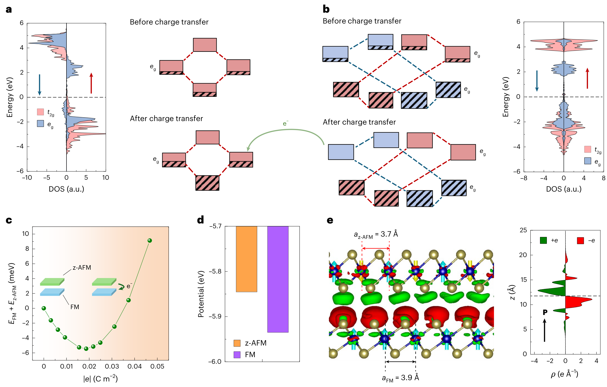
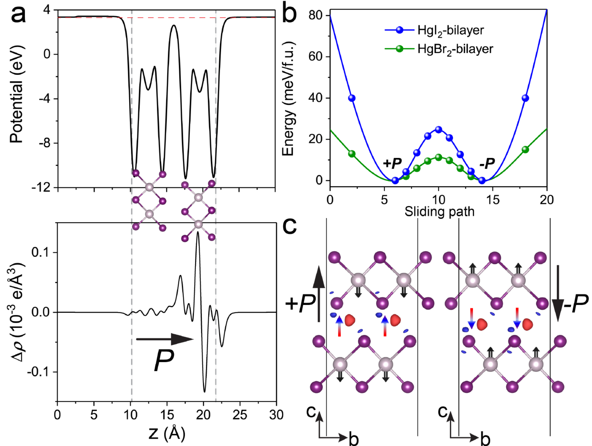
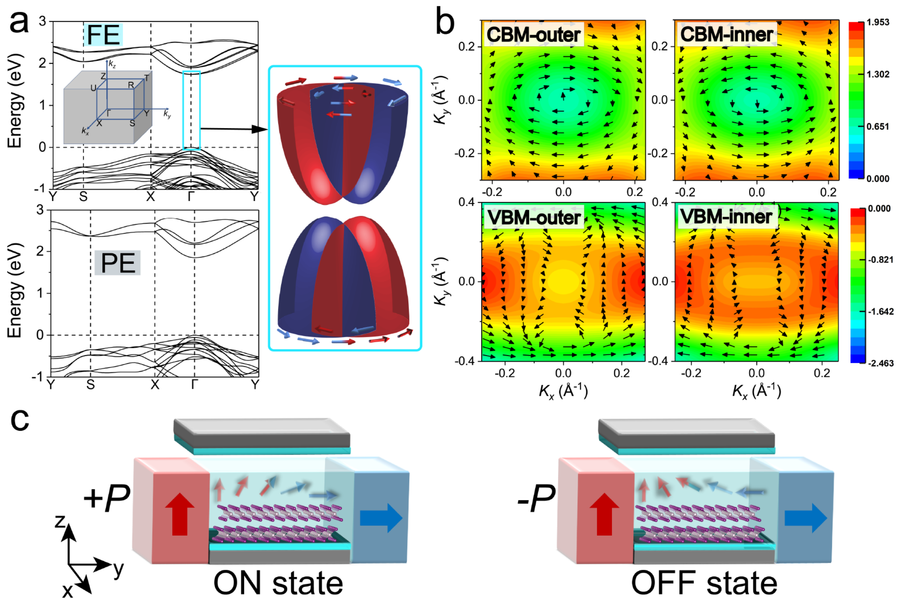

# D03 二维磁性材料 / 2D Magnetic Materials

> 关联领域：[[./D02-multiferroic-materials|多铁性材料]]、[[./Z01-computational-materials-design|材料模拟计算设计]]

## 📚 核心文献与里程碑 (2017–2026)

<table>
  <thead>
    <tr>
      <th style="width:7%">年份</th>
      <th style="width:15%">论文</th>
      <th style="width:12%">类型</th>
      <th style="width:28%">里程碑</th>
      <th style="width:38%">意义</th>
    </tr>
  </thead>
  <tbody>
    <tr>
      <td>2017</td>
      <td>Huang et al. / Gong et al., <em>Nature</em> (2017)（本库未收录）</td>
      <td>实验 (Nature)</td>
      <td>**二维铁磁性实验证实**：单层 CrI₃ 和双层 Cr₂Ge₂Te₆</td>
      <td>打破 Mermin-Wagner 禁令，二维磁性领域诞生</td>
    </tr>
    <tr>
      <td>2021</td>
      <td>—</td>
      <td>—</td>
      <td>**滑动铁电性发现**：h-BN 和 TMD 双层</td>
      <td>为电控磁提供纯电子机制新途径，无需离子位移[[../papers/kaurRecentAdvancesTheoretical2025a]]</td>
    </tr>
    <tr>
      <td>2022</td>
      <td>[[../papers/chenFerromagneticNonmagnetic1T2022]]</td>
      <td>理论 (Phys. Rev. B)</td>
      <td>**FM-CDW 双机制**：结构畸变指数 d₁/d₂</td>
      <td>区分超交换与二聚化路径，深化对二维磁性起源的理解</td>
    </tr>
    <tr>
      <td>2024</td>
      <td>[[../papers/miaoMagneticFerroelectricMetal2024]]</td>
      <td>实验 (Nature)</td>
      <td>**滑移多铁实证**：双层 Fe₃GeTe₂</td>
      <td>磁序与滑移铁电性共存，验证电控磁概念</td>
    </tr>
    <tr>
      <td>2024</td>
      <td>[[../papers/gaoGiantChiralMagnetoelectric2024a]]</td>
      <td>实验 (Nature)</td>
      <td>**手性磁电振荡**：NiI₂</td>
      <td>观测到电子驱动的巨磁电耦合，多路径验证磁电耦合</td>
    </tr>
    <tr>
      <td>2026</td>
      <td>[[../papers/tianRoomtemperatureTwodimensionalMultiferroic2026]]</td>
      <td>实验 (Nat. Mater.)</td>
      <td>**室温多铁金属**：双层 CrTe₂</td>
      <td>领域转折点——从基础研究走向器件应用，首个室温空气稳定二维多铁金属</td>
    </tr>
  </tbody>
</table>

---

## 🔭 领域概述

二维磁性材料研究层状磁体在二维极限下的磁有序行为。2017 年 [[../entities/CrI3|CrI₃]] 和 [[../entities/Cr2Ge2Te6|Cr₂Ge₂Te₆]] 中二维铁磁性的实验发现（Huang et al. / Gong et al., *Nature* 2017，本库未收录）标志着该领域的诞生。此后十余年，研究重心经历了三次迁移：从"寻找更多二维磁体"到"外场调控磁序"，再到"磁性与铁电性融合"。

本领域涵盖以下核心议题：
- 二维磁体的居里温度提升与室温磁序稳定化
- 电场/应变/堆叠工程对磁序的外场调控
- 滑动铁电性与多铁性融合，实现纯电控磁
- 拓扑磁结构（斯格明子、双半子）在二维极限下的稳定性

二维磁性材料是后摩尔时代低功耗自旋电子器件的基础。2024–2026 年间，二维磁性与多铁性的融合催生了**二维多铁金属**这一全新物态[[../papers/tianRoomtemperatureTwodimensionalMultiferroic2026]]，使得"电写磁读"非易失存储成为可能。

---

## 📖 研究背景

2017 年，Huang 和 Gong 两组背靠背在 *Nature* 报道了单层 CrI₃ 和双层 Cr₂Ge₂Te₆ 中的铁磁性（本库未收录），打破了 [[../concepts/mermin-wagner-theorem|Mermin-Wagner 定理]]对二维磁序的禁令。CrI₃ 的层数依赖磁性（单层 FM → 双层 AFM → 三层恢复 FM）直接启发了"磁序层数工程"。

*   **来源**：[[../papers/tianRoomtemperatureTwodimensionalMultiferroic2026]]
*   **关键特征**：MBE 生长的双层 CrTe₂ 中，两层晶格常数不同（0.37 vs 0.39 nm），分别对应 z-AFM 和 FM 序

此后研究重心转向外场调控。Fe₃GeTe₂ 的发现（~230 K Tc）证明层状磁体可实现高居里温度；MnBi₂Te₄ 揭示了二维反铁磁拓扑绝缘体的可能性。2021 年滑动铁电性的发现为电控磁提供了新途径[[../papers/kaurRecentAdvancesTheoretical2025a]]。

2024–2026 年，领域进入"多铁化"阶段。双层 Fe₃GeTe₂ 中磁序与滑移铁电性共存的实验[[../papers/miaoMagneticFerroelectricMetal2024]]与 NiI₂ 中手性磁电振荡的观测[[../papers/gaoGiantChiralMagnetoelectric2024a]]验证了这一方向。2026 年双层 CrTe₂ 的室温多铁金属态[[../papers/tianRoomtemperatureTwodimensionalMultiferroic2026]]标志着领域从基础研究走向器件应用。

二维磁序稳定的核心机制包括：
- **磁各向异性**（magnetic anisotropy）：单离子各向异性打开自旋波能隙
- **交换相互作用**（superexchange）：通过配体离子的间接交换决定 FM/AFM 序[[../concepts/superexchange]]
- **Dzyaloshinskii-Moriya 相互作用**（DMI）：反对称交换耦合产生手性磁结构与斯格明子[[../concepts/dzyaloshinskii-moriya-interaction]]

*   **来源**：[[../papers/tianRoomtemperatureTwodimensionalMultiferroic2026]]
*   **关键特征**：t₂g 满占，多余电子进入 e_g；FM 态 e_g 部分填充允许相邻 Cr 杂化降能，z-AFM 态反平行排列阻碍直接耦合——电子转移使两侧均降能

---

## ⚙️ 主要研究方法

**理论建模**：DFT+U 计算处理过渡金属 3d 电子强关联效应，搜索磁基态（FM / AFM-Néel / AFM-zigzag / AFM-stripy）。CrTe₂ 中 U = 3.0 eV、J = 0.6 eV 的参数组合被验证有效[[../papers/tianRoomtemperatureTwodimensionalMultiferroic2026]]。Berry phase 极化计算量化面外极化大小[[../papers/king-smithTheoryPolarizationCrystalline1993]]。NEB 方法确定翻转最小能量路径[[../papers/henkelmanClimbingImageNudged2000c]]。

**实验验证**：PFM + MFM 联用实现"电写磁读"——PFM 写入铁电畴（±7 V 盒中盒图案），MFM 读出对应磁畴[[../papers/tianRoomtemperatureTwodimensionalMultiferroic2026]]，最早在 NiI₂ 中验证[[../papers/gaoGiantChiralMagnetoelectric2024a]]。SQUID 磁强计表征磁基态与磁化强度[[../papers/songEvidenceSinglelayerVan2022]]、[[../papers/laiTwodimensionalFerromagnetismDriven2019]]。STM/MBE 原位生长与表征确认原子级结构与层数依赖磁序[[../papers/tianRoomtemperatureTwodimensionalMultiferroic2026]]。

**计算模拟**：VASP + PAW + PBE + vdW-DF2 为标准协议（截断能 500 eV，k 网格 6×7，真空层 ≥20 Å）[[../papers/tianRoomtemperatureTwodimensionalMultiferroic2026]]。Monte Carlo 基于 Heisenberg 模型估算居里温度。机器学习势（DREAM/Allegro）加速超快翻转动力学模拟[[../papers/kaurRecentAdvancesTheoretical2025a]]。

*   **来源**：[[../papers/chenStrongSlidingFerroelectricity2024]]
*   **关键特征**：层间滑移产生双阱势，翻转势垒随层数降低——从块体 80.90 meV/f.u. 降至双层 24.65 meV/f.u.，室温可翻转

---

## 📊 关键研究成果

**技术突破**：
- **室温多铁金属**：双层 CrTe₂ 在 400 K 下保持多铁性，极化 ~3.0 pC m⁻¹，翻转势垒 ~24 meV/f.u.，打破传统多铁材料工作温度低的瓶颈[[../papers/tianRoomtemperatureTwodimensionalMultiferroic2026]]
- **电子填充驱动磁电耦合**：FM/AFM 层间电荷转移机制取代传统自旋轨道耦合路径，为设计新多铁材料提供通用原则[[../papers/tianRoomtemperatureTwodimensionalMultiferroic2026]]
- **手性磁电振荡**：NiI₂ 中观测到电子驱动的巨磁电耦合，表明磁电耦合可通过不同物理路径实现[[../papers/gaoGiantChiralMagnetoelectric2024a]]

**代表性成果**：
- 极化数据：CrTe₂ ~3.0 pC m⁻¹ > 滑移铁电体典型值 0.1–1.2 pC m⁻¹[[../papers/chenStrongSlidingFerroelectricity2024]]；BaTiO₃ ~26 pC m⁻¹ 仍是块体标杆。
- 翻转势垒：CrTe₂ 24.65 meV/f.u.（双层）vs HgI₂ 24.65 meV/f.u.（双层）vs 块体 HgI₂ 80.90 meV/f.u.——维度降低效应一致[[../papers/chenStrongSlidingFerroelectricity2024]]。
- 居里温度：Fe₃GeTe₂ ~230 K、CrI₃ ~45 K（单层）、CrTe₂ 室温——Tc 对磁构型极为敏感。

*   **来源**：[[../papers/chenStrongSlidingFerroelectricity2024]]
*   **关键特征**：红色/蓝色等值面显示 ±P 态层间电荷非对称分布；+P 态与 -P 态 Rashba 自旋纹理手性相反，实现电场可控制自旋进动

**应用案例**：四态逻辑存储（P↑↓ × M↑↓）[[../papers/miaoMagneticFerroelectricMetal2024]]；自旋 FET（Rashba 自旋纹理电场可控自旋进动）[[../papers/chenStrongSlidingFerroelectricity2024]]；CMOS 兼容亚飞焦级存储[[../papers/tianRoomtemperatureTwodimensionalMultiferroic2026]]。

*   **来源**：[[../papers/tianRoomtemperatureTwodimensionalMultiferroic2026]]
*   **关键特征**：PFM 写入的铁电畴图案与 MFM 读出的磁畴图案完全对应，衬度随写入电压同步增强

---

## 🔮 未来发展方向

**技术趋势**：
- **FM/AFM 超晶格通用设计**：将 CrTe₂ 的电子填充驱动机制推广到其他二维磁体系[[../papers/tianRoomtemperatureTwodimensionalMultiferroic2026]]
- **超快翻转动力学**：THz 泵浦-探测研究皮秒级自旋翻转时间极限[[../papers/kaurRecentAdvancesTheoretical2025a]]
- **高通量筛选**：基于 (ρ, ξ) 判据从非 vdW 块体中预测可剥离二维多铁[[../papers/zhongHighthroughputExfoliationMultiferroic2025]]

**潜在应用**：非易失性存储（四态逻辑 CMOS 兼容单元）；量子传感[[../papers/tianRoomtemperatureTwodimensionalMultiferroic2026]]；低功耗自旋电子学（电场控磁替代电流控）。

**战略机遇**：二维多铁金属为后摩尔时代自旋电子学提供新材料平台。面内高迁移率与面外极化共存，天然适合器件集成；翻转势垒极低（~10–30 meV/f.u.）；空气稳定性优于 CrI₃、Fe₃GeTe₂ 等同类体系。

---

## 🤔 学术思考

**技术瓶颈**：
- **居里温度**：Fe₃GeTe₂（~230 K）和 CrI₃（~45 K）均低于室温，只有 CrTe₂ 在室温工作但 Tc 机制尚不明确
- **空气稳定性**：CrTe₂ 暴露两周后 PFM/MFM 衬度降至 ~30%[[../papers/tianRoomtemperatureTwodimensionalMultiferroic2026]]
- **极化强度**：~3.0 pC m⁻¹ 虽远超滑移铁电体，但仍远低于 BaTiO₃（~26 pC m⁻¹）

**研究挑战**：
- **机制普适性验证**：电子填充驱动电荷转移机制是否适用于其他范德华层状材料体系[[../papers/tianRoomtemperatureTwodimensionalMultiferroic2026]]
- **大规模集成**：设计合适栅极结构实现电学寻址和晶圆级集成
- **长期稳定性**：需要深入研究材料在环境中的降解机制

**伦理问题**：当前无显著伦理问题。该领域属于基础材料科学研究，不涉及人体实验、数据隐私或军事应用。

---

## 💬 常见问题解答

**Q: 什么是"二维多铁金属"？** 在同一二维材料中同时具备铁电性和金属性的新物态。传统认知中金属性排斥铁电性（Anderson-Blount 佯谬[[../concepts/anderson-blount-mechanism]]），但二维极限下通过层间电荷转移[[../concepts/interlayer-charge-transfer]]机制可实现"面内导电、面外绝缘"的共存[[../papers/tianRoomtemperatureTwodimensionalMultiferroic2026]]。

**Q: 滑动铁电性与传统铁电性有何区别？** 传统铁电性源于离子位移导致的结构不对称；滑动铁电性源于层间相对滑移产生的电荷重新分布，无需离子位移，翻转势垒极低[[../papers/chenStrongSlidingFerroelectricity2024]]。

**Q: 如何实现"电写磁读"？** PFM 写入铁电畴（±7 V 盒中盒图案），MFM 读出对应磁畴图案[[../papers/tianRoomtemperatureTwodimensionalMultiferroic2026]]，最早在 NiI₂ 中验证[[../papers/gaoGiantChiralMagnetoelectric2024a]]。

**Q: 为什么 CrTe₂ 的空气稳定性重要？** 大多数高性能二维磁体（CrI₃、Fe₃GeTe₂）在空气中迅速氧化。CrTe₂ 暴露大气两周后仍保持完整磁电序[[../papers/tianRoomtemperatureTwodimensionalMultiferroic2026]]，是首个兼具室温多铁性与空气稳定性的二维材料。

**Q: 下一步发展方向？** 提升居里温度至室温以上；全电控自旋器件原型设计；将 FM/AFM 超晶格设计原则[[../papers/tianRoomtemperatureTwodimensionalMultiferroic2026]]推广到更多材料体系；探索量子技术应用。

---

## 🔗 概念与实体索引

- **核心概念**：[[../concepts/magnetic-anisotropy]]、[[../concepts/superexchange]]、[[../concepts/dzyaloshinskii-moriya-interaction]]、[[../concepts/mermin-wagner-theorem]]、[[../concepts/interlayer-charge-transfer]]、[[../concepts/sliding-ferroelectricity]]、[[../concepts/magnetoelectric-coupling]]、[[../concepts/anderson-blount-mechanism]]
- **前沿材料**：[[../entities/CrI3]]、[[../entities/Cr2Ge2Te6]]、[[../entities/CrTe2]]、[[../entities/Fe3GeTe2]]、[[../entities/NiI2]]、[[../entities/TMDs]]

---

## ⚠️ 文献缺失提醒

以下论文在 Wiki 中尚未建立条目，建议补充：

| 缺失论文 | 应归属 | 说明 |
|:---|:---|:---|
| Huang et al. (2017) 单层 CrI₃ 二维铁磁性 | `wiki/papers/Huang2017magnetic.md` | 领域开创性工作，本页面里程碑表、研究背景、历史脉络三处以纯文本形式引用（不设双链），建议补建条目后改为双链 |
| Gong et al. (2017) 双层 Cr₂Ge₂Te₆ 二维铁磁性 | `wiki/papers/Gong2017discovery.md` | 与 Huang et al. 背靠背发表，同为领域起点，本页面纯文本引用 |

> **操作建议**：将上述论文导入 Zotero 后运行 `python tools/update_raw_assets.py` 同步 raw assets，再通过 `/workflow update_research_wiki` 自动生成 wiki/papers 条目。
